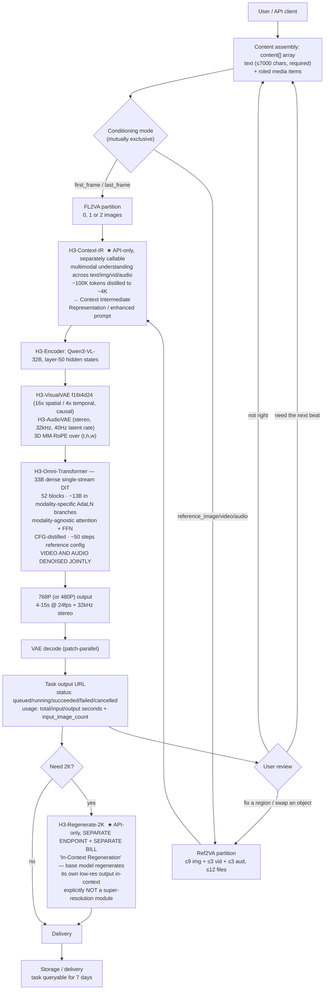

# Hailuo / MiniMax — Architecture Brief

**Analysis date: 2026-09-13.** MiniMax is the Shanghai-based company behind the **Hailuo AI** consumer video product (`hailuoai.video`) and the **MiniMax Open Platform** API (`api.minimax.io`, docs at `platform.minimax.io`). Its flagship video model as of this date is **MiniMax H3** — marketed in the consumer app as **Hailuo 3.0 / Hailuo 03** — announced **2026-07-31** and **open-weighted on 2026-08-03**. The prior line is **Hailuo 2.3 / 2.3-Fast** (Oct 2025) and **Hailuo 02** (June 2025), both still live on the v1 API; the 2024-era line was **video-01 / T2V-01 / I2V-01 / S2V-01**. Every non-trivial architectural claim is labeled **VERIFIED** (MiniMax's own API reference, official news/research blog, the MiniMax-AI GitHub repo, the Hugging Face model card, official self-host docs), **STRONG INFERENCE** (implied by observable API surface, published technique, or official capability claims), or **HYPOTHESIS** (plausible, unconfirmed) — see `.claude/agents/video-platform-intelligence.md`'s research principle.

**Language and access caveat up front:** MiniMax is a Chinese company, but unlike Kuaishou it publishes a **complete English API reference that is directly fetchable** — `platform.minimax.io/docs/api-reference/*` and `platform.minimax.io/docs/guides/*` returned full content on every attempt. This makes MiniMax by far the most *API-legible* platform examined so far; the parameter-level facts below are first-party, not third-party mirrors. Three access gaps remain: (a) **no technical report exists yet** — MiniMax stated one was "coming soon" at the H3 launch and none has appeared on arXiv under MiniMax authorship for any video model; (b) the **official dollar pricing page for H3 could not be read** (the video-points page explicitly says "MiniMax H3 is not supported yet" and redirects to pay-as-you-go), so all per-second dollar figures below are secondary and routed to `monetization-strategist`; (c) **Chinese-language primary material** (MiniMax WeChat/Zhihu engineering posts, the Chinese `hailuoai.com` docs) was not accessed this session and is flagged as an open research gap, exactly as in the Kling brief.

**Relationship to the Runway brief:** Runway's changelog lists "Hailuo 3.0" among the third-party models it brokers **[VERIFIED — see `platforms/runway.md` Executive Summary point 1]**. MiniMax is therefore simultaneously a competitor to and a supplier of other platforms in this research set, which is itself a finding (see Orchestration).

---

## Executive Summary

1. **MiniMax is the only frontier video platform in this research set that open-weighted its flagship.** H3-Base — a **33B-parameter dense single-stream Transformer** — was released on Hugging Face and ModelScope on 2026-08-03 under the *MiniMax H3 Community License*, as two BF16 task-specific checkpoints. This is a categorically different competitive posture from Runway (nothing open) and Kling (only the *image* lineage, Kolors, is Apache-2.0). **[VERIFIED — minimax.io/news/minimax-h3-open-source + github.com/MiniMax-AI/MiniMax-H3]**
2. **The open-weight release is deliberately incomplete, and the withheld pieces are the commercially load-bearing ones.** Two modules are API-only: **H3-Context-IR** (the multimodal prompt-understanding/enrichment stage — "not included in this open-source release") and **H3-Regenerate-2K** (the 2K path — "due to the complexity of the system, this module is not yet open-sourced"). The **native sparse-attention implementation** is also withheld despite being trained in. Consequence: **open weights are capped at 768p and cannot reproduce the hosted product's prompt intelligence.** **[VERIFIED]**
3. **MiniMax's three-stage pipeline is not hidden inside one call — it is exposed as three separately callable, separately billable endpoints.** `POST /v2/h3_context_ir` (understand + enrich, returns an enhanced prompt, "does not create a video generation task"), `POST /v2/video_generation` (generate at 480P/768P/2K), `POST /v2/video_regeneration` (768P → 2K). **This is the single most router-relevant finding in the brief**: a platform has productized prompt-enhancement and upscaling as independent, inspectable, skippable stages. Kling and Runway both bury these inside a single generation call. **[VERIFIED — platform.minimax.io API reference]**
4. **2K is achieved by "In-Context Regeneration," not by a super-resolution cascade — and MiniMax says so explicitly.** Official phrasing: H3 performs 2K output "without dedicated super-resolution module" by having "H3 base model regenerate its own low-resolution output in-context," which they claim recovers detail ("small text and fine detail") that "traditional super-resolution cannot restore." This is a genuinely different architectural answer to the same problem Kling solved with a cascaded multimodal SR module. **[VERIFIED — minimax.io/blog/minimax-h3]**
5. **Architecture disclosure is the most detailed of any platform studied so far — more concrete than Kling's, despite there being no paper.** Disclosed: 33B dense single-stream Transformer with ~**13B parameters in modality-specific AdaLN branches** (cacheable at inference); modality-agnostic attention and FFN layers with modality-specific parameters confined to input/output and AdaLN; **three-dimensional MM-RoPE** over (t, h, w); **H3-Encoder = full pretrained Qwen3-VL-32B weights, hidden states taken from layer 50**; **H3-VisualVAE** = temporal-causal video autoencoder at **16× spatial / 4× temporal compression (`f16t4d24`)**; **H3-AudioVAE** = independent-channel stereo at **32 kHz with a 40 Hz latent token rate**; weights shipped **CFG-distilled** in BF16. **[VERIFIED — Hugging Face model card + GitHub repo]**
6. **MiniMax did not use its own LLM as the text encoder — it used Alibaba's Qwen3-VL-32B.** This is worth stating plainly because MiniMax *has* a frontier LLM line (MiniMax-01/M1/M2/M3, with published arXiv reports on lightning attention). The video line does not reuse it as an encoder. **Do not conflate the lightning-attention/MoE LLM architecture with the video model's architecture — they are separate stacks.** **[VERIFIED — model card names Qwen3-VL-32B; the non-reuse is VERIFIED by the model card's explicit naming]**
7. **The cost/quality lattice is three-dimensional and fully documented in video points for the Hailuo line — and it contains a non-obvious inversion.** On standard `MiniMax-Hailuo-2.3`/`-02`: 768p/6s = 1 point, 768p/10s = 2 points, 1080p/6s = 2 points, and on `-02` only, 512p/6s = 0.3, 512p/10s = 0.5. On `MiniMax-Hailuo-2.3-Fast`: 768p/6s = 0.7, 768p/10s = 1.1, 1080p/6s = 1.3. **Per-second cost is minimized at 6s on the standard tier (0.167 vs 0.200 pt/s) but at 10s on the Fast tier (0.110 vs 0.117 pt/s) — the cost-optimal clip length inverts between tiers.** And 512p is *disproportionately* cheap (3.3× cheaper than 768p for ~2.25× fewer pixels), which makes a low-res draft tier economically real rather than notional. **[VERIFIED — platform.minimax.io/docs/guides/pricing-video]**
8. **Long-form is a hard stop at 15 seconds with no extend mechanism, and MiniMax's own guidance is "assemble short clips."** No `extend`, `continue`, or `video-extend` endpoint exists in the v1 or v2 API overview. Official Hailuo guidance recommends **4–6 second clips** "to maximize temporal stability," treats them as narrative units, and prescribes a **Beginning–Middle–End framework** where "a standard 15-second arc requires these three atoms." **This is the sharpest contrast with Kling, which has a documented three-tier duration story up to 5 minutes.** The widely-repeated "audio-video continuation" capability is a third-party (Runware) description and does **not** appear in MiniMax's own endpoint list. **[VERIFIED for the 15s ceiling and the official guidance; the continuation endpoint is HYPOTHESIS at best]**
9. **Character consistency has two generations of mechanism, neither disclosed, and there is no persistent character library.** Generation 1: `S2V-01` with a `subject_reference` array — **exactly one image**, `type` restricted to `"character"` ("currently only option for person faces"). Generation 2: H3 **Ref2VA** with up to **9 reference images + 3 reference videos + 3 reference audio clips, 12 files max**, each tagged with a `role`. **Nothing resembling Kling's Element Library exists** — no saved named entity, no `@mention` syntax, no reusable character record. Continuity is per-request only. **[VERIFIED for the API surface and for the absence of a library; mechanism NOT disclosed]**
10. **MiniMax's official answer to cross-shot continuity is an asset-and-prompt discipline, explicitly not an architecture.** Their own knowledge base prescribes a **"Master Reference Image (MRI)"** generated once per scene and reused for every narrative beat (claimed to reduce "prompt-based variance by approximately 70%"), identical lighting keywords in every prompt, and — notably — **"generate all clips for a specific sequence in a single sitting"** to hold lighting constant. This is the **third** frontier platform in this research set with **no runtime continuity or quality critic**. **[VERIFIED — hailuoai.video knowledge base]**
11. **Camera control is a genuine in-prompt command DSL, and it is the most actionable camera mechanism found in any brief so far.** Fifteen bracketed tokens — `[Truck left]`, `[Truck right]`, `[Pan left]`, `[Pan right]`, `[Push in]`, `[Pull out]`, `[Pedestal up]`, `[Pedestal down]`, `[Tilt up]`, `[Tilt down]`, `[Zoom in]`, `[Zoom out]`, `[Shake]`, `[Tracking shot]`, `[Static shot]` — usable **simultaneously** (comma-separated inside one bracket, max 3 recommended) and **sequentially** (positioned inline in the prompt: "…`[Push in]`, then …`[Pull out]`"). Official docs state explicit commands "yield more accurate results" than natural language. Compare Runway (vocabulary, no syntax) and Kling (`camera_control` JSON, not time-positioned). **[VERIFIED — platform.minimax.io video-generation-t2v / -i2v]**
12. **The physics/motion story is the weakest-evidenced part of MiniMax's marketing, and one widely-quoted claim does not survive contact with the primary source.** MiniMax officially claims "Extreme Physics Mastery," that Hailuo 02 is "currently the only model globally" able to handle "highly intricate scenarios, such as gymnastics," that start/end-frame generation "flawlessly handles complex physical movements," and for 2.3 an "enhanced understanding of physics and command following." **But the frequently-cited description that the "Hailuo core interprets motion through physically correct depth and inertia mapping, with materials deforming and reacting according to type" appears nowhere on MiniMax's own 2.3 announcement — it traces to third-party blog coverage and is HYPOTHESIS.** No architectural or loss-level physics mechanism is disclosed anywhere. Identical negative finding to Kling. **[Official claims VERIFIED as claims; "inertia mapping" HYPOTHESIS; mechanism NOT DISCLOSED]**
13. **Only one efficiency technique has ever been named, and it is named at marketing depth only: NCR — "Noise-aware Compute Redistribution."** MiniMax's Hailuo 02 announcement states NCR "boosts our training and inference efficiency by 2.5 times" at comparable parameter scale, which funded **3× the parameters and 4× the training data** of its predecessor. The mechanism ("dynamically identify high-error timesteps and targeted allocation of compute, simplifying low-SNR steps") appears **only in secondary sources** and is HYPOTHESIS. This is MiniMax's structural analogue to Kling's 150→10 NFE distillation disclosure, but far less substantiated. **[The 2.5×/3×/4× figures are VERIFIED as MiniMax claims; the mechanism is HYPOTHESIS]**
14. **A novel supply-chain pattern: `MiniMax-H3-Max` is a third party's post-train of MiniMax's open weights, served back through MiniMax's own first-party API.** `MiniMax-H3-Max` is a selectable value of the `model` field on `POST /v2/video_generation` **[VERIFIED — official API reference]**, and fal Research states it produced it by post-training open-weight H3 with "substantial new training data aimed at prompt adherence and aesthetics" plus RL against human preference studies, reaching ~2.5s for a 5s 768p clip **[VERIFIED as fal's own claim]**. Open weights → external specialization → re-absorption into the first-party model menu. No other platform in this research set exhibits this.
15. **Rate limiting is disclosed officially, and the commonly-cited numbers are wrong.** Official: **Video Generation V1 = 20 RPM**; **Video Generation V2 (MiniMax-H3) = 300 RPM with a maximum of 30 in-flight tasks**. Widely-repeated secondary claims of "2 concurrent on free / 15 on paid" contradict the official table. The v2 API also exposes **List Tasks** (7-day window), **Cancel/Delete Task**, and a per-task `usage` object (`total_seconds`, `input_seconds`, `output_seconds`, `input_image_count`) — cancellation and itemized usage accounting that Kling's API does not appear to offer. **[VERIFIED — platform.minimax.io/docs/guides/rate-limits + api-overview]**

---

## Publicly Known Architecture — Product Layer

```
                    ┌───────────────────────────────────────────────────┐
                    │                     USERS                          │
                    │  consumer creators (Hailuo web + iOS + Android) ·   │
                    │  API developers · aggregator/broker platforms       │
                    │  (Runway, fal, Replicate, OpenRouter, ComfyUI) ·    │
                    │  self-hosters (territory-restricted)                │
                    └────────────────────────┬──────────────────────────┘
                                             │
  ┌───────────┬────────────┬────────────┬────┴────────┬───────────┬──────────────┐
  │  HAILUO   │  SUBJECT   │  STORY-    │   MEDIA     │  TEMPLATE │  MINIMAX     │
  │  VIDEO    │  REFERENCE │  BOARD     │   AGENT     │  PACKS    │  OPEN        │
  │           │            │            │             │           │  PLATFORM    │
  │ T2V / I2V │ 1 image →  │ multi-shot │ picks the   │ CineScope │  v1: Hailuo  │
  │ first +   │ consistent │ grid       │ model for   │ LoveFrame │   2.3 / 02   │
  │ last frame│ character  │ layouts;   │ you; one-   │ PetPal    │  v2: H3 /    │
  │ end-frame │ (S2V-01)   │ per-clip   │ click video │ BabyForm  │   H3-Max     │
  │  only     │            │ generation │ ("Video     │ PlayFun   │              │
  │ ref-to-V  │ OMNI       │            │  Agent"     │ SnapMorph │  + h3_context│
  │ editing   │ REFERENCE  │ AnyAngle   │  3-stage    │ StyleSwitch│   _ir        │
  │ V2V xfer  │ ≤9 img +   │ Light      │  roadmap)   │ ASMR      │  + video_    │
  │ voice xfer│ 3 vid +    │  Studio    │             │ Ads       │   regeneration│
  │           │ 3 audio    │            │             │           │  Bearer auth │
  └───────────┴────────────┴────────────┴─────────────┴───────────┴──────────────┘
                                             │
                        ┌────────────────────┴────────────────────┐
                        │        H3-CONTEXT-IR  (API-ONLY)         │
                        │  "deeply interprets multimodal context   │
                        │   across text, images, audio, and video" │
                        │  → structured Context Intermediate       │
                        │    Representation / enhanced prompt      │
                        │  ~100K tokens of understanding distilled │
                        │  to "an average of roughly 4K tokens"    │
                        │  ★ WITHHELD FROM OPEN WEIGHTS            │
                        └────────────────────┬────────────────────┘
                                             │
        ┌────────────────────────────────────┴──────────────────────────────┐
        │                          MODEL LAYER                               │
        │  VIDEO v2: MiniMax-H3 (H3-Base: FL2VA + Ref2VA) ·                  │
        │            MiniMax-H3-Max (fal post-train of open H3)             │
        │            H3-Regenerate-2K  ★ WITHHELD FROM OPEN WEIGHTS         │
        │  VIDEO v1: MiniMax-Hailuo-2.3 · 2.3-Fast · Hailuo-02 ·            │
        │            T2V-01(-Director) · I2V-01(-Director/-live) · S2V-01   │
        │  ADJACENT: image-01 · speech-2.8-hd/turbo (+2.6, 02) ·            │
        │            Voice Clone · Voice Design · music-3.0 ·               │
        │            MiniMax-M3/M2.x LLMs (separate stack)                  │
        └────────────────────────────────────────────────────────────────────┘
```
**[VERIFIED]** for every named surface, model and endpoint; the grouping into "layers" is analytical framing, not a MiniMax-published diagram. `AnyAngle` and `Light Studio` are named on Hailuo's own tools hub **[VERIFIED]**; their mechanisms are undocumented.

---

## Model Stack

| Model | Role | Publicly disclosed internals |
|---|---|---|
| **MiniMax-H3** (Hailuo 3.0) | Flagship omni-modal generator. **4–15s**, 24 fps, **480P / 768P / 2K**, ratios 21:9 / 16:9 / 4:3 / 1:1 / 3:4 / 9:16, **native 32 kHz stereo audio generated jointly with video**, 11 languages of stable speech (AR, ZH, EN, FR, DE, IT, JA, KO, PT, RU, ES), multi-shot inside one clip, instruction-based editing, V2V motion transfer, voice transfer | **The best-documented video model in this research set, despite having no paper.** H3-Omni-Transformer: **33B dense single-stream**, ~**13B in modality-specific AdaLN branches**, modality-agnostic attention + FFN, **3D MM-RoPE** over (t,h,w). Encoder: **full pretrained Qwen3-VL-32B, layer-50 hidden states**. **H3-VisualVAE** `f16t4d24` = 16× spatial / 4× temporal, temporal-causal. **H3-AudioVAE** = independent-channel stereo, 32 kHz, 40 Hz latent token rate. Weights **CFG-distilled**, BF16. **Native sparse attention added in final training stages, withheld from the release.** Official design claim: "Architecture should serve the task," with "generality and efficiency … the only two goals," and a training architecture that "separates understanding and generation workloads, fine-tuning hardware utilization for each," lifting "training throughput by nearly 30%" **[VERIFIED — HF model card + GitHub + minimax.io/blog/minimax-h3]** |
| **H3-Base — FL2VA** (open) | Task partition: text-to-video plus **first-and-last-frame** conditioning. Accepts **zero, one, or two images** | 52 DiT blocks, 66.3 GB in BF16 **[VERIFIED — vLLM recipe]** |
| **H3-Base — Ref2VA** (open) | Task partition: **omni-reference** generation. ≤**9 images**, ≤**3 video clips** (2–15s each, ≤15s total), ≤**3 audio clips** (2–15s each), **≤12 files total** | Same shape, separate checkpoint, 52 blocks / 66.3 GB BF16. Two separate DiT backbones sharing one runtime **[VERIFIED]** |
| **H3-Context-IR** (**API-only**) | The understanding/planning stage. "Deeply interprets multimodal context across text, images, audio, and video" and "converts that understanding into a structured representation with richer semantic detail" while preserving original intent. Exposed as its own endpoint; returns `content.prompt`, an enriched cinematographic breakdown (scene-by-scene with timing, character detail, soundscape, scoring). **Explicitly "does not create a video generation task."** | Described as requiring "dedicated models and a full-modality understanding pipeline" that "distills down to an average of roughly 4K tokens" from ~100K tokens of inference. Backbone **not named**. **Withheld from open weights** **[VERIFIED]** |
| **H3-Regenerate-2K** (**API-only**) | The 2K path. **Not** a super-resolution model — official framing is **"In-Context Regeneration"**: "H3 base model regenerate[s] its own low-resolution output in-context," recovering "small text and fine detail" that "traditional super-resolution cannot restore" | Exposed as `POST /v2/video_regeneration`. Withheld from open weights "due to the complexity of the system" **[VERIFIED]** |
| **MiniMax-H3-Max** | Speed/iteration tier. **480P / 768P only** (both native), **5–15s**, no 2K, reference generation listed "coming soon" on some surfaces | **fal Research's post-train of open-weight H3** — "substantial new training data aimed at prompt adherence and aesthetics," RL with human-preference evaluation across quality / prompt understanding / aesthetics; ~**2.5s for a 5s 768p clip**. Selectable in MiniMax's *own* v2 API `model` field **[Model availability VERIFIED — MiniMax API reference; provenance and latency VERIFIED as fal's own claims]** |
| **MiniMax-Hailuo-2.3 / 2.3-Fast** | Prior flagship, still live on v1. 768p/6s, 768p/10s, 1080p/6s. Official claims: "enhanced understanding of physics and command following," "more complex character body movements with greater fluidity, naturalness, precision, and control," "enhanced response to motion commands for objects," "dynamic camera movements" with "near-photorealistic … lighting direction, shadow transitions, and color tones." Priced at parity with Hailuo 02 | **No architecture disclosed at all.** "-Fast" is an explicit cheaper/faster tier ("up to 50% cost reduction for batch creation"); whether it is distilled, step-reduced or a smaller model is **NOT disclosed** **[Capability + pricing VERIFIED; "-Fast" mechanism HYPOTHESIS]** |
| **MiniMax-Hailuo-02** | 2025 flagship, widest duration/resolution matrix on v1: **512p/6s, 512p/10s, 768p/6s, 768p/10s, 1080p/6s**. **Start & End Frames** feature (plus an "End Frame Only" variant) shipped to web, app and API | Only model with a named efficiency technique: **NCR — "Noise-aware Compute Redistribution"** — claimed to boost "training and inference efficiency by 2.5 times" at comparable parameter scale, funding **3× parameters** and **4× training data** vs. predecessor, with "ample room for inference optimization." **The mechanism is not described by MiniMax.** Claims "native 1080p video generation at a very affordable price point" and "Extreme Physics Mastery" **[Figures VERIFIED as claims; mechanism HYPOTHESIS]** |
| **T2V-01 / T2V-01-Director / I2V-01 / I2V-01-Director / I2V-01-live** | 2024–25 legacy line. 720P default, 6s only, no 1080p. `-Director` variants are the origin of the 15-token bracketed camera DSL; `-live` is tuned for stylized/animated motion | Not disclosed **[VERIFIED for constraints via API reference]** |
| **S2V-01** | The original **subject reference** model. `subject_reference` array; `type` restricted to `"character"` ("currently only option for person faces"); **exactly one image** (JPG/JPEG/PNG/WebP, <20 MB, short side >300px, aspect ratio 2:5–5:2) | Mechanism **not disclosed**. MiniMax's own caveat is unusually candid: while the model "enhances subject consistency, it may occasionally follow prompts less precisely" than T2V or I2V, "with some environmental morphing" **[VERIFIED — minimax.io/news/s2v-01-release]** |
| **Adjacent stack** | `image-01` (T2I + I2I); `speech-2.8-hd` / `-turbo` (+ 2.6, 02) TTS with async long-text up to 1M characters; **Voice Clone** and **Voice Design**; `music-3.0`; `MiniMax-M3 / M2.7 / M2.5 / M2.1 / M2` LLMs behind OpenAI- and Anthropic-compatible endpoints; a server-side **Web Search** tool | The LLM line has real published reports — **MiniMax-01** (arXiv 2501.08313: lightning attention + MoE, 456B total / 45.9B active, 32 experts, 1M-token training context) and **MiniMax-M1** (arXiv 2506.13585). **These describe the text stack, not the video stack.** **[VERIFIED — and the non-transfer is important: H3's encoder is Qwen3-VL-32B, not a MiniMax LLM]** |

### Image-to-Video — how it is actually exposed

Researched specifically. **I2V is exposed differently on v1 and v2, and the v2 form is materially better structured.**

```
  V1 API  (Hailuo 2.3 / 2.3-Fast / 02 / I2V-01*)      V2 API  (H3 / H3-Max)
  ─────────────────────────────────────────────      ─────────────────────────────
  POST /v1/video_generation                          POST /v2/video_generation
    first_frame_image  ← REQUIRED, single             content: [
      URL or base64 data URL                            { type:"text",      … },
      JPG/JPEG/PNG/WebP · <20MB                         { type:"image_url",
      short edge >300px · AR 2:5–5:2                      role:"first_frame" },
                                                        { type:"image_url",
    NOTE: the official i2v reference lists NO            role:"last_frame"  },
    last_frame_image parameter — yet the                { type:"video_url",
    "Start & End Frames" feature IS officially           role:"reference_video" },
    shipped for Hailuo 02 on web, app AND API.          { type:"audio_url",
    Resolution differs by sub-mode:                      role:"reference_audio" }
      Start+End frame ..... 768p, 1080p               ]
      End frame only ...... 768p, 1080p               roles: first_frame (default) |
      Start frame only .... 512p                              last_frame |
    ⇒ the v1 surface and the v1 docs disagree;                reference_image |
      treat v1 last-frame support as real but                 reference_video |
      under-documented                                        reference_audio
```

Three facts matter for a router:

- **`first_frame` / `last_frame` and `reference_image` / `reference_video` / `reference_audio` are mutually exclusive in one v2 request.** Official constraint: "Image-to-video (`first_frame`/`last_frame`) and reference-to-video (`reference_image`/`reference_video`/`reference_audio`) are mutually exclusive." **You cannot pin a first frame *and* supply character references in the same call.** This is structurally the same class of constraint as Kling's `camera_control` ⊥ `image_tail` exclusivity, and it forces an either/or decision per shot. **[VERIFIED]**
- **"End Frame Only" is an unusual and useful mode**: specify the destination and let the model construct the journey. Officially shipped on Hailuo 02 at 768p/1080p. **[VERIFIED]**
- **Start-frame-only is the *cheapest* resolution tier on Hailuo 02 (512p), while start+end and end-only start at 768p.** Quality/cost is therefore coupled to *which* frame-conditioning mode you pick, not just to resolution. **[VERIFIED]**

No official statement was found comparing I2V quality to T2V quality for any MiniMax model. Third-party leaderboard positioning (Artificial Analysis) places H3 top-3 in both Text-to-Video and Image-to-Video and **#1 in Video Editing**, and first among open-weight models in Image-to-Video — but that is third-party evaluation, useful as directional evidence only. **[Leaderboard claims VERIFIED as Artificial Analysis' published position; not a MiniMax disclosure]**

### Long Video — the flat ceiling

Researched specifically, because this is where Kling turned out to have a three-tier story.

```
  MINIMAX / HAILUO                              KLING (for contrast)
  ────────────────────────────                  ────────────────────────────
  one generation ......... 4–15s                one generation ....... ≤15s
  extend / continue ...... ✗ NONE               extend ............... ≤3 min
  long-form product ...... ✗ NONE               Avatar 2.0 ........... ≤5 min
  official guidance ...... "4–6 second clips
                            to maximize
                            temporal stability"
                           BME framework:
                            3 atoms = 15s arc
  official continuity
  guidance ............... reuse one Master
                           Reference Image;
                           identical lighting
                           keywords; generate
                           the whole sequence
                           in ONE SITTING
```

**There is no extend, continue, or shot-extension endpoint anywhere in MiniMax's own API overview**, which lists exactly six video operations: Create Video Generation Task, Create H3-Context-IR Task, Create Video Regeneration Task, Query Task, List Tasks, Cancel or Delete Task. **[VERIFIED by enumeration — platform.minimax.io/docs/api-reference/api-overview]**

Two adjacent things are sometimes mistaken for extend and are not:
- **`reference_video` (≤3 clips, ≤15s total)** conditions a *new* generation on existing footage — V2V motion transfer and instruction-based editing. MiniMax's own H3 page describes transferring "identity, motion, framing, edit rhythm, atmosphere, and sound." It does not add duration. **[VERIFIED]**
- **`/v2/video_regeneration`** adds *resolution*, not duration. **[VERIFIED]**

**The "audio-video continuation" capability widely attributed to H3 is downgraded.** It appears in third-party broker documentation (Runware) and in secondary write-ups, never in MiniMax's own endpoint enumeration or its own H3 capability page (which lists no continuation/extension claim). **[HYPOTHESIS — do not plan around it without direct API confirmation]**

**Narrata read:** this is strong corroboration, from a second independent frontier platform, that **long-form = generate-short + assemble**. MiniMax's own documentation *prescribes* the architecture Narrata already has (per-shot-pair generation plus an assembly step). The transferable detail is the two continuity heuristics they publish and Narrata does not currently enforce: **(a) one Master Reference Image per scene reused across all beats, and (b) identical lighting/color-temperature language injected into every shot prompt in a sequence.** Both are prompt-assembly changes, not features. Route to `ai-architect`.

### Camera Control — a bracketed command DSL

```
  15 OFFICIAL COMMAND TOKENS              COMPOSITION RULES
  ──────────────────────────              ─────────────────
  [Truck left]   [Truck right]            SIMULTANEOUS: comma-separate inside
  [Pan left]     [Pan right]                one bracket — "[Pan left,Pedestal up]"
  [Push in]      [Pull out]                 recommended max 3 commands
  [Pedestal up]  [Pedestal down]
  [Tilt up]      [Tilt down]              SEQUENTIAL: place brackets inline in
  [Zoom in]      [Zoom out]                 prompt order — "…[Push in], then
  [Shake]                                    …[Pull out]"
  [Tracking shot]
  [Static shot]                           Natural language also works, but
                                          official docs state explicit commands
  available on T2V-01-Director,           "yield more accurate results"
  I2V-01-Director, and documented in
  the prompt field for the Hailuo line
```
**[VERIFIED — platform.minimax.io video-generation-t2v and video-generation-i2v parameter docs]**

This is the most structured camera mechanism found across the three briefs. Runway has a *vocabulary* with no syntax; Kling has a `camera_control` JSON object that is mutually exclusive with endpoint pinning and is not time-positioned. MiniMax's tokens are **both composable and temporally ordered by their position in the prompt string** — you can express "push in, then pull out" without any timeline parameter. Whether the model honours ordering reliably is not measured in any primary source. **[Syntax VERIFIED; adherence quality NOT VERIFIED]**

---

## Generation Pipeline



**Evidence note:** every named component, every constraint, and the three-endpoint decomposition are **VERIFIED** from MiniMax's own API reference, research blog, model card and GitHub repo. The **joint video+audio denoising** is VERIFIED (official: audio is "generated jointly with the video rather than added afterwards"; the vLLM recipe describes "a CFG-distilled joint video/audio diffusion transformer" with a separate `audio_flow_shift`). What is **STRONG INFERENCE** is the exact placement of H3-Context-IR relative to the encoder in the *hosted* pipeline — MiniMax exposes it as a separate endpoint and says its output is an enhanced prompt, so the hosted generation path almost certainly runs it internally by default, but this is not stated. **As with Runway and Kling, no automated quality or continuity critic was found anywhere in the pipeline** — no PASS/REGENERATE gate, no identity-verification step, no temporal-stability check. The only automated gate is **content moderation**, which surfaces as HTTP **422 "sensitive content detected."** **[STRONG INFERENCE on the critic absence; the 422 moderation gate is VERIFIED]**

### API Request Lifecycle

```
  CLIENT                      MINIMAX OPEN PLATFORM                BACKEND
    │                                  │                              │
    ├── Authorization: Bearer {key} ──►│  (JWT from Account Mgmt)     │
    │   Content-Type: application/json │                              │
    │                                  │                              │
    │ ── optional stage 1 ───────────────────────────────────────────── │
    ├── POST /v2/h3_context_ir ───────►│  model: MiniMax-H3           │
    │   content[] · duration · ratio   │  duration 4-15 · ratio        │
    │◄── { task_id }                   │                              │
    ├── GET query task ──────────────►│  → content.prompt =           │
    │◄── succeeded { content.prompt }  │    enriched cinematographic   │
    │                                  │    breakdown. NO video made.  │
    │                                  │                              │
    │ ── stage 2 ────────────────────────────────────────────────────── │
    ├── POST /v2/video_generation ────►│                              │
    │   model: MiniMax-H3 | -H3-Max    ├─ validate + balance ────────►│
    │   content[]: text (req'd) +      │  429 if >300 RPM or          │
    │     image_url{role:first_frame|  │  >30 tasks in flight     ┌────▼────┐
    │       last_frame|reference_image}│  402 if no balance       │  QUEUE  │
    │     video_url{reference_video}   │  422 if moderation trips └────┬────┘
    │     audio_url{reference_audio}   │                              │
    │   resolution: 480P|768P|2K       │                         ┌────▼────┐
    │   duration: 4-15 (H3) 5-15 (Max) │                         │ GPU pool│
    │   ratio: adaptive|21:9|16:9|4:3| │                         │ Ulysses │
    │          1:1|3:4|9:16            │                         │ SP · TP │
    │   callback_url                   │                         │ BF16 ·  │
    │◄── { task_id }                   │                         │ sparse  │
    │                                  │                         │ attn    │
    ├── GET query task ──────────────►│  queued → running →      └─────────┘
    │◄── running                       │  succeeded | failed |
    │◄── succeeded {                   │  cancelled
    │      content.url,                │
    │      usage{ total_seconds,       │  OR push to callback_url
    │             input_seconds,       │  (v1 callbacks require echoing
    │             output_seconds,      │   a challenge field within 3s)
    │             input_image_count }} │
    │                                  │
    │ ── optional stage 3 ───────────────────────────────────────────── │
    ├── POST /v2/video_regeneration ──►│  source_task_id (≤7 days old,
    │   resolution: 2K                 │   account-owned, whitelisted)
    │                                  │  OR base_video meeting exact
    │                                  │  768P specs: audio track present,
    │                                  │  24 fps, w&h divisible by 32,
    │                                  │  area 589,824-1,032,192 px,
    │                                  │  107-362 frames in 17-FRAME STEPS
    │◄── { task_id } → 2K output       │
    │                                  │
    ├── GET list tasks (7-day window) ►│
    ├── POST cancel / delete task ────►│
    └──────────────────────────────────┘

  V1 (Hailuo 2.3 / 02 / *-01 legacy):  POST /v1/video_generation
     model · prompt (≤2000 chars, 15 bracketed camera commands)
     first_frame_image · subject_reference[] (S2V-01 only)
     duration · resolution · prompt_optimizer (default TRUE)
     fast_pretreatment (default false, Hailuo models only) · callback_url
     status: processing | success | failed          Rate limit: 20 RPM
```
**[VERIFIED at parameter level from MiniMax's own API reference — no third-party mirrors were needed.]** Queue and GPU-pool internals are **STRONG INFERENCE**; the Ulysses/TP/BF16/sparse-attention details are VERIFIED for *open-weight self-hosting* and only **STRONG INFERENCE** for MiniMax's hosted serving.

Three details in that lifecycle are worth isolating:

- **`prompt_optimizer` defaults to `true` on v1.** Prompt rewriting is **on by default and silently applied** unless a caller disables it. Any Narrata integration that carefully engineers a prompt and forgets this flag is not sending the prompt it thinks it is sending. **[VERIFIED]**
- **`fast_pretreatment` (default `false`, Hailuo models only)** is an undocumented-purpose speed lever on the *preprocessing* stage. Its effect on output is not described. **[VERIFIED that it exists; effect NOT disclosed]**
- **The 17-frame quantization on regeneration input is an architecture leak.** Eligible source videos must have 107–362 frames **in 17-frame increments**. A 17-frame quantum is exactly what a temporal-causal VAE at 4× temporal compression produces when chunking (1 + 4×4 frames), so this constraint is visible evidence of the latent chunking granularity. **[Constraint VERIFIED; the arithmetic interpretation is HYPOTHESIS]**

---

## Orchestration — a decomposed pipeline with no router

MiniMax has **no model router in the Runway sense** and, like Kling, exposes selection to the user. But unlike Kling, it decomposes the *pipeline* rather than unifying it.

```
                        USER CHOOSES, EXPLICITLY
                                  │
      ┌───────────┬───────────────┼───────────────┬──────────────┐
      ▼           ▼               ▼               ▼              ▼
   API version  model          resolution      duration      conditioning
   v1 | v2      H3 | H3-Max |  480P|768P|2K    4-15 (H3)     mode (first/last
                Hailuo-2.3 |   (512p|768p|     5-15 (Max)    frame) XOR
                2.3-Fast |     1080p on v1)    6|10 on v1    (reference img/
                Hailuo-02 |                                   vid/audio)
                *-01 legacy
      │            │                │                │                │
      └────────────┴────────────────┴────────────────┴────────────────┘
                                  │
                    THREE INDEPENDENT STAGES, EACH OPTIONAL
                                  │
      ┌───────────────────────────┼───────────────────────────┐
      ▼                           ▼                           ▼
  /v2/h3_context_ir       /v2/video_generation        /v2/video_regeneration
  understand + enrich     generate 480P/768P/2K       768P → 2K
  (skippable — or use     (the only mandatory stage)  (skippable, separate bill,
   its output as a                                     7-day source window)
   reviewable artifact)
```

**The orchestration insight is the decomposition itself.** Because the three stages are separate endpoints, a client can:

1. Call `h3_context_ir` once, **inspect and cache the enriched prompt**, and reuse it across several generation attempts — paying for understanding once instead of once per take.
2. Generate at **768P, review, and only then decide whether the shot earns 2K** — instead of committing to 2K pricing up front.
3. **Skip stage 1 entirely** when the client already has a well-formed structured prompt (which is exactly Narrata's situation: `SHOT_PLANNING` + `MOTION_PROMPT_DRAFTING` already produce one).

**[VERIFIED — the endpoints and their independence are documented; the three orchestration strategies are our reading, STRONG INFERENCE]**

The one place MiniMax *does* do routing is the consumer app: the **Media Agent** (an evolution of the Video Agent) "automatically matches appropriate multi-modal models based on user input" and offers "one-click video generation." The stated three-stage roadmap, from Hailuo AI's official account, is: **Stage 1** prebuilt agent templates (one-click); **Stage 2** semi-customizable, "users can edit any part of the video creation process, from script to visuals to voiceover"; **Stage 3** "fully autonomous, end-to-end video Agent." **[VERIFIED — minimax.io/news/minimax-hailuo-23 for the Media Agent; the three-stage roadmap is from Hailuo AI's official X account and is a *plan*, not shipped architecture]**

**A structural note on the competitive graph.** Runway brokers Hailuo 3.0 as a third-party model; fal post-trained H3 into H3-Max; MiniMax then serves `MiniMax-H3-Max` from its own API. The same model therefore reaches users through at least four layers (MiniMax direct, fal, Runway's router, ComfyUI/self-host). For Narrata this means **"which model" and "which provider of that model" are separate router dimensions with different prices, latencies and feature coverage** — H3 via fal is not the same product as H3 via MiniMax (fal's H3 lacks the 12-file reference pack and bills references as tokens rather than per image). **[VERIFIED as fal's own comparison; the router implication is our reading]**

---

## Continuity System

MiniMax attacks continuity at **three layers, and the third is documentation rather than engineering.** There is no equivalent of Kling's Element Library at any layer.

```
 LAYER 1 — REFERENCE CONDITIONING PER REQUEST        ★ strongest layer
   S2V-01 (legacy) ....... subject_reference[]
                             type: "character" ONLY ("person faces")
                             image: EXACTLY ONE
                             <20MB · short side >300px · AR 2:5-5:2
   H3 Ref2VA ............. role:"reference_image"  ≤9 images
                           role:"reference_video"  ≤3 clips, 2-15s each
                           role:"reference_audio"  ≤3 clips, 2-15s each
                           ≤12 files total · ≤30MB/image · 256-5760px
   What it carries (official): "identity, motion, framing, edit rhythm,
     atmosphere, and sound" — i.e. references are NOT identity-only;
     video refs carry camera/motion, audio refs carry voice
   ⇒ continuity as retrieval-into-context, scoped to ONE request
   [VERIFIED — API reference + hailuoai.video H3 page]

 LAYER 2 — FRAME PINNING
   first_frame (default) · last_frame · "End Frame Only" mode
   ⇒ continuity as geometric constraint at clip boundaries
   ⚠ MUTUALLY EXCLUSIVE with Layer 1 in a single v2 request
   [VERIFIED]

 LAYER 3 — PRESCRIBED HUMAN DISCIPLINE                ★ the real answer
   MiniMax's own knowledge base, verbatim guidance:
     "Clip Length: 4-6 seconds (to maximize temporal stability)"
     MASTER REFERENCE IMAGE (MRI): "Generate one MRI for your entire
       scene. For every narrative beat ... generate 3-5 variations using
       the same MRI" — claimed to reduce "prompt-based variance by
       approximately 70%"
     LIGHTING LOCK: include identical lighting keywords (explicit colour
       temperature) in every prompt of a sequence
     SESSION LOCK: "Generate all clips for a specific sequence in a
       single sitting" to hold lighting consistent
     BME FRAMEWORK: establishing shot + action/hero moment + resolution;
       "a standard 15-second arc requires these three atoms"
     Candid limitation: "even with a perfect MRI and a precise motion
       prompt, the model may produce artifacts"
   ⇒ continuity is a WORKFLOW the user executes, not a system property
   [VERIFIED — hailuoai.video/pages/knowledge/multi-clip-ai-
    storyboarding-workflow-guide]
```

### The notable absences

**There is no persistent entity store.** No saved character, no named prop, no location record, no `@mention` binding syntax, no consistency toggle, no lock. Every reference image is uploaded or URL-referenced **per request**, and tasks are only queryable for **7 days**. Compared with Kling's Element Library — categorized, multi-angle, voice-bound, permanently stored, `@`-invoked — MiniMax's continuity layer is *stateless*. **[VERIFIED by absence across the full API reference, the guides, the tools hub and the knowledge base read this session]**

**There is no cross-shot edit propagation.** H3 has strong *within-clip* instruction editing — officially, "replace, add, or remove people and objects; change backgrounds, lighting, effects, dialogue, and voice—while untouched content stays stable," and it ranks #1 on Artificial Analysis' Video Editing arena. But editing operates on **one supplied clip**; there is no Aleph-2.0-style "fix once, propagate across all cuts." **[STRONG INFERENCE — absence of evidence across official docs and product pages]**

**There is no architectural mechanism for temporal/motion stability, and no loss-level disclosure of any kind.** This is now the **third consecutive platform** with this negative finding. MiniMax's physics language is entirely claim-level: "Extreme Physics Mastery," "currently the only model globally" for gymnastics-class motion, "flawlessly handles complex physical movements. Action sequences, gymnastics, and parkour are rendered with unparalleled smoothness and continuity," "enhanced understanding of physics and command following." Not one of these is accompanied by a mechanism, a loss term, a training objective, or a benchmark definition. **[Claims VERIFIED as claims; mechanism NOT DISCLOSED]**

**The hype claim that had to be downgraded.** The sentence most frequently quoted as MiniMax's physics architecture — that the "Hailuo core interprets motion through physically correct depth and inertia mapping, with materials deforming and reacting according to type: fabric folds, hair flow, and particle motion now follow a consistent logic derived from image lighting and spatial geometry" — **does not appear on MiniMax's own Hailuo 2.3 announcement**, which was fetched directly and contains only the four generic claims quoted above. It traces to third-party creative-tool blog coverage. **It is HYPOTHESIS and is explicitly not used as evidence anywhere in this brief.** This is the same failure mode as the Kling brief's "native 4K 60fps" claim: a specific-sounding technical sentence that originated downstream of the vendor and then circulated as if it were a disclosure.

**One quietly honest disclosure deserves credit.** MiniMax's own S2V-01 announcement states that while the model improves subject consistency, "it may occasionally follow prompts less precisely" than T2V or I2V, "with some environmental morphing." That is a vendor documenting a **consistency-vs-prompt-adherence tradeoff** in its own launch post. **This is a real, evidenced tension a router must model:** turning identity conditioning up costs prompt adherence. Neither Runway nor Kling admits this anywhere. **[VERIFIED — minimax.io/news/s2v-01-release]**

---

## Probable Hidden Architecture

MiniMax's disclosure pattern is the **inverse of Kling's**. Kling published its systems engineering (parallelism, FP8, NFE counts, distillation stages) and withheld its model topology. MiniMax published its **model topology in unusual detail** — parameter split, encoder identity, VAE compression ratios, positional encoding, block counts — and withheld its **systems engineering and its training process almost entirely**.

```
  DISCLOSED (VERIFIED)                        WITHHELD (NOT DISCLOSED)
  ─────────────────────────────────────       ──────────────────────────────────
  33B dense single-stream Transformer         Training data sources / scale / compute
  ~13B in modality-specific AdaLN branches    Pre-train → post-train recipe (any of it)
  52 DiT blocks per task partition            Whether RLHF/DPO is used at all
  Modality-agnostic attention + FFN           CFG-distillation details (teacher, steps)
  3D MM-RoPE over (t, h, w)                   NCR's actual mechanism
  Encoder = Qwen3-VL-32B, layer-50 states     H3-Context-IR's backbone model
  H3-VisualVAE f16t4d24 (16x sp / 4x temp)    How references are injected
  H3-AudioVAE stereo 32kHz / 40Hz tokens      What "-Fast" actually is (distill? smaller?)
  Joint video+audio denoising                 Hosted serving stack, GPU vendor/count
  CFG-distilled BF16 checkpoints              Any runtime quality/continuity gate
  Sparse attention trained (impl withheld)    Any evaluation benchmark, internal or public
  3-stage pipeline as 3 endpoints             Physics/motion mechanism (none stated)
  "In-Context Regeneration" for 2K            Whether 2K regeneration re-runs full denoising
  ~100K → ~4K token context distillation      Multi-shot mechanism inside one clip
  "+~30% training throughput" from splitting
    understanding vs generation workloads
```

The most reasonable reading of the hosted inference stack:

```
      content[] (text + roled media)
              │
              ▼
     ┌──────────────────────────────────────────────────────────┐
     │  H3-CONTEXT-IR  —  multimodal understanding + planning    │
     │    "dedicated models and a full-modality understanding    │
     │     pipeline"  [VERIFIED phrasing]                        │
     │    ~100K tokens of inference distilled to ~4K tokens      │
     │    output = Context Intermediate Representation           │
     │  ⇒ a planner/enricher, architecturally the same ROLE as   │
     │    Kling's Prompt Enhancer MLLM — but exposed as an API   │
     │    and withheld from open weights                         │
     └────────────────────────┬─────────────────────────────────┘
                              │  enriched structured prompt
                              ▼
     ┌──────────────────────────────────────────────────────────┐
     │  H3-OMNI-TRANSFORMER  —  33B dense single-stream DiT       │
     │                                                            │
     │  Qwen3-VL-32B layer-50 states ─┐                          │
     │  visual latents (f16t4d24) ────┼─ ONE token stream        │
     │  audio latents (40Hz stereo) ──┘   3D MM-RoPE (t,h,w)     │
     │                                                            │
     │  modality-agnostic attention + FFN                        │
     │  modality-specific params ONLY at I/O and AdaLN (~13B,    │
     │    stated CACHEABLE at inference)                         │
     │  VIDEO AND AUDIO DENOISED IN THE SAME PASS                │
     │  CFG-distilled · ~50 steps in the reference config        │
     │  sparse attention trained in, not shipped open            │
     │                                                            │
     │  two task partitions, separate checkpoints, one runtime:  │
     │    FL2VA (0-2 frames)      Ref2VA (≤12 reference files)   │
     └────────────────────────┬─────────────────────────────────┘
                              │  768P (or 480P) + 32kHz stereo
                              ▼
     ┌──────────────────────────────────────────────────────────┐
     │  H3-REGENERATE-2K  —  "In-Context Regeneration"            │
     │    NOT a super-resolution model. The base model is fed     │
     │    its own low-res output as context and regenerates.      │
     │    Official rationale: recovers "small text and fine       │
     │    detail" that "traditional super-resolution cannot       │
     │    restore."                                               │
     │    ⇒ the 2K pass is another full generation, which is the  │
     │      most plausible reason it is priced and rate-limited   │
     │      as a separate task rather than folded in  [HYPOTHESIS]│
     └──────────────────────────────────────────────────────────┘
```
**[VERIFIED for every labeled component and spec — HF model card, GitHub repo, minimax.io/blog/minimax-h3, API reference. The "2K pass is a full generation" reading is HYPOTHESIS.]**

The elegant part of this design is the mirror image of Kling's: where Kling made a cascaded SR stage cheap by caching condition KV across denoising steps, **MiniMax eliminated the SR stage entirely and reused the base model on its own output.** Architecturally that is *more* expensive per 2K second but *simpler* — one model to train, one model to serve, and a resolution decision that can be deferred until after a human has seen the draft. **The deferral is the real product win, and it is available to any API consumer, including Narrata.** **[STRONG INFERENCE]**

---

## Infrastructure

**Note per Section 11 of the agent brief: everything in this table is either (a) open-weight self-hosting requirements, which are relevant to Narrata only as build-vs-buy input, or (b) Scale-tier facts about MiniMax's own operation that do not apply to Narrata at MVP.** Narrata runs a single VPS with an empty `workers/` and no self-hosted GPU inference; nothing here is an infrastructure recommendation. Route to `technical-architect` for awareness only.

| Signal | Evidence |
|---|---|
| **MiniMax's own hosted serving stack — GPU vendor, count, cluster topology, scheduler, storage, CDN** | **NOT VERIFIABLE.** No MiniMax engineering blog covering video serving was found. Searched from several angles (engineering-blog, GPU-scheduling, inference-scaling, capacity queries). *Lesson applied from the Runway audit — "check for an engineering surface distinct from research/changelog" — was applied here and came up empty for the video line.* |
| Official self-host reference configuration for H3: **8 × B200 with Ulysses 8** via SGLang, status "SGLang **Experimental** / ComfyUI native"; ComfyUI path has "no published minimum GPU memory" | **[VERIFIED — platform.minimax.io/docs/guides/local-deploy]** |
| **Self-hosting excludes H3-Context-IR and the complete 2K workflow** — official wording. Operators must handle "capacity planning, scaling, monitoring, recovery, and upgrades" plus "authentication, TLS, network isolation, and remote-media access restrictions" themselves | **[VERIFIED — same page]** |
| Community/vendor-validated deployment matrix: **4×B300/GB200** (no offload, up to ~72 GB/GPU), **4×MI300X** and **4×MI355X** (ROCm + AITER attention), **4×RTX PRO 5000 Blackwell**, **2×RTX 5090/4090** via distributed layerwise offload (24–32 GB/GPU), single GPU with CPU offload, **DGX Spark (GB10) where FP8 quantization is mandatory** | **[VERIFIED as the vLLM recipe's published validated configurations]** |
| Serving flags: `--usp 4` (Ulysses SP), `--ring 1`, `--text-encoder-tp-size 4`, `--vae-patch-parallel-size 4`; BF16 default; attention backends `TRTLLM_ATTN` (Blackwell), `CUDNN_ATTN` (consumer RTX), `FLASH_ATTN`→AITER (ROCm); optional lossy **SAGE** (FP8 Q/K) and **Skip-Softmax** (sparse tile selection) on Blackwell | **[VERIFIED — vLLM recipe]** |
| **Measured cost of generation, 4×B300**: FL2VA, 209 frames at 1248×768 (8.7s of video) = **86.96 s client end-to-end**. Stage breakdown: text encoder 0.21 s, visual encoder 0.20 s, **DiT 79.1 s (88% of total)**, VAE decode 2.40 s. VAE patch parallelism cuts decode **3.4–3.5×** (8.24 s → 2.40 s). Two-video Ref2VA, 362 frames at 1344×768 = **784.4 s** model-stage mean. Reference config: 50 steps, `flow_shift=12`, `audio_flow_shift=3.0` | **[VERIFIED — vLLM recipe.]** *This is the single most useful infrastructure number in the brief: ~10× real-time on four datacenter GPUs for the simple path, and **~9× slower again for a two-video reference generation**. Reference-heavy conditioning is not a free parameter — it is an order-of-magnitude cost multiplier.* |
| **Rate limits (official)**: Video Generation V1 = **20 RPM**; Video Generation V2 (MiniMax-H3) = **300 RPM, max 30 in-flight tasks**. Adjacent: TTS 60 RPM, Voice Cloning 60 RPM, Voice Design 20 RPM, Music (all models) 120 RPM with a 20-connection cap, `image-01` **10 RPM**. No free/paid split is published; no TPM published for video | **[VERIFIED — platform.minimax.io/docs/guides/rate-limits]**. Widely-cited "2 free / 15 paid concurrent" figures **contradict this table** and are rejected. |
| Task retention: tasks queryable / listable for **7 days**; `/v2/video_regeneration` by `source_task_id` additionally requires **whitelist access** | **[VERIFIED]** |
| Error surface as a first-class concern: **402** insufficient balance, **422 sensitive content detected**, **429** rate limit, plus 400/401/500 | **[VERIFIED]** — worth designing for: moderation is a routine, expected failure mode, not an edge case |
| MiniMax reportedly **split compute between the M-series text models and the H-series video models while expanding a self-operated GPU cluster** in Q1 2026, per its H1 2026 financial disclosure | **[Reported by financial media from company disclosure — the *structural* fact (separate compute pools per model family) is architecturally interesting; the financials are business intelligence and belong to `market-intelligence`]** |
| MiniMax's ARR / margin trajectory, the Alibaba Cloud data-platform partnership, and any funding/IPO activity | **Business intelligence — noted and routed to `market-intelligence`, not reasoned about here** |

---

## UX Architecture

Six surfaces sit on the model layer: **Hailuo Video** (T2V, I2V with first/last/end-only frames, reference-to-video, instruction editing, V2V and voice transfer), **Subject Reference / Omni Reference** (the consistency surface), **Storyboard** (multi-shot grid layouts with per-clip generation, plus a tools hub that lets users "jump from Storyboard to other features like AnyAngle, Light Studio or Hailuo Agent without losing context"), **Media Agent** (model auto-selection + one-click generation, with a published three-stage autonomy roadmap), **Template Packs** (CineScope, LoveFrame, PetPal, BabyForm, PlayFun, SnapMorph, Style Switch, ASMR, Ads), and the **Open Platform API**. **[VERIFIED — hailuoai.video + minimax.io/news/minimax-hailuo-23]**

Four UX patterns stand out, and one of them is a pattern *no other platform in this research set has*:

- **Camera control as inline bracketed tokens.** `[Push in]`, then `[Pull out]` — composable, temporally ordered by position in the sentence, no separate widget or JSON. It is the rare case of a control DSL that is *more* expressive than the GUI it replaces, because ordering is free.
- **A published, opinionated workflow doctrine instead of a feature.** Hailuo's knowledge base tells users, in specifics, how to get continuity: 4–6s clips, one Master Reference Image per scene, identical lighting keywords, one sitting per sequence, BME structure. Most platforms ship a toggle and hope; MiniMax shipped *instructions*. Whether that is a strength or an admission is arguable, but it is cheap, honest, and it demonstrably transfers.
- **Resolution as a deferred decision.** Because 2K is a separate endpoint operating on an existing 768P result, the product naturally supports "draft cheap → review → upgrade the keepers." **This is the strongest UX/cost pattern in the brief.**
- **Template packs as the on-ramp.** Nine named single-purpose generators (pets, babies, ASMR, ads, memes) sit alongside the general tool. This is a distribution/activation pattern rather than an architecture one — flag to `growth-strategist` via `product-strategist`, since `growth-strategist` may still be a stub.

**Notably absent from the UX:** any asset library, saved-character panel, version history, take comparison, or project container. Tasks expire from queryability after 7 days. Narrata's take history and lockable `Character`/`Location` records are **ahead of MiniMax's shipping product** on exactly the axis Narrata cares most about. **[STRONG INFERENCE — absence of evidence across the tools hub, docs and knowledge base]**

---

## What Narrata Should Adopt (evidence-based, not exhaustive)

- **Deferred-resolution generation: draft at low res, upgrade only the keepers.** MiniMax has productized this as a separate endpoint (`/v2/video_regeneration`, 768P → 2K) and their verified Hailuo points table shows the economics are real and *superlinear at the low end* — 512p/6s costs **0.3 points vs 1.0 for 768p/6s**, a 3.3× saving for ~2.25× fewer pixels. Narrata's `VideoModelConfig`/`AiModelOption` registry should be able to express **"generate this shot at draft quality, and re-request final quality only on approval"** as a first-class, per-take decision rather than a project-wide setting. **[Pricing lattice VERIFIED; the two-pass recommendation is ours. Route to `video-architect`, with the cost model to `monetization-strategist`.]**
- **Per-tier cost-optimal clip length, in the router.** The verified points table contains an inversion: on standard Hailuo, **6s is 17% cheaper per second than 10s** (0.167 vs 0.200 pt/s), so two 6s clips beat one 10s clip on both cost *and* total footage; on Hailuo-2.3-**Fast**, 10s is marginally cheaper per second (0.110 vs 0.117). **Cost-optimal duration is a function of the tier, not a constant** — which means "how long should this generation be" is a routing decision, not a creative-only one. Narrata's existing duration-based routing in `VideoModelConfig` should carry a per-model-option cost curve rather than assuming linearity. **[VERIFIED — official pricing-video page. Route to `video-architect`; unit economics to `monetization-strategist`.]**
- **Treat prompt enrichment as a cacheable, inspectable artifact rather than an inline step.** MiniMax exposes `h3_context_ir` separately precisely so the enriched prompt can be produced once, reviewed, and reused across generation attempts. Narrata already has `SHOT_PLANNING` and `MOTION_PROMPT_DRAFTING` as persisted stages, so **this is validation of the existing shape** — the evidenced extension is (a) making sure a regenerated take **reuses** the stored enriched prompt rather than re-running the LLM stage, and (b) noting that MiniMax's own enrichment output is a *structured cinematographic breakdown* (per-beat timing, character detail, soundscape, scoring), which is a concrete target format for what `MOTION_PROMPT_DRAFTING` should emit. **[VERIFIED pattern; route to `ai-architect`.]**
- **Bracketed camera command tokens as the camera vocabulary.** The Runway brief already recommended constraining camera language to a fixed model-legible term set; MiniMax's 15-token DSL is the **concrete, provider-native version of that recommendation**, with documented composition rules (≤3 simultaneous, inline ordering for sequences) and an official statement that explicit commands beat natural language. Narrata's camera vocabulary should be **a fixed enum that can be rendered either as bracketed tokens (MiniMax) or as prose with mandatory speed qualifiers (Runway)** — i.e. store camera intent structurally and let the provider adapter serialize it. That is exactly the "structured multimodal instruction, not a rendered prompt string" conclusion from the Kling brief, now with a second independent provider syntax to serialize into. **[VERIFIED — MiniMax API docs. Route to `ai-architect`.]**
- **The Master Reference Image discipline, and the lighting lock.** MiniMax's own continuity guidance — one Master Reference Image per *scene* reused across every beat, plus identical lighting/colour-temperature keywords in every prompt of a sequence — is free to implement and maps directly onto Narrata's existing `Location`/`StoryBible` records. Narrata already stores `referenceImages` per `Character`/`Location`; what it apparently does not do is **derive and pin a per-scene master reference and a per-scene lighting clause, then inject both into every shot prompt in that scene.** That is a prompt-assembly change with no new tables. **[VERIFIED guidance; route to `ai-architect`.]**
- **Model the consistency-vs-prompt-adherence tradeoff explicitly.** MiniMax is the only vendor found that admits it in its own launch material ("enhances subject consistency … may occasionally follow prompts less precisely … with some environmental morphing"). A router that turns reference conditioning up whenever a character is present will silently degrade action fidelity. Narrata's `isLocked` flag on `Character`/`Location` is the natural place to express this deliberately rather than accidentally. **[VERIFIED admission; route to `ai-architect` and `video-architect`.]**
- **Treat conditioning-mode exclusivity as a hard router constraint.** On MiniMax v2, **first/last-frame pinning and reference-image conditioning cannot be combined in one request.** Kling has a structurally identical constraint on a different axis (`camera_control` ⊥ `image_tail`/masks). A provider-agnostic adapter layer therefore needs a **per-provider capability matrix with exclusion rules**, not just a parameter map — otherwise the router will construct requests that are individually valid and jointly rejected. **[VERIFIED for both providers; route to `video-architect`.]**

## What Narrata Should Avoid / Not Chase Yet

- **Do not self-host H3, despite the open weights.** The bar set out in Section 12 is not cleared. Concretely: the official reference config is **8×B200 with Ulysses 8** and is labelled **"Experimental"**; the open release **excludes H3-Context-IR and the 2K workflow**, so a self-host reproduces neither the prompt intelligence nor the output resolution of the hosted product; measured throughput is **~10× real-time on four B300s for the easy path and ~90× real-time for a two-video reference generation**; and MiniMax explicitly hands the operator "capacity planning, scaling, monitoring, recovery, and upgrades." Narrata has a single VPS and an empty `workers/`. **The open weights are strategically important as evidence — not as an integration target.** **[VERIFIED premises; recommendation is ours.]**
- **Do not treat the H3 licence as a settled question even where deployment is permitted.** The *MiniMax H3 Community License* reportedly defines its Applicable Territory as worldwide **excluding the EU, UK, Republic of Korea and the USA**, with a commercial-use revenue ceiling around **$20M/yr**; the hosted API is unaffected. This is a legal/commercial constraint on the open-weight path specifically, it materially affects where a self-hosted Narrata deployment could legally serve, and **it should be verified against the licence text by a human before it informs any decision.** **[Territory and revenue terms are from secondary reporting and the HF model card's application requirement, NOT read from licence text this session — flagged as unverified. Route to `market-intelligence` and `monetization-strategist`; do not act on it as architecture.]**
- **Do not plan around an H3 "extend"/"continuation" capability.** It is not in MiniMax's own endpoint enumeration. The 15-second ceiling is hard, and MiniMax's own documentation prescribes assembly from 4–6s atoms. **[VERIFIED absence]**
- **Do not treat "physics" as a routable quality dimension based on vendor claims.** MiniMax makes the loudest physics claims in this research set and discloses the least mechanism — and the most technical-sounding physics sentence in circulation is not MiniMax's. If motion quality is to be a router dimension it must be grounded in Narrata's own measured outcomes or in third-party arena data, never in launch copy. **[Claims VERIFIED as claims; mechanism absent]**
- **Do not build the Media-Agent-style "one-click, model auto-selected" surface yet.** MiniMax's own three-stage roadmap puts full autonomy at Stage 3 and has shipped Stage 1 (templates). This corroborates the existing Narrata sequencing decision to defer a `MASTER_AI` top-level orchestrator until the per-stage pipelines are solid; it is not new evidence for building one sooner. If anything it strengthens the deferral. **Sequencing question — flag to `company-vision` / `technical-architect`, do not act.**
- **Do not conflate MiniMax's LLM architecture with its video architecture.** Lightning attention, MoE, 456B/45.9B-active, 1M-token context — all of that is the M-series text line, has published arXiv reports, and tells you **nothing** about H3, whose encoder is Qwen3-VL-32B and whose generator is a dense 33B DiT. Several secondary write-ups blur these. **[VERIFIED distinction]**

---

## What Could Not Be Verified

- **No technical report exists for any MiniMax video model.** One was stated as "coming soon" at the H3 launch; nothing has appeared on arXiv under MiniMax authorship for the video line. Everything architectural in this brief comes from the model card, the GitHub repo, the research blog and the API reference. **This is the single largest evidence gap, and it is the reverse of Kling, where the paper is the best source.** If the report lands it will likely resolve most items below.
- **NCR's actual mechanism.** "Noise-aware Compute Redistribution" is named, and its 2.5× efficiency / 3× params / 4× data consequences are claimed, but MiniMax never describes what it does. The commonly-repeated explanation ("dynamically identify high-error timesteps, allocate compute there, simplify low-SNR steps") is secondary-only. **HYPOTHESIS.** Also unverified: whether NCR survives into H3 at all — it is a Hailuo-02-era disclosure and is not mentioned in any H3 material.
- **What `MiniMax-Hailuo-2.3-Fast` and `fast_pretreatment` actually are.** "-Fast" is priced 30–45% below standard and is presumably distilled or step-reduced, but nothing is disclosed. `fast_pretreatment` (default `false`, Hailuo-only) is a documented boolean with an undocumented effect. Both are directly router-relevant and both are opaque. **HYPOTHESIS.**
- **How references are injected.** Same top unknown as in the Kling brief: neither S2V-01's single-image identity conditioning nor H3's 12-file omni-reference has a disclosed mechanism (adapter? token concatenation? cross-attention? identity embedding?). Given H3's single-stream design and 3D MM-RoPE, token concatenation into the shared stream is the most plausible reading — **STRONG INFERENCE at best, and the mechanism itself is HYPOTHESIS.**
- **Whether In-Context Regeneration re-runs full denoising.** If it does, 2K is a second full generation and the separate endpoint/billing follows naturally; if it is a partial/low-step pass, the economics differ substantially. Not stated. **HYPOTHESIS.**
- **The multi-shot mechanism.** H3 "can generate multiple shots inside one clip" and Hailuo has a Storyboard surface, but whether multi-shot is one forward pass over a shared context (Kling's claim) or an internal orchestration of conditioned passes is not disclosed. No shot-count limit, per-shot prompt syntax, or per-shot duration parameter is documented anywhere in the API.
- **The v1 last-frame discrepancy.** The official `video-generation-i2v` reference lists **no** `last_frame_image` parameter, yet "Start & End Frames" is officially announced as live on the API for Hailuo 02 with per-sub-mode resolution rules. Either the parameter is undocumented or it is exposed under another name. **Must be resolved empirically before any v1 integration.**
- **All dollar pricing.** The official pay-as-you-go price page for H3 could not be read (the video-points page states "MiniMax H3 is not supported yet"). Secondary figures conflict: MiniMax-direct is reported at **$0.08/s (768P)** and **$0.13/s (2K)** with **$0.05/s** for 2K regeneration and **$0.04/image** after five free; fal reports **$0.06/s** for H3 at 768p on fal and **$0.08/s** for H3-Max, with both at **$0.05/s** at 480p and a different reference-billing model (token-pooled vs per-image). **Only the Hailuo video-points lattice is VERIFIED.** Route the dollar figures to `monetization-strategist` for first-party verification; do not build a unit-economics model on them.
- **Conflicting resolution ceilings.** MiniMax's own docs cap H3 at **2K**; fal's comparison page refers to H3's "2K/4K upscales." No MiniMax source claims 4K. **Treat 2K as the ceiling; 4K is unverified.**
- **Whether H3 exposes distinct "video editing" and "voice transfer" endpoints.** fal describes H3 as having them and Artificial Analysis ranks H3 #1 in Video Editing, but MiniMax's own API overview enumerates only six video operations and none is an editing endpoint — implying editing is expressed through `content[]` + `reference_video` rather than a dedicated route. **STRONG INFERENCE, needs empirical confirmation.**
- **Any evaluation benchmark, internal or published.** Kling at least disclosed OmniVideo-1.0 as a development-time benchmark with named Identity Consistency and Video Consistency dimensions. **MiniMax discloses no benchmark of any kind** — only third-party arena placements. So there is not even development-time evidence of how MiniMax measures consistency.
- **MiniMax's hosted serving infrastructure.** No engineering-blog surface for the video line was found. GPU vendor/count, cluster topology, scheduler, queueing system, storage and CDN are all unknown. The only structural signal is a reported split of compute between the M-series and H-series families.
- **The licence text itself.** Territory exclusions (EU/UK/KR/US) and the ~$20M revenue ceiling are from secondary reporting plus the model card's application requirement, not from the licence document read this session. **Flagged as unverified and routed for human legal review.**
- **Chinese-language primary sources** (MiniMax WeChat/Zhihu engineering posts, the Chinese `hailuoai.com` docs and pricing) were not accessed. As in the Kling brief, this is the most likely home of any reference-injection or serving disclosure, and it is the top open research lead.
- **Release-date precision.** H3 announced 2026-07-31 and open-weighted 2026-08-03 are consistent across sources including MiniMax's own pages; Hailuo 2.3 (Oct 2025) and Hailuo 02 (June 2025) dates come from announcement pages without precise datelines. Treat non-H3 dates as ±2 weeks.

---

## Sources

**Primary (MiniMax official):**
- [MiniMax Research — MiniMax H3: An Open Model Breaking the Boundaries Between Tasks and Modalities](https://www.minimax.io/blog/minimax-h3) — *the single most important architectural source: Contextual Omni Representation, H3-VAE, H3-Omni Transformer, In-Context Regeneration, the ~100K→~4K token distillation, the "+~30% training throughput" claim, and the price-performance claims*
- [MiniMax News — Open General Intelligence: MiniMax H3 Is Now Open Source](https://www.minimax.io/news/minimax-h3-open-source) — *what was released vs. withheld; 33B/13B AdaLN split; 768p cap on open weights*
- [GitHub — MiniMax-AI/MiniMax-H3](https://github.com/MiniMax-AI/MiniMax-H3) — *H3-Omni-Transformer, MM-RoPE, H3-Encoder (Qwen3-VL-32B layer 50), H3-VisualVAE `f16t4d24`, H3-AudioVAE, FL2VA/Ref2VA specs, CFG-distilled BF16, withheld sparse attention, SGLang/Ulysses deployment*
- [Hugging Face — MiniMaxAI/MiniMax-H3 model card](https://huggingface.co/MiniMaxAI/MiniMax-H3) — *three-module decomposition (Context-IR / Base / Regenerate-2K), variant table, licence application requirement*
- [MiniMax API Docs — Create Video Generation Task (v2)](https://platform.minimax.io/docs/api-reference/video-generation-v2-create) — *full v2 parameter spec, `content[]` roles, the first/last-frame ⊥ reference exclusivity, status lifecycle, `usage` object, error codes*
- [MiniMax API Docs — Create Video Regeneration Task](https://platform.minimax.io/docs/api-reference/video-generation-v2-regeneration) — *768P→2K only, source eligibility, the 17-frame quantization*
- [MiniMax API Docs — Create H3-Context-IR Task](https://platform.minimax.io/docs/api-reference/video-generation-v2-h3-context-ir) — *"does not create a video generation task"; enriched-prompt output*
- [MiniMax API Docs — API Overview](https://platform.minimax.io/docs/api-reference/api-overview) — *complete endpoint enumeration; the basis for the "no extend endpoint" finding*
- [MiniMax API Docs — Create Text-to-Video Generation Task (v1)](https://platform.minimax.io/docs/api-reference/video-generation-t2v) — *v1 models, duration/resolution matrix, 15 camera commands, `prompt_optimizer` default true, `fast_pretreatment`*
- [MiniMax API Docs — Image-to-Video Task (v1)](https://platform.minimax.io/docs/api-reference/video-generation-i2v) — *`first_frame_image` constraints; absence of `last_frame_image`*
- [MiniMax API Docs — Subject-Reference to Video Generation Task](https://platform.minimax.io/docs/api-reference/video-generation-s2v) — *S2V-01, `subject_reference`, `type: "character"` only, exactly one image*
- [MiniMax API Docs — Video Generation guide](https://platform.minimax.io/docs/guides/video-generation) — *H3 vs H3-Max spec table, reference-input limits, 7000-char prompt limit*
- [MiniMax API Docs — Video Packages / pricing](https://platform.minimax.io/docs/guides/pricing-video) — *the VERIFIED Hailuo video-points lattice; "MiniMax H3 is not supported yet"*
- [MiniMax API Docs — Rate Limits](https://platform.minimax.io/docs/guides/rate-limits) — *V1 20 RPM; V2 300 RPM / 30 in-flight; adjacent model limits*
- [MiniMax API Docs — Run and self-host MiniMax Open Models](https://platform.minimax.io/docs/guides/local-deploy) — *8×B200 / Ulysses 8, "Experimental" status, exclusion of H3-Context-IR and the 2K workflow*
- [MiniMax News — MiniMax Hailuo 02, World-Class Quality, Record-Breaking Cost Efficiency](https://www.minimax.io/news/minimax-hailuo-02) — *NCR named; 2.5× / 3× params / 4× data; "Extreme Physics Mastery"; 768p-6s / 768p-10s / 1080p-6s*
- [MiniMax News — MiniMax-Hailuo-02 Start & End Frames Feature is Now Live](https://www.minimax.io/news/minimax-hailuo-02-start-end-frames-feature-is-now-live) — *start+end, End-Frame-Only, per-mode resolutions, physics claims*
- [MiniMax News — MiniMax Hailuo 2.3: A New Level of Complex Video Performance & Media Agent](https://www.minimax.io/news/minimax-hailuo-23) — *the ONLY official 2.3 physics/camera language; Media Agent; 2.3-Fast; pricing parity. **Fetched directly — the basis for downgrading the "inertia mapping" claim.***
- [MiniMax News — S2V-01: Subject Reference of Hailuo](https://www.minimax.io/news/s2v-01-release) — *one reference image; the candid consistency-vs-prompt-adherence admission*
- [MiniMax News — The Video-01 video generation API has officially been released](https://www.minimax.io/news/video-generation-api) — *Bearer auth, original async task shape*
- [Hailuo AI — MiniMax H3 tool page](https://hailuoai.video/tools/minimax-h3) — *official capability claims: modes, 5–15s, up to 1440p/2K, native stereo, editing scope, "identity, motion, framing, edit rhythm, atmosphere, and sound"*
- [Hailuo AI — Guide to Multi-Clip AI Storyboarding & Workflow](https://hailuoai.video/pages/knowledge/multi-clip-ai-storyboarding-workflow-guide) — ***the continuity doctrine: 4–6s atoms, Master Reference Image, lighting keywords, single-sitting rule, BME framework, the "may produce artifacts" caveat***
- [Hailuo AI — AI Storyboards: Dynamic Scenes for Filmmakers & Agencies](https://hailuoai.video/pages/knowledge/ai-storyboards-dynamic-scenes)
- [Hailuo AI — product home / tools hub](https://hailuoai.video/) — *named surfaces and template packs*
- [MiniMax-01: Scaling Foundation Models with Lightning Attention — arXiv 2501.08313](https://arxiv.org/abs/2501.08313) and [MiniMax-M1 — arXiv 2506.13585](https://arxiv.org/abs/2506.13585) — *the TEXT line. Cited here only to establish that the video line does not reuse it.*

**Vendor-primary for the open-weight serving path (each is primary for its own stack, not for MiniMax's):**
- [vLLM Recipes — MiniMaxAI/MiniMax-H3](https://recipes.vllm.ai/MiniMaxAI/MiniMax-H3) — *validated GPU configurations, parallelism flags, attention backends, the 86.96 s / 784.4 s measurements, 52-block / 66.3 GB backbones, 50 steps, flow-shift values*
- [fal — MiniMax H3 vs. MiniMax H3 Max](https://fal.ai/learn/devs/minimax-h3-vs-minimax-h3-max) — *fal's own account of producing H3-Max by post-training open H3; latency and feature-delta claims*
- [AMD — Day 0 Support for MiniMax H3 on AMD Instinct GPUs](https://www.amd.com/en/developer/resources/technical-articles/2026/day-0-support-for-minimax-h3-on-amd-gpus.html) *(fetch failed with ECONNRESET this session; listed as an unread lead for ROCm/AITER serving detail)*

**Third-party evaluation (directional only, not a MiniMax disclosure):**
- [Artificial Analysis — Text to Video leaderboard](https://artificialanalysis.ai/video/leaderboard/text-to-video) · [Image to Video leaderboard](https://artificialanalysis.ai/video/leaderboard/image-to-video)
- [Artificial Analysis on X — H3 #1 in Video Editing, top-3 in T2V and I2V](https://x.com/ArtificialAnlys/status/2083042088338538594)

**Official company account (plan, not shipped architecture):**
- [Hailuo AI on X — the three-stage Video Agent roadmap](https://x.com/Hailuo_AI/status/1935866735141568860)

**Business intelligence — noted and routed to `market-intelligence`, not used for any architectural claim:**
- [MiniMax Investor Relations — news & releases](https://ir.minimax.io/news-events/new-releases)
- [ChinaBizInsider — MiniMax H1 2026 results: ARR, margin, and the M-series/H-series compute split](https://chinabizinsider.com/minimaxs-arr-tops-800m-but-margin-squeeze-tests-its-ai-growth-model/)
- [Alibaba Cloud — MiniMax builds a cloud-native Data + AI platform](https://www.alibabacloud.com/blog/602784)

**Secondary — consulted, explicitly NOT used for any VERIFIED claim. Several are the origin of claims flagged above: the "physically correct depth and inertia mapping" physics sentence, the "2 free / 15 paid concurrency" figures that contradict the official rate-limit table, the "audio-video continuation" endpoint, the "4K" ceiling, and the unverified licence territory/revenue terms:**
- runware.ai, atlascloud.ai, explainx.ai, techtimes.com, kingy.ai, minimax-ai.chat, minimax3.org, minimaxh3.co, vidmuse.ai, kunya.ai, orcarouter.ai, pixo.video, forvideo.ai, kie.ai, comfyui-wiki.com, marktechpost.com, datanorth.ai, runpod.io, spheron.network, higgsfield.ai, getimg.ai, blog.segmind.com, trilogyai.substack.com, arcloop.ai, hailuo02.net, huggingface.co/blog/ResterChed

---

## Relevant to Narrata — closing

- **MiniMax is the strongest available external validation of Narrata's *staged pipeline* design, in a way neither Runway nor Kling was.** Kling's thesis is collapse-everything-into-one-model; Runway's is many-models-plus-a-router. MiniMax's is **an explicitly three-stage pipeline — understand → generate → upgrade — with each stage a separate, skippable, separately-billed API call.** That is structurally the same shape as Narrata's persisted `SHOT_PLANNING` → generation → assembly staging. The consumable lesson is not to add a stage but to **make the existing stages independently addressable and cacheable**, so a regeneration can reuse a stored enriched prompt and a 2K upgrade can be a per-take decision. Hand to `video-architect` (stage independence) and `ai-architect` (what the enriched-prompt artifact should contain).
- **The deferred-resolution pattern is the highest-leverage, lowest-cost finding in this brief, and it is backed by verified numbers.** 512p/6s costs **0.3 video points** against **1.0** for 768p/6s and **2.0** for 1080p/6s — a **6.7× spread inside a single provider's own catalogue**, with the low end priced superlinearly cheap. Combined with 2K-as-a-separate-endpoint, this makes "draft everything cheap, review, upgrade only the keepers" an evidenced economic architecture rather than a nice idea. It also means the per-tier cost-optimal *clip length* is not constant (6s on standard, 10s on Fast), so duration belongs in the router's cost model. Route the routing logic to `video-architect`; route the unit economics to `monetization-strategist`, which owns whether this becomes a credit-tier structure.
- **Three platforms, three times, no runtime quality or continuity critic.** Runway: none found. Kling: a development-time benchmark (OmniVideo-1.0) but no runtime gate. MiniMax: **no benchmark at all**, and its official answer to continuity is a *documented human workflow* — Master Reference Image, lighting keywords, single-sitting generation. The only automated gate anywhere in MiniMax's pipeline is content moderation (HTTP 422). The pattern is now well-evidenced enough to state as a conclusion rather than a hypothesis: **automated per-generation video/audio validation is an industry-wide hole, not a catch-up item.** Narrata's missing analogue to `IMAGE_VALIDATION` for video/voice/music/SFX remains the clearest differentiation surface identified across all three briefs. Route to `video-architect`.
- **Two platforms, two different hard exclusivity constraints, same lesson.** MiniMax: first/last-frame ⊥ reference conditioning. Kling: `camera_control` ⊥ `image_tail`/masks. A provider-agnostic adapter needs a **capability matrix with exclusion rules**, not a parameter map, or the router will reliably build requests that are individually valid and jointly rejected. Route to `video-architect`.
- **The open-weight release changes the strategic picture even though Narrata should not self-host.** A frontier-competitive video model with disclosed internals now exists in the open, a third party (fal) post-trained it into a faster specialised variant within days, and MiniMax re-served that variant from its own API. The forward implication for Narrata's provider-agnostic router is that **"which model" and "which provider of that model" are independent dimensions with different prices, latencies and feature coverage** — and that the set of available models is likely to include community post-trains of open bases, not just vendor flagships. That is an argument for keeping the `AiModelOption` registry's provider-agnosticism strict, which is already the direction. Route to `ai-architect` (registry shape) and `market-intelligence` (an open frontier video model is a pricing-floor event with direct competitive implications).
- **One hype claim was corrected, and the failure mode is now a recognisable pattern.** The "physically correct depth and inertia mapping / materials deforming according to type" sentence attached to Hailuo 2.3 is not MiniMax's — their own announcement says only "enhanced understanding of physics and command following." This is the same shape as the Kling brief's "native 4K 60fps": a specific-sounding technical sentence that originates downstream of the vendor and then circulates as disclosure. **Direct-fetch the vendor's own announcement before crediting any architectural claim, and treat unusually precise technical phrasing in aggregator coverage as a red flag rather than a signal.**
