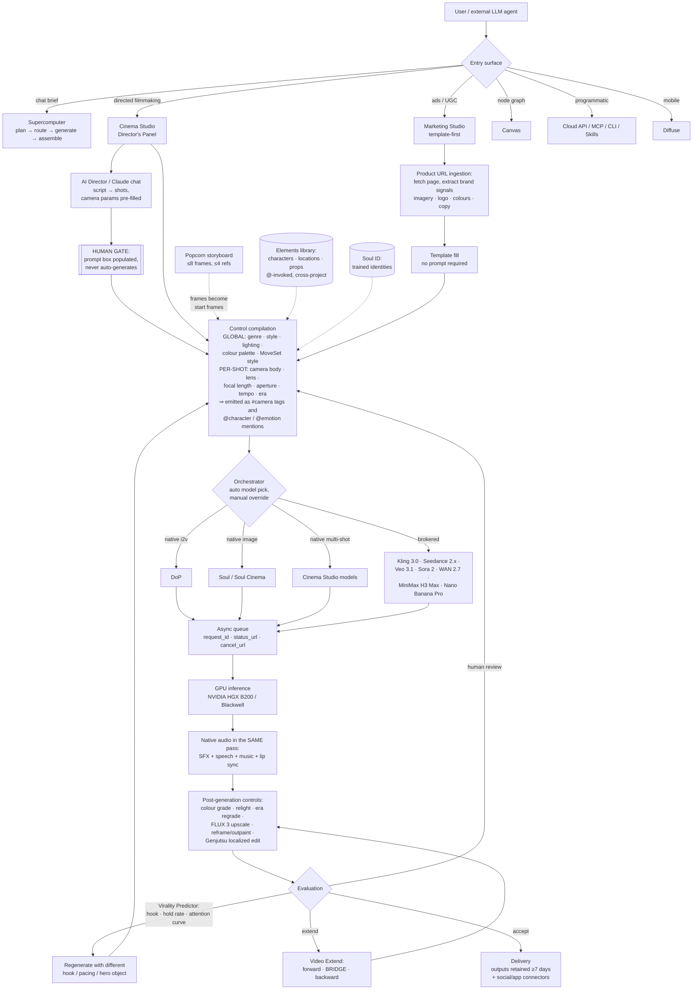

# Higgsfield — Architecture Brief

**Analysis date: 2026-09-13.** Higgsfield ships faster than any platform yet examined in this repository (its own changelog shows multiple releases per week); treat this as a snapshot, not a permanent description. Every non-trivial claim is labeled **VERIFIED** (official higgsfield.ai product pages, help center, changelog, blog, API docs, or a vendor-co-published engineering case study), **STRONG INFERENCE** (implied by observable product behavior, API surface, or known engineering patterns), **HYPOTHESIS** (technically plausible, unconfirmed), or **NOT VERIFIABLE** (searched, nothing found either way) — see `.claude/agents/video-platform-intelligence.md`'s research principle.

**Why this brief exists, and why its angle differs from `runway.md` and `kling.md`.** Runway and Kling were analyzed primarily as *model* companies with products attached. Higgsfield is the inverse: it trains a small number of native models but its centre of gravity is unmistakably the **product layer** — a directorial control surface stacked on top of ~30 brokered third-party generation models. That makes it the closest structural analogue to Narrata in this repository so far, and the most directly useful comparison for a narrative/story-driven product that is API-first for generation.

**Evidence-surface note, per the lesson recorded in `CHANGELOG.md` (2026-09-13) to check for an engineering surface distinct from research/changelog on every brief.** Checked and the result is a mixed one:
- Higgsfield has **no research blog, no arXiv paper, and no engineering blog.** Searched arXiv for a Higgsfield/DoP technical report — nothing. `blog.higgsfield.ai` does not resolve (DNS failure). **[NOT VERIFIABLE / VERIFIED by absence]**
- It **does** have three real first-party surfaces that most competitors lack: an official **changelog** (`higgsfield.ai/creator-hub/changelog`), a genuinely detailed **help center** (`higgsfield.ai/creator-hub/help-center/*`), and **public API docs** (`docs.higgsfield.ai`). The help center is the single best primary source in this brief and carries far more specific detail than Runway's or Kling's equivalents.
- The **only** engineering-depth disclosure found anywhere is a **vendor-co-published case study with Nebius** (Higgsfield's cloud provider). It is near-primary — jointly authored, technically specific, and self-serving for both parties. It is treated as VERIFIED for *what Higgsfield did* and flagged as vendor marketing wherever it makes performance claims.
- **Evidence trap worth naming explicitly:** `geo.higgsfield.ai` is a Higgsfield-owned subdomain hosting what appears to be AI-generated SEO content. It *looks* first-party by domain but reads as marketing copy, sometimes contradicting the help center. **Nothing from `geo.higgsfield.ai` is used for a VERIFIED claim in this brief.**

---

## Executive Summary

1. **Higgsfield is the strongest available proof that the product layer, not the model, is a defensible position in AI video.** It brokers ~30+ third-party models (Kling 3.0, Seedance 2.0/2.5, Veo 3.1, Sora 2, WAN 2.7, MiniMax H3 Max, Nano Banana Pro, Seedream 5.0 Lite, GPT Image 2.0, FLUX) alongside a handful of native ones, and competes almost entirely on *how you direct them*. **[VERIFIED — help center "What is Higgsfield," Canvas docs, changelog]**

2. **Higgsfield's control philosophy is the direct opposite of Runway's, and this is the most important cross-cutting finding in this brief.** `runway.md` documented Runway repeatedly **collapsing control surfaces into prompts** (masks → noun phrases, camera sliders → camera vocabulary, parametric camera control retired 2026-07-30). Higgsfield is **expanding control surfaces into parametric widgets**: a Director's Panel with camera body, lens, focal length and aperture per shot; a two-source Lighting Console; an Emotion Wheel with 8 emotions at 3 intensity levels; 50+ colour-grading presets; a Tempo control; an Era scrubber. Two frontier products reached opposite conclusions about the same problem. **[VERIFIED on both sides]**

3. **It reconciles those two philosophies with a notation layer.** Camera moves are `#`-tags and characters/emotions are `@`-mentions inside the prompt field — so the widgets *compile into prompt tokens* rather than into a separate API parameter space. "Static, handheld, zoom, pan — every move is a # tag." This is the single most transferable UX/prompt-architecture idea in the brief: structured control that is still legible to a text-conditioned model. **[VERIFIED — higgsfield.ai/generate, Cinema Studio 4.0 blog]**

4. **Higgsfield offers a three-way split on character identity where Runway offers two.** **Soul ID** is a genuinely *trained* per-user identity (20–80 photos, "training takes a few minutes," not exportable as a file, holds exactly one person). **Elements** are reference-based reusable named assets (character / location / prop) invoked with `@`. **Soul Cast** is a menu-driven *generative* character builder. Runway's narrative product has only the reference path and states explicitly that Gen-4 References work "without the need for fine-tuning." Higgsfield sells fine-tuning as the premium consistency tier. **[VERIFIED]**

5. **Higgsfield trains its own models and discloses real training-infrastructure detail — via Nebius, not itself.** NVIDIA HGX B200 (Blackwell) multi-node clusters; a "multi-billion-parameter diffusion model" unifying **image editing and keyframe generation**; distributed optimizers chosen *over* activation checkpointing to protect iteration speed; hybrid FlashAttention + cuDNN fused attention; `torch.compile()`; a multi-stage resolution curriculum (~720p → 2K+); decoupled preprocessing with cached latents in a "location-aware store" and async batch pulling to prevent GPU idle; **DPO with human evaluators, fed by multiple-candidate generation and ranking per prompt**. **[VERIFIED — Nebius customer story, vendor-co-published]**

6. **Cinema Studio is the clearest "AI filmmaker" product layer shipped by anyone.** Version 4.0 exposes global project settings (Genre, Style, Lighting, Colour Palette, Camera MoveSet Style) and per-shot settings (Camera type, Lens, Focal length, Aperture), plus an Acting Console, Tempo control, Era scrubber, forward/**bridge**/backward Video Extend, up to **50 references per generation**, and native audio (SFX + speech + music) generated in the same pass as video. Higgsfield's own framing for the output: **"a finished, edited scene, not a raw clip."** **[VERIFIED — help center + Cinema Studio 4.0 blog]**

7. **The AI Director is deliberately advisory, not autonomous.** Claude runs as an AI Director in a chat panel inside Cinema Studio: it adjusts Genre/Style/Camera settings from conversation and decomposes a script into shots with camera parameters pre-filled — but **"Claude-generated prompts populate the prompt box for your review before generating: Claude never triggers generation directly."** A frontier product with full agent capability chose to put a human confirmation gate between planning and spend. **[VERIFIED — help center Cinema Studio]**

8. **Higgsfield never retires versions — Cinema Studio 2.0 through 4.0 all remain selectable simultaneously.** "When you open Cinema Studio, version 4.0 loads by default; the selector at the top switches between all versions, from 2.0 to 4.0." This is the exact opposite of Runway's mass retirement of 2026-07-30 (Gen-3 Alpha Turbo, mask inpainting, Expand Video, parametric camera control all killed on one day). **[VERIFIED]**

9. **Marketing Studio is a distinct business-workflow product, not a template folder — and it is the clearest signal that Higgsfield's go-to-market is performance/creator marketing, not filmmaking.** Paste a product URL → the page is read and **brand signals (product imagery, logo, colours, copy) are automatically extracted and fill a template** → one click, **no prompt required** → finished ad with native audio and lip sync, ≤15s. 1,500+ templates across six task categories including Meta and Google placement specs. **[VERIFIED — help center Marketing Studio]**

10. **Higgsfield ships the first automated post-generation evaluator with a regeneration loop found in this research programme — but it scores commercial outcome, not correctness.** **Virality Predictor** takes a clip ≤15s and returns a Virality Index, Hook Strength, Hold Rate / predicted retention, an attention curve, and a "brain region heatmap," with a documented loop of score → read → regenerate with a different hook/pacing/hero object. Both `runway.md` and `kling.md` concluded no frontier platform runs a per-generation quality/continuity critic. **That conclusion still holds** — Higgsfield built an *engagement* critic instead of a *quality* critic. The runtime quality/continuity gap is now confirmed across three platforms. **[Feature VERIFIED via Higgsfield's own X announcement and app page listing; the neuroscience claim is HYPOTHESIS at best — see "What Could Not Be Verified"]**

11. **There are three architecturally distinct kinds of "template" in the product**, which is a useful taxonomy: **presets** (parameter bundles — 100+ DoP motion presets, 50+ colour grades, 6 lighting presets, 10 cinematographer-inspired MoveSet styles), **format templates** (Marketing Studio's 1,500+ output-format recipes), and **pipeline templates** (any Canvas node graph, saved and re-runnable with swapped inputs). Only the third is user-authored. **[VERIFIED]**

12. **Model *selection* is agentic rather than policy-driven — a real divergence from Runway's router.** Supercomputer's officially named **"Orchestrator"** "picks the best-fit model for every step," with manual override. There is no public equivalent of Runway's declarative `optimize_for: cost | latency | quality` + allow/deny lists + cost caps. Higgsfield's routing is an LLM's judgement; Runway's is a policy engine. **[VERIFIED that Orchestrator exists and auto-selects; the policy-vs-judgement characterisation is STRONG INFERENCE from the absence of any routing-policy surface in the docs or API]**

13. **Higgsfield distributes through agents as a first-class channel.** A hosted MCP server at `mcp.higgsfield.ai/mcp` (shipped 2026-04-30) plus a CLI and installable Skills (`npx skills add higgsfield-ai/skills`) expose generation, character training, Kling 3.0 Motion Control, audio, upscaling, outpainting/reframing and generation history to Claude, ChatGPT, Cursor, Claude Code and any MCP client. Same pattern Runway adopted; now confirmed on two platforms. **[VERIFIED — help center integrations]**

---

## Publicly Known Architecture — Product Layer

```
                       ┌──────────────────────────────────────────────────────┐
                       │                       USERS                           │
                       │  short-film creators · performance marketers ·        │
                       │  agencies · AI-influencer operators · social creators ·│
                       │  teams (real-time co-direction) · external LLM agents  │
                       └───────────────────────┬──────────────────────────────┘
                                               │
 ┌──────────┬───────────┬──────────┬───────────┴──┬──────────┬──────────┬─────────────┐
 │  CINEMA  │ MARKETING │  CANVAS  │ SUPERCOMPUTER│ POPCORN  │    AI    │  MCP · CLI  │
 │  STUDIO  │  STUDIO   │          │              │          │ INFLUENCER│  · SKILLS  │
 │  (2.0→4.0│  ads/UGC  │ node     │  chat agent  │ storyboard│ persona  │  + Blender │
 │  all live│  URL→ad   │ graph    │ "Orchestrator"│ ≤8 frames│ builder  │  plugin    │
 │  at once)│  1,500+   │ chain    │  + Memory    │ auto/    │ menu-    │  + Cloud   │
 │ Director's│ templates│ models   │  + 30+ app   │ manual   │ driven   │    API     │
 │  Panel   │  40+      │ save as  │  connectors  │          │          │            │
 │ Soul Cast│  avatars  │ template │  AI employees│          │          │  DIFFUSE   │
 │ Elements │ Virality  │ realtime │              │          │          │  (mobile)  │
 │ AI Dir.  │ Predictor │ collab   │              │          │          │            │
 └──────────┴───────────┴──────────┴──────────────┴──────────┴──────────┴─────────────┘
   adjacent single-purpose apps: 3D Jutsu (previz) · Genjutsu (localized video edit) ·
   Relight · Color Palette · Faceless Studio · Personal Clipper · 3D Render · Higgsfield Audio
                                               │
                       ┌───────────────────────┴──────────────────────────┐
                       │              ORCHESTRATION / ASSET LAYER          │
                       │  Orchestrator (auto model pick) · Elements library │
                       │  Soul ID registry · Memory · Projects/subfolders · │
                       │  credit metering (cost shown before Generate)      │
                       └───────────────────────┬──────────────────────────┘
                                               │
     ┌─────────────────────────────────────────┴──────────────────────────────────┐
     │                                MODEL LAYER                                  │
     │  NATIVE:  DoP (image→video, "cinematography-aware") · Soul / Soul 2.0 /     │
     │           Soul Cinema (image) · Popcorn (keyframe/storyboard) ·             │
     │           Cinema Studio native models · Higgsfield Audio                    │
     │  BROKERED VIDEO:  Kling 3.0 · Seedance 2.0 / 2.5 · Veo 3.1 · Sora 2 ·       │
     │           WAN 2.7 · MiniMax H3 Max · Gemini Omni 1.1 Flash                  │
     │  BROKERED IMAGE:  Nano Banana Pro · Seedream 5.0 Lite · GPT Image 2.0 ·     │
     │           FLUX (+ FLUX 3 Video Upscaler)                                    │
     │  BROKERED REASONING (Supercomputer):  Claude Opus 4.7 / 4.6 / Sonnet 4.6 ·  │
     │           GPT-5.5 Pro · GPT-6 Astra · Gemini 3.1 Pro · xAI · DeepSeek       │
     └─────────────────────────────────────────────────────────────────────────────┘
```
**[VERIFIED]** for every named surface and model; the grouping into "layers" is analytical framing, not a Higgsfield-published diagram.

---

## Model Stack

| Model | Role | Publicly disclosed internals |
|---|---|---|
| **DoP** (lineage `DoP I2V-01`) | Native **image→video**. Preset-driven cinematic shot generation. 3s or 5s. Seed + steps exposed under Advanced. Appears as "Higgsfield Standard" in model selectors | Officially "cinematography-aware: trained to understand and control motion, lighting, lens behavior, framing, and spatial composition" **[VERIFIED — help center]**. Architecture, params, encoders: **not disclosed**. Widely-repeated secondary claim that DoP "blends diffusion with reinforcement learning so the model reasons about how a scene should move" appears on no Higgsfield page found **[HYPOTHESIS]** — though DPO *is* confirmed in training generally (see Infrastructure) |
| **Soul / Soul 2.0 / Soul Cinema** | Native image models; "built for cinematic, fashion, and culture-native visuals." The substrate Soul ID trains into | Not disclosed. Exposed at `api.higgsfield.ai/higgsfield-ai/soul/v2/standard` **[VERIFIED — docs.higgsfield.ai]** |
| **Popcorn** | Native **storyboard / keyframe** generator. ≤8 frames per sequence, Auto or Manual mode, ≤4 image references, combines real photos with AI images in one sequence | "Higgsfield's native AI storyboard generator" **[VERIFIED]**. Mechanism not disclosed. **[STRONG INFERENCE]** that Popcorn is (or descends from) the Nebius-described "multi-billion-parameter diffusion model [combining] image editing and keyframe generation" — the functional description matches exactly, but Higgsfield never connects the two |
| **Cinema Studio native models** | Multi-shot cinematic video with native audio | Referenced as distinct from brokered models ("Cinema Studio native models plus Seedance 2.5 support") but **never named or described** **[NOT VERIFIABLE]** |
| **Higgsfield Audio** | Voiceover, voice cloning, translation, dubbing, voice change | Not disclosed |
| **Soul ID** | Per-user **trained identity** on the Soul family; also usable as an Element in Seedance video | Training inputs and time VERIFIED (20–80 photos, "a few minutes"); mechanism **not disclosed**. See Continuity System |
| **Virality Predictor** | Post-generation engagement evaluator | Model, training data, validation: **not disclosed** |
| **3D Jutsu** | Prompt/reference → editable 3D scene (objects, layout, lighting, cameras, animation) → video. GLB import/export | Agent-assembled via Supercomputer **[VERIFIED]**; generation mechanism not disclosed |
| **Genjutsu** | Localized video edit: "Change an object, location, product, or character in a video while leaving everything else as it was" | Not disclosed. Functionally Higgsfield's Aleph-2.0 analogue **[STRONG INFERENCE]** |
| **Brokered models** | Coverage, price points, specialist capability, "unlimited" tier fodder | N/A — brokered |

---

## Generation Pipeline



**Evidence note.** Every *node* is VERIFIED as an existing Higgsfield capability. The *edges* are **STRONG INFERENCE** except three that are explicitly documented: the AI Director human gate ("Claude never triggers generation directly"), the Virality Predictor → regenerate loop (documented as a workflow), and Popcorn frames feeding video generation as start frames ("a frame works as a start frame or reference for Kling or Veo, and chaining the final frame of one clip into the next keeps the motion continuous"). **No automated *quality or continuity* critic was found anywhere in the pipeline** — the only automated post-generation evaluator scores predicted engagement. **[STRONG INFERENCE from absence across help center, changelog, product pages and API docs]**

---

# Researched Specifically (2026-09-13)

The eleven subsections below were researched as named topics, in the same manner `runway.md` gave dedicated treatment to camera control, extend, inpainting/outpainting, asset management and environment continuity.

---

## 1. Cinematic Camera System

**Higgsfield's camera system is the most elaborate parametric camera surface shipped by any platform examined in this repository — and it exists in two architecturally different forms.**

### Form A — Camera as a *preset* (DoP, image→video)

```
  DoP PRESET LIBRARY  —  "each preset is a motion blueprint"
  ├─ Effects                 VFX-driven transformations
  ├─ Basic Camera Control    camera moves, standard intensity
  ├─ Epic Camera Control     "camera moves of increasing intensity"
  ├─ Catch the Pulse         curated themed collection
  └─ Mix                     combines presets
  discovery feeds: New · Trending · Top Choice
  named moves reported: crash zoom · dolly · crane · FPV drone ·
                        bullet time · Snorricam · robot arm · helicopter · POV
  quality tiers appear as preset variants: Lite · Preview · Turbo
  output: 3s or 5s · seed and steps exposed under Advanced
```
**[VERIFIED for the five categories, the discovery feeds, the 3s/5s durations, seed/steps, and the "motion blueprint" framing — help center "How to Use Higgsfield DoP for Image-to-Video." The "100+ presets" count and several individual move names come from reporting and Higgsfield marketing pages rather than the help center — STRONG INFERENCE on the exact count.]**

### Form B — Camera as *optics + movement parameters* (Cinema Studio 4.0)

```
  GLOBAL (whole project)              PER-SHOT (each shot individually)
  ──────────────────────              ────────────────────────────────
  Genre  General · Action · Epic      Camera body   Modern · 35mm Film ·
         Drama · Comedy · Horror                    8mm Film · DV Camcorder
  Style                               Lens          "clean sharp to anamorphic
  Lighting                                          and vintage options"
  Colour Palette                      Focal length
  Camera MoveSet Style                Aperture      full manual
    (10 styles, "inspired by
     cinematographers")               Movement      30+ new presets in 4.0
                                                    "every move is a # tag"
  Help center, verbatim: "Video is the primary entry point. Per-shot camera
  settings ... are configured for each individual shot, while global project
  settings ... apply across the whole project."
```
**[VERIFIED — help center "How to Use Higgsfield Cinema Studio" + Cinema Studio 4.0 blog + higgsfield.ai/generate]**

Higgsfield's marketing framing for why this produces cinematic rather than generic motion is an **"anti-slop camera pipeline"** avoiding "plastic skin, drifting faces, no AI shimmer." That is a claim, not a mechanism. **[VERIFIED that they say it; HYPOTHESIS as to what, if anything, it names technically]**

**The architecturally interesting part is the `#` tag.** Camera controls do not live in a separate parameter namespace — they compile into tokens inside the prompt field. That means the same control is simultaneously a UI widget, a text token the model was trained on, and something an agent can emit over MCP without a bespoke schema. It is the bridge between Runway's "camera is vocabulary" position and a real control surface.

**Narrata read.** `runway.md` recommended constraining `MOTION_PROMPT_DRAFTING`/`SHOT_PLANNING` to a fixed camera vocabulary with mandatory speed/duration qualifiers. Higgsfield shows the next step: **make the vocabulary a closed, named, selectable set that compiles into the prompt**, rather than prose the LLM free-writes. Narrata already has a `Shot`-level structure and a Prompt Builder with structured fields (per the most recent commit, `Motion prompt drafting: populate the structured Prompt Builder fields`), so this is an extension of live work, not a new build. Two distinct routes: the **vocabulary/compilation design** goes to `ai-architect`; the **preset-browsing-and-selection interaction** (categories, Trending/Top Choice feeds, intensity tiers) goes to `ui-ux-engineer`. Gap Narrata already covers: per-shot records exist, so attaching camera parameters to a shot needs no new entity. **[Pattern VERIFIED at Higgsfield; the recommendation is ours]**

---

## 2. Shot Generation and Sequencing

**Higgsfield has a real shot-list construct, and it is produced by an LLM under a human confirmation gate.**

```
  SCRIPT / IDEA
      │
      ▼
  AI DIRECTOR (Claude, in-panel chat)
      · "adjusts Genre, Style, and Camera settings based on the conversation"
      · decomposes a script into individual shots
        WITH CAMERA PARAMETERS PRE-FILLED
      · "Claude-generated prompts populate the prompt box for your review
         before generating: Claude never triggers generation directly"   ◄── gate
      │
      ▼
  POPCORN STORYBOARD (optional visual pass)
      · ≤8 frames per sequence · Auto (one prompt expands) or Manual
        (direct every frame: subject, setting, style, atmosphere shot by shot)
      · ≤4 image references
      · "generates frames as connected parts of one visual sequence"
      · edit one frame later without breaking the others
      │
      ▼
  SHOT GENERATION
      · per-shot camera/lens/aperture settings under global project settings
      · Cinema Studio 4.0: up to 30s per generation, scene-level editing
        INSIDE a single generation, cuts and rhythm built in (Tempo control)
      │
      ▼
  SEQUENCING
      · Popcorn frame → start frame for Kling/Veo; "chaining the final frame
        of one clip into the next keeps the motion continuous"
      · Video Extend: FORWARD · BRIDGE · BACKWARD
```
**[VERIFIED — help center Cinema Studio + help center Popcorn + Cinema Studio 4.0 blog + changelog]**

Two findings deserve emphasis.

**First, the "bridge" extend mode.** Runway's extend (delegated to Seedance 2.5) is bidirectional — forwards or backwards. Higgsfield adds a third mode that generates *between* two existing points. That is functionally first-last-frame conditioning exposed as a product feature, and it is the same anti-drift structure `kling.md` identified in the KlingAvatar 2.0 cascade (pin both ends of a segment so drift cannot compound past a boundary). **[VERIFIED that the three modes exist — Higgsfield's own Cinema Studio 4.0 announcement; the connection to first-last-frame conditioning is STRONG INFERENCE]**

**Second, a hierarchy claim that could not be fully confirmed.** Secondary sources describe a three-tier "shots → scenes → story" structure. The help center confirms a **shot-based hierarchy with global-project vs per-shot settings** and confirms **project subfoldering for "Scenes, versions, deliverables"**, but does not state a formal three-tier data model. **[Shot/project tiers VERIFIED; a formal three-tier scene entity is HYPOTHESIS]**

**Narrata read.** This is the section where Narrata is *closest to parity and arguably ahead*. Narrata already has `SHOT_PLANNING`, `SCRIPT_DRAFTING` and `MOTION_PROMPT_DRAFTING` as first-class `AiJobType`s, a real per-Shot/per-Scene data model, and frame-chaining in the Image→Video path. Higgsfield validates that design rather than exposing a gap. Two concrete transfers:
- **The human gate between planning and spend is a design principle, not a limitation.** A platform with far more capital than Narrata chose to have its AI Director *populate* rather than *execute*. This directly supports the recorded decision to defer a `MASTER_AI` top-level orchestrator until per-stage pipelines are solid — Higgsfield is evidence that a strong per-stage product with an advisory planner beats an autonomous one. Flag to `company-vision` / `technical-architect` as sequencing corroboration; do not treat it as a green light to build an orchestrator.
- **Bridge-mode generation** (pin both endpoints, generate the middle) is worth evaluating against Narrata's current forward-chaining, and is the second independent sighting of this pattern after KlingAvatar 2.0. Route to `video-architect`.

---

## 3. Character-Driven Workflows

Higgsfield has **three distinct character mechanisms**, and the product routes between them by *what the user already has*:

```
  USER HAS A REAL PERSON / 20+ PHOTOS      → SOUL ID          (trained)
  USER HAS ONE OR A FEW REFERENCE IMAGES   → ELEMENTS         (reference)
  USER HAS NOTHING BUT AN IDEA             → SOUL CAST        (generated)
                                             AI INFLUENCER    (generated)
```

- **Soul ID** — "20 or more photos of the same person (up to 80 supported)," "high-quality and well-lit, with the face shown from different angles and expressions, no sunglasses or heavy shadows, no cropped faces. Include at least one full-height photo." "Training takes a few minutes." Works "across the Soul family" and in Seedance video generation as an Element. Selected from a **Character tab** when generating images; invoked via **`@ Elements`** for video. **[VERIFIED]**
- **Soul Cast** — a menu-driven AI actor builder: Genre, Budget, Era, Archetype, Identity (gender/race/age), Physical Appearance, Details (scars, tattoos, freckles), Outfit. "No prompting required." Output saveable as an Element. **[VERIFIED for the parameter categories via Higgsfield product/blog pages; the exact 8-category list is STRONG INFERENCE, assembled across pages rather than stated on one]**
- **AI Influencer** — a broader persona builder: "every attribute is configured from menus in the Builder panel, with no prompt writing required." Base panel: Character Type, Gender, Ethnicity/Origin Base, Skin Colour, Eye Colour, Skin Conditions, Age; Advanced adds Face, Body, Style tabs. Supports "humans, mammals, reptiles, fish, hybrids, and aliens, and categories can be blended in a single build." Up to 4K. Documented consistency path: **generate a batch of portraits, then train a Soul ID on 20+ of them.** **[VERIFIED — help center AI Influencer]**

That last detail is the most interesting workflow in the section: **a generated character is made persistent by generating a synthetic photoset and training on it.** Generation → dataset → fine-tune → durable identity. It closes the loop between "invented character" and "trained character" without the user owning any real photographs.

Animation paths for a character: Motion Control (record yourself performing the movement), movement templates, or talking-head with lipsync. **[VERIFIED]**

**Narrata read.** Narrata's `Character` record with `referenceImages` and `isLocked` maps cleanly onto Higgsfield's **Elements** tier and nothing else. The two gaps are asymmetric:
- The **generated-character-builder tier** (Soul Cast / AI Influencer) is a genuine product gap and is *cheap* for an API-first platform — it is a structured form that compiles into an image-generation prompt, then persists the result as reference images on an existing `Character` record. No new infrastructure. Route the interaction design to `ui-ux-engineer` and the attribute schema to `ai-architect`.
- The **trained tier** (Soul ID) is **not** a recommendation for Narrata. It requires owning a trainable image model and a per-user adapter store; Narrata is API-first (Section 12 of the agent spec sets a high bar for self-hosting). Note it as a competitive fact, not a roadmap item. If a provider ever exposes hosted per-character fine-tuning behind an API, re-open it — that is the trigger condition. Route to `ai-architect` as a watch item.
- The **portrait-batch → training-set** pattern is the transferable half even without training: generating a *multi-angle consistent portrait set* for a character and storing it as viewpoint-typed `referenceImages` achieves much of the benefit through pure reference conditioning. This corroborates the `kling.md` recommendation on viewpoint-typed reference images from a second platform.

---

## 4. Templates

Three architecturally distinct template types, which is the useful finding:

| Type | Instances | Contains | Authored by | Applied to |
|---|---|---|---|---|
| **Preset** (parameter bundle) | DoP motion presets (5 categories, 100+); 50+ colour-grading presets; 6 lighting presets; 10 Camera MoveSet styles "inspired by cinematographers"; Era 1960s–2020s; Tempo (Auto/Chaotic/Dynamic/Calm/Single Shot); Genre (6) | A named bundle of generation parameters | Higgsfield | One generation |
| **Format template** (output recipe) | Marketing Studio: **1,500+**, six categories — Product Shots (Studio / Lifestyle / With Model), Ads (**Meta and Google placement specs**), Marketplace, Posters, UGC Videos (Faceless / Talking Head / Silent), Motion (Hypermotion / 2D Product Motion / Mixed Media / Motion Design) | A finished-ad structure with slots for brand assets | Higgsfield | One deliverable |
| **Pipeline template** (workflow) | Any Canvas board: "save an entire workflow as a reusable template — for ad variants, character sheets, storyboards, or any pipeline you run repeatedly. Duplicate, swap the inputs" | A node graph of chained models | **The user / the team** | A repeatable multi-step job |

**[VERIFIED — help center Marketing Studio, help center DoP, help center Canvas, Cinema Studio 4.0 blog]**

Two design details worth recording. **Presets carry discovery affordances** — DoP surfaces New / Trending / Top Choice feeds, which turns a preset library into a *ranked* surface with social signal rather than a flat dropdown. And **Marketing Studio is explicitly "template-first": "instead of describing an ad from scratch, you start from a ready format and connect your product,"** generating "in one click" with "no prompt required." The prompt is not the primary interface there at all. **[VERIFIED]**

**Narrata read.** Preset-as-parameter-bundle is the immediately transferable one and it composes with Narrata's existing structures: a named "look" (lighting + palette + era + camera MoveSet) attached to a `StoryBible` or project would give story-wide visual consistency from a single selection, which is *exactly* the problem a Visual Style Bible is meant to solve. Route the concept to `ai-architect` (what fields, how they compile into prompts) and the browsing/selection UX to `ui-ux-engineer`. Pipeline templates are a Canvas-shaped idea and should be considered **Avoid for now** — they presuppose a node-graph product Narrata does not have and should not build to get them. Format templates are a Marketing Studio concern; see Subsection 11 and route to `product-strategist` / `growth-strategist`.

---

## 5. Director-Style Controls

This is Higgsfield's differentiator and the reason the user flagged it as relevant to Narrata's vision. Cinema Studio 4.0 frames itself as a **"production console,"** and the controls are organized the way a film crew's departments are.

```
  DEPARTMENT              CONTROL SURFACE                         SCOPE
  ──────────              ───────────────                         ─────
  CAMERA / OPTICS   body (Modern/35mm/8mm/DV) · lens ·            per shot
                    focal length · aperture
  CAMERA MOVEMENT   30+ movement presets · MoveSet style ·        per shot,
                    "every move is a # tag"                       style global
  LIGHTING          2-source Video Lighting Console               per shot
                    presets: Auto · Silhouette · Practicals ·
                    Window · Overhead Fall · Contre-jour ·
                    Soft Cross
                    manual: colour · brightness · diffuse · angle
  COLOUR / GRADE    50+ palettes · temperature · contrast ·       POST-generation
                    saturation · sharpness · film grain ·
                    highlights · exposure
  PERIOD / STOCK    Era scrub 1960s–2020s — "scrub the decade     global
                    and the whole film regrades — stock,
                    halation, colour"
  PERFORMANCE       Acting Console / Emotion Wheel:               per character,
                    Hope · Anger · Joy · Trust · Fear ·           via @-mention
                    Surprise · Sadness · Disgust
                    × 3 intensity levels
  EDITING / PACING  Tempo: Auto · Chaotic · Dynamic · Calm ·      per generation
                    Single Shot — "cuts, rhythm and flow
                    built in"
  GENRE             General · Action · Epic · Drama ·             global
                    Comedy · Horror
```
**[VERIFIED — Cinema Studio 4.0 blog + help center + higgsfield.ai/generate. Note a minor internal inconsistency: the blog says "six presets" for Lighting then names seven; treat the count as ~6–7.]**

Three structural observations:

- **Lighting and colour sit on opposite sides of generation.** Lighting is a *pre-generation* conditioning control; colour grading is a *post-generation* adjustment on the produced clip. That is exactly how real production works, and it is a deliberate architectural split — grade is cheap and non-destructive, light is not.
- **The Emotion Wheel is per-character and addressed by `@`-mention.** Performance direction is bound to an entity, not to the shot as a whole. That is the same "attributed subject" idea `runway.md` found in WorldPrompt — except here it ships in the narrative product rather than being locked in a world-model research branch.
- **Tempo is editorial direction, not generation direction.** "Cuts, rhythm and flow built in" inside a single ≤30s generation means the model is producing an *edited sequence*, and the user is directing the cutting pattern. Higgsfield's own claim: the output is "a finished, edited scene, not a raw clip."

**Narrata read.** This is the richest vein in the brief for Narrata's product vision, and most of it is *cheap for an API-first platform* because these controls are conditioning vocabulary, not model features.
- **Per-character emotion/performance direction bound to an entity** is a near-exact fit for Narrata's existing `Character` records and its `DIALOGUE_DIRECTION` / `NARRATION_DIRECTION` job types — those stages already exist and already know which character is speaking. Adding a structured emotion + intensity attribute that compiles into both the image/video prompt *and* the voice generation call would give visual and vocal performance a single source of truth. This is the highest-leverage single item in the brief. Route to `ai-architect`; the voice-side implication touches `video-architect`'s audio dispatch.
- **A department-organized control panel** (camera / light / grade / performance / pacing) is a UX pattern, and the reason it works is that it matches a mental model users already have. Route to `ui-ux-engineer`.
- **Pre-generation vs post-generation split**: grade, relight and era-regrade as *post* operations on an existing take is a cost lever as much as a creative one — it avoids regenerating a good performance to fix a bad look. Route to `video-architect`; note that Narrata's ffmpeg render pipeline is the natural home for grade-like operations without any model call at all.

---

## 6. Scene Composition

Higgsfield composes multiple elements into a scene at **three different levels of structure**, from loosest to strictest:

```
 LEVEL 1 — REFERENCE STACKING (loosest)
   Cinema Studio 4.0: "up to fifty per generation" — uploaded images/videos,
   Soul Cast characters, saved Elements. Earlier versions: 2.5 → 3 Soul Cast
   characters; 3.0 → up to 9 references "including characters, locations,
   and scene details."
   ⇒ composition = "put enough of the right pictures in the context"
   [VERIFIED — help center Cinema Studio, Cinema Studio 4.0 blog]

 LEVEL 2 — NAMED-TAG BINDING (the notation layer)
   Elements are @-mentioned by name; emotions are assigned to a character
   by @-mention. Higgsfield's own guidance is that assets must be named
   consistently because prompts auto-match inputs by these tags.
   ⇒ composition = a prompt sentence with typed, resolvable entity slots
   [Element @-invocation and @-mention emotion assignment VERIFIED;
    the "prompts auto-match your inputs by these tags" phrasing comes from a
    Higgsfield blog/SEO surface rather than the help center — STRONG INFERENCE]

 LEVEL 3 — 3D JUTSU (the only true scene graph)
   "Turns a prompt or reference into an editable 3D scene, with objects,
   layout, lighting, cameras, and animation, and then into video."
   · an agent running on Supercomputer assembles the scene
   · the user refines "real scene objects without regenerating everything"
   · manual editing is scoped: move objects, add primitives and lights,
     frame cameras
   · GLB imports keep animation intact; exports as GLB, animated MP4,
     or a static frame
   · positioned as "scene blocking and previz"
   ⇒ composition = explicit spatial state, edited, THEN rendered
   [VERIFIED — changelog 2026-09-04 + Higgsfield 3D Jutsu blog/product page]
```

**3D Jutsu is the most significant composition finding.** `runway.md` recorded that the only real structured world-state format at Runway (WorldPrompt — persistent environment + attributed subjects + "laws" + first frame, split from a timestamped event stream) is confined to the GWM research branch and unavailable to narrative generation. Higgsfield shipped a *user-editable* spatial scene representation into the consumer product, with objects, lights and cameras as addressable entities and a non-destructive edit path ("refine real scene objects without regenerating everything"). It is far cruder than WorldPrompt conceptually, but it is **live**. **[VERIFIED; the comparison to WorldPrompt is our analysis]**

**Narrata read.** Careful here — this is a place where the obvious lesson is the wrong one.
- **Do not build a 3D previz surface.** It is a separate product category (a 3D editor), it requires 3D asset handling, GLB pipelines and a spatial editing UI, and it is orthogonal to narrative continuity. This belongs in "What Narrata Should Avoid."
- **Do take the decomposition it implies.** 3D Jutsu separates *what is in the scene and where* from *how the scene is rendered*. Narrata's `Location` and `Character` records already hold the "what"; what is missing is any notion of **which entities are present in a given shot and in what relation** — i.e. a per-shot entity manifest rather than free-text prose. That is a schema-level change with no new infrastructure, and it makes continuity checkable (a validator can ask "was every manifest entity present?"). Route to `ai-architect` for the schema and `video-architect` for the validation implication.
- **Reference-budget escalation is a real trend signal** (Runway: Seedance 2.5 at 30 images + 10 videos + 10 audio; Kling: 7–10; Higgsfield: 3 → 9 → **50** across one year of versions). If reference budgets keep growing, "retrieval-into-context" beats clever conditioning tricks, and Narrata's job is to *select and rank* which of a project's reference images to send — a retrieval problem, not a modelling one. Route to `ai-architect`.

---

## 7. Multi-Model Orchestration

**Higgsfield brokers more models than Runway and selects between them with an agent rather than a policy engine.**

```
                      ┌──────────────── SUPERCOMPUTER ─────────────────┐
                      │  "breaks a request into steps, picks the right  │
   plain-language ───►│   model for each one, runs them, and assembles  │
   brief              │   the result"                                   │
                      │  "Orchestrator now picks the best-fit model     │
                      │   for every step"                               │
                      │  default: auto · override: explicit selector    │
                      │  memory: "context the agent keeps between chats"│
                      │  connectors: Slack · Drive · Notion · Gmail ·   │
                      │              Figma · Telegram · TikTok · 30+    │
                      └───────────────────────┬───────────────────────┘
                                              │
        ┌──────────────────┬──────────────────┼───────────────────┬─────────────────┐
        ▼                  ▼                  ▼                   ▼                 ▼
   REASONING LLMs     NATIVE GEN         BROKERED VIDEO      BROKERED IMAGE     TOOLS/APPS
   Claude Opus 4.7    Soul / Soul        Kling 3.0           Nano Banana Pro    upscale
   Opus 4.6           Cinema             Seedance 2.0/2.5    Seedream 5.0 Lite  reframe
   Sonnet 4.6         Cinema Studio      Veo 3.1             GPT Image 2.0      bg removal
   GPT-5.5 Pro        DoP                Sora 2              FLUX               audio/dub
   GPT-6 Astra        Popcorn            WAN 2.7                                Personal
   Gemini 3.1 Pro                        MiniMax H3 Max                         Clipper
   xAI · DeepSeek                        Gemini Omni 1.1 Flash                  3D / web
```
**[VERIFIED — help center Supercomputer, higgsfield.ai/supercomputer-intro, help center Canvas, changelog Aug–Sep 2026]**

Four observations:

- **The roster is refreshed continuously, and the changelog is the proof.** Within roughly two weeks (2026-08-27 → 2026-09-04) Higgsfield added FLUX 3 Video Upscaler, Gemini Omni 1.1 Flash, MiniMax H3 Max, Claude Fable 5.1 and GPT-6 Astra. Model ingestion is an operational routine, not a project. **[VERIFIED]**
- **Reasoning models are brokered on the same footing as generation models.** The user can choose which LLM powers the agent chat. Very few platforms expose that.
- **Higgsfield never states what the Orchestrator *is*.** No default model is named, no routing policy is published, no cost/latency/quality axis exists in any public surface. Secondary sources assert a custom "Hermes Agent" fine-tuned from Nous Research's Hermes 3 with 40+ tools; that claim does not appear on any Higgsfield page found, and the same sources contain a clear factual error elsewhere (describing Seedance, a ByteDance model, as "Higgsfield's own"). **[HYPOTHESIS — explicitly not used as evidence. Note only that "Hermes" does appear on Higgsfield's official MCP page as a *supported CLI client*, which is a different claim entirely.]**
- **Routing is entangled with pricing.** "Unlimited model access" applies to mid-tier models on certain plans and time windows; premium models (Sora 2, Veo 3.1, Kling 3.0) still consume credits. Which model the Orchestrator picks therefore has a direct margin consequence. **[Plan mechanics VERIFIED from the changelog's 2026-09-03 Scale Plans entry and Higgsfield's pricing surfaces; the "routing is a margin lever" reading is STRONG INFERENCE]**

**Narrata read.** Narrata's `AiModelOption`/`AiJobType` registry plus `VideoModelConfig` already does provider-agnostic, admin-configured per-job-type routing with duration-based selection. Higgsfield is the third independent confirmation that a brokered multi-model layer is the correct architecture for a product-layer company — this is validation, not a gap.
- The evidenced extension is **agentic selection as an *optional* layer over a deterministic registry, not a replacement for it.** Higgsfield keeps a manual selector alongside auto. Narrata should keep its deterministic registry as the substrate and treat any "let the model choose" behaviour as a thin layer that *writes into* the same registry-shaped decision. Route to `ai-architect`.
- **The margin entanglement is a real finding with pricing implications** and should not be reasoned about here: hand to `monetization-strategist` (routing decisions are a unit-economics lever, and Narrata's registry already has the hooks to implement tiered routing) and to `market-intelligence` (the "unlimited mid-tier, credits for premium" structure is a competitor pricing pattern).
- **Continuous model ingestion as an operational routine** is a `technical-architect` note: Narrata's provider-agnostic call sites are what make this cheap, and that property is worth protecting.

---

## 8. Creative UI

Higgsfield's product surface is **tool-per-job**, not one-editor-for-everything — seven top-level tools plus a long tail of single-purpose apps, with an official decision guide for choosing between them.

```
  WEB — higgsfield.ai, "choose a tool from the home page"
    CINEMA STUDIO      parametric, panel-driven, versioned 2.0→4.0 (all live)
    MARKETING STUDIO   template-first, URL-driven, prompt optional
    CANVAS             node-based infinite board; models chain; parallel runs
                       with side-by-side comparison; save graph as template;
                       real-time multi-user; "you only spend credits when a
                       node actually generates, not when you build the pipeline"
    SUPERCOMPUTER      chat; agent plans/routes/generates/assembles;
                       "AI employees" with bundled skills
    AI INFLUENCER      form/menu-driven persona builder
    POPCORN            storyboard grid
    single-purpose apps 3D Jutsu · Genjutsu · Relight · Color Palette ·
                       Faceless Studio · Personal Clipper · 3D Render ·
                       Virality Predictor · Higgsfield Audio

  MOBILE — DIFFUSE (iOS + Android), social-shaped: selfie → clip, daily free credits

  AGENT — MCP server at mcp.higgsfield.ai/mcp (shipped 2026-04-30);
          CLI; Skills via `npx skills add higgsfield-ai/skills`;
          clients: Claude, ChatGPT, Cursor, Claude Code, OpenClaw, Hermes

  PLUGIN — Blender add-on with an MCP bridge

  API — docs.higgsfield.ai; key-pair auth; async submit → poll or webhook;
        returns {status, request_id, status_url, cancel_url};
        outputs retained "at least seven days"
```
**[VERIFIED — help center "Which Higgsfield Tool Should You Use," help center Canvas / integrations, docs.higgsfield.ai, changelog, Higgsfield Blender plugin page]**

Four interaction patterns stand out:

- **The version selector is a product decision, not a legacy artifact.** All Cinema Studio versions 2.0–4.0 remain usable. Users who tuned a workflow to 2.5's behaviour keep it. This is diametrically opposed to Runway's retirement discipline and is only affordable because Higgsfield's versions are *control surfaces over brokered models*, not models themselves. **[VERIFIED]**
- **Cost is shown before commitment, everywhere.** "The credit cost is shown on the Generate button before you confirm"; in Canvas, building a pipeline is free and only node execution bills. **[VERIFIED]**
- **Four interaction paradigms coexist** — panel (Cinema Studio), template gallery (Marketing Studio), node graph (Canvas), chat (Supercomputer) — with an official routing guide between them rather than an attempt to unify them.
- **The agent surface is a distribution channel.** MCP + CLI + Skills + a Blender plugin means Higgsfield generation appears inside tools it does not own.

**Narrata read.**
- **Cost-before-generate is the cheapest high-value item in this entire brief and Narrata has the data already.** A prior finding recorded in project memory is that OpenRouter's cost field is currently discarded; surfacing per-generation cost on the action button is a small change with disproportionate trust value. Route to `ui-ux-engineer` (surface) and `monetization-strategist` (it is the precondition for credit-based pricing).
- **Do not adopt tool-per-job.** Higgsfield's seven tools serve seven *different* jobs-to-be-done for different buyer personas. Narrata is a single narrative pipeline; fragmenting it would be copying an artifact of Higgsfield's go-to-market, not a UX insight. This is a `product-strategist` note and belongs in "Avoid."
- **Do not build a node canvas.** Same reasoning as Subsection 4 — it presupposes arbitrary pipeline composition, which contradicts Narrata's opinionated staged pipeline.
- **Version-pinning of a generation configuration is worth a thought**, though, because Narrata's `AiModelOption` registry means a project generated last month may not reproduce today. That is a real reproducibility question for `technical-architect` / `video-architect`, and Higgsfield's answer (never break an old configuration) is one valid response.
- **MCP as a distribution channel** is now confirmed on two platforms (Runway, Higgsfield). Route to `growth-strategist` as a channel observation — not an architecture recommendation.

---

## 9. Image → Cinematic Video

**DoP is Higgsfield's answer to "why is our i2v cinematic rather than generic," and the answer has three parts: a purpose-trained model, a preset as the unit of motion, and the keyframe as the load-bearing input.**

```
  INPUT            a single keyframe image (PNG/JPG/paste)
                   "DoP builds the entire shot from it" — guidance is to use
                   "a sharp, well-composed image"
       │
       ▼
  PRESET           "each preset is a motion blueprint that defines the camera
                   logic or effect of the clip"
                   Effects · Basic Camera Control · Epic Camera Control ·
                   Catch the Pulse · Mix
       │
       ▼
  TEXT             descriptive prompt layered on top of the preset
       │
       ▼
  SETTINGS         duration 3s or 5s · seed · steps (Advanced)
       │
       ▼
  MODEL            DoP — "Higgsfield's native image-to-video model, built for
                   high-quality, controllable, cinematic video generation from
                   images ... cinematography-aware: trained to understand and
                   control motion, lighting, lens behavior, framing, and
                   spatial composition"
```
**[VERIFIED — help center "How to Use Higgsfield DoP for Image-to-Video"]**

**What actually makes it "cinematic" rather than generic i2v**, as far as the evidence supports:
1. **The motion is chosen from a curated library, not described in prose.** A preset is a known-good motion blueprint the model was trained to execute. Generic i2v asks the user to describe motion in words and hope; DoP constrains the space to moves that work. **[VERIFIED]**
2. **The training objective is explicitly cinematographic** — motion, lighting, lens behaviour, framing and spatial composition are named as what the model was trained to control. **[VERIFIED that this is the claim; the mechanism is not disclosed]**
3. **Higgsfield's entire pipeline treats the still frame as the unit of authorship.** Popcorn generates storyboard keyframes; DoP animates a keyframe; Soul/Soul ID guarantee the person in the keyframe. The image carries composition, character, wardrobe, lighting and set — so the video model only has to solve *motion*. **[STRONG INFERENCE — this is our reading of how the pieces fit; Higgsfield never states it as an architecture]**
4. Related surfaces in the same family: Draw to Video, Sketch to Video, Product Placement modes, and the Diffuse mobile app, all built on the DoP line. **[STRONG INFERENCE — reported consistently; not found on a help center page this session]**

**Narrata read — this is the most direct architectural validation of Narrata's design found in any brief so far.** Narrata's Image→Video mode (generate an image per shot, then animate per shot-pair, per the per-shot-pair architecture built 2026-08-23) is *the same bet*: solve identity, composition and style in image space where it is cheap and controllable, then ask the video model only for motion. Higgsfield, at ~$700M annualized and 4.5M daily generations, runs the same decomposition. This is evidence that Narrata's visual-production-mode design is on the right side of an architectural fork, not a compromise.
- The evidenced extension is **preset-as-motion-blueprint**: Narrata's `MOTION_PROMPT_DRAFTING` currently drafts motion prose. A curated, named motion-preset library that the drafting stage *selects from* (and may then elaborate) would constrain the output space to moves that reliably work, and is a prompt-architecture change rather than a build. Route to `ai-architect`, with the library-browsing UX to `ui-ux-engineer`.
- **Keyframe quality as a gating input** ("DoP builds the entire shot from it") is a validation argument: Narrata already has `IMAGE_VALIDATION` on the image stage. Higgsfield's framing says that stage is not merely a nicety — it is the load-bearing quality gate for the *video* that follows. Worth telling `video-architect` explicitly, because it changes the priority of strengthening image validation relative to adding video validation.

---

## 10. Consistent Characters — Mechanism, and the Comparison to Runway

The mechanism question, answered as precisely as the evidence allows:

| | **Soul ID** | **Elements** | **Soul Cast / AI Influencer** |
|---|---|---|---|
| Mechanism class | **Trained** per-identity | **Reference-conditioned** | **Generated** then persisted as reference |
| Input | 20–80 photos of one real person | 1+ images of anything (character, location, prop) | Menu selections |
| Setup cost | "Training takes a few minutes" | Instant | Instant |
| Invocation | Character tab (images) / `@ Elements` (video) | `@`-mention by name | Saved as an Element |
| Scope | **Exactly one person**; "for scenes with two or more consistent characters, use Elements" | Unlimited entities, any type | — |
| Portability | **"Not exportable as a standalone file"** | Reusable "across shots and projects," team-shared | — |
| Fidelity claim | "clearly the same person," *not* pixel-identical | Not claimed | Consistent "across every scene and angle" |
| Works with | Soul family; Seedance video as an Element | Cinema Studio, Canvas, video models | Cinema Studio |

**[VERIFIED — help center Soul ID, help center Cinema Studio, help center AI Influencer]**

**What the mechanism probably is.** Higgsfield never says. But minutes-scale training, a 20–80 image requirement, per-identity scoping, single-subject limitation, and explicit non-exportability together point strongly at a **per-user lightweight adapter fine-tune (LoRA-class) over the Soul image model**, stored server-side and referenced by ID. The single-person limitation is itself diagnostic: reference-conditioning methods compose across subjects; adapter fine-tunes notoriously do not. **[STRONG INFERENCE; the specific method — LoRA vs. DreamBooth-style vs. an identity encoder — is HYPOTHESIS]**

### Comparison to Runway's Characters/References split (per `runway.md`)

```
  RUNWAY                                    HIGGSFIELD
  ──────                                    ──────────
  Characters (Dev API objects)              Soul ID
    conversational-avatar entities,           trained identity, one person,
    grouped with tool calling, video          minutes to create, premium
    meetings, camera/screen sharing           consistency tier
    → GWM Avatars branch, NOT narrative       → fully inside the narrative
      continuity                                and marketing products

  References (saved, tagged, named)         Elements
    ENTITY-AGNOSTIC: "consistent             TYPED but the type is a label:
    characters, objects and locations"       character / location / prop
    explicitly "without the need for         @-invoked by name, cross-project,
    fine-tuning or additional training"      team-shared
    → carries narrative identity             → carries narrative identity

  Brand Kits (enterprise)                   (no direct analogue; Marketing
    sectioned reference bundles whose        Studio extracts brand signals
    descriptions compile into a custom       from a URL instead)
    system prompt
```

**The substantive divergence: Runway made "no fine-tuning required" a selling point; Higgsfield made fine-tuning the premium tier.** Both ship a reference path. Only Higgsfield also ships a trained path, and it positions the trained path as *higher fidelity but less composable* — which is a coherent and honest trade, stated in its own docs ("holds one person").

A second divergence worth recording: **Runway's `Character` name is misleading** (it denotes a conversational avatar, not a narrative-continuity record — corrected in `runway.md` on 2026-09-13). **Higgsfield's naming is accurate**: Soul ID is an identity, an Element is a reusable asset. Kling's Element Library uses almost identical vocabulary and `@name` invocation — **Kling and Higgsfield independently converged on the same construct and even the same notation.** That convergence across two large, unrelated platforms is the strongest evidence yet that the named-reusable-entity-invoked-inline pattern is correct. **[VERIFIED on both sides; the convergence observation is our analysis]**

**Narrata read.**
- **Narrata's `Character`/`Location` + `referenceImages` + `isLocked` is the Elements tier, and it is now corroborated by three platforms** (Runway References, Kling Elements, Higgsfield Elements). No change needed to the core design — this is validation.
- **Two evidenced deltas, both small:** (a) `@`-mention invocation *inside prompt text* rather than a separate reference-attachment panel — now seen at both Kling and Higgsfield, strengthening the `kling.md` recommendation; (b) an explicit **type** on the entity (character / location / **prop**) — Narrata has `Character` and `Location` but no prop-equivalent, and props are a documented continuity failure mode. Route both to `ai-architect`.
- **The trained tier is a deliberate non-recommendation for Narrata.** It requires owning or renting per-identity fine-tuning, which Section 12 of the agent spec sets a high bar against. The honest competitive read is that Higgsfield will beat Narrata on single-protagonist likeness fidelity, and Narrata should compete on *multi-character narrative continuity across a long story* — precisely the axis where Soul ID explicitly does not work ("holds one person"). That is a differentiation finding for `product-strategist`.

---

## 11. Social / Advertising Workflows

**This is where Higgsfield's go-to-market visibly diverges from Runway's, and it is structured enough to be worth treating as an architecture in its own right.**

```
  ┌─────────────────────── MARKETING STUDIO ───────────────────────┐
  │                                                                  │
  │  INGEST     paste a website or product page link                │
  │             "the page is read automatically, and brand signals   │
  │              (product imagery, logo, colors, copy) fill the      │
  │              template"                                           │
  │                    │                                             │
  │  SELECT     1,500+ templates, six categories:                    │
  │             Product Shots · Ads (Meta / Google placement specs)  │
  │             Marketplace · Posters · UGC Videos · Motion          │
  │                    │                                             │
  │  CAST       40+ ready-to-use avatars, or a custom one from a     │
  │             description, or a Soul ID trained once from 20+      │
  │             photos — "every ad variation after that uses the     │
  │             same face automatically"                             │
  │                    │                                             │
  │  GENERATE   one click · "no prompt required" · ≤15s per          │
  │             generation · native audio and lip sync in one pass   │
  │             UGC sub-formats: Faceless · Talking Head · Silent    │
  │                    │                                             │
  │  EVALUATE   VIRALITY PREDICTOR — upload a clip ≤15s, receive:    │
  │             · Virality Index (overall)                           │
  │             · Hook Strength (first-second attention capture)     │
  │             · Hold Rate / predicted retention                    │
  │             · Attention curve over the timeline                  │
  │             · a "heatmap of brain regions your clip activates"   │
  │             available on-platform AND via MCP/CLI                │
  │                    │                                             │
  │  ITERATE    documented loop: score → read the heatmap →          │
  │             regenerate with a different hook, pacing, or         │
  │             hero object                                          │
  │                    │                                             │
  │  RECREATE   AD REFERENCE — upload an existing (or competitor's)  │
  │             viral video and recreate it with your own product,   │
  │             brand and message                                    │
  └──────────────────────────────────────────────────────────────────┘

  ADJACENT SOCIAL SURFACES
    AI INFLUENCER    persistent virtual persona for ongoing content
    DIFFUSE (mobile) selfie → clip, daily free credits, social-shaped
    FACELESS STUDIO  animated faceless videos in three steps, four themes:
                     Education · History · Kids · Storytelling
    PERSONAL CLIPPER YouTube clip extraction
    CONNECTORS       TikTok, Slack, Drive, Notion, Gmail, Figma, 30+
```
**[VERIFIED — help center Marketing Studio, help center integrations, changelog; the Virality Predictor metric names come from Higgsfield's own X launch announcement and app listing, cross-confirmed by multiple independent write-ups, and are therefore VERIFIED at the level of "these are the advertised outputs." The Ad Reference pairing is VERIFIED from Higgsfield's own announcement.]**

**Three architectural observations.**

- **Brand-signal extraction from a URL is the most underrated piece.** It replaces the entire "upload your assets and describe your brand" onboarding with a paste. Architecturally it is a scrape + structured-extraction step feeding a template's slot schema — unglamorous, cheap, and it removes the single biggest friction point in ad creation. **[VERIFIED that it happens; the extraction mechanism is not disclosed]**
- **The Virality Predictor closes an evaluation loop that no other platform examined has closed.** `runway.md` and `kling.md` both concluded that no frontier platform runs a per-generation critic. Higgsfield built one — but it answers "will this perform?" rather than "is this correct?". There is still **no continuity critic, no identity-drift check, no prompt-adherence gate** anywhere in Higgsfield's pipeline. The industry-wide runtime *quality* gap is now confirmed across three platforms, while the *engagement* evaluation space has a shipped competitor. **[STRONG INFERENCE, corroborated across three platforms]**
- **The "brain region heatmap" is a neuromarketing claim with no published validation.** No methodology, model, training data, or correlation study was found. It is presented as a product output, not a measured prediction. Treat it as a UI metaphor with unknown predictive value. **[HYPOTHESIS; see "What Could Not Be Verified"]**

**Narrata read — this subsection routes mostly outside the architecture agents.**
- **To `growth-strategist`:** the whole pattern is a growth architecture, not a video architecture. Template-first creation (no prompt required), an evaluation score that motivates a *second* generation, a competitor-video "recreate this" hook, a social-shaped mobile app with daily free credits, and agent-surface distribution via MCP together explain how a product-layer company reached scale fast. The single most portable idea for a narrative product: **an automated post-generation score that makes regeneration feel purposeful rather than like failure.** Narrata's take-history already stores every attempt; scores would give takes a reason to be compared.
- **To `monetization-strategist`:** template-first generation drives volume per user (many ad variants per brief), which is the demand side of a credit model; "cost shown before Generate" is the trust mechanism that makes credits tolerable; the unlimited-mid-tier / credits-for-premium split is a live competitor structure. Also note Marketing Studio's ≤15s ceiling — cheap unit, high volume — versus Cinema Studio's ≤30s.
- **To `market-intelligence`:** Higgsfield's positioning is performance/creator marketing with filmmaking as a halo, which is materially different from Runway's studio/post-production push. Business figures encountered (≈$700M annualized per Sacra, ~20M users, 50M videos, ~4.5M daily generations, $130M Series A at $1.3B, reported talks at ~$5B) are business intelligence and are **not** reasoned about here.
- **To `product-strategist`:** Higgsfield's ads business funds its filmmaking product. That is a strategic pattern worth a decision, not a feature to copy. Narrata should *not* build Marketing Studio; the question worth asking is whether any narrow, high-volume workflow could play the same role for Narrata.
- **Explicitly not recommended:** an "Ad Reference"-style competitor-video recreation feature. It is legally and reputationally fraught and orthogonal to narrative storytelling.

---

## Orchestration

Higgsfield runs **two orchestration layers that do not look alike**, and the distinction matters.

```
  LAYER A — DETERMINISTIC, USER-DRIVEN (Cinema Studio, Marketing Studio, DoP)
    The user (or a template, or the AI Director) fills a structured control
    surface. The surface compiles to prompt tokens (# camera tags, @ entity
    mentions) plus parameters. One generation call. No agent involved.
    ⇒ predictable, inspectable, cheap to reason about

  LAYER B — AGENTIC (Supercomputer, 3D Jutsu)
    A brief goes to the Orchestrator, which "breaks a request into steps,
    picks the right model for each one, runs them, and assembles the result,"
    with memory across chats and 30+ external connectors.
    ⇒ open-ended, multi-step, model-chosen

  LAYER C — MANUAL COMPOSITION (Canvas)
    The user draws the pipeline as a node graph and saves it as a template.
    ⇒ the user IS the orchestrator; graphs become reusable artifacts
```

The notable thing is that **Higgsfield did not collapse these into one**. A user with a precise intent uses Layer A; a user with a vague brief uses Layer B; a user with a repeated process uses Layer C. And the AI Director sits *inside* Layer A rather than replacing it — planning without executing. **[VERIFIED for the existence and behaviour of all three; the three-layer framing is our analysis]**

**Narrata read.** Narrata's staged pipeline is Layer A, and the recorded architectural decision to defer `MASTER_AI` is a decision to defer Layer B. Higgsfield is evidence that Layer A can carry a product to very large scale on its own, and that when Layer B arrives it should be *additive* rather than a replacement. Layer C (Canvas) should be considered out of scope for Narrata entirely. Sequencing question for `company-vision` / `technical-architect`; do not treat as a build recommendation.

---

## Continuity System

Higgsfield attacks continuity at five layers. Compared with Runway and Kling, its distinguishing features are the **trained** layer and the **post-generation look** layer.

```
 LAYER 1 — TRAINED IDENTITY (Soul ID)                        ★ unique among the three
   per-identity training on 20–80 photos, minutes to build, server-side,
   non-exportable, single-person, works across the Soul family and as an
   Element in video generation
   ⇒ continuity as a model artifact
   [inputs/limits VERIFIED; mechanism STRONG INFERENCE (adapter fine-tune)]

 LAYER 2 — PERSISTENT NAMED ENTITIES (Elements)
   "An Element (a character, location, or prop) is created once and reused
   across shots and projects." @-invoked, project-scoped but portable,
   instantly shared across a team.
   ⇒ continuity as a durable addressable record — same construct as Kling's
     Element Library, same @name notation, arrived at independently
   [VERIFIED]

 LAYER 3 — REFERENCE STACKING
   3 (CS 2.5) → 9 (CS 3.0) → 50 (CS 4.0) references per generation, mixing
   uploads, Soul Cast characters and saved Elements
   ⇒ continuity as retrieval-into-context, with a rapidly growing budget
   [VERIFIED]

 LAYER 4 — IN-GENERATION MULTI-SHOT
   up to 30s per Cinema Studio 4.0 generation with cuts, rhythm and flow
   built in; scene-level editing inside a single generation
   ⇒ cross-cut continuity as a property of one context, as at Kling
   [VERIFIED]

 LAYER 5 — POST-GENERATION LOOK LOCK                         ★ distinctive
   colour grading (50+ palettes + temperature/contrast/saturation/sharpness/
   grain/highlights/exposure), Relight, and the Era scrubber — "scrub the
   decade and the whole film regrades" — applied AFTER generation, and
   available as standalone products (Relight, Color Palette)
   ⇒ visual-style continuity enforced in post, not conditioned in prompt
   [VERIFIED]
```

**Layer 5 is the genuinely useful idea.** Style/lighting/grade continuity across shots is one of the hardest things to hold through prompt conditioning, because each generation is an independent sample. Higgsfield sidesteps it: generate freely, then **normalize the look in post across the whole project**. That converts a stochastic conditioning problem into a deterministic transform — the same inversion `runway.md` credited to Aleph 2.0's edit-and-propagate, but applied to *look* rather than *content*, and far cheaper because much of it is colour maths rather than inference.

**Notably absent at Higgsfield:** any equivalent of Aleph 2.0's *cross-shot content edit propagation* (change one thing, propagate across cuts). Genjutsu edits objects/locations/characters within a video, but nothing found indicates it propagates a change across multiple separate generations. **[STRONG INFERENCE — absence of evidence across help center, changelog and product pages]**

**Narrata read.** Layer 5 is the actionable one and **Narrata can do most of it without any model call at all** — its ffmpeg render pipeline is already the right place for grade normalization across a story's shots. A project-level "look" (palette + grade parameters + grain) stored on the `StoryBible` and applied in render would give story-wide visual coherence deterministically, independent of which model generated which shot. That is a genuinely differentiating capability for a *long-form* product, because the longer the story the more sampling variance accumulates. Route to `video-architect` (render pipeline) with the project-level look record to `ai-architect`. Layers 1–4 are already covered or already recommended elsewhere in this brief.

---

## Infrastructure

| Signal | Evidence |
|---|---|
| **NVIDIA HGX B200 systems, 180 GB GPU memory per system**, multi-node clusters, optimized for Blackwell | **[VERIFIED — Nebius customer story, vendor-co-published]** |
| **Cloud provider is Nebius** (not a hyperscaler) — a notable choice for a company at this scale | **[VERIFIED]** |
| A **"multi-billion-parameter diffusion model"** combining **image editing and keyframe generation** in a single framework, handling "large parameter counts, long diffusion sequences and high-resolution data" | **[VERIFIED]**; that this model is Popcorn is **[STRONG INFERENCE]** |
| **Distributed optimizers used *instead of* activation checkpointing** — checkpointing "reduced memory usage but introduced significant recomputation overhead"; iteration speed prioritized over memory conservation | **[VERIFIED]** — a rare disclosure of an explicit engineering *trade-off*, not just a technique |
| **Hybrid attention**: FlashAttention variants + cuDNN fused attention built for Blackwell; `torch.compile()` for JIT compilation and kernel fusion | **[VERIFIED]** |
| **Multi-stage curriculum on resolution and quality**: early training ~720p, advanced 2K+ | **[VERIFIED]** |
| **Decoupled data preprocessing**: cached latents in a "location-aware store," asynchronous batch pulling to prevent GPU idle time | **[VERIFIED]** — data-loading, not compute, treated as the bottleneck |
| **DPO alignment with human evaluators**, fed by **multiple candidate generations ranked per prompt** | **[VERIFIED]** — the same DPO choice Kling disclosed; now two of three platforms |
| Time to first training run: **"< 1 hour"** | **[VERIFIED, but vendor performance marketing — discount accordingly]** |
| Sustained **4.5M+ daily generations** (video and image) | **[VERIFIED — Nebius; corroborated in reporting]** |
| Async API: key-pair auth, submit → poll or webhook, `{status, request_id, status_url, cancel_url}`, cancellable, outputs retained **"at least seven days"** | **[VERIFIED — docs.higgsfield.ai]** |
| Brokering ~30+ third-party models through one credit system and one API shape ⇒ a per-provider adapter layer with normalized parameters and unified billing | **[STRONG INFERENCE]** — same reasoning applied to Runway; the uniform request lifecycle across heterogeneous providers is the visible tell |
| Hosted multi-tenant MCP server at `mcp.higgsfield.ai/mcp` | **[VERIFIED]** |
| Inference serving stack, quantization, parallelism strategy, GPU counts, scheduler, queue technology, storage/CDN vendors, autoscaling | **NOT VERIFIABLE.** The Nebius case study covers **training only** — it never discusses serving. No engineering blog exists. Searched from several angles; nothing found. |
| Funding, revenue, valuation, user counts | **Business intelligence — route to `market-intelligence`; not reasoned about here** |

**Narrata read — explicitly a `technical-architect` question, not a recommendation.** Everything above is **Scale architecture** for a company that *trains foundation models*. Narrata is at **MVP** (single VPS, empty `workers/`, API-first generation, zero self-hosted GPUs) and should stay there. Nothing in this table is actionable for Narrata now. Two observations that *are* transferable, both method rather than infrastructure:
- **The bottleneck named is data loading, not compute** ("asynchronous batch pulling to prevent GPU idle time"). The general lesson — that the expensive resource idles waiting on I/O and orchestration, not on work — applies just as well to API concurrency budgets as to GPU pools, and echoes the `runway.md` finding about SLO-driven queue sizing.
- **Multiple-candidate generation with ranking** is disclosed at Higgsfield as a *training-data* practice. A prior Narrata audit ranked best-of-N generation last among near-term fixes; nothing here changes that ranking, but it is worth noting that the frontier uses candidate-ranking mainly to *build preference data*, not to serve users. Note to `video-architect`; do not reprioritize on this alone.

---

## UX Architecture

Covered in depth in Subsection 8 above. The three patterns worth restating as design principles:

1. **Structured controls that compile into prompt notation** (`#` for camera, `@` for entities and emotions) — the reconciliation of parametric control with text-conditioned models, and the most transferable idea in the brief.
2. **Cost displayed before commitment**, on the Generate button and at node-execution time in Canvas.
3. **Departmental organization of controls** (camera / lighting / grade / performance / pacing) mapping onto a mental model users already hold from film production.

And one anti-pattern worth naming: **tool proliferation**. Higgsfield ships seven top-level tools plus a dozen single-purpose apps and needs an official help-center article to tell users which one to open. That is a symptom of serving several distinct buyer personas at once, and it is not a model for a focused narrative product.

---

## What Narrata Should Adopt (evidence-based, prioritized, not exhaustive)

1. **Per-character emotion/performance direction as a structured, entity-bound attribute** (Higgsfield's Emotion Wheel: 8 emotions × 3 intensity levels, `@`-assigned to a character). Narrata's `Character` records plus `DIALOGUE_DIRECTION`/`NARRATION_DIRECTION` already know who is speaking; a shared emotion+intensity field would drive both visual prompt and voice call from one source. Highest leverage in the brief. → `ai-architect`, with an audio-dispatch implication for `video-architect`.
2. **A closed, named camera/motion vocabulary that compiles into prompt tokens**, rather than LLM-free-written camera prose. Extends both the `runway.md` camera-vocabulary finding and Narrata's in-flight structured Prompt Builder work. → `ai-architect`; preset-browsing UX → `ui-ux-engineer`.
3. **Project-level "look" applied in post-render** (palette, grade parameters, grain, era) to normalize visual style across shots deterministically. Narrata's ffmpeg pipeline can do most of this with no inference cost, and the benefit grows with story length — a long-form differentiator. → `video-architect` (render), `ai-architect` (the look record on `StoryBible`).
4. **Cost shown before generation commits.** Small change, disproportionate trust value, and a precondition for credit pricing. → `ui-ux-engineer` + `monetization-strategist`.
5. **A per-shot entity manifest** (which characters/locations/props are present, and in what relation) as structured data rather than prose — the transferable half of 3D Jutsu, and the thing that makes continuity machine-checkable. Adds a **prop** type Narrata currently lacks. → `ai-architect`, with validation implications for `video-architect`.
6. **`@`-mention entity invocation inside prompt text** — now independently converged on by Kling and Higgsfield, which strengthens the existing `kling.md` recommendation. → `ai-architect` / `ui-ux-engineer`.
7. **A generated-character builder** (structured attribute form → image generation → persist as `referenceImages`) for users who have an idea but no reference photos. Cheap for an API-first platform. → `ui-ux-engineer` (form), `ai-architect` (attribute schema).
8. **Bridge-mode generation** (pin both endpoints, generate the middle) as an alternative to pure forward frame-chaining — second independent sighting after KlingAvatar 2.0. → `video-architect`.
9. **An automated post-generation score that makes regeneration purposeful** rather than a failure signal. Higgsfield proved the loop works commercially; Narrata's version should score *continuity and prompt adherence*, not virality — which is the open space. → `video-architect` (as an extension of `IMAGE_VALIDATION`'s established result shape), with the growth framing to `growth-strategist`.

## What Narrata Should Avoid / Not Chase Yet

- **Training per-user character identities (Soul ID equivalent).** Requires owning a trainable image model and a per-identity adapter store; contradicts Narrata's API-first posture. Re-open only if a provider exposes hosted per-character fine-tuning behind an API. Compete instead on multi-character continuity across a long story — the axis where Soul ID explicitly does not work.
- **A node-graph canvas.** Presupposes arbitrary pipeline composition, which contradicts Narrata's opinionated staged pipeline. The one thing it delivers (reusable pipelines) is better served by presets and templates within the existing stages.
- **A 3D previz/blocking workspace (3D Jutsu equivalent).** Different product category; 3D asset handling and spatial editing UI are large surfaces orthogonal to narrative continuity. Take the *decomposition* (entities + spatial relations as data), not the editor.
- **Tool-per-job product fragmentation.** Higgsfield's seven tools serve seven buyer personas; Narrata has one narrative pipeline. Copying the structure would import Higgsfield's go-to-market problem without its go-to-market.
- **A Marketing Studio / ads business.** Adjacent market, different buyer, different sales motion. If it is ever considered it is a `company-vision` / `product-strategist` decision, not an architecture one.
- **Competitor-video recreation ("Ad Reference").** Legally and reputationally fraught, orthogonal to storytelling.
- **Treating "native 4K / one minute per generation" as a bar to match.** Higgsfield's own sources conflict (see below); like Kling's "native 4K 60fps," this looks like marketing drift.
- **Assuming Higgsfield has solved automated quality/continuity evaluation.** It built an *engagement* critic. The quality/continuity critic gap is now confirmed absent across Runway, Kling and Higgsfield — three for three.

---

## What Could Not Be Verified

- **DoP's architecture.** No parameter count, encoder, VAE, conditioning mechanism, or temporal design is disclosed. The widely-repeated "blends diffusion with reinforcement learning so the model reasons about how a scene should move" appears on no Higgsfield page found. **[HYPOTHESIS]** — note that DPO *is* confirmed in Higgsfield's training generally, which is likely the seed of the claim.
- **Soul ID's mechanism.** Adapter fine-tune vs. identity encoder vs. something else. Strongly implied to be a per-identity fine-tune by the training time, photo count, single-subject limitation and non-exportability, but never stated. **[STRONG INFERENCE on the class; HYPOTHESIS on the method]**
- **Popcorn's cross-frame consistency mechanism**, and whether Popcorn is the Nebius-described image-editing/keyframe model. The functional descriptions match exactly; Higgsfield never connects them. **[STRONG INFERENCE]**
- **What "Cinema Studio native models" actually are.** Referenced as distinct from brokered models, never named or described. This is the largest single unknown in Higgsfield's model stack.
- **What the Supercomputer "Orchestrator" is**, what it routes on, and whether any cost/latency/quality policy exists. No default model named, no routing policy published, no API surface for it. Secondary claims of a Nous-Hermes-3-derived custom agent are unsourced and come from write-ups containing at least one clear factual error. **[HYPOTHESIS — not used as evidence]**
- **Virality Predictor's model, training data, and predictive validity.** The "brain region heatmap" in particular is a neuromarketing claim with no published methodology, validation study, or correlation evidence. Treat as an unvalidated product output. **[HYPOTHESIS]**
- **How Elements are injected at generation time** (token concatenation, adapter, cross-attention, retrieval). Same unknown flagged as the top open question in `kling.md`; unresolved at Higgsfield too. Across three platforms, nobody discloses reference injection.
- **Resolution and duration ceilings conflict across Higgsfield's own surfaces.** `higgsfield.ai/generate` claims "native 4K" and "up to one minute per generation"; the Cinema Studio 4.0 blog says "up to 30 seconds" and "up to 1080p"; the help center does not resolve it. Marketing Studio is ≤15s, DoP is 3s or 5s. Treat the product-page figures as aspirational and the blog/help-center figures as operative. **[Direct internal contradiction — flagged, not resolved]**
- **Lighting preset count** — the Cinema Studio 4.0 blog says "six presets" then names seven (Auto, Silhouette, Practicals, Window, Overhead Fall, Contre-jour, Soft Cross).
- **Exact DoP preset count.** "100+" and "70+" both circulate; the help center gives categories, not a number.
- **Whether Genjutsu propagates an edit across multiple separate generations** (the Aleph 2.0 cross-shot property) or only within one clip. Nothing found either way. **[STRONG INFERENCE of per-clip only]**
- **Any serving-side infrastructure.** The Nebius case study covers training exclusively. No inference stack, scheduler, queue, storage, CDN or autoscaling detail exists publicly. Unlike Runway, **Higgsfield has no engineering blog to find** — checked and confirmed absent.
- **Cinema Studio 4.0's exact release date.** Confirmed live and documented as of 2026-09-13; the changelog excerpt read this session covered late Aug – early Sep 2026 and did not include the 4.0 entry. Treat version dates as approximate.
- **Whether the three-tier shots → scenes → story hierarchy is a formal data model** or a description of project subfoldering. Help center confirms shot-level and project-level settings plus subfolders for "Scenes, versions, deliverables"; a scene entity is not confirmed.

---

## Sources

**Primary (Higgsfield official):**
- [Higgsfield Help Center — What is Higgsfield?](https://higgsfield.ai/creator-hub/help-center/getting-started/what-is-higgsfield) — *the canonical list of native tools and brokered models*
- [Higgsfield Help Center — Which Higgsfield Tool Should You Use](https://higgsfield.ai/creator-hub/help-center/tools/which-higgsfield-tool-should-i-use)
- [Higgsfield Help Center — How to Use Higgsfield Cinema Studio](https://higgsfield.ai/creator-hub/help-center/tools-and-workflows/how-do-i-use-cinema-studio) — *global vs per-shot settings, AI Director human gate, Elements, reference limits by version*
- [Higgsfield Help Center — How do I create and use a Soul ID character?](https://higgsfield.ai/creator-hub/help-center/ai-models/how-do-i-create-and-use-a-soul-id-character) — *the trained-identity tier, verbatim limits*
- [Higgsfield Help Center — How to Use Popcorn on Higgsfield](https://higgsfield.ai/creator-hub/help-center/ai-models/how-do-i-use-popcorn)
- [Higgsfield Help Center — How to Use Higgsfield DoP for Image-to-Video](https://higgsfield.ai/creator-hub/help-center/ai-models/how-do-i-use-dop)
- [Higgsfield Help Center — How do I use Marketing Studio to create video ads?](https://higgsfield.ai/creator-hub/help-center/tools/how-do-i-use-marketing-studio-to-create-video-ads) — *URL ingestion, 1,500+ templates, six categories*
- [Higgsfield Help Center — How to Use Higgsfield Supercomputer](https://higgsfield.ai/creator-hub/help-center/tools/how-do-i-use-supercomputer)
- [Higgsfield Help Center — How to Use Higgsfield AI Influencer](https://higgsfield.ai/creator-hub/help-center/tools/how-do-i-use-ai-influencer)
- [Higgsfield Help Center — How to Use Canvas for Multi-Node Generation](https://higgsfield.ai/creator-hub/help-center/tools/how-do-i-use-canvas)
- [Higgsfield Help Center — How to Connect Higgsfield to Claude or ChatGPT](https://higgsfield.ai/creator-hub/help-center/integrations/how-do-i-connect-higgsfield-to-ai-agent) — *MCP endpoint and exposed capability list*
- [Higgsfield Help Center — How to Access Higgsfield via CLI and Skills](https://higgsfield.ai/creator-hub/help-center/integrations/how-do-i-access-higgsfield-via-cli)
- [Higgsfield Changelog](https://higgsfield.ai/creator-hub/changelog) — *2026 release cadence, 3D Jutsu, Genjutsu, model ingestion, plan changes*
- [Higgsfield Blog — Meet Cinema Studio 4.0](https://higgsfield.ai/blog/cinema-studio-4-0) — *Director's Panel, Lighting Console, Emotion Wheel, extend modes, 50 references, 30s, 1080p*
- [Higgsfield — Cinema Studio 4.0 product page](https://higgsfield.ai/generate) — *"# tag" camera notation, "finished, edited scene, not a raw clip," conflicting 4K/1-minute claims*
- [Higgsfield — Cinema Studio / AI Filmmaking Workspace](https://higgsfield.ai/cinematic-video-generator)
- [Higgsfield — Supercomputer intro](https://higgsfield.ai/supercomputer-intro) — *the named "Orchestrator"*
- [Higgsfield — Camera Controls](https://higgsfield.ai/camera-controls) *(returned HTTP 503 on repeated direct fetch this session; preset-category facts taken from the DoP help center article instead)*
- [Higgsfield — Soul Cast intro](https://higgsfield.ai/soul-cast-intro)
- [Higgsfield — Canvas intro](https://higgsfield.ai/canvas-intro)
- [Higgsfield — Marketing Studio intro](https://higgsfield.ai/marketing-studio-intro)
- [Higgsfield — 3D Jutsu](https://higgsfield.ai/3d-jutsu) · [Blog — Build and Animate 3D Scenes from a Prompt](https://higgsfield.ai/blog/higgsfield-3d-jutsu)
- [Higgsfield — Genjutsu](https://higgsfield.ai/genjutsu)
- [Higgsfield — Virality Predictor app listing](https://higgsfield.ai/apps/virality-predictor) *(returned HTTP 503 on direct fetch; metric names taken from Higgsfield's own launch announcement, cross-confirmed across independent write-ups)*
- [Higgsfield — MCP](https://higgsfield.ai/mcp) · [CLI](https://higgsfield.ai/cli) · [Skills](https://higgsfield.ai/skills)
- [Higgsfield — Blender plugin](https://higgsfield.ai/plugins/blender)
- [Higgsfield API Docs](https://docs.higgsfield.ai/docs) — *auth, async lifecycle, Soul v2 endpoint, 7-day output retention*
- [Higgsfield Blog — How to Turn a Script into an AI Storyboard and Shot List](https://higgsfield.ai/blog/script-to-ai-storyboard-shot-list)
- [Higgsfield Blog — The AI Storyboard Generator That Feels Like Directing: Meet Popcorn](https://higgsfield.ai/blog/The-AI-Storyboard-Generator-That-Feels-Like-Directing)
- [@higgsfield_ai on X — Cinema Studio 4 launch thread](https://x.com/higgsfield_ai/status/2087609525734183414) *(first-party announcement; source for "30+ new Camera Movement presets," "2-source Video Lighting Console," "Acting Console with 6 emotions at 3 intensity levels," "Video Extend with forward, bridge or backward generation")*
- [@higgsfield on X — Virality Predictor launch](https://x.com/higgsfield/status/2053139109074657482) *(first-party; source for the ≤15s input, hook score, hold rate, brain-region heatmap, Ad Reference pairing, MCP/CLI availability)*

**Near-primary — vendor-co-published engineering case study (the only engineering-depth surface that exists):**
- [Nebius — Higgsfield AI: Training a large-scale diffusion model at speed](https://nebius.com/customer-stories/higgsfield-ai) — *HGX B200, distributed optimizers vs activation checkpointing, FlashAttention + cuDNN fused attention, `torch.compile()`, resolution curriculum, location-aware latent cache, async batch pulling, DPO with human evaluators, multi-candidate ranking, 4.5M+ daily generations. Jointly authored and self-serving for both parties; treated as VERIFIED for engineering choices and discounted where it makes performance claims.*

**Reputable reporting (business/context — routed to `market-intelligence`, not used for any architectural claim):**
- [Sacra — Higgsfield revenue, valuation & funding](https://sacra.com/c/higgsfield/)
- [36Kr — AI Video Unicorn Higgsfield: $200M in 9 months by "serving" social media marketers](https://eu.36kr.com/en/p/3650517574312323)
- [Product Growth — $300M in 11 Months: The Rise and Reckoning of Higgsfield AI](https://www.productgrowth.blog/p/higgsfield-growth-teardown)
- [OpenAI — How Higgsfield turns simple ideas into cinematic social videos](https://openai.com/index/higgsfield/) *(returned HTTP 403 to direct fetch this session; listed as a known unread source, not cited for any claim)*

**Secondary — consulted, explicitly NOT used for any VERIFIED claim:**
- `geo.higgsfield.ai` — **a Higgsfield-owned subdomain hosting apparently AI-generated SEO content.** First-party by domain, marketing by substance, and it contradicts the help center in places. Treated as secondary throughout; this is an evidence trap worth remembering on future briefs.
- bitsminds.com, explainx.ai — origin of the unsourced "Hermes Agent built on Nous Research Hermes 3, 40+ tools" claim; the same write-ups misattribute Seedance to Higgsfield.
- dynalord.com, piclumen.com, omidsaffari.com, creatify.ai, mcstarters.com, droidcrunch.com, yangsweb.com, kolbo.ai, memons.ai, scriptable.com, apidog.com, aitoolcurator.com — reviews and guides; origin of several unverified preset counts ("70+", "100+", "stack up to three simultaneous camera movements") and of the "DoP blends diffusion with reinforcement learning" claim.
- segmind.com, eachlabs.ai, pixazo.ai — third-party API mirrors, noted but not relied upon.
