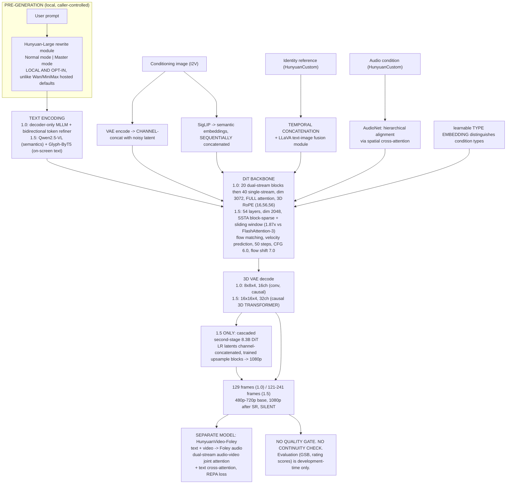

# HunyuanVideo (Tencent Hunyuan) — Architecture Brief

**Analysis date: 2026-09-14.** HunyuanVideo is Tencent's open-weight video-generation line: **HunyuanVideo** (13B, weights 2024-12-01, arXiv 2412.03603) → **HunyuanVideo-I2V** (2025-03-05) → **HunyuanCustom** (2025-05-08, arXiv 2505.04512) → **HunyuanVideo-Avatar** / **HunyuanPortrait** (2025-05) → **HunyuanVideo-Foley** (2025-08-21, arXiv 2508.16930) → **Hunyuan-GameCraft-1.0** (2025-08-13) → **HunyuanWorld-Voyager** (2025-08-27) → **HunyuanVideo-1.5** (8.3B, weights 2025-11-18, arXiv 2511.18870, current base model). Every non-trivial claim is labeled **VERIFIED** (the technical reports, the official GitHub repos and their READMEs/configs, the Hugging Face model cards, the licence text), **STRONG INFERENCE**, or **HYPOTHESIS**.

**Why this brief exists and what it was commissioned to settle.** `RESEARCH_CHECKLIST.md` had downgraded HunyuanVideo to last place after the Wan brief, on the grounds that the open-weight build-vs-buy question was already answered with verified arithmetic. That reasoning was correct about build-vs-buy and wrong about everything else. HunyuanVideo turns out to be the **second fully-readable frontier architecture** in this programme, and it disagrees with Wan on almost every design choice that Wan disclosed — text encoder, text-fusion topology, attention density, VAE compression ratio, model-size direction, and licence. **Two labs solving the same problem with published source is worth far more than one**, because every point of disagreement marks a place where the field has no consensus and Narrata should therefore not assume one.

**It also settles the programme's longest-standing open question.** Across eight prior briefs the recurring finding was: *does any vendor disclose an identity-conditioning mechanism?* Wan answered partially (VACE, Wan-Animate — in papers, never in a hosted product). **HunyuanCustom is the second independent answer, and it converges on the same core mechanism: temporal concatenation of the reference.** Section "Character Consistency" below treats this as the brief's headline finding.

**Registry ground truth, per the method the Wan brief established.** The `tencent` Hugging Face catalogue's video models are, newest first: `HunyuanVideo-1.5` (**2025-11-18**), `HunyuanWorld-Voyager` (2025-08-27), `HunyuanVideo-Foley` (2025-08-21), `Hunyuan-GameCraft-1.0` (2025-08-13), `HunyuanPortrait` (2025-05-27), `HunyuanVideo-Avatar` (2025-05-26), `HunyuanCustom` (2025-05-08), `HunyuanVideo-I2V` (2025-03-05), `HunyuanVideo` (2024-12-01). The `Tencent-Hunyuan` GitHub org's video repos show maintenance activity into mid-2026 (`HunyuanVideo` updated 2026-06-29, `HunyuanVideo-1.5` 2026-04-10) but **no HunyuanVideo 2.0 repo and no newer base model**. **[VERIFIED by direct enumeration of `huggingface.co/api/models?author=tencent` and the GitHub org repo list, 2026-09-14]**

**Evidence-trap note, milder than Wan's but the same species.** Secondary sources assert, with dates, that "Tencent officially open sourced HunyuanVideo on January 29, 2026" (the weights are dated **2024-12-01**), and that HunyuanVideo 1.5 was "released in 2026" (**2025-11-18**). One aggregator asserts HunyuanVideo is "the only open-source video model worth running at production scale" — a claim contradicted by Tencent's own 1.5 report, which scores itself *behind* Veo3 and *ahead* of Wan2.2. **Registries and first-party reports only.**

---

## Executive Summary

1. **HunyuanVideo 1.0's architecture is fully disclosed and exact: 13B+ parameters, a "dual-stream to single-stream" hybrid transformer of 20 dual-stream blocks followed by 40 single-stream blocks, model dim 3072, FFN 12288, 24 heads of head-dim 128, full attention (not divided spatiotemporal), and a RoPE channel partition of (d_t, d_h, d_w) = (16, 56, 56).** **[VERIFIED — arXiv 2412.03603 + repo]**
2. **The dual-stream → single-stream design is the single biggest architectural divergence from Wan, and it is about *where text meets video*.** Hunyuan processes video and text tokens in **separate streams for the first 20 blocks** (each modality learning its own modulation without interference) and then **concatenates them into one joint stream for the remaining 40 blocks**. Wan never mixes them — text enters only via cross-attention, all 40 blocks. Seedance does a third thing (text fusion confined to spatial layers, MMDiT-style). **Three labs, three text-fusion topologies, all published. There is no settled answer.** **[VERIFIED for all three]**
3. **The text encoder is a decoder-only MLLM, chosen over CLIP and T5-XXL with a stated rationale — and it directly contradicts the choice Wan made after its own ablation.** Tencent: an MLLM gives *"better image-text alignment"* and *"superior ability in image detail description and complex reasoning,"* with an **extra bidirectional token refiner** added specifically because the MLLM's attention is causal. Alibaba ablated Qwen2.5-7B and GLM-4-9B and chose the **encoder-only umT5-XXL** instead. MiniMax used Qwen3-VL-32B hidden states. **Three frontier labs, three incompatible conclusions about the same component, each published with reasons.** **[VERIFIED]**
4. **HunyuanVideo 1.5 is a deliberate 36% *downscale* of the flagship — 8.3B, and it is the newest base model in the line.** 54 layers, dim 2048, FFN 8192, 16 heads × head-dim 128. **Tencent's answer to the frontier is a smaller model with a much more aggressive latent space and sparse attention, not a bigger one.** **[VERIFIED — arXiv 2511.18870]**
5. **The VAE moved in exactly the opposite direction from Alibaba's, and this is the most instructive cross-vendor contrast in the brief.** HunyuanVideo 1.0: **8× spatial / 4× temporal, 16 latent channels**. HunyuanVideo 1.5: **16× spatial / 4× temporal, 32 latent channels**, a *"causal 3D transformer architecture designed for joint image-video encoding."* **Alibaba built a 64× VAE and refused to put its flagship on it, leaving that VAE to the small TI2V-5B. Tencent moved its entire line onto the high-compression VAE and paid for it with more latent channels (16 → 32).** Compression ratio alone is the wrong thing to compare; **ratio × channels** is the real capacity knob, and Tencent's 16×/32ch retains far more per-token information than a naive reading of "16× vs 8×" suggests. **[Both vendors' numbers VERIFIED; the channels-as-compensation reading is ours — STRONG INFERENCE]**
6. **Tencent published a working sparse-attention design, which closes an open question left by two previous briefs.** **SSTA (Selective and Sliding Tile Attention)**: partition Q/K into 3D blocks → score blocks by **Q-K similarity minus K-K redundancy** → select top-k → add a sliding-window mask → block-sparse attention. Claimed **1.87× end-to-end speedup on 10-second 720p vs FlashAttention-3** (per-step 5.51s → 2.95s at 720p/241 frames). **Wan used full dense attention and conceded attention can be 95% of training time; MiniMax trained native sparse attention and withheld the implementation; Tencent published theirs.** **[VERIFIED — arXiv 2511.18870]**
7. **Identity conditioning is disclosed, and it converges on Wan's VACE mechanism independently.** HunyuanCustom adds to the base model: a **LLaVA-based text-image fusion module** for joint identity+description understanding, and an **image ID enhancement module that "leverages temporal concatenation to reinforce identity features across frames."** **VACE concatenates references on the temporal axis and drops them at decode; HunyuanCustom concatenates identity features temporally. Two labs, two papers, same core answer.** This is now a *converged* finding, not a single data point. **[VERIFIED — arXiv 2505.04512 + arXiv 2503.07598]**
8. **HunyuanCustom is the most conditioning-complete open architecture found: four modalities, four distinct injection mechanisms, one model.** Text+image via LLaVA fusion; **identity via temporal concatenation**; **audio via AudioNet, doing "hierarchical alignment via spatial cross-attention"**; **video via "latent-compressed conditional video through a patchify-based feature-alignment network."** Where Alibaba shipped a *zoo* of task models (VACE, S2V, Animate, Dancer), Tencent put four conditioning paths in one architecture. **[VERIFIED]**
9. **I2V conditioning is dual-path — the same geometry/semantics split Wan uses — plus one mechanism Wan does not have.** HunyuanVideo 1.5: *"(1) VAE-based encoding, where the image latent is concatenated with the noisy latent along the channel dimension"* and *"(2) SigLip-based feature extraction, where semantic embeddings are concatenated sequentially."* Then: ***"A learnable type embedding is introduced to explicitly distinguish between different types of conditions."*** **That type embedding is the in-model solution to the exact problem the Wan brief identified for Narrata — that a character reference and a shot's start frame are different kinds of object that must not be conflated.** Tencent tags them; Narrata must keep them in separate slots. **[VERIFIED]**
10. **The licence is not open in the way Wan's is, and the restriction is territorial and applies to outputs.** **Tencent Hunyuan Community License**: the Territory is *worldwide **excluding the European Union, United Kingdom and South Korea***, and licensees may not use, reproduce, modify, distribute or display the works **or any outputs** outside it; a **100 million MAU** threshold requires a separate licence at Tencent's discretion; outputs may not be used to train competing models; attribution must be preserved; governed by **Hong Kong law**. **Wan is Apache 2.0 with none of this.** Same bespoke-licence shape as MiniMax. **[VERIFIED — LICENSE.txt / NOTICE in both repos]**
11. **First-party prompt rewriting exists, but in the honest form.** The repo ships a **fine-tuned Hunyuan-Large rewrite module** with **"Normal mode"** and **"Master mode"** to *"adapt user prompts to model-preferred formats."* **Unlike Alibaba's `prompt_extend` (hosted, defaults to `true`) and MiniMax's `prompt_optimizer` (hosted, defaults to `true`), this is a local, explicitly-invoked module — the caller genuinely controls it.** Fourth vendor with a prompt-rewrite stage; first one where the default is *off by construction*. **[VERIFIED — repo README]**
12. **The self-host VRAM story changed by ~4.4× inside one model family.** HunyuanVideo 1.0: **60 GB peak at 720×1280×129 frames**, 45 GB at 544×960×129, *80 GB recommended, 60 GB minimum*. HunyuanVideo 1.5: *"peak memory of 13.6 GB"* for **720p 121-frame T2V/I2V** with pipeline offloading, group offloading and VAE tiling enabled — explicitly *"on a single consumer-grade GPU (e.g., RTX 4090)."* **[VERIFIED — both repos/reports]**
13. **HunyuanVideo-Foley is the most directly Narrata-relevant model in the entire line, and it is not a video generator.** An end-to-end **Text-Video-to-Audio (TV2A)** Foley model: a 100k-hour curated multimodal dataset, a **representation-alignment (REPA) loss using self-supervised audio features** to stabilise latent-diffusion training, and a multimodal DiT with **dual-stream audio-video fusion via joint attention plus textual semantic injection via cross-attention** to resolve modal competition. **Narrata's Audio Cue Plan stage consumes a silent assembled cut and produces SFX requests — which is precisely the TV2A input shape.** **[VERIFIED — arXiv 2508.16930]**
14. **129 frames, fixed, for HunyuanVideo 1.0 — and 129 = 1 + 4×32.** Third independent confirmation of the causal-VAE "1+T" quantization rule (Wan's `frame_num 121`, MiniMax's 17-frame increments). **Duration quantization is a general property of this model class, not a per-provider quirk.** **[VERIFIED; the generalisation is ours]**
15. **Evaluation is development-time only, and Tencent's own numbers are refreshingly unflattering.** HunyuanVideo 1.5 GSB win rates: **+17.12% vs Wan2.2, +12.6% vs Kling 2.1, −10.32% vs Veo3**; instruction-following ratings **61.57 (Hunyuan 1.5) vs 44.07 (Wan2.2) vs 73.77 (Veo3)**. **A lab publishing that it loses to Veo3 is a credibility signal.** But as at all eight prior platforms: **no runtime quality gate, no continuity check, no identity-drift monitor anywhere in the pipeline. Nine for nine.** **[VERIFIED — arXiv 2511.18870]**
16. **Reachability for Narrata is materially worse than Wan's, and that is the decisive practical difference.** Wan is served by OpenRouter — the provider Narrata already integrates — as `wan-2.6/2.7/3.0`. **HunyuanVideo was not found in OpenRouter's video catalogue this session**; the verified third-party host is **fal** (listed ~**$0.40/video**, text-to-video only, **capped at 480p**). **A 480p-capped T2V-only endpoint is not a production path for a storytelling product.** **[fal listing VERIFIED; OpenRouter absence is VERIFIED BY ABSENCE this session and should be re-checked before acting]**

---

## Publicly Known Architecture — Product Layer

```
                  ┌──────────────────────────────────────────────────┐
                  │  TENCENT HUNYUAN — OPEN WEIGHTS, RESTRICTED LICENCE │
                  │  (Tencent Hunyuan Community License, NOT Apache)  │
                  └───────────────────────┬──────────────────────────┘
                                          │
   ┌──────────────────────────────────────┴───────────────────────────────────┐
   │                                                                           │
 ┌─┴────────────────────────────────┐        ┌───────────────────────────────┐ │
 │ BASE GENERATORS                  │        │ CONDITIONING / TASK MODELS    │ │
 │  HunyuanVideo  13B   2024-12-01  │        │  HunyuanVideo-I2V   2025-03   │ │
 │    20 dual-stream + 40 single    │        │  HunyuanCustom      2025-05   │ │
 │    dim 3072 · ffn 12288 · 24 hd  │        │    image+audio+video+text     │ │
 │    VAE 8x8x4, 16ch · 129 frames  │        │    ID via TEMPORAL CONCAT     │ │
 │    MLLM text enc + token refiner │        │  HunyuanVideo-Avatar 2025-05  │ │
 │    full attention · 60GB @720p   │        │  HunyuanPortrait     2025-05  │ │
 │ ─────────────────────────────────│        └───────────────────────────────┘ │
 │  HunyuanVideo-1.5  8.3B 2025-11  │                                          │
 │    54 layers · dim 2048 · ffn    │        ┌───────────────────────────────┐ │
 │      8192 · 16 heads x 128       │        │ ADJACENT / WORLD MODELS       │ │
 │    VAE 16x16x4, 32ch (causal 3D  │        │  HunyuanVideo-Foley  2025-08  │ │
 │      TRANSFORMER, not conv)      │        │    TEXT+VIDEO -> AUDIO (TV2A) │ │
 │    SSTA SPARSE ATTENTION 1.87x   │        │  Hunyuan-GameCraft   2025-08  │ │
 │    cascaded SR -> 1080p (2nd     │        │  HunyuanWorld-Voyager 2025-08 │ │
 │      8.3B DiT)                   │        │  R-DMesh (SIGGRAPH26) 2026-08 │ │
 │    13.6 GB peak on ONE RTX 4090  │        └───────────────────────────────┘ │
 └──────────────────────────────────┘                                          │
                                                                               │
 ┌─────────────────────────────────────────────────────────────────────────────┘
 │ THIRD-PARTY SERVING (the weak link for Narrata)
 │   fal ....... hunyuan-video, ~$0.40/video, T2V ONLY, 480p CAP
 │   OpenRouter  Tencent TEXT models listed; HunyuanVideo NOT FOUND this session
 │   ComfyUI / diffusers / xDiT (5.64x on 8 GPUs) / FP8 weights (-10 GB)
 └─────────────────────────────────────────────────────────────────────────────
      NO HOSTED FIRST-PARTY VIDEO API COMPARABLE TO ALIBABA'S MODEL STUDIO
      WAS VERIFIED THIS SESSION.
```
**[VERIFIED]** for every model, date, and number drawn from the reports, repos and HF catalogue. The serving block's "NOT FOUND" is verified-by-absence this session only.

---

## Model Stack

| Model | Role | Publicly disclosed internals |
|---|---|---|
| **HunyuanVideo** (13B, 2024-12) | Flagship T2V/unified image-video | **20 dual-stream blocks → 40 single-stream blocks**; **dim 3072 · FFN 12288 · 24 heads · head-dim 128**; **RoPE partition (d_t, d_h, d_w) = (16, 56, 56)**; **full attention** (*"rather than divided spatiotemporal attention,"* enabling *"unified generation for both images and videos"*); **3D VAE 8× spatial / 4× temporal, 16 channels** (compresses (T+1)×3×H×W → (T/c_t+1)×C×(H/c_s)×(W/c_s)); **decoder-only MLLM text encoder + bidirectional token refiner**; **flow matching**, velocity objective `E‖v_t − u_t‖²`; **129 frames fixed**, 540p/720p. **[VERIFIED — arXiv 2412.03603 + repo]** |
| **HunyuanVideo-1.5** (8.3B, 2025-11) | Current base model, efficiency-first | **54 layers · dim 2048 · FFN 8192 · 16 heads · head-dim 128**; **SSTA sparse attention**; **VAE 16× spatial / 4× temporal, 32 latent channels**, *"causal 3D transformer architecture designed for joint image-video encoding"*; **dual-channel text encoder — Qwen2.5-VL for semantics + multilingual Glyph-ByT5 for text rendering**; **cascaded second-stage 8.3B DiT for latent-space SR to 1080p** (LR latents joined by channel concatenation, trained upsample blocks, then VAE decode); **CFG-distilled variant** for fast inference; 50 steps in the reported timings. **[VERIFIED — arXiv 2511.18870]** |
| **HunyuanVideo-I2V** (2025-03) | Image-to-video | *"A Customizable Image-to-Video Model based on HunyuanVideo."* The mechanism documented in detail is 1.5's: **VAE latent channel-concatenation (geometry) + SigLIP semantic embeddings concatenated sequentially (semantics) + a learnable type embedding distinguishing condition types.** **[Repo VERIFIED; the dual-path mechanism VERIFIED for 1.5]** |
| **HunyuanCustom** (2025-05) | **Identity-preserving, multi-modal conditioning** | **LLaVA-based text-image fusion module** (joint modelling of identity image + description); **image ID enhancement module using temporal concatenation** *"to reinforce identity features across frames"*; **AudioNet** performing *"hierarchical alignment via spatial cross-attention"*; **video conditioning via "latent-compressed conditional video through a patchify-based feature-alignment network."* Claims SOTA over open and closed methods on **ID consistency**, realism and text-video alignment, single- and multi-subject. **[VERIFIED — arXiv 2505.04512]** |
| **HunyuanVideo-Avatar / HunyuanPortrait** (2025-05) | Audio-driven avatar / portrait animation | Released as weights + repos. Mechanisms not read this session. **[Existence VERIFIED; internals NOT READ]** |
| **HunyuanVideo-Foley** (2025-08) | **Text+Video → Foley audio** | **100k-hour** curated multimodal dataset via automated annotation; **representation-alignment (REPA) loss** using self-supervised audio features to guide latent diffusion, *"efficiently improving audio quality and generation stability"*; **multimodal DiT with dual-stream audio-video fusion through joint attention and textual semantic injection via cross-attention**, explicitly framed as *"resolving modal competition."* Claims SOTA on audio fidelity, visual-semantic alignment, temporal alignment and distribution matching. **[VERIFIED — arXiv 2508.16930]** |
| **Hunyuan-GameCraft-1.0 / HunyuanWorld-Voyager** (2025-08) | Interactive/world video | GameCraft: *"High-dynamic Interactive Game Video Generation with Hybrid History Condition."* **"Hybrid history condition" is the closest thing in the line to a continuation mechanism, and its internals were not read this session.** **[Existence VERIFIED; internals NOT READ — flagged as the top open lead]** |
| **Hunyuan-Large rewrite module** | Prompt rewriting | Fine-tuned, ships in the repo, **"Normal mode" and "Master mode"**, adapts prompts *"to model-preferred formats."* Local and opt-in. **[VERIFIED — repo README]** |

---

## Deep Technical Section

Everything here is from the two technical reports, the HunyuanCustom/Foley papers, and the repo READMEs. **It applies to the open weights only.** No hosted Tencent video API was verified this session, so there is no closed-line counterpart to compare against — unlike Wan, the open/closed divergence problem does not arise here.

### 1. Transformer architecture

```
  HUNYUANVIDEO 1.0 vs 1.5 — verified numbers
  ────────────────────────────────────────────────────────────────────────
                        1.0 (13B, 2024-12)        1.5 (8.3B, 2025-11)
  blocks .............  20 dual + 40 single       54 (dual-stream)
  model dim ..........  3072                      2048
  FFN dim ............  12288                     8192
  heads ..............  24                        16
  head dim ...........  128                       128
  attention ..........  FULL (dense)              SSTA (block-sparse +
                                                    sliding window)
  RoPE (dt,dh,dw) ....  (16, 56, 56)              not stated in report
  VAE ................  8x8 spatial, 4x temporal  16x16 spatial, 4x temporal
  latent channels ....  16                        32
  text encoder .......  decoder-only MLLM +       Qwen2.5-VL + Glyph-ByT5
                        bidirectional refiner       (dual-channel)
  objective ..........  flow matching (velocity)  flow matching (multi-stage)
```

**The dual-stream → single-stream split is the design worth understanding**, because it is a genuine third option between the two approaches previously catalogued. In the first 20 blocks, video tokens and text tokens are processed **independently**, each with their own modulation — so neither modality's statistics distort the other's early representation. The streams are then **concatenated** and the remaining 40 blocks attend over the joint sequence. Compare:

- **Wan**: text *never* joins the video stream. Cross-attention only, every block. Cheapest, most modular; text is treated as an unordered condition.
- **Seedance**: text fusion confined to the *spatial* layers of a decoupled spatial/temporal attention stack.
- **Hunyuan**: separate early, joint late.

**All three are published, all three work, and they are mutually incompatible.** For Narrata the operative consequence is not which is best — it is that **prompt structure interacts with architecture in ways that differ per provider**, which is a further argument for the Higgsfield-derived "keep intent structured internally, serialize per provider" rule rather than tuning one canonical prompt shape. **[Architectures VERIFIED; the synthesis is ours]**

**RoPE partition (16, 56, 56).** With head-dim 128, Hunyuan 1.0 allocates **16 channels to time and 56 each to height and width** — a deliberately *asymmetric*, spatially-weighted split. Wan splits `[c − 2·(c//3), c//3, c//3]`, i.e. roughly **even thirds with the remainder to time** (for c=128: 44/42/42). **Tencent gives time 12.5% of the head dimension; Alibaba gives it ~34%.** That is a 2.7× difference in how much positional capacity is spent on the temporal axis, and it is the sharpest single numeric disagreement between the two open architectures. **[Both partitions VERIFIED; the comparison is ours]**

### 2. Attention: the sparsity question, finally answered in public

SSTA, as described in the 1.5 report:

```
  1. partition Q and K into 3D blocks
  2. score each block pair by  (Q-K similarity)  MINUS  (K-K redundancy)
  3. select top-k blocks                       <- the "Selective" half
  4. add a sliding-window mask                 <- the "Sliding Tile" half
  5. block-sparse attention over the survivors

  claimed: 1.87x end-to-end on 10-second 720p vs FlashAttention-3
           per-step 5.51s -> 2.95s at 720p / 241 frames
```

The **"minus K-K redundancy"** term is the non-obvious part: blocks are selected not merely for relevance to the query but **penalised for being redundant with other selected keys**, which is a diversity criterion rather than a pure top-k relevance criterion. **[VERIFIED — arXiv 2511.18870]**

This closes a question left open twice. The Wan report stated that at ~1M-token sequence lengths attention *"can account for up to 95% of end-to-end training time"* and chose to attack it with **2D context parallelism rather than sparsity**. MiniMax trained **native sparse attention** and did not publish the implementation. **Tencent published a complete, reproducible design with a measured speedup against a named baseline.** For Narrata this is context, not action — but it is the kind of thing that determines whether long-clip generation gets cheaper, and it is now in the open. **[All three positions VERIFIED]**

### 3. Latent space — and the cross-vendor VAE contradiction

```
  HunyuanVideo 1.0 VAE .... 8 x 8 spatial, 4 x temporal, 16 channels
                            => per-token capacity 16ch over 8x8x4 pixels
  HunyuanVideo 1.5 VAE .... 16 x 16 spatial, 4 x temporal, 32 channels
                            causal 3D TRANSFORMER (not a conv VAE)
                            => 4x the spatial compression, 2x the channels

  Wan 2.1/2.2 flagship .... 4 x 8 x 8, 16 channels   (kept by the 2.2 flagship)
  Wan 2.2 small model ..... 4 x 16 x 16, channels not stated
                            (used ONLY by TI2V-5B, never by the flagship)
```

**Alibaba built a high-compression VAE and declined to put its best model on it. Tencent moved its whole line onto one.** The reconciling detail is the channel count: Tencent **doubled latent channels from 16 to 32** when it quadrupled spatial compression, so information per latent token fell far less than the compression ratio implies. **This is the most useful correction in the brief to a naive reading of published specs: "compression ratio" is not comparable across models without the channel count.** It also means any Narrata-side reasoning about provider quality tiers from published VAE ratios alone is unsound. **[Numbers VERIFIED; the reconciliation is ours — STRONG INFERENCE]**

**A second, quieter change: 1.5's VAE is described as a causal 3D *transformer*, not a causal 3D convolutional net.** Wan's is conv-based with GroupNorm replaced by RMSNorm for causality. **Two different families of video autoencoder are in production at the frontier.** **[VERIFIED]**

### 4. Text conditioning

**HunyuanVideo 1.0** uses *"a pre-trained Multimodal Large Language Model (MLLM) with a Decoder-Only structure"* instead of CLIP or T5-XXL, with two stated reasons — better image-text alignment, and *"superior ability in image detail description and complex reasoning"* — plus **an extra bidirectional token refiner** to compensate for the MLLM's causal attention. **The refiner is the tell: a decoder-only LM produces left-to-right-conditioned token representations, which is the wrong shape for a condition that the diffusion model should see holistically, so Tencent bolted a bidirectional pass on top.** **[Design VERIFIED; the reading is ours]**

**HunyuanVideo 1.5** switched to a **dual-channel** encoder: **Qwen2.5-VL** for semantics plus **multilingual Glyph-ByT5** specifically *for text-rendering accuracy* — i.e. a dedicated encoder whose only job is making on-screen text come out right. **This is the first sighting in the programme of a text encoder split by *purpose* rather than by modality**, and it is a direct response to a failure mode Alibaba openly conceded for wan3.0 ("on-screen text rendering accuracy is still improving"). **[VERIFIED]**

**Practical note for anyone reading prompt-length limits across vendors:** Wan's open line hard-caps at **512 umT5 tokens**. No equivalent hard cap was found in Hunyuan's reports this session. **Do not assume prompt budgets transfer between providers.** **[Wan cap VERIFIED; Hunyuan cap NOT FOUND — unverified either way]**

### 5. Training, data and infrastructure

| | HunyuanVideo 1.0 | HunyuanVideo 1.5 |
|---|---|---|
| **Curriculum** | Five stages: 256px images → mixed-scale 256–512px images → 256px videos → 256px *long* videos → **720×1280×129** video, then manual fine-tuning on **~1M curated samples** | Multi-stage progressive training (stages not enumerated at the same granularity) |
| **Data** | Not quantified in the material read | **5B images** selected from a pool of **>10B** for pre-training (1B reserved for later stages); **>10 million hours of raw video** segmented into 2–10 s clips with **PySceneDetect** plus custom operators; three filtering levels (basic structural, visual quality, aesthetic) yielding **~800M high-quality video segments** |
| **Captioning** | Dense captioning used throughout | **Three specialist captioners** — images, videos (*with cinematic properties*), and I2V transitions — trained with **RL (OPA-DPO)** to balance caption richness against hallucination |
| **SR stage data** | — | **1M high-quality clips**, 1K–4K, 3–10 s, 24 fps, plus high-res images |
| **Infrastructure** | **5D parallelism** — tensor, sequence, context and data parallelism plus **Zero/ZeroCache** — on Tencent's **AngelPTM** framework over the **Tencent XingMai** GPU network | Inference measured on **8× NVIDIA H800** with context parallelism |
| **Compute scale** | **NOT DISCLOSED** — no GPU-hours, no cluster size. Same gap as Wan. | **NOT DISCLOSED** |
| **Data provenance** | **NOT DISCLOSED** | **NOT DISCLOSED** — volume and filtering are detailed; sourcing and licensing are not addressed |

**Two things stand out.** First, **a video captioner trained specifically to describe *cinematic properties*** is the closest thing in any open report to a machine-readable shot grammar, and it is trained with preference optimisation to avoid hallucinating detail — a notable admission that dense captioning has a hallucination failure mode. Second, **RL appears in the captioning pipeline, not in the generator's post-training.** As with Wan, **no RLHF/DPO stage is described for the video model itself.** **[VERIFIED]**

### 6. Inference, quantization and deployment

```
  HUNYUANVIDEO 1.0 (repo defaults and published requirements)
  ─────────────────────────────────────────────────────────────────────
  sampling steps ...... 50 (default)
  embedded CFG scale .. 6.0 (default)
  flow shift .......... 7.0 (default)   [cf. Wan2.2-A14B: 12.0; TI2V-5B: 5.0]
  flow reverse ........ samples t=1 -> t=0
  video length ........ 129 frames, FIXED   (= 1 + 4 x 32)
  resolutions ......... 540p / 720p recommended; 720x1280, 1280x720,
                        960x544, 960x960
  GPU peak memory ..... 60 GB @ 720x1280x129
                        45 GB @ 544x960x129
                        80 GB recommended, 60 GB minimum
  FP8 weights ......... ~10 GB saving, "while maintaining generation quality"
  xDiT parallel ....... up to 5.64x on 8 GPUs at 1280x720

  HUNYUANVIDEO 1.5
  ─────────────────────────────────────────────────────────────────────
  peak memory ......... 13.6 GB @ 720p / 121 frames, T2V and I2V,
                        with pipeline offloading + group offloading
                        + VAE tiling — "a single consumer-grade GPU
                        (e.g., RTX 4090)"
  720p / 241 frames ... 58.39 s total with acceleration, 1.1679 s/step
  CFG distillation .... used for the accelerated inference measurements
```
**[VERIFIED — repo README and arXiv 2511.18870]**

**The 60 GB → 13.6 GB shift is the real story of the 1.5 release**, and it is the product of three compounding decisions: fewer parameters (13B → 8.3B), a 4× more compressed latent space, and sparse attention — plus aggressive offloading. **Tencent optimised for *reachability* while Alibaba optimised for *capability* and let the community handle quantization.** Both are defensible; they produce very different ecosystems.

**The 129-frame constant is the third confirmation of the "1+4k" rule** (Wan `frame_num 121`; MiniMax 17-frame increments on 2K). **[VERIFIED at three vendors]**

---

## Character Consistency — the programme's standing question, now answered twice

This is the section the brief was commissioned for. The running finding across eight briefs has been: *hosted products expose reference images but never explain them; only Alibaba, in papers, disclosed a mechanism.* **HunyuanCustom is the second disclosure, and it agrees with the first.**

```
  MECHANISM CONVERGENCE — two labs, two papers, one core answer
  ──────────────────────────────────────────────────────────────────────────
  ALIBABA — VACE (arXiv 2503.07598)
    Video Condition Unit V = [T; F; M]  (text, context frames, masks)
    reference images VAE-encoded, CONCATENATED ON THE TEMPORAL AXIS,
      dropped before decode
    Concept Decoupling into reactive F x M and inactive F x (1-M)
    Context Adapter Tuning: frozen DiT + Context Embedder +
      8 copied Context Blocks at layers [0, 5, 10 ... 35]

  TENCENT — HunyuanCustom (arXiv 2505.04512)
    LLaVA-based text-image fusion module
      -> joint modelling of identity image AND its description
    image ID enhancement module leveraging TEMPORAL CONCATENATION
      "to reinforce identity features across frames"
    AudioNet: hierarchical alignment via spatial cross-attention
    video condition: latent-compressed video through a patchify-based
      feature-alignment network
  ──────────────────────────────────────────────────────────────────────────
  CONVERGENT CORE: identity is injected by occupying FRAME SLOTS the model
  attends over across the whole clip — not by pinning a start frame, and
  not by fine-tuning weights.
```

**Why the convergence matters more than either paper alone.** A single paper is a design choice; two independent labs arriving at the same mechanism, from different backbones (Wan's cross-attention-only DiT vs Hunyuan's dual-stream/single-stream hybrid), is evidence about the *problem*, not about either team's taste. The property both exploit is the same one the Wan brief identified: **a temporally-concatenated reference is visible to every output frame through full attention, without geometrically constraining any one of them.** A first frame cannot do that. A LoRA can, but requires training. **[Both mechanisms VERIFIED; the convergence reading is ours — STRONG INFERENCE]**

**Tencent's genuine addition beyond Wan is the LLaVA fusion module**: the identity image is modelled *jointly with its textual description*, not as a bare visual embedding. That is architecturally the in-model version of the rule the Sora brief derived from OpenAI's documentation — *the reference supplies appearance, the name/description supplies the binding*. **Three independent sources (VACE's masks, HunyuanCustom's LLaVA fusion, OpenAI's "mention the character name verbatim") now point at the same requirement: a reference asset needs an accompanying textual anchor to attach to the right subject.** **[Each source VERIFIED; the three-way synthesis is ours]**

### Continuity, and the absences

```
 LAYER 1 — I2V / FRAME CONDITIONING                              [VERIFIED]
   VAE channel-concat (geometry) + SigLIP sequential concat (semantics)
   + a LEARNABLE TYPE EMBEDDING distinguishing condition types
   ⇒ the in-model answer to "a reference and a start frame are different
     kinds of thing"

 LAYER 2 — IDENTITY CONDITIONING (HunyuanCustom)                 [VERIFIED]
   temporal concatenation + LLaVA text-image fusion
   single AND multi-subject
   ⇒ continuity as retrieval-into-context, scoped to ONE request

 LAYER 3 — TASK MODELS (Avatar, Portrait, GameCraft)             [VERIFIED
   audio-driven avatars; portrait animation;                      as released;
   GameCraft's "hybrid history condition"                         internals
   ⇒ continuity as a dedicated model                              NOT READ]

 LAYER 4 — MULTI-SHOT INSIDE ONE GENERATION           *** DOES NOT EXIST ***
   No shot_type parameter. No multi-shot claim. No scene sequencing.
   129 frames (1.0) / 121-241 frames (1.5). One shot, one generation.
   [VERIFIED BY ABSENCE across both reports and both repos]
```

**The absences are total and they match every other platform.** No persistent character record. No location record. No prop record. No style record. No project container. No story structure. No `@mention`. No lock. **And no runtime quality or continuity validator of any kind — nine platforms, nine times.** HunyuanCustom *measures* ID consistency in its evaluation, exactly as Wan-Bench does, as a development-time benchmark.

**Narrata's `StoryBible` + lockable `Character`/`Location` records with `referenceImages` remain ahead of this platform's shipping surface on persistence — for the third consecutive open-weight-adjacent brief.** What Narrata lacks is not the entity model; it is the *injection mechanism*, and that is a provider capability, not something Narrata builds. **[VERIFIED by absence]**

---

## Generation Pipeline



**Evidence note:** every component in this diagram is **VERIFIED** from a technical report or repo README — the second time in the programme (after Wan) that a pipeline diagram required no inference. The one structural observation worth drawing out: **audio is a separate model applied after video, not a joint generation.** Where Alibaba's closed line (wan2.5+) and OpenAI's Sora 2 generate synchronized audio natively, **Tencent's open line keeps video and Foley as two models in sequence.** For Narrata — whose pipeline already assembles silent video first and then produces audio against it — **Tencent's shape is the one that matches Narrata's existing architecture**, and Sora's/Wan's native-audio shape is the one that would require restructuring. **[Architectures VERIFIED; the fit observation is ours]**

---

## Orchestration

**There is no router and no orchestrator.** As with Wan, the caller picks a checkpoint. What differs is the *packaging philosophy*, and the contrast is clean enough to be worth stating as a pattern:

```
   ALIBABA / WAN ................ ONE BACKBONE, MANY TASK CHECKPOINTS
     VACE (reference+edit) · S2V (speech) · Animate · Dancer · Fun-Control
     ⇒ orchestration burden pushed onto the integrator
     ⇒ warning in the repo: LoRAs do NOT port across the task family

   TENCENT / HUNYUAN ............ FEWER MODELS, MORE CONDITIONING PATHS
     HunyuanCustom alone absorbs image + audio + video + text conditioning,
     each through its OWN injection mechanism inside ONE architecture
     ⇒ orchestration burden pushed into the model
     ⇒ but still separate models for Avatar, Portrait, Foley, GameCraft
```

**Neither lab is consistent about it** — Tencent still ships Avatar, Portrait, Foley and GameCraft separately — but HunyuanCustom is the strongest existing argument that **multi-modal conditioning can be unified behind one model with per-modality injection paths plus a type embedding**, rather than behind one model per conditioning mode. That is architecturally the same conclusion the Wan brief reached about VACE's Context Adapter (a *pluggable capability* beats a checkpoint per task), reached by a different route. **[Both architectures VERIFIED; the comparison is ours]**

---

## Probable Hidden Architecture

Hunyuan's disclosure profile is the **most complete of any platform in this programme** — more complete than Wan's, because there is no closed hosted line whose internals diverge. The withheld set is correspondingly small:

```
  DISCLOSED (VERIFIED)                        WITHHELD / NOT FOUND
  ────────────────────────────────────        ──────────────────────────────
  Full DiT configs, both generations          Training compute (GPU-hours,
  Dual-stream/single-stream split               cluster size) — never stated
  RoPE partition (16,56,56)                   Training-data provenance,
  VAE ratios, channels, family                  licensing, sourcing
  MLLM encoder choice + rationale             Any post-training/RLHF on the
  Token refiner rationale                       GENERATOR (RL appears only in
  SSTA algorithm + measured speedup             the captioning pipeline)
  Flow matching objective + defaults          Whether a first-party hosted
  5-stage curriculum, data volumes              video API exists at all
  Captioner design + OPA-DPO RL               GameCraft's "hybrid history
  5D parallelism, AngelPTM, XingMai             condition" internals
  Identity mechanism (temporal concat)        Avatar / Portrait mechanisms
  I2V dual path + type embedding              Prompt-length limits
  VRAM, latency, FP8, xDiT numbers            Any roadmap beyond 1.5
  GSB results INCLUDING LOSSES
  Licence terms, in full
```

**The one genuinely unresolved structural question is where this line is going.** The newest base model is a **deliberate downscale** (13B → 8.3B) shipped in November 2025, with repo maintenance continuing into mid-2026 and **no 2.0**. Two readings are available and the evidence does not distinguish them: either Tencent has repositioned HunyuanVideo as the *efficient, locally-runnable* open option and ceded the quality frontier (consistent with publishing a −10.32% GSB result against Veo3), or a larger successor exists internally and is unannounced. **[HYPOTHESIS, both branches — do not assume either]**

---

## Infrastructure

**Per Section 11 of the agent brief: everything here is open-weight self-hosting data or Scale-tier facts about a model-training lab. Narrata is at MVP — single VPS, empty `workers/`, API-first. Nothing here is an infrastructure recommendation.** Route to `technical-architect` for awareness.

| Signal | Evidence |
|---|---|
| **Training infrastructure is unusually well documented**: 5D parallelism (TP + SP + CP + DP with Zero/ZeroCache) on **AngelPTM**, over the **Tencent XingMai** GPU network | **[VERIFIED — arXiv 2412.03603]** |
| **Compute scale: never disclosed**, for any Hunyuan video model | **NOT DISCLOSED** — identical gap to Wan; apparently a norm in this literature |
| **Inference parallelism**: xDiT gives **up to 5.64× on 8 GPUs** at 1280×720; 1.5 timings measured on **8× H800** with context parallelism | **[VERIFIED]** |
| **Quantization**: official **FP8 weights**, ~**10 GB** saving, claimed to maintain quality | **[VERIFIED as the repo's claim; the quality parity is Tencent's own]** |
| **The self-host arithmetic is unchanged from the Wan brief and still negative.** 1.0 needs 60 GB at 720p — H100/A100-80G class. 1.5 fits **13.6 GB on an RTX 4090**, which *does* change the hardware floor — but the Wan brief's breakeven logic was never about VRAM, it was about **a GPU billing 24/7 against a marginal-cost-zero API**. A cheaper GPU lowers the breakeven throughput; it does not eliminate the need for sustained daily volume Narrata does not have. | **[VRAM figures VERIFIED; the conclusion carries over from the Wan brief's arithmetic]** |
| **Third-party hosting is thin.** fal serves HunyuanVideo (~$0.40/video, **T2V only, 480p cap**). No OpenRouter video listing found this session. | **[fal VERIFIED; OpenRouter absence verified-by-absence only]** |
| **No first-party hosted video API was verified.** Unlike Alibaba's Model Studio, no Tencent Cloud video-generation endpoint with published parameters and pricing was confirmed this session. | **NOT VERIFIED either way — flagged as an open lead** |

---

## UX Architecture

**There is effectively none to analyse, and less than Wan had.** HunyuanVideo is a model, not a product: its user surfaces are ComfyUI, diffusers, xDiT and third-party hosts. No consumer site comparable to `wan.video` was examined. Three observations:

- **"Normal mode" and "Master mode" on the prompt rewriter is a small, good UX idea** — exposing rewrite *intensity* as a named tier rather than a boolean. Compare Sora's graded edit intensity (Strong/Mild/Subtle) and Runway's retired sliders. **A two-or-three-tier named intensity is emerging as the industry's compromise between a toggle and a continuous control.** Route to `ui-ux-engineer` as a pattern. **[VERIFIED at two vendors]**
- **A captioner trained on "cinematic properties" implies a shot-description vocabulary that the model was explicitly trained to understand.** Neither report publishes that vocabulary. **If it were published it would be the single most useful artifact in this programme for `SHOT_PLANNING` prompt design** — flagged as the top open research lead for this platform.
- **No asset library, no character panel, no project container, no version history, no take comparison** — at model or ecosystem level. Same absence as Wan.

---

## What Narrata Should Adopt (evidence-based, not exhaustive)

- **Treat temporal-axis reference injection as the *converged* industry mechanism for identity, and let that settle Narrata's reference-assembly design.** Two independent labs (Alibaba's VACE, Tencent's HunyuanCustom) published different systems that inject identity the same way: **the reference occupies frame slots the model attends over across the whole clip.** The Wan brief recommended never conflating a character reference with a shot's start frame; **this brief upgrades that from a single-source inference to a two-source convergence**, and adds Tencent's in-model confirmation — a **learnable type embedding "to explicitly distinguish between different types of conditions."** The vendors tag condition types internally; Narrata must keep them in distinct slots externally. **[Both mechanisms VERIFIED. Route to `ai-architect`.]**
- **Pair every reference asset with a textual anchor — three independent sources now require it.** VACE uses masks to say *which region* the reference governs; HunyuanCustom uses a **LLaVA fusion module** to model the identity image *jointly with its description*; OpenAI documents that *"passing the character ID alone isn't enough."* **Narrata's `Character.referenceImages` should never be sent without the character's canonical name and a short stable description in the prompt text.** This is the same recommendation the Sora brief made, now with mechanistic backing from two open architectures. **[All three sources VERIFIED. Route to `ai-architect`.]**
- **Evaluate HunyuanVideo-Foley for Narrata's SFX stage — it is the best architectural match to a pipeline stage Narrata already built.** Narrata's per-shot-pair video work added a persisted **assemble-without-audio** step that feeds an **Audio Cue Plan**, and `SFX_GENERATION` currently dispatches to ElevenLabs/OpenRouter from *text* alone. Foley is **Text+Video→Audio**: it consumes the silent cut *and* the cue text, with **dual-stream audio-video joint attention** for temporal alignment. **The input Narrata's pipeline already produces is exactly this model's input.** This is not a recommendation to self-host — it is a recommendation to (a) check whether any hosted provider serves a TV2A model, and (b) treat "video-conditioned SFX" as the target capability shape when specifying that stage. **[Model and mechanism VERIFIED — arXiv 2508.16930. Route to `video-architect`, with `ai-architect` on the registry question.]**
- **Add "duration is quantized by the provider's causal VAE" to the adapter contract — now confirmed at three vendors.** Hunyuan 1.0: **129 frames fixed** (1 + 4×32). Wan: `frame_num 121` (1 + 4×30). MiniMax: 17-frame increments at 2K. **Narrata's duration-splitting and ffmpeg assembly should model duration as a quantized, provider-declared value rather than a free float.** **[VERIFIED at three vendors. Route to `video-architect`.]**
- **Stop treating published VAE compression ratios as a quality proxy.** Tencent quadrupled spatial compression (8× → 16×) *and doubled latent channels* (16 → 32) in the same release; Alibaba shipped a 64× VAE and kept its flagship on the 8× one. **Ratio without channel count is meaningless, and both vendors' choices are defensible.** Relevant to any Narrata-side reasoning that tries to rank provider quality tiers from spec sheets. **[Numbers VERIFIED at both vendors; the caution is ours. Route to `ai-architect`.]**
- **Adopt named intensity tiers rather than booleans for any "how much should the AI change this" control.** Tencent's rewriter ships **Normal / Master**; Sora's edits ship **Strong / Mild / Subtle**; Runway retired continuous sliders. **A short named ladder is where three vendors have landed.** Applies to Narrata's regeneration and prompt-enhancement surfaces. **[VERIFIED at two vendors, plus Runway's retirement. Route to `ui-ux-engineer`.]**
- **Keep the "prompt rewriting must be caller-controlled" rule, and note that Tencent shows the good version of it.** Alibaba's `prompt_extend` and MiniMax's `prompt_optimizer` default to `true` server-side; **Tencent's Hunyuan-Large rewriter is a local, explicitly-invoked module.** Narrata's `SHOT_PLANNING`/`MOTION_PROMPT_DRAFTING` stages already produce considered prompts, so the requirement is unchanged (disable hosted rewriters), but the pattern to *emulate* if Narrata ever offers prompt enhancement is Tencent's: **an explicit, named, opt-in stage the user can see.** **[VERIFIED. Route to `ai-architect`.]**
- **Record the sparse-attention result as cost-trajectory intelligence, not as an action.** SSTA's **1.87× end-to-end at 10-second 720p** is a published, measured result against a named baseline, and it is the kind of advance that moves per-second API pricing over the next year. **Narrata does not implement this; `monetization-strategist` should know that long-clip generation costs have a visible downward trajectory driven by published technique, not just by vendor competition.** **[VERIFIED. Route to `monetization-strategist` and `market-intelligence`.]**

## What Narrata Should Avoid / Not Chase Yet

- **Do not self-host HunyuanVideo — and note that the 13.6 GB figure does not change the verdict.** The Wan brief's breakeven arithmetic turned on a GPU billing continuously against an API whose marginal cost is zero when idle, not on the size of the GPU. A consumer-GPU-class model lowers the breakeven throughput; it does not remove the need for sustained daily generation volume that Narrata, on a single VPS with an empty `workers/`, does not have. **The 60 GB flagship is simply out of the question.** **[VRAM figures VERIFIED; the recommendation carries the Wan brief's arithmetic.]**
- **Do not adopt HunyuanVideo weights without a licence review, and do not assume "open weights" means Apache-style freedom.** The **Tencent Hunyuan Community License** excludes the **EU, UK and South Korea** from the licensed Territory — **and the restriction extends to *outputs*, not just to the weights** — imposes a **100M MAU** ceiling requiring a discretionary Tencent licence, forbids using outputs to train competing models, requires preserved attribution, and is governed by **Hong Kong law**. **For a product that may serve EU/UK users, this is a substantive legal constraint, not a formality.** Wan's Apache 2.0 has none of it. **[Licence terms VERIFIED. Route to `company-vision`/`monetization-strategist` if self-hosting is ever revisited; no action while Narrata is API-first.]**
- **Do not treat the fal endpoint as a production path.** ~$0.40/video, **text-to-video only, 480p cap**. Narrata's pipeline is image-conditioned (Image→Video is a core `SceneVisualMode`) and 480p is below the quality floor for a storytelling product. **A T2V-only, 480p endpoint cannot serve Narrata's main path regardless of price.** **[fal listing VERIFIED.]**
- **Do not add HunyuanVideo to the `AiModelOption` registry on the strength of its architecture.** This brief's architectural findings are excellent and its *reachability* findings are poor: no verified first-party hosted API, no OpenRouter video listing found, one capped third-party endpoint. **Compare Wan, which is reachable through Narrata's existing OpenRouter integration with first-frame/last-frame/first-clip conditioning. Architecture quality and integration value are different axes, and Hunyuan scores high on one and low on the other.** **[VERIFIED contrast.]**
- **Do not expect multi-shot or story structure from this line.** Neither report claims it, no parameter exposes it, and generation is a single fixed-length clip (129 frames at 1.0). **Nothing here changes Narrata's generate-per-shot-then-assemble architecture, and nothing here should be read as an argument for single-pass long-form.** **[VERIFIED by absence.]**
- **Do not source Hunyuan release facts from aggregators.** Secondary sources date the 2024-12-01 open-sourcing to "January 29, 2026," place 1.5 in 2026 rather than 2025-11-18, and assert HunyuanVideo is "the only open-source video model worth running at production scale" — a claim Tencent's own report contradicts by scoring itself **−10.32% GSB against Veo3**. **Registries and first-party reports only, per the rule the Wan brief established.** **[VERIFIED by enumeration.]**

---

## What Could Not Be Verified

- **Training compute for any Hunyuan video model.** No GPU-hours, no cluster size, in either report. Identical to the Wan gap.
- **Training-data provenance, licensing and sourcing.** Volumes and filtering pipelines are unusually well documented; where the >10M hours of video came from is not addressed.
- **Whether any post-training / preference-optimization stage exists for the generator.** RL (OPA-DPO) is documented only for the **captioners**.
- **Whether a first-party Tencent Cloud hosted video-generation API exists**, with what parameters and pricing. Not confirmed either way this session. **Top open lead** — it would change the reachability verdict entirely.
- **Whether HunyuanVideo appears anywhere in OpenRouter's video catalogue.** Absence established only by a single session's search; **re-check before relying on it.**
- **HunyuanVideo 1.5's RoPE design**, and whether it retains 1.0's (16, 56, 56) partition. Not stated in the material read.
- **Prompt-length limits** for either generation. Wan's 512-token umT5 cap has no verified Hunyuan counterpart.
- **Hunyuan-GameCraft's "hybrid history condition"** — the closest thing in the line to a continuation mechanism, and its internals were not read. Second-highest open lead.
- **HunyuanVideo-Avatar and HunyuanPortrait mechanisms.** Released and enumerated; papers not read this session.
- **The "cinematic properties" captioner's actual vocabulary.** Not published. Would be the most useful artifact in this programme for `SHOT_PLANNING` prompt design if it were.
- **Measured quality cost of FP8**, and of the community GGUF ecosystem around Hunyuan (which exists but was not enumerated with download counts as the Wan brief did for QuantStack).
- **Whether HunyuanVideo 1.5's 16×/32ch VAE actually preserves quality relative to 1.0's 8×/16ch.** The channel doubling is a strong structural argument; **no reconstruction-fidelity comparison between the two VAEs was found.**
- **Chinese-language primary sources** — Tencent Hunyuan's WeChat/Zhihu posts and Chinese Tencent Cloud documentation. As with Kling, Hailuo and Wan, this is the most likely home of additional disclosure and remains the standing top research lead for all Chinese vendors.
- **Whether a HunyuanVideo 2.0 exists internally.** No repo, no model, no announcement — but repo maintenance continued into mid-2026, so the line is not abandoned.

---

## Sources

**Primary (Tencent Hunyuan official):**
- [arXiv 2412.03603 — *HunyuanVideo: A Systematic Framework For Large Video Generative Models*](https://arxiv.org/abs/2412.03603) — ***the 13B architecture: 20 dual-stream + 40 single-stream blocks, dim 3072, FFN 12288, 24 heads, head-dim 128, RoPE (16,56,56), full attention, 3D VAE 8×8×4/16ch, decoder-only MLLM text encoder + bidirectional token refiner, flow-matching velocity objective, five-stage curriculum, 5D parallelism/AngelPTM/XingMai***
- [arXiv 2511.18870 — *HunyuanVideo 1.5 Technical Report*](https://arxiv.org/html/2511.18870v1) — ***8.3B DiT (54 layers, dim 2048, FFN 8192, 16×128 heads), SSTA sparse attention and its 1.87× measurement, VAE 16×16×4/32ch causal 3D transformer, Qwen2.5-VL + Glyph-ByT5 dual-channel text encoder, the I2V dual path + learnable type embedding, cascaded 1080p SR, data pipeline (5B images / >10M hours / ~800M clips), OPA-DPO captioners, 13.6 GB single-GPU figure, GSB results including the Veo3 loss***
- [arXiv 2505.04512 — *HunyuanCustom: A Multimodal-Driven Architecture for Customized Video Generation*](https://arxiv.org/abs/2505.04512) — ***the identity mechanism: LLaVA text-image fusion, image ID enhancement via temporal concatenation, AudioNet spatial cross-attention, patchify-based video feature alignment***
- [arXiv 2508.16930 — *HunyuanVideo-Foley: Multimodal Diffusion with Representation Alignment for High-Fidelity Foley Audio Generation*](https://arxiv.org/abs/2508.16930) — *TV2A framework, 100k-hour dataset, REPA loss, dual-stream audio-video joint attention + text cross-attention*
- [GitHub — Tencent-Hunyuan/HunyuanVideo](https://github.com/Tencent-Hunyuan/HunyuanVideo) and its [README](https://raw.githubusercontent.com/Tencent-Hunyuan/HunyuanVideo/main/README.md) — ***GPU memory table (60 GB @ 720p×129, 45 GB @ 544p×129, 80 GB recommended / 60 GB minimum), sampling defaults (50 steps, CFG 6.0, flow shift 7.0, flow-reverse), 129-frame constant, resolution list, the Hunyuan-Large rewrite module with Normal/Master modes, FP8 (−10 GB), xDiT 5.64× on 8 GPUs***
- [GitHub — Tencent-Hunyuan organization repositories](https://github.com/orgs/Tencent-Hunyuan/repositories) — *the video repo enumeration: no 2.0, maintenance into mid-2026*
- [Hugging Face — `api/models?author=tencent`](https://huggingface.co/api/models?author=tencent&search=Hunyuan&sort=createdAt&direction=-1&limit=60) — ***the dated model catalogue; the basis for "newest base model is 1.5, 2025-11-18"***
- [HunyuanVideo-1.5 LICENSE](https://github.com/Tencent-Hunyuan/HunyuanVideo-1.5/blob/main/LICENSE) · [HunyuanVideo LICENSE.txt](https://github.com/Tencent-Hunyuan/HunyuanVideo/blob/main/LICENSE.txt) · [HF NOTICE](https://huggingface.co/tencent/HunyuanVideo-1.5/blob/main/NOTICE) — ***Tencent Hunyuan Community License: Territory excluding EU/UK/South Korea and covering outputs, 100M MAU threshold, no-competing-model-training, attribution, Hong Kong law***
- [GitHub — Tencent-Hunyuan/HunyuanCustom](https://github.com/Tencent-Hunyuan/HunyuanCustom) · [HunyuanVideo-1.5](https://github.com/Tencent-Hunyuan/HunyuanVideo-1.5) · [HunyuanVideo-Foley](https://github.com/Tencent-Hunyuan/HunyuanVideo-Foley) · [Hunyuan-GameCraft-1.0](https://github.com/Tencent-Hunyuan/Hunyuan-GameCraft-1.0)

**Cross-referenced from prior briefs in this programme (for the comparisons drawn above):**
- [arXiv 2503.20314 — *Wan*](https://arxiv.org/abs/2503.20314) and [arXiv 2503.07598 — *VACE*](https://arxiv.org/abs/2503.07598) — *the Wan RoPE split, umT5 ablation, VAE ratios, and VACE's temporal-axis reference concatenation, all per `platforms/wan.md`*

**Vendor-primary for their own stack:**
- [fal — `fal-ai/hunyuan-video`](https://fal.ai/models/fal-ai/hunyuan-video) — *~$0.40/video, T2V only, 480p cap*

**Secondary — consulted, explicitly NOT used for any VERIFIED claim; the first several are the origin of the mis-dated release claims corrected above:**
- technode.com, news.aibase.com, comfyui-wiki.com, presenc.ai, nextomoro.com, vuela.ai, adam.holter.com, localaimaster.com, ageofllms.com, deepwiki.com, cloudprice.net, nolist.ai, tokenmix.ai, hyper.ai, emergentmind.com, aimodels.fyi, researchgate.net, thursdai.news

---

## Relevant to Narrata — closing

- **The programme's longest-standing open question is now answered, and the answer converges.** Across eight briefs the recurring finding was that no vendor discloses an identity-conditioning mechanism; Wan partially broke that with VACE and Wan-Animate. **HunyuanCustom is the second independent disclosure and it lands on the same core mechanism — temporal concatenation of the reference so it is visible to every output frame without geometrically constraining any.** Two labs, two backbones, one answer. **This should now be treated as the field's settled mechanism, and it validates the Wan brief's recommendation that Narrata must never let a character reference and a shot start-frame share a slot.** Route to `ai-architect`.
- **The three-way convergence on "a reference needs a textual anchor" is the most actionable item.** VACE pairs references with masks; **HunyuanCustom pairs the identity image with its description through a LLaVA fusion module**; OpenAI documents that the character ID alone is insufficient and the name must appear verbatim. **Narrata should never dispatch `Character.referenceImages` without the canonical character name and a stable short description in the prompt text.** Small change, three independent sources, directly on Narrata's differentiation axis. Route to `ai-architect`.
- **HunyuanVideo-Foley is the sleeper finding, and it is not about video generation at all.** Narrata already produces a **silent assembled cut** and an **Audio Cue Plan** before generating SFX — and `SFX_GENERATION` currently works from text alone. Foley is a **Text+Video→Audio** architecture with dual-stream audio-video joint attention for temporal alignment: **the exact input shape Narrata's pipeline already emits, targeting the exact stage Narrata implements most crudely.** The action is not to self-host it but to treat *video-conditioned* SFX as the capability shape to look for in providers. Route to `video-architect`.
- **Architecture quality and integration value are orthogonal, and this brief is the clean demonstration.** HunyuanVideo is the most completely disclosed architecture in the programme — more open than Wan, since there is no divergent closed line — **and it is the least reachable**: no verified first-party hosted API, no OpenRouter video listing found, one 480p T2V-capped third-party endpoint. Wan is less disclosed at the frontier and vastly more useful, because `alibaba/wan-2.7` is one registry row away through an integration Narrata already has. **Do not let disclosure quality drive integration decisions.** Route to `ai-architect` and `technical-architect`.
- **"Open weights" is not one thing, and the licence difference is now a two-vendor spread wide enough to matter.** Wan is **Apache 2.0** — no territory limit, no revenue ceiling, no application. HunyuanVideo is the **Tencent Hunyuan Community License** — **EU, UK and South Korea excluded from the Territory, with the restriction extending to outputs**, a 100M MAU discretionary ceiling, a no-competing-training clause, and Hong Kong governing law. **If Narrata ever revisits self-hosting, the licence is a first-order filter, not a footnote.** Route to `monetization-strategist` and `company-vision`.
- **Nine platforms, nine times: no runtime quality or continuity critic anywhere.** Tencent measures ID consistency and publishes GSB win rates *including its losses* — good practice, and still development-time only. Combined with Wan-Bench's 14-metric structure, SeedVideoBench's four-dimension rubric, and Sora's proof that runtime frame-and-audio scanning is feasible at consumer scale, **`video-architect` now has feasibility, rubric, result shape and nine-platform evidence that this is unclaimed ground.** It remains the clearest differentiation surface in the programme.
- **Finally, the field has less consensus than a single brief suggests, and that is itself a strategic finding.** Two labs with published source disagree on the text encoder (decoder-only MLLM vs encoder-only umT5, each after an explicit ablation), on text fusion (joint stream vs cross-attention only), on attention (sparse vs dense), on VAE compression (16×/32ch vs 8×/16ch, with the third vendor refusing to put its flagship on its own high-compression VAE), on temporal RoPE budget (12.5% vs ~34% of head dim), on model-size direction (down vs up), and on licensing. **Narrata should not build any assumption that depends on "how video models work" being settled — it is not.** The provider-agnostic `AiModelOption` registry is the correct architectural response, and this brief is further evidence for protecting it. Route to `technical-architect`.
