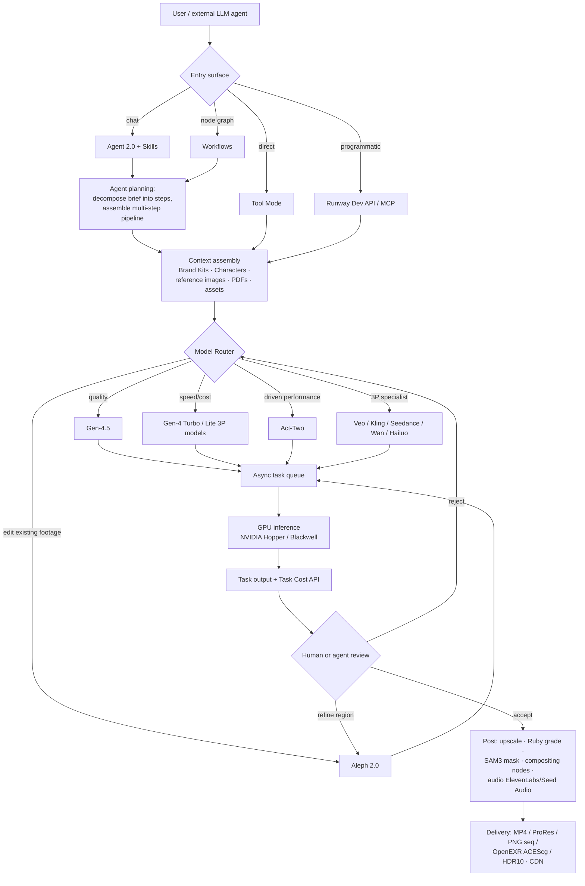

# Runway — Architecture Brief

**Analysis date: 2026-09-13.** Runway's product surface moves fast; treat this as a snapshot, not a permanent description. Every non-trivial architectural claim is labeled **VERIFIED** (official Runway docs/research/changelog/API), **STRONG INFERENCE** (implied by observable behavior, APIs, or published technique), or **HYPOTHESIS** (plausible, unconfirmed) — see `.claude/agents/video-platform-intelligence.md`'s research principle.

**Updated 2026-09-13 (follow-up gap audit).** Six checklist gaps were researched and integrated in place: environment/location consistency (Continuity System), camera control and generative extend (new subsections under Model Stack), inpainting/outpainting (Continuity System), asset management (new subsection under UX Architecture), and GPU/inference infrastructure (Infrastructure). The largest correction is infrastructural — Runway maintains an **engineering blog** separate from its research and changelog surfaces, which the first pass missed entirely.

---

## Executive Summary

1. **Runway is no longer "an AI video model company." It is a generative-media platform that also happens to make frontier models.** Its API/MCP surface now serves first-party models (Gen-4.5, Gen-4 Turbo, Gen-4 Image, Aleph 2.0, Act-Two, Ruby, GWM-*) *alongside* third-party ones — Veo, Kling, Seedance 2.0/2.5, Wan 3.0, Hailuo 3.0, Nano Banana 2, Seedream 5.0, Ideogram 4.0, Grok Imagine, GPT Image 2.5, ElevenLabs v3, Seed Audio 1.0. **[VERIFIED — Runway changelog + Runway Dev API changelog]**
2. **The strategic centerpiece of 2026 is the Model Router** (launched 2026-07-21/23): developers declare *cost / latency / quality* preferences plus allow/deny lists and cost caps, and Runway picks the model per request, ranked on its own internal quality/price/speed data. This is explicitly a bet that "the best model will keep changing." **[VERIFIED — changelog + TechCrunch]**
3. **Gen-4.5 is the flagship foundation model**: text-to-video and image-to-video, native audio (dialogue, SFX, ambience), ~1-minute long-form with multi-shot generation, character consistency, and multi-shot edit propagation. Runway claims #1 on the Artificial Analysis text-to-video leaderboard at 1,247 Elo. **[VERIFIED]**
4. **Runway publishes almost nothing about Gen-4.5's internal architecture.** The official research page discloses benchmark position and that it was trained and served on NVIDIA Hopper and Blackwell GPUs — and essentially nothing else. Widely-repeated secondary claims that Gen-4.5 is an "A2D (autoregressive-to-diffusion) architecture fusing Qwen2.5-VL with parallel diffusion decoding" are **not** on any Runway page found. **[HYPOTHESIS — secondary tech blogs only; do not treat as fact]**
5. **The one place Runway *does* disclose architecture is the world-model line.** GWM-1 is described officially as an **autoregressive model built on top of Gen-4.5**, generating frame-by-frame in real time, action-conditioned on camera pose, robot commands, audio/speech, and events. GWM Worlds 2 goes further: a bidirectional model **post-trained into a causal autoregressive one**, with causal video/audio decoders running a **sliding KV-cache** (older frames evicted), **few-step distillation**, and **on-policy training on its own generated context to correct drift**. 720p/24fps video + 48 kHz audio, indefinite length. **[VERIFIED — runway.com/research GWM-1 and GWM Worlds 2]** This is the single best public window into how Runway builds.
6. **Editing is a separate model family, not a mode of the generator.** Aleph 2.0 is an "in-context video model": prompt-driven edits on existing footage, up to **30s at 1080p**, **keyframe-image conditioning** (hand it an edited frame, it propagates), **localized edits** that leave everything else untouched, and **automatic propagation across shot boundaries** in multi-cut videos. It ships with a dedicated product, Edit Studio. **[VERIFIED]**
7. **The agentic layer is now the primary consumer surface.** Agent 2.0 (campaign-scale production), Agent Skills (custom, shareable), Agent Workflows (AI-assembled multi-step pipelines), Agent Sessions inside Projects, a timeline editor embedded *in* the agent, PDF/Brand Kit inputs, and a hosted MCP server so external LLM agents (Claude, ChatGPT, Cursor) can drive Runway. **[VERIFIED — changelog Jun–Aug 2026]**
8. **Runway's infrastructure is far better documented than this brief originally recorded — via a separate engineering blog at `runway.com/news/engineering`.** Kubernetes with production inference and research in deliberately *separate* clusters; **Kueue** as the GPU scheduler (chosen over Volcano to avoid a second scheduler binary); a custom cross-cluster capacity controller named **`deckard`** that lends idle inference GPUs to research overnight; p98-latency-SLO-driven capacity planning validated by discrete-event replay of arrival rates; **+20 percentage points of GPU utilization, ~2x industry norms**. AWS SQS for queueing, GCP `a3-megagpu-8g` (8×H100) GPU node pools. **[VERIFIED]** See Infrastructure.
9. **Three capabilities that look like gaps in Runway's narrative product are actually deliberate retirements or delegations.** Mask-based **inpainting** was retired 2026-07-30 and replaced by prompt-scoped Aleph 2.0 edits ("no mask, no tracking step"); parametric **camera control** was retired with Gen-3 Alpha Turbo and replaced by a documented camera-*vocabulary* the models are trained to obey; **extend** is delegated to a brokered third-party model (Seedance 2.5) rather than done natively by Gen-4.5. The pattern: **Runway keeps collapsing control surfaces into prompts.** **[VERIFIED]**
10. **Runway has no first-class Location/Environment entity in its narrative product — a confirmed gap, not an unresearched one.** Locations are handled by the same entity-agnostic Reference mechanism as characters, plus a `locations` section inside enterprise Brand Kits. The only real structured world-state format, **WorldPrompt** (persistent environment + attributed subjects + "laws" + first frame, separated from a timestamped event stream), lives in the GWM world-model branch and is not available to narrative generation. Narrata's lockable `Location` records are ahead of Runway's shipping narrative product here. **[VERIFIED]**
11. **Professional-delivery plumbing landed in 2026**: ProRes/PNG-sequence/OpenEXR export, ACEScg EXR delivery, HDR10/HLG/10-bit/12-bit mastering, a dedicated `/v1/video_to_hdr` endpoint, and SAM3 video segmentation for transparent masking. Runway is chasing real post-production pipelines, not just social clips. **[VERIFIED — API changelog Aug 2026]**

---

## Publicly Known Architecture — Product Layer

```
                         ┌─────────────────────────────────────────────┐
                         │                 USERS                        │
                         │  creators · marketing teams · studios ·       │
                         │  enterprises · developers · external agents   │
                         └──────────────────┬──────────────────────────┘
                                            │
  ┌──────────┬──────────┬──────────┬────────┴───────┬──────────┬──────────────┐
  │  AGENT   │   TOOL   │   EDIT   │    STUDIO      │  STORY   │  RUNWAY DEV  │
  │  (chat)  │   MODE   │  STUDIO  │  (composite/   │  PANELS  │  API + MCP   │
  │          │ (direct  │ (Aleph   │   edit UI)     │ (3-panel │  + Adobe     │
  │ Agent2.0 │  model   │   2.0)   │                │  story   │   plugins    │
  │ Skills   │  calls)  │          │  Workflows +   │  board)  │              │
  │ Workflows│  Ruby    │ keyframe │  node graph +  │ Cinematic│  Model Router│
  │ Sessions │  grading │  edits   │  compositing   │ Brainstorm│  Characters │
  │ Timeline │          │          │  nodes         │          │  Recipes     │
  └──────────┴──────────┴──────────┴────────────────┴──────────┴──────────────┘
                                            │
                         ┌──────────────────┴──────────────────┐
                         │        ORCHESTRATION LAYER           │
                         │  Model Router · Task Queue ·         │
                         │  Characters · Brand Kits · Assets    │
                         └──────────────────┬──────────────────┘
                                            │
        ┌───────────────────────────────────┴────────────────────────────┐
        │                        MODEL LAYER                              │
        │  FIRST-PARTY: Gen-4.5 · Gen-4 Turbo · Gen-4 Image · Aleph 2.0   │
        │               Act-Two · Ruby · GWM-1 / Worlds 2 / Avatars /     │
        │               Robotics · Upscale · SAM3 segmentation            │
        │  THIRD-PARTY: Veo · Kling 3.0 · Seedance 2.0/2.5 · Wan 3.0 ·    │
        │               Hailuo 3.0 · Nano Banana 2 · Seedream 5.0 ·       │
        │               Ideogram 4.0 · Grok Imagine · GPT Image 2.5 ·     │
        │               ElevenLabs v3 · Seed Audio 1.0 · Gemini Omni Flash│
        └─────────────────────────────────────────────────────────────────┘
```
**[VERIFIED]** for every named surface and model; the grouping into "layers" is analytical framing, not a Runway-published diagram.

**Workflow modes available (API task types):** text-to-video, image-to-video, video-to-video, text-to-image, video-upscale, and `character_performance` (Act-Two). **[VERIFIED — docs.dev.runwayml.com]**

---

## Model Stack

| Model | Role | Publicly disclosed internals |
|---|---|---|
| **Gen-4.5** | Flagship T2V/I2V; native audio; ~1 min long-form; multi-shot | Almost none. NVIDIA Hopper/Blackwell for R&D→inference **[VERIFIED]**. "A2D / Qwen2.5-VL" is unsourced **[HYPOTHESIS]** |
| **Gen-4 Turbo** | Fast, cheap variant for iteration | Not disclosed. Almost certainly a distilled/step-reduced Gen-4 **[STRONG INFERENCE]** — Runway explicitly uses distribution-matching distillation elsewhere |
| **Gen-4 Image** | Stills / reference-image generation, feeds I2V | Not disclosed |
| **Aleph 2.0** | In-context video editing, 30s@1080p, keyframe-conditioned, cross-shot propagation | Capabilities VERIFIED; architecture explicitly withheld |
| **Act-Two** | Performance capture: driving video → animated character. Single-character input; multi-character done by compositing passes | Capability + API availability **[VERIFIED]**; mechanism not disclosed |
| **Ruby** | Color grading / HDR, exposed in Tool Mode, Workflows, Dev | Not disclosed |
| **GWM-1 / Worlds 2 / Avatars / Robotics** | Real-time interactive world simulation, action-conditioned | **Best-documented.** Autoregressive on Gen-4.5 base; causal cached decoders; sliding KV window; few-step distillation; on-policy self-context training **[VERIFIED]** |
| **SAM3** | Video segmentation → transparent masks for compositing | **[VERIFIED]** |
| **Third-party models** | Coverage, price points, specialist capability | N/A — brokered |

### Camera Control

Researched specifically (2026-09-13). **Runway's narrative-video line has no camera-control UI or API parameter today. Camera control is purely prompt-based.** This is a *regression* from earlier Runway, not a gap Runway never filled. **[VERIFIED]**

```
  GEN-3 ALPHA TURBO ERA               GEN-4 / GEN-4.5 ERA (current)
  ─────────────────────               ─────────────────────────────
  "Camera Control" — a dedicated      no camera UI, no camera API param
  parametric control surface:         camera is expressed as vocabulary
    left/right · up/down · in/out       inside the text prompt
    pan L/R · tilt up/down
    rotate CW/CCW
  "Advanced Camera Control":
    direction + INTENSITY
                                      Gen-4.5's pitch is prompt adherence:
  RETIRED 2026-07-30 with             it "excels at understanding and
  Gen-3 Alpha Turbo                   executing complex, sequenced
                                      instructions," incl. "detailed camera
                                      choreography ... within a single prompt"
```

Runway's replacement for the control surface is **documentation**: an official camera-terms library ("Camera Terms, Prompts, & Examples") and a camera-prompting guide listing the movement vocabulary the models reliably recognize — dolly in/push-in, dolly out/pull-back, pan left/right, whip pan, tilt up/down, truck left/right, pedestal up/down, orbit, arc, crane up/drone rise, crash zoom, handheld, steadicam, gimbal, locked-off static. Runway's stated rule: **every movement term should carry a speed or duration** ("slow, deliberate, steady, rapid," or an explicit "slow 5-second pan right"), and **name the right primitive** — "a dolly moves the camera through space; a pan pivots it in place. Models treat these differently." For Gen-4.5 specifically, Runway says prompt adherence is now strong enough that **combining** camera terms is encouraged. **[VERIFIED — runway.com/resources/ai-camera-prompts, help center Gen-4/Gen-4.5 prompting guides]**

Two adjacent camera capabilities that are *not* camera control in the parametric sense:
- **Aleph 2.0 can re-frame an existing shot** — "Get the close-up: tighter shot on the product, same moment," and more generally "generating any angle of a scene." Camera as a *post-hoc edit*, consistent with the edit-and-propagate pattern. **[VERIFIED]**
- **GWM Worlds 2 takes per-frame camera input** as part of its time-varying state. That is real, parametric, frame-level camera control — but it exists only in the real-time world-model branch, not in narrative generation. **[VERIFIED]**

**Narrata read:** the frontier's current answer to camera control in narrative video is a *controlled prompt vocabulary*, not a control widget. That is directly actionable and cheap: Narrata's `MOTION_PROMPT_DRAFTING` and `SHOT_PLANNING` stages could constrain camera language to a fixed, model-legible term set with a mandatory speed/duration qualifier, rather than letting the LLM free-write camera prose. This is a prompt-architecture change, not a feature build — hand to `ai-architect`. **[STRONG INFERENCE that the vocabulary approach transfers; the vocabulary itself is VERIFIED]**

### Generative Extend

Researched specifically (2026-09-13). **Extend still exists and is a current, named feature — but it is no longer a first-party model capability.** **[VERIFIED]**

Current state:
- **Extend is positioned as the standard path to length.** Runway's video-generator product page: "Single generations are short clips. To build a longer sequence, use **Extend** to stretch a clip and chain multiple generations together with **Workflows**." **[VERIFIED]**
- **It runs on a brokered third-party model.** The documented current implementation is the **Seedance 2.5 (Edit/Extend Video)** node — "modify an existing video or continue it past its last frame," within Seedance 2.5's up-to-30s single-generation ceiling. **[VERIFIED — help center "Creating with Seedance 2.5"]**
- **Bidirectional.** Extend mode "continues a video forwards or backwards" — extend forwards by describing what happens after the clip ends, backwards by describing what happens before it begins. **[VERIFIED]**
- **Output is the delta, not the joined clip.** "The output contains only the new footage at your set Duration, and your original video is unchanged" — extending a 30s video by 5s returns a 5s clip; the user assembles original + extension in **Studio**. **[VERIFIED]**
- **Gen-4.5 does not have a confirmed native extend.** Gen-4.5 currently exposes text-to-video and image-to-video, with "support for additional inputs coming soon." **[VERIFIED]**
- **Aleph 2.0 is not an extend tool.** It edits inputs of **2–30s** and is documented for transformation, not lengthening. Its shot-extension-adjacent behavior is *cross-shot edit propagation*, which is a different axis (breadth across existing cuts, not added duration). **[VERIFIED]** No evidence found that Aleph 2.0 can add duration.
- **No `extend` endpoint in the public Dev API**, and the API changelog contains no extend entry. Extend appears to be a web-app/Workflows-node surface only. **[VERIFIED by absence — docs.dev.runwayml.com + API changelog]**

**The architectural tell:** Runway's flagship model tops out around a minute of multi-shot, and the platform's answer to "make it longer" is to **route to a third-party model that does extend**, then assemble in a conventional timeline. Even at the frontier, long-form is still **generate-short + chain + assemble**, not generated end-to-end. That directly validates Narrata's per-shot-pair generation plus assembly architecture rather than suggesting it should chase single-shot long-form. **[STRONG INFERENCE]**

**Narrata read:** "output is only the new footage; you assemble it yourself" is a notable design choice — it keeps the extension a first-class, independently reviewable/regenerable asset instead of mutating the original. Narrata's take-history model already has this property. Worth confirming with `video-architect` that any future extend-style feature preserves it rather than producing an opaque longer clip.

---

## Generation Pipeline



**Evidence note:** every *node* is VERIFIED as an existing Runway capability. The *edges* — specifically the reject→router and refine→Aleph loops — are **STRONG INFERENCE**. Critically, no evidence was found of an automated quality/continuity critic in Runway's pipeline. The refinement loop appears to be human-in-the-loop (or agent-in-the-loop via MCP), not a model-based PASS/REGENERATE evaluator. **[STRONG INFERENCE — absence of evidence in docs, changelog, and research pages]**

### API Request Lifecycle

```
  CLIENT                      RUNWAY DEV API                    BACKEND
    │                               │                              │
    ├── POST /v1/{task_type} ──────►│                              │
    │   model | prompt | refs |     │                              │
    │   keyframes | duration |      ├─ validate + price ──────────►│
    │   ratio | seed | router_id    │                              │
    │                               ├─ router: match rules,        │
    │                               │  rank on quality/price/speed │
    │                               │  + capacity fallback ───────►│
    │◄── 200 { id, status:PENDING } │                              │
    │                               │                         ┌────▼────┐
    ├── GET /v1/tasks/{id} ────────►│                         │  QUEUE  │
    │◄── RUNNING                    │                         └────┬────┘
    ├── GET /v1/tasks/{id} ────────►│                         ┌────▼────┐
    │◄── SUCCEEDED { output:[url] } │                         │ GPU pool│
    │                               │                         └─────────┘
    └── GET task cost ─────────────►│  per-generation credit transparency
```
**[VERIFIED]** — create-and-poll async model, router capacity fallbacks for concurrency (changelog 2026-07-30), Task Cost API (2026-07-30). Queue and GPU-pool internals are **STRONG INFERENCE**.

---

## Orchestration — the Model Router

```
                    ┌─────────────────── ROUTER CONFIG ───────────────────┐
                    │  optimize_for: cost | latency | quality             │
                    │  allow_list / deny_list                             │
   request ────────►│  cost_cap                                           │
   (+ router_id)    │  ranked against Runway's internal quality/price/    │
                    │  speed telemetry + live capacity                    │
                    └──────────┬──────────────────────────────────────────┘
                               │
       ┌───────────┬───────────┼───────────┬────────────┬──────────────┐
       ▼           ▼           ▼           ▼            ▼              ▼
   Gen-4.5    Gen-4 Turbo   Veo 3.1    Kling 3.0   Seedance 2.5   Wan 3.0
  (quality)    (speed)     (3P spec.)  (3P spec.)   (30s/4K)     (native audio)
       │                                                              │
       └──────────────────► routing history logged in Activity tab ◄───┘
```

Two design details worth noting: **routing decisions are logged and inspectable** (Activity tab, 2026-08-03) and **the router degrades on capacity rather than failing** (2026-07-30). The quality ranking is human-curated — Runway's creative team evaluates motion, composition, lip-sync per media type and that judgment feeds the router, per a TechCrunch interview with Runway's CPO. **[VERIFIED]** That makes it a *taste-encoded* router, not a purely automated benchmark router.

---

## Continuity System

Runway attacks continuity at four different layers:

```
 LAYER 1 — IN-MODEL (Gen-4.5)
   character consistency + multi-shot generation inside a single ~1-min context
   ⇒ continuity is a property of one long context, not of stitching
   [capability VERIFIED; mechanism NOT disclosed]

 LAYER 2 — REFERENCE CONDITIONING
   reference images at generation time; reference budgets grew sharply in 2026
   (Seedance 2.5 on Runway: up to 30 images + 10 videos + 10 audio clips;
    GPT Image 2.5: 16 refs; Seedream 5.0 Lite: 14 refs)
   ⇒ continuity as retrieval-into-context
   [VERIFIED via API changelog]

 LAYER 3 — PERSISTENT ENTITIES ("Characters")
   Characters are first-class API objects: create, list, inspect,
   attach/detach knowledge documents, with avatars + custom voices
   ⇒ continuity as a durable, reusable, addressable record
   [VERIFIED — Runway Dev MCP + docs]

 LAYER 4 — POST-HOC PROPAGATION (Aleph 2.0)
   edit once → propagate across all relevant shots in a multi-cut video;
   keyframe image as the ground-truth target for the edit
   ⇒ continuity as a repair operation, applied after generation
   [VERIFIED]
```

Layer 4 is the genuinely novel move. Most platforms treat consistency as something to get right *before* generating. Runway also treats it as something fixable *afterward, globally, across cuts* — with a hand-edited keyframe as the specification. That inverts the usual regenerate-until-consistent loop into an edit-and-propagate loop, which is far cheaper.

How Gen-4.5 maintains identity internally is **not disclosed**. Claims about "latent space anchoring" circulating in 2026 blog posts have no Runway source. **[HYPOTHESIS]**

One clarification on Layer 3: the **Dev API `Characters` objects are conversational-avatar entities, not narrative-continuity entities.** The docs group them with tool calling, video meetings, and camera/screen sharing — i.e. they belong to the GWM Avatars branch (a persistent persona with a voice and knowledge documents you can talk to), not to the Gen-4.5 shot-consistency path. The thing that actually carries identity into a narrative generation is a **saved Reference**, not a `Character`. **[STRONG INFERENCE — from the Dev API docs' own grouping of Characters features; Runway does not state the distinction explicitly]** This matters for Narrata: Runway's "persistent character entity" is a weaker precedent for a Story-Bible-style `Character` record than the name suggests.

### Environment / Location Continuity

Researched specifically (2026-09-13). **Runway has no first-class persistent `Location` / `Set` / `Environment` entity anywhere in the product or API — confirmed gap, not an unresearched one.** There is no location analogue to the `Characters` API object, no environment-lock toggle, and no location endpoint. **[VERIFIED by absence — checked runway.com product/research pages, docs.dev.runwayml.com, and the help center's Assets & Workspaces and Gen-4 References articles]**

What Runway has instead is **four weaker, mostly-generic mechanisms**, none of which treat a location as a durable named record the way Narrata's `Location` table does:

```
 A — REFERENCES ARE ENTITY-AGNOSTIC (the main mechanism)
     Gen-4 References make no type distinction between a character, an object
     and a location. The Gen-4 announcement is explicit: "consistent characters,
     objects and locations across scenes" from "a single reference image," and
     "utilize visual references ... to create new images and videos utilizing
     consistent styles, subjects, locations and more" — "without the need for
     fine-tuning or additional training."
     Documented location workflow: feed one reference image of the set and
     prompt for different angles / focal points / objects to build consistent
     environment coverage and b-roll. References can be tagged, named, saved to
     persist across sessions, and shared workspace-wide.
     ⇒ location continuity = the character mechanism, pointed at a background
     [VERIFIED — runway.com/research/introducing-runway-gen-4 + help center
      "Creating with Gen-4 Image References"]

 B — BRAND KITS (the closest thing to a Location Bible)
     Reusable collections of reference images/videos organized into sections for
     "the products, locations, colors, and more that define a visual identity."
     Each section takes an optional description that is "automatically
     incorporated into your Brand Kit's custom system prompt, giving the model
     context about how to apply those specific references." Scopable to the
     whole workspace, to specific projects, or both. Enterprise-tier.
     ⇒ this is reference-bundle-plus-system-prompt, i.e. a brand-identity
       construct that happens to have a locations slot — not a per-scene
       continuity record with state
     [VERIFIED — help center "Brand Kits for Enterprises"]

 C — POST-HOC ENVIRONMENT EDITING (Aleph 2.0)
     Named capabilities: "New background, no reshoot" ("Add graffiti on the wall
     behind him"), season/time-of-day change ("Change the season to winter"),
     relight, and a dedicated "Change Video Backdrop" App.
     ⇒ environment continuity as a repair operation, matching the Layer-4
       edit-and-propagate pattern above
     [VERIFIED — runway.com/product/aleph-2 + runway.com/product/ai-video-generator]

 D — WORLDPROMPT (GWM Worlds 2 only — the one real world-state format)
     The world-model branch *does* have an explicit structured environment
     representation, split into:
       PERSISTENT WORLD CONTEXT
         · genesis prompt: environment, layout, materials, lighting,
           ambient sound
         · subjects that can participate in events, with attributes
         · "laws" — reusable conventions governing behavior
         · a first frame for visual grounding
       TIME-VARYING STATE
         · timestamped event stream: free-form action prompts with start/end
           timestamps, addressed to a subject *or to the scene itself*
         · per-frame camera input
     ⇒ the only place Runway separates "what persists" from "what changes"
     [VERIFIED — runway.com/research/introducing-gwm-worlds-2]
```

**Why this matters for Narrata.** WorldPrompt is the single most transferable idea in this brief and it is *not* in Runway's narrative product — it is locked inside the real-time world-model branch. Its shape (persistent environment + attributed subjects + explicit "laws" + first-frame grounding, separated from a timestamped event stream) is close to a Story Bible plus a scene graph, and it validates the split Narrata already makes between `StoryBible`/`Location` records and per-scene shot state. Runway's *narrative* pipeline, by contrast, has no location entity at all — which means a persistent, lockable `Location` record is a place where Narrata is already ahead of Runway's shipping narrative product, not behind it. **[STRONG INFERENCE on the comparison; the WorldPrompt structure itself is VERIFIED]**

### Inpainting and Outpainting

Researched specifically (2026-09-13). Runway **does** use the term "inpainting" and **did** ship a dedicated mask-based inpainting tool — but **retired it on 2026-07-30**, the same date Gen-3 Alpha Turbo and Gen-4 Aleph were retired. **[VERIFIED — runway.com/resources/ai-video-inpainting]**

The architecture shift is the interesting part:

```
  LEGACY (retired 2026-07-30)          CURRENT (Aleph 2.0)
  ─────────────────────────            ────────────────────
  1. MASK    paint the region     ──►  describe it in words
             on frame 1                ("remove the trash can")
  2. TRACK   propagate the mask   ──►  model detects + tracks it
             through motion             itself
  3. GENERATE fill the masked     ──►  model reconstructs the frame
             region                     and holds it consistent as
                                        camera and subject move
  ⇒ three user steps, explicit      ⇒ one step, no mask, no tracking
    region specification              ("no mask, no tracking step")
```

Runway's own framing: "With Aleph 2.0, those three steps collapse into one." Region specification moved from **spatial (a mask)** to **semantic (a noun phrase)**. **[VERIFIED]**

Surfaces: the capability is exposed through the **"Remove from Video" App** for targeted object removal and through **Agent 2.0** for broader edits — not as a standalone inpainting mode. **[VERIFIED]** There is no mask or region parameter in the public Dev API; Aleph 2.0 takes video + prompt (+ optional keyframe image). **[VERIFIED — docs.dev.runwayml.com]**

**Outpainting** is treated as a *separate, explicitly distinguished* capability, which Runway calls **generative fill**: "Inpainting removes or replaces something already inside the frame. Generative fill adds to the frame, most often extending edges or changing aspect ratio." The older named implementation was **Expand Video** on Gen-3 Alpha Turbo, retired with that model on 2026-07-30. **[VERIFIED]** Whether a first-party outpainting/aspect-ratio-expansion path survives under a current model was **not confirmed** — no current-model Expand Video equivalent was found.

**Narrata read:** the mask→prompt collapse is the cheap, high-leverage half. It removes an entire interaction surface (mask painting + tracking UI) by pushing region selection into the text prompt, which is a UX decision as much as a model one. Narrata's take-history regeneration currently replaces a whole shot; a prompt-scoped "change only X in this shot" path would be the same trade, and does not require Narrata to build masking UI. Route to `ui-ux-engineer` and `video-architect`.

---

## Probable Hidden Architecture — the Real-Time World-Model Branch

This is the one place Runway's architecture is actually public, via the GWM research pages.

```
  user action (text / camera pose / audio / robot cmd)
        │
        ▼
  ┌──────────────────────────────────────────────────────────┐
  │  GWM Worlds 2  —  autoregressive diffusion, causal        │
  │                                                            │
  │  frame_t tokens {video, text, audio}                       │
  │    └─ causally attend to self + past frames                │
  │       within SLIDING KV-CACHE WINDOW (old frames evicted)  │
  │                                                            │
  │  few-step denoising  (distribution-matching distillation)  │
  │  trained two-stage: off-policy → ON-POLICY on its own      │
  │  generated context, to correct rather than amplify drift   │
  └───────────────────────┬──────────────────────────────────┘
                          │  latents streamed as produced
                          ▼
        ┌──────────────────────────────────┐
        │ CAUSAL video decoder (cached)    │──► 720p @ 24fps
        │ CAUSAL audio decoder (cached)    │──► 48 kHz
        └──────────────────────────────────┘
                          │
                          ▼  no fixed clip length — indefinite session
```
**[VERIFIED — runway.com/research GWM-1 and GWM Worlds 2.]**

Two takeaways. First, **Runway converts a bidirectional full-attention generator into a temporally-causal one by post-training** — the base model is reused, not rebuilt. Second, **on-policy self-context training is their named answer to long-horizon drift**: the model sees its own outputs during training and learns to correct them. That is a *training-time* solution to a problem most platforms solve with *inference-time* scaffolding (frame chaining, reference re-injection). Variants: GWM Robotics, GWM Avatars (audio-driven conversational characters), GWM Worlds.

---

## Infrastructure

| Signal | Evidence |
|---|---|
| NVIDIA Hopper + Blackwell across R&D, pre-train, post-train, **and inference**; explicit optimization collaboration with NVIDIA | **[VERIFIED — official Gen-4.5 research page]** |
| Async task queue with create→poll, task IDs, task-level cost accounting | **[VERIFIED — API]** |
| Router-level capacity fallback under concurrent load ⇒ multi-model, multi-pool capacity management | **[VERIFIED — changelog]** |
| Third-party models served through Runway ⇒ a brokering/proxy layer with per-provider adapters, normalized params (refs, keyframes, ratios, duration), and unified billing | **[STRONG INFERENCE]** — normalization is visible in the API's uniform parameter shape across heterogeneous providers |
| Hosted MCP server as a first-class, multi-tenant product surface | **[VERIFIED]** |
| Real-time GWM inference ⇒ persistent stateful GPU sessions with KV cache, not stateless batch jobs | **[STRONG INFERENCE]** from the published sliding-KV-cache design |
| **Kubernetes, with production inference and research in *separate* clusters** — for blast-radius containment and independent K8s versions, GPU drivers, and networking stacks | **[VERIFIED — Runway engineering blog]** |
| **Kueue** as the GPU scheduler, chosen over **Volcano** explicitly because it "works *with* kube-scheduler rather than introducing a second scheduler binary." `ClusterQueue` + cohort model; reserved per-team queues with `borrowingLimit: 0`; a shared opportunistic default queue; gang scheduling; two-layer pod priority (default `-500`, reserved `0`); preemption ordered by lowest Kueue workload priority then shortest running time; a CI gate blocking reservations exceeding static capacity | **[VERIFIED — Runway engineering blog]** |
| **GPU utilization raised "over 20 percentage points," to "~2x industry norms"**; preemption costs a 20–30 min gap before the reserved job runs | **[VERIFIED]** |
| **A custom cross-cluster capacity controller named `deckard`** that reallocates between inference and research by controlling *both* inference deployment replica counts *and* the size of the underlying cloud GPU node pools. Runs on five fixed windows (weekday peak 8:30am–12:30pm ET, weekday day, weekday night, weekend day, weekend night); node transfers take **20–60 min** | **[VERIFIED]** |
| **Diurnal demand shaping**: traffic peaks ~9am ET, bottoms ~8pm ET, trough is **under half of peak** — the "borrow idle inference GPUs at night for research" thesis. Ephemeral vs. static nodes distinguished by the label `runwayml.com/compute-shared-with-external-clusters=true` | **[VERIFIED]** |
| **Capacity planning is SLO- and queueing-theory-driven, not utilization-driven**: targets a **p98 latency SLO**; safe utilization scales with pool size (~70% at 4 GPUs vs. >95% at 400 GPUs). Forecasting replays the **last 7 days of per-minute arrival counts** through discrete-event simulation across several random seeds to validate p98 | **[VERIFIED]** |
| **The async task queue is AWS SQS**, with arrival metrics read from **AWS CloudWatch**; GPU node pools reference the machine type **`a3-megagpu-8g`** (a Google Cloud 8×H100 instance) ⇒ Runway appears to run **multi-cloud**, GPU capacity on GCP with AWS for queueing/telemetry | Component names **[VERIFIED — named in the engineering blog]**; the "multi-cloud" characterization is **[STRONG INFERENCE]** — Runway never states a cloud strategy |
| Absolute cluster size / total GPU count, storage and CDN vendors, model-serving runtime (TensorRT/vLLM-equivalent), quantization and parallelism strategy | **NOT VERIFIABLE.** The engineering blog covers *scheduling and capacity*, never *serving internals*. Searched: Runway engineering blog, GPU-scheduling and inference-scaling queries, conference-talk and infra-interview angles — nothing further found. |
| Customers on the infra: Adobe, Cloudflare, ElevenLabs, Expedia, Shutterstock, Quora | **[VERIFIED — TechCrunch]** |

**This is the second place Runway genuinely discloses architecture** (alongside the GWM research pages), and it was missed in the first pass of this brief: Runway maintains an **engineering** section under `runway.com/news/engineering` that is distinct from the research and changelog surfaces.

**Narrata read — and this one is explicitly a `technical-architect` question, not a recommendation.** Everything above is **Scale/Enterprise architecture** and none of it applies to Narrata at MVP (single VPS, empty `workers/`, API-first generation, zero self-hosted GPUs). Narrata does not schedule GPUs; its providers do. The one *transferable* idea is not infrastructural at all — it is **sizing queues against a latency SLO using arrival-rate replay rather than eyeballing utilization**, which is a method that works just as well on an API-provider concurrency budget as on a GPU pool, and would become relevant only when Narrata actually has a worker fleet. Flag to `technical-architect`; do not act on it now.

---

## UX Architecture

Six distinct product surfaces sit on top of the same orchestration/model layer (see Product Layer diagram above): **Agent** (chat-driven, campaign-scale), **Tool Mode** (direct model calls for power users), **Edit Studio** (Aleph 2.0's keyframe-driven edit UI), **Studio** (node-graph compositing + Workflows), **Story Panels** (3-panel storyboard + Cinematic Brainstorm), and the **Dev API/MCP** (programmatic + external-agent access). Notable UX patterns: Brand Kits and PDFs as first-class generation inputs, Characters as reusable named entities surfaced in the UI (not just the API), and a visible routing-decision Activity log so users can audit what the router actually picked.

### Asset Management

Researched specifically (2026-09-13). Runway's asset layer is **a four-tier container hierarchy plus a metadata/filter layer plus a reference-semantics layer** — conventional DAM in its lower tiers, distinctive only where assets become *model inputs*.

```
  WORKSPACE            billing + membership boundary; Enterprise workspaces
   │                   can contain TEAMSPACES for scoped collaboration
   ├─ PROJECT          "organize and collaborate on sessions, workflows,
   │                    and assets around a specific creative effort."
   │                    Agent Sessions live INSIDE Projects. A Project's
   │                    assets + Brand Kits are auto-available in-session,
   │                    "so you never re-upload logos, product shots or
   │                    style references."
   ├─ FOLDERS          user-created, for delineating project files
   └─ SYSTEM FOLDERS
        · All Generations  — every generated asset lands here automatically
        · Private          — every uploaded asset lands here
      Completed generations save to the creator's private assets or the
      shared Project space, and can be moved to workspace shared assets.

  METADATA / FILTER LAYER
    sort + filter by: asset type · media type · duration · creator ·
                      date created · favorite
    rename with variable templates ($Date, $Prompt)
    favorites, usable as a filter from inside generative tools

  REFERENCE-SEMANTICS LAYER  ← the part that isn't generic DAM
    · Saved References — tag + name an asset so it persists across sessions
      and can be shared workspace-wide via a "Share with Workspace" toggle
    · Brand Kits       — sectioned reference collections (products,
      locations, colors, ...), each section carrying an optional description
      that is compiled into the Brand Kit's CUSTOM SYSTEM PROMPT; scopable
      to the whole workspace, to specific projects, or both
```
**[VERIFIED — help center "Managing assets," "How to organize assets," "Introduction to workspaces," "Brand Kits for Enterprises," "Creating with Gen-4 Image References"; runway.com/changelog]**

**Version history: not found.** No per-generation version tree, revision history, variant-comparison view, or lineage/provenance link from an output back to its parent generation was documented anywhere searched. Generations appear to be **flat, immutable, independently-stored assets** — re-running a prompt produces a new asset in All Generations, not a new version of an existing one. **[STRONG INFERENCE — absence of evidence across the help center's Assets & Workspaces category and the changelog; Runway does not state that versioning is absent]**

**The one genuinely interesting pattern: descriptions compiled into a system prompt.** A Brand Kit section is not just a bag of images — its free-text description is automatically folded into a system prompt that tells the model *how to apply* those references. That converts an asset collection into **retrieval-plus-instruction** rather than retrieval alone, and it is the closest thing Runway has to a Story Bible. **[VERIFIED]**

**Narrata read.** Two asymmetries are worth flagging:
- **Narrata is likely *ahead* on lineage.** Take history already gives Narrata per-shot generation lineage that Runway's flat All Generations model does not appear to have. This is a differentiation surface, not a gap to close — route to `product-strategist`.
- **Narrata is likely *behind* on the "references carry instructions" pattern.** Narrata's `referenceImages` on `Character`/`Location` are images; Runway pairs reference bundles with a description that becomes system-prompt context. Adding an intent/usage-note field alongside reference images is a low-complexity, high-leverage extension of an existing table. Hand to `ai-architect` as a prompt-architecture question.
- Project-scoped context auto-injection ("never re-upload") is a workflow pattern for `ui-ux-engineer`, not an architecture change.

---

## What Narrata Should Adopt (evidence-based, not exhaustive)

- **An explicit optimize-for axis (cost / latency / quality) on top of the existing `AiModelOption`/`AiJobType` router**, plus a visible, logged routing-decision history — Runway's router validates the registry-based routing approach already in place and shows two concrete extensions worth considering.
- **Edit-and-propagate as a continuity-repair strategy** (Aleph 2.0's model: fix one keyframe, propagate the fix across shots) as a cheaper alternative to always regenerating a full take when only identity/continuity needs correcting.
- **Characters as explicitly reusable, addressable entities** — directionally validates Narrata's `Character`/`Location` + `StoryBible` design rather than suggesting a new pattern.

## What Narrata Should Avoid / Not Chase Yet

- Building a real-time, frame-streaming world-model branch (GWM) — this is a different product category (interactive worlds/robotics) requiring persistent stateful GPU sessions, not a natural extension of a narrative-video pipeline.
- Assuming Runway has solved automated quality/continuity evaluation — no evidence of one was found in their stack; this looks like an open, industry-wide gap rather than a capability to catch up to.

---

## What Could Not Be Verified

- Gen-4.5's actual architecture, text/image encoders, VAE, or conditioning mechanism.
- Act-Two's identity/motion-transfer mechanism.
- Whether an automated video quality/continuity critic exists anywhere in Runway's stack (absence of evidence, not evidence of absence).
- Parameter counts, training data, and training compute for any Runway model.
- ~~Cloud/orchestration/storage stack.~~ **Substantially RESOLVED 2026-09-13** via Runway's engineering blog — Kubernetes + Kueue, split inference/research clusters, the `deckard` capacity controller, AWS SQS queueing, GCP `a3-megagpu-8g` GPU node pools. See Infrastructure. Still unverifiable: **absolute cluster/GPU counts, storage and CDN vendors, the model-serving runtime, and any quantization or tensor/pipeline-parallelism strategy** — the engineering blog covers scheduling and capacity, never serving internals. Searched from several angles (engineering blog, GPU-scheduling queries, inference-scaling queries, conference-talk and infra-interview angles); nothing further surfaced.
- **Whether any first-party outpainting / "generative fill" / aspect-ratio-expansion path exists under a current model.** Runway names the capability and distinguishes it from inpainting, but the named implementation (Expand Video on Gen-3 Alpha Turbo) was retired 2026-07-30 and no current-model successor was found.
- **Whether Gen-4.5 will gain a native extend.** Runway says only "support for additional inputs coming soon."
- **Whether generation version history / lineage exists in any form.** No evidence found either way; treated as STRONG INFERENCE of absence, not fact.
- **Aleph 2.0's region-localization mechanism** — how a noun phrase is resolved to a spatial region and tracked without a user mask is not disclosed (SAM3 is a plausible but unconfirmed component). **[HYPOTHESIS]**
- Exact release dates for several 2026 items — sources conflict (e.g., Aleph 2.0 is dated May 21, 2026 on Runway's news page but appears in the API changelog in July 2026, likely reflecting web-app vs. API availability). Treat dates as ±1 month.
- Runway's Feb 2026 raise (~$315M at ~$5.3B) is business intelligence, not architecture — belongs with `market-intelligence`, not reasoned about here.

---

## Sources

**Primary (Runway official):**
- [Runway Product Updates & Changelog](https://runway.com/changelog)
- [Runway Dev API Changelog](https://docs.dev.runwayml.com/api-details/api_changelog/)
- [Runway Dev API Docs](https://docs.dev.runwayml.com/)
- [Runway Research — Introducing Runway Gen-4.5](https://runway.com/research/introducing-runway-gen-4.5)
- [Runway Research — Introducing Runway GWM-1](https://runway.com/research/introducing-runway-gwm-1)
- [Runway Research — Introducing GWM Worlds 2](https://runway.com/research/introducing-gwm-worlds-2)
- [Runway Research — Introducing Runway Aleph](https://runway.com/research/introducing-runway-aleph)
- [Runway News — Introducing Aleph 2.0 and Edit Studio](https://runway.com/news/introducing-aleph-2-and-edit-studio)
- [Runway News — Introducing Runway Dev MCP](https://runway.com/news/company-news/runway-dev-mcp)
- [Runway Help — Performance Capture with Act-Two](https://help.runwayml.com/hc/en-us/articles/42311337895827-Performance-Capture-with-Act-Two)
- [Runway Help — Multi-Character Dialogues with Act-Two](https://help.runwayml.com/hc/en-us/articles/41748090660499-Creating-Multi-Character-Dialogues-with-Act-Two)
- [Runway Help — Story Panels](https://help.runwayml.com/hc/en-us/articles/50985233945747-Story-Panels)

**Primary — added 2026-09-13 (six-gap follow-up audit):**

*Infrastructure — Runway's engineering blog, missed in the first pass:*
- [Runway Engineering — Borrowing the Night: Reclaiming Idle Inference GPUs for Research](https://runway.com/news/engineering/borrowing-the-night-reclaiming-idle-inference-gpus-for-research)
- [Runway Engineering — No Idle GPUs: Managing Research Compute at Runway](https://runway.com/news/no-idle-gpus-managing-research-compute-at-runway)

*Environment / location continuity:*
- [Runway Research — Runway Gen-4: AI Video Generation with World Consistency](https://runway.com/research/introducing-runway-gen-4)
- [Runway Help — Creating with Gen-4 Image References](https://help.runwayml.com/hc/en-us/articles/40042718905875-Creating-with-Gen-4-Image-References)
- [Runway Help — Advanced References Use Cases](https://help.runwayml.com/hc/en-us/articles/41170686463635-Advanced-References-Use-Cases)
- [Runway Academy — Transform Backgrounds with Aleph](https://academy.runwayml.com/tutorial/change-environments-with-aleph)
- [Runway Resources — AI Shot List: how to build a camera-ready plan](https://runway.com/resources/ai-shot-list)

*Camera control:*
- [Runway Resources — AI Camera Prompts: How to Control Camera Movement, Angles and Shots in AI Video](https://runway.com/resources/ai-camera-prompts)
- [Runway Help — Camera Terms, Prompts, & Examples](https://help.runwayml.com/hc/en-us/articles/47313504791059-Camera-Terms-Prompts-Examples)
- [Runway Help — Creating with Camera Control on Gen-3 Alpha Turbo](https://help.runwayml.com/hc/en-us/articles/34926468947347-Creating-with-Camera-Control-on-Gen-3-Alpha-Turbo) *(retired feature; retained as evidence of the pre-Gen-4 control surface)*
- [Runway Help — Gen-4 Video Prompting Guide](https://help.runwayml.com/hc/en-us/articles/39789879462419-Gen-4-Video-Prompting-Guide)
- [Runway Help — Creating with Gen-4.5](https://help.runwayml.com/hc/en-us/articles/46974685288467-Creating-with-Gen-4-5)

*Generative extend:*
- [Runway Product — AI Video Generator](https://runway.com/product/ai-video-generator)
- [Runway Help — How to create longer videos and films](https://help.runwayml.com/hc/en-us/articles/26871350018835-How-to-create-longer-videos-and-films)
- [Runway Help — Creating with Seedance 2.5](https://help.runwayml.com/hc/en-us/articles/53542207042323-Creating-with-Seedance-2-5)

*Inpainting / outpainting:*
- [Runway Resources — AI video inpainting: how it works](https://runway.com/resources/ai-video-inpainting)
- [Runway Product — Aleph 2.0](https://runway.com/product/aleph-2)
- [Runway Help — Inpainting](https://help.runwayml.com/hc/en-us/articles/19155664495379-Inpainting) *(legacy mask-based tool, retired 2026-07-30)*
- [Runway Help — Creating with Expand Video on Gen-3 Alpha Turbo](https://help.runwayml.com/hc/en-us/articles/34926355398675-Creating-with-Expand-Video-on-Gen-3-Alpha-Turbo) *(retired; evidence for "generative fill" as the outpainting concept)*

*Asset management:*
- [Runway Help — Managing assets](https://help.runwayml.com/hc/en-us/articles/4408611980563-Managing-assets)
- [Runway Help — How to organize assets](https://help.runwayml.com/hc/en-us/articles/23998498329107-How-to-organize-assets)
- [Runway Help — Introduction to workspaces](https://help.runwayml.com/hc/en-us/articles/26120892253843-Introduction-to-workspaces)
- [Runway Help — Brand Kits for Enterprises](https://help.runwayml.com/hc/en-us/articles/47057921993491-Brand-Kits-for-Enterprises)
- [Runway Academy — Manage Generated Assets](https://academy.runwayml.com/getting-started/asset-management)

*Method note:* `help.runwayml.com` returns HTTP 403 to direct fetches. Help-center content above was captured via indexed search excerpts of the official articles, not secondary reporting; `runway.com`, `academy.runwayml.com`, and `docs.dev.runwayml.com` pages were fetched directly.

**Reputable reporting (strategy/context, not architecture):**
- [TechCrunch — Runway bets on AI model routing](https://techcrunch.com/2026/07/23/runway-bets-on-ai-model-routing-as-generative-media-gets-crowded/)
- [TechCrunch — Runway raises $315M at $5.3B](https://techcrunch.com/2026/02/10/ai-video-startup-runway-raises-315m-at-5-3b-valuation-eyes-more-capable-world-models/)
- [TechCrunch — Runway releases its first world model, adds native audio](https://techcrunch.com/2025/12/11/runway-releases-its-first-world-model-adds-native-audio-to-latest-video-model)

**Secondary — explicitly flagged as unverified where cited (not used for any VERIFIED claim):**
- [AlphaSignal — Runway Rebuilds Gen-4.5 to Stream Video Frames in Real Time](https://alphasignal.ai/news/runway-rebuilds-gen-4-5-to-stream-video-frames-in-real-time)
- [CometAPI — Runway Gen-4.5 Review](https://www.cometapi.com/runway-gen-4-5-review-what-is-is-and-what-is-new/)
- [VentureBeat — Runway Gen-4 character consistency](https://venturebeat.com/ai/runways-gen-4-ai-solves-the-character-consistency-challenge-making-ai-filmmaking-actually-useful)
