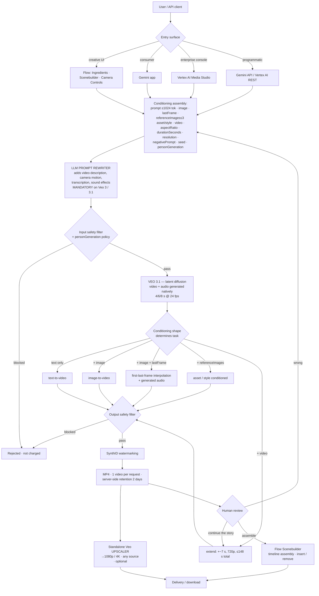

# Google Veo — Architecture Brief

**Analysis date: 2026-09-13.** Veo is Google DeepMind's video-generation line; its flagship as of this date is the **Veo 3.1 family** (`veo-3.1-generate`, `veo-3.1-fast-generate`, `veo-3.1-lite-generate`), built on the **Veo 3** base documented in the official *Veo 3 Technical Report* and *Veo 3 Model Card*. **No "Veo 4" exists** — Google's model-card index does not list one, and the successor line is branded differently (**Gemini Omni Flash**, model card updated 2026-08-27). Every non-trivial architectural claim is labeled **VERIFIED** (DeepMind model cards/research papers, Google Cloud and Gemini API documentation, official Google blogs), **STRONG INFERENCE** (implied by observable API surface, published technique, or official capability claims), or **HYPOTHESIS** (plausible, unconfirmed) — see `.claude/agents/video-platform-intelligence.md`'s research principle.

**Method caveat up front.** Google publishes materially more primary technical detail than Runway or Kling, but it is scattered across five surfaces (deepmind.google model cards, arXiv papers by DeepMind teams, `ai.google.dev` Gemini API docs, `docs.cloud.google.com` Vertex AI docs, and `blog.google`/Cloud Blog announcements) and two of them resisted direct reading this session:
- **`docs.cloud.google.com` returns only its navigation shell to direct fetches** (client-rendered docs site). Vertex-specific facts below therefore come from **indexed search excerpts of the official Google Cloud pages themselves**, not secondary reporting, and are labeled as such — the same method the Kling brief used for `help.runwayml.com`-class sources.
- **The *Veo 3 Technical Report* and *Veo 3 Model Card* are PDFs whose text could not be extracted** by the available tooling. Claims sourced to them below rest on (a) official-page search excerpts quoting them and (b) the DeepMind model-card pages that inherit from them. The single most-repeated architectural claim about Veo — that audio and video latents are denoised *jointly* — is **explicitly downgraded to STRONG INFERENCE** for this reason, despite appearing in many confident secondary write-ups.

---

## Executive Summary

1. **Veo is a single foundation model wrapped in a thick, well-documented API surface — not a model zoo and not a router.** There is one generation model per tier (`3.1` / `3.1 Fast` / `3.1 Lite`), differentiated by cost/latency/quality, and the user or developer picks the tier explicitly. Google does **not** operate a Runway-style automatic model router for video. **[VERIFIED — Gemini API + Vertex AI docs]**
2. **Multimodal conditioning is the most legible part of Veo's architecture, because it is fully enumerated in the API.** Veo 3.1 accepts, in one request: a text `prompt` (1,024-token limit, which also carries dialogue/SFX/ambience cues), an `image` (first frame), a `lastFrame` (final frame, interpolation), up to **3 `referenceImages`** each typed `asset` or `style`, and a `video` (a prior Veo generation, for extension). **There is no audio input and no camera parameter.** **[VERIFIED]**
3. **An LLM prompt rewriter is a mandatory, non-disableable stage in front of Veo 3 and Veo 3.1.** Google's own docs describe an "LLM-based prompt enhancement tool, also known as a prompt rewriter" that adds "video description, camera motions, transcription, and sound effects" to the user's prompt, and state that **it can be turned off for Veo 2 but not for Veo 3 and 3.1**. DeepMind's own research paper independently confirms the rewriter sits in the Vertex serving path. This is the closest structural analogue to Kling's Prompt Enhancer — **two of the three frontier platforms examined now put a mandatory LLM between the user and the generator.** **[VERIFIED — Google Cloud docs excerpts + arXiv 2509.20328]**
4. **Physics is Google's loudest marketing claim and its weakest verified one — but the gap is narrower than for competitors, because DeepMind published numbers.** The official claim is "real world physics" and a human-preference win on a "Visually realistic physics" axis. DeepMind's own paper (arXiv 2509.20328) reports *per-scenario* zero-shot success rates (rigid-body 1.00, mirror reflection 1.00, glass refraction 0.92, buoyancy 0.58–0.83, gravity/air-resistance 0.50). Independent work is harsher: a 2025 study measures generated-video gravity at **1.81 m/s²** versus Earth's 9.81, i.e. a systematic violation of Galileo's equivalence principle. **Veo has strong *qualitative* physical priors and quantitatively wrong *dynamics*.** **[Claims VERIFIED; capability partially VERIFIED with numbers; "simulates real-world physics" as generally true is HYPOTHESIS]**
5. **Cinematography is taught, not parameterized.** Google's official prompting guidance defines a five-slot prompt schema — `[Cinematography] + [Subject] + [Action] + [Context] + [Style & Ambiance]` — and publishes controlled vocabularies for camera movement, shot composition, and lens/depth-of-field. This is *exactly* the pattern the Runway brief identified, arrived at independently. **[VERIFIED — Google Cloud Blog + Vertex prompt guide]**
6. **Camera control splits by layer, and this refines the Runway brief's finding.** The **API has no camera parameter** — camera is prompt vocabulary only. But the **Flow product ships a "Camera Controls" UI** ("direct control over camera motion, angles and perspectives"). So the frontier pattern is not "no camera widget"; it is **"a camera widget in the product that compiles down to prompt text, with no camera field in the API."** **[VERIFIED]**
7. **`[00:00-00:02]`-style timestamp prompting is Google's officially documented multi-shot mechanism** — the user writes a shot list with timecodes inside a single 8-second prompt and Veo executes the cuts. It is the cheapest multi-shot control surface found on any platform examined so far and requires no API support at all. **[VERIFIED — Google Cloud Blog "Ultimate prompting guide for Veo 3.1"]**
8. **Native audio is genuinely native, but the *mechanism* is less confirmed than the internet believes.** DeepMind states audio — dialogue, SFX, ambience — is "generated natively" and synchronized, with no separate dubbing step. The widely-repeated specific that a *single diffusion process denoises a unified token sequence of video spacetime patches and temporal audio latents* traces to analyses citing the Veo 3 Tech Report, not to a Google page readable this session. **[Native+synchronized: VERIFIED. Joint unified-latent denoising: STRONG INFERENCE.]**
9. **Veo's long-form story is `8s base + 7s increments → ~148s ceiling`, and it is more constrained than it looks.** A single generation is **4, 6, or 8 seconds at 24fps**; 8s is *mandatory* for 1080p/4K, for reference images, and for extension. Extension accepts only a **Veo-generated** source, **720p only**, up to 141s in, 148s out. Source videos expire after **2 days**. **[VERIFIED — Gemini API docs]**
10. **Veo's `lastFrame` parameter is the productized, API-available version of the keyframe-anchored long-form pattern the Kling brief flagged as most transferable.** First-frame + last-frame interpolation with generated audio is a documented, GA-class Veo 3.1 capability. Narrata does not need to wait for a first-last-frame-capable API — it already has one. **[VERIFIED]**
11. **Temporal consistency has no disclosed architectural mechanism — a third platform with the same hole.** No temporal-consistency loss, optical-flow objective, anti-flicker module, or frame-to-frame regularizer is disclosed anywhere in Veo's model cards, papers, or docs. What *is* disclosed is adjacent: DeepMind's "chain-of-frames" framing (frame-by-frame generation as the reasoning substrate), a measured world-state-memory result, and a separate robotics paper stating Veo was **"optimized to support robot action conditioning and multi-view consistency."** **[VERIFIED by absence for the general model; the robotics optimization is VERIFIED]**
12. **Upscaling is a separate model, not part of generation** — a standalone Vertex AI capability that takes video "from any source" (Veo, another AI model, or a real camera) to 1080p/4K. This corroborates the cascaded-SR reading the Kling brief made, now across two platforms: **frontier "4K" is a distinct post-generation stage.** **[VERIFIED — Google Cloud Blog]**
13. **The Veo brand may be the *penultimate* generation.** Google's newest video model card is **Gemini Omni Flash** (2026-08-27): "our next step towards models that can create and edit anything from any input—starting with video," any-to-any input (text/image/audio/video), video-with-audio output, conversational multi-turn editing. The Gemini API docs now position Veo 3.1 as the choice "for specific capabilities like scene extension, last-frame control, or integration with **legacy pipelines**." **Google is converging on the same unified-model thesis as Kling's O1.** **[VERIFIED — model card + Gemini API docs]**

---

## Publicly Known Architecture — Product Layer

```
                    ┌───────────────────────────────────────────────────┐
                    │                     USERS                          │
                    │  filmmakers · creators · marketers · enterprises ·  │
                    │  Workspace users · API developers                   │
                    └────────────────────────┬──────────────────────────┘
                                             │
  ┌───────────┬────────────┬────────────┬────┴────────┬───────────┬──────────────┐
  │   FLOW    │  GEMINI    │  VERTEX AI │  GEMINI API │  GOOGLE   │  GOOGLE      │
  │ (Labs)    │    APP     │   MEDIA    │  + AI STUDIO│  VIDS     │  WORKSPACE   │
  │           │            │   STUDIO   │             │(Workspace)│              │
  │Ingredients│ consumer   │ console UI │ veo-3.1-*   │ Omni Flash│              │
  │Scenebuilder│ T2V / I2V │ + REST API │ generate    │ in-doc    │              │
  │CameraCtrls│            │ veo-3.1-   │ operations. │ video     │              │
  │AssetMgmt  │            │ generate-  │ get polling │           │              │
  │Flow TV    │            │ 001 (GA)   │             │           │              │
  │Insert/Rm  │            │ upscaler   │             │           │              │
  └───────────┴────────────┴────────────┴─────────────┴───────────┴──────────────┘
                                             │
                        ┌────────────────────┴────────────────────┐
                        │     CONDITIONING ASSEMBLY LAYER          │
                        │  prompt (≤1024 tok, incl. dialogue/SFX)  │
                        │  + image (first frame)                   │
                        │  + lastFrame                             │
                        │  + referenceImages[≤3] {asset|style}     │
                        │  + video (prior Veo output, for extend)  │
                        │  + aspectRatio · durationSeconds ·       │
                        │    resolution · negativePrompt · seed ·  │
                        │    personGeneration                      │
                        │                                          │
                        │  ►► LLM PROMPT REWRITER  (MANDATORY on   │
                        │     Veo 3 / 3.1 — cannot be disabled)    │
                        └────────────────────┬────────────────────┘
                                             │
        ┌────────────────────────────────────┴──────────────────────────────┐
        │                          MODEL LAYER                               │
        │  VIDEO+AUDIO:  Veo 3.1 · Veo 3.1 Fast · Veo 3.1 Lite               │
        │                (legacy: Veo 3 / Veo 3 Fast stable, Veo 2)          │
        │  SUCCESSOR:    Gemini Omni Flash  (any-to-any → video+audio,       │
        │                conversational editing)                             │
        │  AUX:          standalone Veo UPSCALER (→1080p/4K, any source)     │
        │                Imagen / Nano Banana (stills inside Flow)           │
        │                Gemini (prompt rewriting, captioning, NL editing)   │
        │  SAFETY:       SynthID watermarking on all outputs                 │
        └────────────────────────────────────────────────────────────────────┘
```
**[VERIFIED]** for every named surface, model ID, parameter and limit; the grouping into "layers" is analytical framing, not a Google-published diagram.

---

## Model Stack

| Model | Role | Publicly disclosed internals |
|---|---|---|
| **Veo 3.1** (`veo-3.1-generate-preview` / Vertex `veo-3.1-generate-001`) | Flagship T2V / I2V / first-last-frame / reference-conditioned / extend; native audio; 4/6/8s @ 24fps; 720p/1080p/4K; 16:9 or 9:16 | **Latent diffusion** (Veo 3 Model Card). Trained on **TPUs using JAX and ML Pathways**; training video/audio annotated with text captions at multiple levels of detail **by multiple Gemini models** **[VERIFIED via official model-card excerpts]**. Depth/width/parameter count **not disclosed** |
| **Veo 3.1 Fast** | Lower-latency tier, same feature set incl. reference images + extend | Not disclosed. Almost certainly a distilled/step-reduced Veo 3.1 **[STRONG INFERENCE]** — no Google statement found |
| **Veo 3.1 Lite** | Cheapest tier; **no extend, no reference images, no 4K** | Model card states it is **built on Veo 3** and defers architecture, training data and limitations to the Veo 3 card. Only disclosed numbers are head-to-head win-rates vs Veo 3.1 Fast: **T2V 54.6%** (1,000 prompts), **I2V 47.2%** (646 prompts) **[VERIFIED]** |
| **Veo 3 / Veo 3 Fast** | Prior generation, now the **stable** tier while 3.1 is *preview* on the Gemini API | Veo 3 Model Card (updated 2026-01-13) + **Veo 3 Technical Report** — the only real architecture documents Google has published for this line. Latent diffusion; SynthID; Gemini-generated captions **[VERIFIED that the documents exist and state latent diffusion; full text unreadable this session]** |
| **Veo upscaler** | **Standalone** post-generation SR: any-source video → 1080p / 4K | Announced as a separate Vertex AI capability (private preview → public preview, ~2026-04). No model ID published. Architecture **not disclosed** **[VERIFIED that it is separate from generation]** |
| **Gemini Omni Flash** | Successor line: any-to-any (text/image/audio/video in) → video+audio out; multi-turn conversational editing | Model card: **transformer-based, natively multimodal**, citing Vaswani et al. 2017. Trained on audio/video/image/text with multi-detail captions, filtered for compliance/safety/quality, then **semantically deduplicated**. Stated limitations: "Maintaining complete consistency throughout edits, generating scenes with complex motion, or rendering perfectly accurate text remains a challenge"; speech editing withheld pending safety research **[VERIFIED]** |
| **Gemini (as a component)** | Prompt rewriting at inference; captioning at training; natural-language editing inside Flow | **[VERIFIED]** that Gemini models perform all three roles; which Gemini variant serves as the rewriter is **not disclosed** |

### Multimodal Conditioning — what Veo accepts and how it is combined

This is the best-specified layer of Veo, because Google enumerates it as an API contract rather than describing it in prose.

```
  INPUT                 TYPE            LIMIT / CONSTRAINT              MODELS
  ─────────────────────────────────────────────────────────────────────────────
  prompt                text            ≤1,024 tokens. Carries          all
                                        dialogue (in quotes), SFX:,
                                        Ambient noise:, camera terms,
                                        lighting, style, AND optional
                                        [00:00-00:02] shot timecodes
  negativePrompt        text            describe what to EXCLUDE        all
                                        as positive description
  image                 image           FIRST FRAME (I2V). Also the     all
                                        first frame in interpolation
  lastFrame             image           FINAL FRAME. Requires `image`.  3.1, Fast, Lite
                                        Model generates the transition
                                        between them "complete with
                                        accompanying audio"
  referenceImages[]     image + type    ≤3. referenceType = "asset"     3.1, Fast only
                                        (up to 3 images of ONE person/
                                        character/product — appearance
                                        preserved) OR "style" (ONE
                                        image — aesthetic transferred)
  video                 prior Veo clip  extension source. Veo-generated 3.1, Fast only
                                        ONLY. ≤141s. 720p only.
                                        Expires after 2 days (resets
                                        on reference)
  ── NOT ACCEPTED ────────────────────────────────────────────────────────────
  audio input           ✗   no audio-conditioning path in the Veo API
  camera parameters     ✗   no structured camera field of any kind
  masks / regions       ✗   no spatial region specification
  multiple videos       ✗   "multi-video reasoning unsupported"; 1 output per request
```
**[VERIFIED — ai.google.dev Gemini API Veo docs + Vertex AI reference-image docs]**

Three structural observations.

**First, conditioning is *typed*, and that is unusual.** `referenceType: "asset" | "style"` is an explicit declaration of *what the reference means*, not just *that a reference exists*. Runway's Gen-4 References are deliberately entity-agnostic; Kling's Elements are typed by category (Character/Prop/Scene/Costume) but the type is a library taxonomy rather than a conditioning mode. **Veo is the only one of the three that makes the model's *use* of a reference an explicit request-level parameter.** **[VERIFIED for the parameter; the three-way comparison is our analysis]**

**Second, the asset budget is small and the style budget is smaller.** Three asset images of a *single* subject, or one style image. Compare Kling (7 reference characters on Video 3.0 Omni, 10 images on Image 3.0 Omni) and Runway-brokered Seedance 2.5 (30 images + 10 videos + 10 audio clips). **Veo has by far the tightest reference budget of the three platforms.** That is a real constraint for multi-character narrative work. **[VERIFIED]**

**Third, there is no audio input.** Veo generates audio but cannot be conditioned on it. There is no lip-sync-to-supplied-speech path, no music-driven generation, no voice cloning. Kling's Avatar 2.0 (portrait + speech → 5 min) and Runway's Act-Two have no Veo equivalent. **[VERIFIED by absence across the Veo API surface]**

### Scene Understanding — what is disclosed and what is inferable

Google discloses **four** mechanisms that bear on how Veo interprets a scene description. None is a "scene decomposition module"; the mechanism is distributed.

```
 1 — LLM PROMPT REWRITER                                    ★ strongest evidence
     Official: "an LLM-based prompt enhancement tool, also known as a prompt
     rewriter, which offers the option to rewrite your prompts to add video
     description, camera motions, transcription, and sound effects."
     · ENABLED BY DEFAULT and NOT DISABLEABLE on Veo 3 and Veo 3.1
       (it can be disabled only on veo-2.0-generate-001)
     · the rewritten prompt is returned in the API response ONLY IF the
       original prompt was fewer than 30 words
     · DeepMind's own research paper confirms the rewriter is in the serving
       path: "an LLM-based prompt rewriter"
     ⇒ scene understanding happens partly in an LLM BEFORE the video model
     [VERIFIED — Google Cloud docs excerpts + arXiv 2509.20328]

 2 — GEMINI-GENERATED TRAINING CAPTIONS
     Veo 3's training video/audio was "annotated with text captions at
     different levels of detail, leveraging multiple Gemini models."
     ⇒ the model's notion of "what a scene is" is inherited from a VLM's
       multi-granularity descriptions, not from human shot annotation
     [VERIFIED — Veo 3 Model Card excerpts]

 3 — TIMESTAMP PROMPTING (spatial/temporal decomposition pushed to the user)
     Google's official prompting guide documents directing multi-shot
     sequences inside ONE 8-second generation via explicit timecodes:
       [00:00-00:02] Medium shot from behind explorer pushing aside vine
       [00:02-00:04] Reverse shot of explorer's face, awe expression
       [00:04-00:06] Tracking shot following explorer over stone carvings
       [00:06-00:08] Wide, high-angle crane shot revealing temple complex
     ⇒ shot decomposition is a PROMPT CONVENTION, not an API structure
     [VERIFIED — Google Cloud Blog, Veo 3.1 prompting guide]

 4 — IMPLICIT 3D / LIGHTING UNDERSTANDING (behavioral evidence)
     · Flow's Insert: add an element with automatic handling of "shadows and
       scene lighting"; Remove: reconstruct the background behind a deleted
       object
     · DeepMind's zero-shot paper: Veo 3 performs segmentation, edge
       detection, affordance recognition and tool-use simulation with NO
       task-specific training, and retains world state — "coherence when the
       camera zooms to close-up and returns to original view" (success 1.0)
     · the Gemini Robotics world-simulator paper reports Veo optimized for
       "multi-view consistency" with "multi-view completion"
     ⇒ Veo behaves as though it carries an implicit scene representation;
       Google never claims an explicit 3D or scene-graph component
     [Behaviors VERIFIED; "there is an internal 3D/scene-graph
      representation" is HYPOTHESIS]
```

**The honest summary: Veo has no disclosed scene-decomposition architecture.** What it has is an LLM in front (rewriter), a VLM behind (captions), and a documented prompt convention for the user to do decomposition themselves. That is a *cheaper* answer than Kling's MVL composite input and Runway's agent planner, and it is the answer most directly copyable by an API-first platform.

### Physics — claims vs. demonstrations vs. independent evaluation

This deserves separating carefully, because Google's marketing and Google's research say different-sized things.

```
  ┌─ TIER 1 — MARKETING CLAIM (deepmind.google, blog.google) ──────────────┐
  │ "greater realism and fidelity, made possible by Veo 3's real world     │
  │  physics and audio"                                                    │
  │ "Visually realistic physics" listed as a human-preference dimension on │
  │  which "Participants choose Veo 3.1's outputs over other models"       │
  │ Flow blog: Veo "excel[s] at physics and realism"                       │
  │ ⇒ this is a PREFERENCE claim ("looks more physical to people"),        │
  │   NOT a simulation-accuracy claim. Google never claims a physics       │
  │   engine, a solver, or physically-grounded dynamics.                   │
  │ [VERIFIED as an accurate quotation of what Google claims]              │
  └────────────────────────────────────────────────────────────────────────┘
                                    │
  ┌─ TIER 2 — DEEPMIND'S OWN MEASURED RESULTS (arXiv 2509.20328) ──────────┐
  │ "Video models are zero-shot learners and reasoners", Wiedemer et al.,  │
  │ evaluating Veo 3 through the Vertex AI API. Per-scenario success:      │
  │     rigid-body dynamics ........... 1.00                               │
  │     mirror reflection ............. 1.00                               │
  │     glass refraction (inverted) ... 0.92                               │
  │     colour mixing, additive ....... 0.92                               │
  │     buoyancy, rock ................ 0.83                               │
  │     colour mixing, subtractive .... 0.75                               │
  │     soft-body dynamics ............ 0.67                               │
  │     buoyancy, bottle cap .......... 0.58                               │
  │     gravity / air resistance ...... 0.50  (Earth AND Moon scenarios)   │
  │ Emerged "without any task-specific training."                          │
  │ Veo 3 >> Veo 2 on adjacent reasoning: object extraction 50%→93%,       │
  │ 5x5 maze solving 14%→78% (pass@10).                                    │
  │ Caveats DeepMind states itself: "jack of many trades, master of few";  │
  │ Veo 3 has "a prior to keep things moving"; prompt phrasing moves       │
  │ results by 40-64 percentage points.                                    │
  │ [VERIFIED]                                                             │
  └────────────────────────────────────────────────────────────────────────┘
                                    │
  ┌─ TIER 3 — INDEPENDENT EVALUATION ──────────────────────────────────────┐
  │ Physics-IQ (INSAIT + Google DeepMind, WACV 2026): across Sora, Runway, │
  │ Pika, Lumiere, SVD, VideoPoet, "physical understanding is severely     │
  │ limited, and unrelated to visual realism"; best model 29.5/100.        │
  │ ⚠ Veo was NOT in the original Physics-IQ model set — do not cite that  │
  │   29.5 figure against Veo.                                             │
  │                                                                        │
  │ arXiv 2512.02016 ("Objects in Generated Videos Are Slower Than They    │
  │ Appear"): generated-video effective gravity measured at 1.81 m/s²      │
  │ vs Earth's 9.81; explicit "violations of Galileo's equivalence         │
  │ principle." A lightweight adaptor trained on 100 clips raised it to    │
  │ 6.43 m/s² (65% of terrestrial) and generalized zero-shot.              │
  │ [VERIFIED as reported; whether the measured model is Veo specifically  │
  │  could not be confirmed from the abstract — treat as an industry-wide  │
  │  finding, not a Veo-specific one]                                      │
  └────────────────────────────────────────────────────────────────────────┘
```

**The resolution.** Veo's physics is best described as **strong qualitative priors, weak quantitative dynamics**. It reliably knows *that* a rock sinks and a mirror reflects; it does not reliably get *how fast things fall*. DeepMind's own framing supports this: they present the results as evidence of **emergent general vision capability**, not as evidence of simulation fidelity. Anyone reading "real-world physics simulation" as "you can trust the dynamics" is over-reading Google. **[STRONG INFERENCE, well supported by Tiers 2 and 3]**

One genuinely notable data point: **Google itself is productizing Veo as a world simulator.** The Gemini Robotics team uses a Veo-derived model to evaluate robot policies — "optimized to support robot action conditioning and multi-view consistency," validated against "1600+ real-world evaluations." That is Google's equivalent of Runway's GWM branch: **the same base model, post-trained into an action-conditioned world model, living outside the narrative-video product.** **[VERIFIED — arXiv 2512.10675]**

### Cinematography and Camera Instructions

Veo's answer to both is the same answer: **a published controlled vocabulary plus a prompt schema — with a UI widget layered on top in the product, and nothing in the API.**

Google's official five-slot prompt schema:

```
    [Cinematography] + [Subject] + [Action] + [Context] + [Style & Ambiance]
```

And the officially documented vocabularies:

```
  CAMERA MOVEMENT          SHOT COMPOSITION          LENS / DEPTH OF FIELD
  ───────────────          ────────────────          ─────────────────────
  dolly shot               wide shot                 shallow depth of field
  tracking shot            medium shot               wide-angle lens
  crane shot               close-up                  soft focus
  aerial view              extreme close-up          macro lens
  slow pan                 low angle                 deep focus
  POV shot                 high-angle crane shot
  handheld shot            two-shot
  180-degree arc shot      reverse shot
                           over-the-shoulder
                           eye-level / top-down
```
**[VERIFIED — Google Cloud Blog "Ultimate prompting guide for Veo 3.1" + Vertex AI video-generation prompt guide excerpts]**

Now the layer split, which is the finding that **refines the Runway brief**:

```
  RUNWAY (per runway.md)                 VEO (this brief)
  ──────────────────────                 ────────────────
  Gen-3 era: parametric Camera           Veo API: NO camera parameter, ever.
    Control widget (pan/tilt/zoom          Camera is prompt vocabulary only.
    + intensity)  → RETIRED 2026-07-30
                                         Flow product: "Camera Controls —
  Gen-4/4.5 era: no camera UI,             Master your shot with direct
    no camera API param, camera as         control over camera motion,
    published prompt vocabulary            angles and perspectives."
                                           (zoom, pan, directional movement)

  ⇒ Runway COLLAPSED the widget          ⇒ Google KEPT a widget in the
    into the prompt at BOTH layers         product and never had one in the
                                           API. The widget compiles to text.
```

**Refined cross-platform reading:** the Runway brief concluded "the frontier's current answer to camera control in narrative video is a *controlled prompt vocabulary*, not a control widget." Veo shows the more precise version: **the model interface is prompt vocabulary; the product interface can still be a widget, because a widget over a fixed vocabulary is just a prompt builder.** Those are compatible, and the combination is strictly better UX than either alone. **[VERIFIED for both platforms' current state; the synthesis is our analysis]**

Veo's cinematography claim beyond vocabulary is thin and honest: Google says Veo 3.1 offers "greater narrative control with an **improved understanding of cinematic styles**." No mechanism is given. There is no film-stock model, no LUT layer, no lens simulation module — style is conditioned through text and (optionally) one `style`-typed reference image. **[VERIFIED; mechanism NOT disclosed]**

### Audio / Video Generation

```
  WHAT IS OFFICIALLY STATED                       [VERIFIED]
  ─────────────────────────                       
  · "Veo 3 lets you add sound effects, ambient noise, and even dialogue
     to your creations – generating all audio NATIVELY"  (DeepMind)
  · Veo 3.1: "richer native audio, from natural conversations to
     SYNCHRONIZED sound effects"                        (Developers Blog)
  · audio accompanies first-last-frame interpolation: the transition is
     generated "complete with accompanying audio"        (Developers Blog)
  · audio is specified ENTIRELY IN THE TEXT PROMPT, with three conventions:
        dialogue  →  in quotation marks:  A woman says, "We have to leave now."
        SFX       →  SFX: thunder cracks in the distance
        ambience  →  Ambient noise: the quiet hum of a starship bridge
  · all three Veo 3.1 tiers (incl. Lite) have native audio
  · safety filters can block a generation on audio grounds; blocked
     generations are not charged

  WHAT IS NOT OFFICIALLY READABLE                 [STRONG INFERENCE]
  ───────────────────────────────
  · that a SINGLE diffusion process denoises a unified token sequence
    containing both spatio-temporal VIDEO latents and temporal AUDIO
    latents, so that sync is a property of shared attention rather than
    of post-hoc alignment.
    This is stated consistently by multiple technical analyses that cite
    the Veo 3 Technical Report, including one published on Google Cloud's
    own Medium community channel — but it could not be read out of a
    Google-hosted page this session. It is the most likely true reading
    and it is NOT treated as VERIFIED here.

  WHAT IS ABSENT                                  [VERIFIED by absence]
  ──────────────
  · no audio INPUT parameter
  · no separate audio model, voice library, or TTS surface in the Veo API
  · no lip-sync-to-supplied-audio mode
  · no music-generation parameter (Lyria is a separate Google model,
    separately priced, not part of Veo)
  · no per-track audio output — you get one muxed MP4
```

**The architectural tell for Narrata:** Veo's audio is *inseparable* from its video. There is no stem, no track, no separate voice asset. For a platform like Narrata that resolves character voices server-side for story-wide consistency, **Veo's native audio is a competitor to that design, not a component of it** — you cannot ask Veo to use a specific voice, and you cannot extract its dialogue track to replace. **[VERIFIED by absence; the implication is our analysis]**

### Long-Context Generation — and an apples-to-apples comparison

```
   ONE GENERATION                          EXTENSION CHAIN
   ──────────────                          ───────────────
   durationSeconds ∈ {4, 6, 8}             input: a PRIOR VEO video only
   24 fps, MP4, 1 video per request        input ≤ 141 s, 720p ONLY
                                           each call adds ~7 s
   8 s is MANDATORY when:                  output ceiling: 148 s (~2:28)
     · resolution = 1080p or 4k            audio continues across extension
     · referenceImages are used            source expires in 2 days
     · the clip will be extended             (timer RESETS when referenced)
```
**[VERIFIED — ai.google.dev Gemini API Veo docs. The "~7 s per call" figure is arithmetic from Google's own 141 s-in / 148 s-out limits and is corroborated by Vertex "Extend videos" documentation excerpts; Vertex separately describes extending source videos "between 1 and 30 seconds in length," which appears to be a Vertex-surface constraint rather than a contradiction — flagged as unresolved.]**

Now the comparison the other two briefs make possible:

| | **Runway Gen-4.5** | **Kling Video 3.0** | **Veo 3.1** |
|---|---|---|---|
| Single generation | **~1 min**, multi-shot in-context | 3–15 s, ≤6 cuts in-context | **4 / 6 / 8 s**, multi-shot via timecode prompting |
| Multi-shot mechanism | in-model, one long context | in-model, per-shot prompts+durations | **prompt convention** (`[00:00-00:02]`) inside 8 s |
| Extend | delegated to 3rd party (Seedance 2.5) | native workflow, +4–5 s per call | native API, **+~7 s per call** |
| Extend ceiling | Seedance's 30 s per generation | **≤3 min** cumulative | **≤148 s** cumulative |
| Extend output | **the delta only** — you assemble | continued clip | continued clip (full video) |
| Extend resolution | n/a | not stated | **720p only** |
| Extend source | any video (3P model) | Kling-generated only | **Veo-generated only** |
| Longest single product operation | ~1 min | **5 min** (Avatar 2.0, portrait+speech) | 8 s |
| First+last frame anchoring | keyframe-conditioned *edits* (Aleph 2.0) | in avatar cascade (internal) | **`lastFrame` — exposed in the API** |

Three readings fall out of this table.

**(a) Runway has by far the longest single generation; Veo has by far the shortest.** An 8-second ceiling is a *significant* architectural constraint and it is easy to miss under Google's "a minute or more" marketing — that minute is always a chain, never a generation.

**(b) Veo's extend is the most restrictive of the three** (Veo-only source, 720p-only, 2-day expiry) but the **only one exposed as a plain API parameter on the flagship model**. Runway delegates it; Kling has it but as a workflow.

**(c) Veo is the only platform of the three that exposes first-frame + last-frame interpolation as a first-class generation mode on its flagship, with audio.** The Kling brief identified keyframe-anchored, first-last-frame-conditioned sub-clip generation as "the single most directly transferable architecture" for Narrata's long-form problem, and noted Narrata would need "any first-last-frame-capable generation API." **Veo 3.1 is that API, today, via `image` + `lastFrame`.** This is the single most actionable finding in this brief. **[VERIFIED]**

---

## Generation Pipeline



**Evidence note:** every *node* is VERIFIED as a documented Veo capability or documented pipeline stage. The *placement* of the prompt rewriter before the safety filter, and of SynthID after generation, is **STRONG INFERENCE** — Google states both exist but not their ordering. As with Runway and Kling, **no evidence was found of an automated quality or continuity critic anywhere in Veo's pipeline.** The only automated gates disclosed are **safety** filters (input and output) and **SynthID** watermarking, neither of which evaluates whether the video is *good* or *consistent*. The refinement loop is human-in-the-loop. **[STRONG INFERENCE — absence of evidence across model cards, Gemini API docs, Vertex docs and Google blogs]**

### API Request Lifecycle

```
  CLIENT                  GEMINI API / VERTEX AI                BACKEND
    │                              │                              │
    ├── POST generate ────────────►│                              │
    │   model: veo-3.1-generate-*  │                              │
    │   prompt                     ├─ validate + quota ──────────►│
    │   image · lastFrame          │                              │
    │   referenceImages[≤3]        ├─ LLM PROMPT REWRITE ────────►│
    │     {image, referenceType}   │  (cannot be disabled on 3/3.1;
    │   video (extend source)      │   rewritten prompt returned  │
    │   aspectRatio 16:9|9:16      │   ONLY if original <30 words)│
    │   durationSeconds 4|6|8      │                              │
    │   resolution 720p|1080p|4k   ├─ input safety filter ───────►│
    │   negativePrompt · seed      │                         ┌────▼────┐
    │   personGeneration           │                         │  QUEUE  │
    │   storageUri (Vertex)        │                         └────┬────┘
    │                              │                         ┌────▼────┐
    │◄── { operation, done:false } │                         │  TPU    │
    │                              │                         │  pool   │
    ├── operations.get ───────────►│   poll every ~10 s      │ (JAX /  │
    │◄── done:false                │   latency 11 s – 6 min  │Pathways)│
    ├── operations.get ───────────►│   (6 min at peak)       └─────────┘
    │◄── done:true                 │
    │    response.generated_videos[0]                        output retained
    │                              │                         SERVER-SIDE 2 DAYS
    └── download within 2 days ───►│                         (resets if reused
                                   │                          as extend source)
```
**[VERIFIED — ai.google.dev Gemini API Veo docs for the lifecycle, polling interval, latency envelope, parameters, and retention window. "TPU pool" is VERIFIED at the training level (the Veo 3 Model Card states TPU + JAX + ML Pathways) and STRONG INFERENCE at the serving level. Queue internals are STRONG INFERENCE.]**

Two details worth noting against the other briefs. **Veo returns a long-running `operation` rather than a task ID with a status enum** — functionally identical to Runway's create-and-poll and Kling's submitted→processing→succeed, but Google exposes no callback/webhook on the Gemini API surface, where Kling does (`callback_url`). And **Veo has a hard 2-day server-side retention**, which is materially shorter than an asset-library model — any platform building on Veo must treat download-and-persist as a mandatory pipeline step, not an option. **[VERIFIED]**

---

## Orchestration — tiers, not routing

Veo has **no model router**, in either the Runway sense (automatic, optimize-for-cost/latency/quality) or any other sense. Selection is explicit and user-facing, exactly as with Kling.

```
                        USER / DEVELOPER CHOOSES, EXPLICITLY
                                      │
      ┌───────────────┬───────────────┼───────────────┬───────────────┐
      ▼               ▼               ▼               ▼               ▼
   model tier     resolution      duration       conditioning     surface
   3.1 / Fast /   720p / 1080p    4 / 6 / 8 s    shape            Flow / Gemini
   Lite           / 4k                           (image? refs?    app / Vertex /
                                                  lastFrame?       Gemini API
   $0.40/s        $0.40 → $0.60    8 s forced     video?)
   $0.10/s        per second       for 1080p/4K
   $0.05/s        at 4K            refs, extend
      │               │               │               │               │
      └───────────────┴───────────────┴───────────────┴───────────────┘
                                      │
                                      ▼
                     ONE MODEL PER TIER — task disambiguated
                     by WHICH CONDITIONING FIELDS ARE PRESENT
                                      │
        ┌────────────┬────────────────┼────────────────┬────────────┐
        ▼            ▼                ▼                ▼            ▼
       T2V          I2V         first-last-frame   asset/style    extend
                                 interpolation       refs
```

**This is the same "task identity is inferred from input composition" design Kling uses**, arrived at independently and stated less grandly — Google never gives it a name like MVL. **[VERIFIED from the API surface; the comparison is our analysis]**

The genuine orchestration in Google's stack lives **above** Veo, not inside it:
- **Gemini rewrites the prompt** on every Veo 3/3.1 call (mandatory).
- **Flow orchestrates multi-clip production** — Ingredients → clip → Scenebuilder timeline → extend → insert/remove.
- **Google ships a "video editor agent skill" on GitHub** alongside the Veo 3.1 Lite/upscaler announcement, i.e. Veo is being packaged for agent consumption the way Runway packages MCP. **[VERIFIED — Google Cloud Blog]**
- **Gemini Omni Flash collapses the orchestration into the model** via multi-turn conversational editing, which is where Google is heading. **[VERIFIED — model card]**

---

## Continuity System

Veo attacks continuity at five layers. Layers 1–3 are identity/style; Layer 4 is structural; Layer 5 — temporal stability — is, as with Kling, **the least disclosed and the most important.**

```
 LAYER 1 — TYPED REFERENCE CONDITIONING ("Ingredients to Video")  ★ strongest
   referenceImages[≤3], each declared referenceType:
     "asset" — up to 3 images of ONE person / character / product;
               "Veo preserv[es] the subject's appearance in the output video"
     "style" — exactly ONE image; aesthetic transferred
   Official claims: "Keep your characters looking the same even as the
   setting changes, making it easier to tell a full narrative by having the
   same character appear across multiple scenes"; "Control the scene by
   maintaining the integrity of your setting and the objects within it. You
   can also reuse an object, backgrounds or textures across scenes";
   "Identity consistency is better than ever."
   ⇒ NOTE: this covers LOCATIONS and PROPS explicitly, not just characters —
     Veo's reference mechanism is entity-agnostic like Runway's, but with a
     typed asset/style switch Runway lacks.
   Mechanism NOT disclosed. Requires durationSeconds=8. 3.1 / Fast only.
   [VERIFIED — Vertex reference-image docs + blog.google Ingredients post]

 LAYER 2 — KEYFRAME ANCHORING (image + lastFrame)                ★ transferable
   Supply both endpoints; Veo "generate[s] the transition between them,
   complete with accompanying audio." Available on 3.1, Fast AND Lite.
   ⇒ drift cannot compound past a segment whose BOTH ends are pinned.
     This is the API-exposed form of the anti-drift pattern the Kling brief
     found buried inside KlingAvatar 2.0's internal cascade.
   [VERIFIED]

 LAYER 3 — PERSISTENT PROJECT ASSETS (Flow only, not the API)
   Flow "Ingredients": create ingredients, use them to make a clip,
   "reference ingredients in plain language" across scenes; plus Asset
   Management to "easily manage and organize all of your ingredients and
   prompts."
   ⇒ this is a PRODUCT-LAYER library. There is NO persistent character /
     location ENTITY in the Veo API — no Character object, no Location
     object, no @-mention binding syntax. Compare Kling's Element Library
     (durable, typed, voice-bound, @-invoked) — Veo's is much thinner.
   [VERIFIED — blog.google Flow post; API absence VERIFIED by absence]

 LAYER 4 — SEQUENTIAL CONTINUATION (extend) + ASSEMBLY (Scenebuilder)
   extend: continue a prior Veo clip, +~7 s, audio carries through.
   Scenebuilder: "Seamlessly edit and extend your existing shots — revealing
   more of the action or transitioning to what happens next with continuous
   motion and consistent characters."
   ⇒ forward-chaining, with the accumulating-drift risk that implies, and
     no stated mechanism for preventing it.
   [VERIFIED for the capability; drift handling NOT disclosed]

 LAYER 5 — TEMPORAL / MOTION CONSISTENCY within a clip        ★ weakest layer
   NO disclosed architectural mechanism. Searched: Veo 3 / 3.1 Lite /
   Gemini Omni Flash model cards, arXiv 2509.20328, arXiv 2512.10675,
   Gemini API Veo docs, Vertex video docs, DeepMind and Google blogs.
   Found NO temporal-consistency loss, NO optical-flow or warping objective,
   NO frame-to-frame regularizer, NO anti-flicker module, NO named
   architectural temporal component.
   What IS disclosed, all adjacent rather than mechanistic:
     · CHAIN-OF-FRAMES (arXiv 2509.20328): "frame-by-frame video generation
       parallels chain-of-thought in language models" — a framing of the
       temporal axis as a REASONING substrate, not a stability mechanism
     · MEASURED world-state memory: coherence preserved "when the camera
       zooms to close-up and returns to original view" — success rate 1.0
     · MULTI-VIEW CONSISTENCY as an explicit POST-TRAINING objective — but
       only in the robotics world-simulator variant (arXiv 2512.10675),
       which is "optimized to support robot action conditioning and
       multi-view consistency," not in the shipping narrative model
     · Gemini Omni Flash's own stated limitation: "generating scenes with
       complex motion... remains a challenge"
   ⇒ temporal stability is, as far as Google discloses, an EMERGENT property
     of scale and training data — exactly the conclusion the Kling brief
     reached for Kling 3.0.
   [VERIFIED by absence across the corpus listed above]
```

**Three platforms, three identical holes.** Runway does not disclose how Gen-4.5 holds identity. Kling discloses only data-filtering, DPO objectives and an eval benchmark. Google discloses a chain-of-frames *framing* and a robotics-branch *objective*. **No frontier platform publishes an inference-time temporal-stability mechanism for narrative video.** After three briefs this is no longer an evidence gap in our research — it is a genuine, consistent property of the field. **[STRONG INFERENCE, now corroborated across three platforms]**

**The one thing Veo adds that the other two do not:** a *public, API-level* way to bound drift, via `lastFrame`. Runway's keyframe conditioning is an *edit* primitive (Aleph 2.0); Kling's is *internal* to the avatar cascade. Veo's is a generation parameter anyone can call. **[VERIFIED]**

---

## Probable Hidden Architecture

The disclosure pattern is the mirror image of Kling's. **Kling published its systems engineering and withheld its model topology. Google published its interface, its evaluation, and its emergent capabilities — and withheld both the topology and the systems engineering.**

```
  DISCLOSED (VERIFIED)                        WITHHELD (NOT DISCLOSED)
  ─────────────────────────────────────       ──────────────────────────────────
  Latent diffusion                            Backbone type (DiT? U-Net? hybrid?)
  Video + audio generated natively            Parameter count, depth, width
    and synchronized                          Whether audio/video latents are
  Trained on TPUs, JAX, ML Pathways             denoised JOINTLY (widely claimed,
  Captions from multiple Gemini models          not readable from a Google page)
  LLM prompt rewriter, non-disableable        Text encoder identity
  24 fps, 4/6/8 s, 720p/1080p/4K              VAE / tokenizer / compression ratio
  ≤3 typed reference images                   Positional encoding scheme
  first-frame + last-frame interpolation      Reference INJECTION mechanism
  extend to 148 s at 720p                     Prompt-rewriter model identity
  Standalone upscaler, any source             Distillation (Fast/Lite mechanism)
  SynthID on every output                     Step counts / NFE / sampler
  Safety filters in and out                   Serving stack, batching, caching
  Per-second pricing by tier & resolution     Cluster size, TPU generation
  Head-to-head win-rates (Lite vs Fast)       Training data scale / compute
  Zero-shot capability benchmarks             Any runtime quality/continuity gate
  Robotics variant: action conditioning       Temporal-stability mechanism
    + multi-view consistency
```

The most reasonable reading of the inference stack, with confidence levels marked:

```
      user prompt + typed conditioning
              │
              ▼
     ┌──────────────────────────────────────────────────────────┐
     │  LLM PROMPT REWRITER (a Gemini model)          [VERIFIED] │
     │   injects: scene description, camera motion,              │
     │   transcription, sound effects                            │
     │   ALWAYS ON for Veo 3 / 3.1                               │
     └────────────────────────┬─────────────────────────────────┘
                              ▼
     ┌──────────────────────────────────────────────────────────┐
     │  VEO 3.1 — LATENT DIFFUSION                    [VERIFIED] │
     │                                                           │
     │  spatio-temporal VIDEO latents                            │
     │            ⊕                                   [STRONG    │
     │  temporal AUDIO latents                         INFERENCE]│
     │    denoised in a SHARED attention context,                │
     │    which is why sync is native rather than aligned        │
     │                                                           │
     │  conditioned on: rewritten text                [VERIFIED] │
     │                  first frame / last frame      [VERIFIED] │
     │                  ≤3 typed reference images     [VERIFIED] │
     │                  prior-clip context (extend)   [VERIFIED] │
     │                  ── injection mechanism for all of the    │
     │                     above: NOT DISCLOSED                  │
     │                                                           │
     │  Fast / Lite tiers = distilled or step-reduced  [STRONG   │
     │                       variants                   INFER.]  │
     └────────────────────────┬─────────────────────────────────┘
                              ▼
     ┌──────────────────────────────────────────────────────────┐
     │  SAFETY FILTER + SYNTHID WATERMARK             [VERIFIED] │
     └────────────────────────┬─────────────────────────────────┘
                              ▼
     ┌──────────────────────────────────────────────────────────┐
     │  STANDALONE UPSCALER (separate call, any source)         │
     │  → 1080p / 4K                                  [VERIFIED] │
     │  ⇒ high-resolution output is a DISTINCT STAGE, not a      │
     │    native property of generation           [STRONG INFER.]│
     └──────────────────────────────────────────────────────────┘
```

**Two cross-platform corroborations fall out of this.** First, the separate upscaler makes **two of three platforms** (Kling's cascaded multimodal SR, Veo's standalone upscaler) where frontier "4K" is demonstrably a post-generation stage — the Kling brief's skepticism about "native 4K" claims generalizes. Second, the mandatory LLM rewriter makes **two of three platforms** (Kling's Prompt Enhancer, Veo's prompt rewriter) that put a trained/instructed LLM between the user's words and the generator, *by default and without asking*. That is now a pattern, not a quirk. **[STRONG INFERENCE, corroborated]**

---

## Infrastructure

| Signal | Evidence |
|---|---|
| **Veo 3 trained on Google TPUs, using JAX and ML Pathways** | **[VERIFIED — Veo 3 Model Card, via official-page search excerpts]** |
| Training data: audio + video + image, captioned at multiple levels of detail by **multiple Gemini models**, filtered for safety/PII | **[VERIFIED — Veo 3 Model Card]**; Gemini Omni Flash adds compliance/safety/quality filtering plus **semantic deduplication** **[VERIFIED — Omni Flash model card]** |
| Async long-running-operation API: submit → `operations.get` poll every ~10 s | **[VERIFIED — Gemini API docs]** |
| **Latency envelope 11 s – 6 min**, "6 minutes (peak hours)" | **[VERIFIED]** — Google publishes a peak-hours degradation figure, which implies shared, contended capacity rather than dedicated per-tenant pools **[STRONG INFERENCE]** |
| **2-day server-side retention** on generated videos, resetting when a video is reused as an extension source | **[VERIFIED]** — implies a short-TTL object store in front of generation, not a durable asset library |
| Vertex `storageUri` writes output directly to a customer GCS bucket | **[VERIFIED — Vertex docs excerpts]** |
| Three price/latency tiers per model family, priced **per second of output and by resolution** (3.1: $0.40 @720p/1080p, $0.60 @4K; Fast: $0.10 / $0.12 / $0.30; Lite: $0.05 / $0.08) | **[VERIFIED — ai.google.dev pricing page]** |
| Gemini Omni Flash is priced **per token** (5,792 tokens per second of 720p video; $17.50 / 1M video output tokens ≈ $0.10/s) — a different billing primitive from Veo's per-second model | **[VERIFIED — ai.google.dev pricing page]** |
| Deployment surfaces span Gemini API, AI Studio, Vertex AI, Gemini app, Flow, Google Workspace/Vids | **[VERIFIED]** |
| Scale signal: **275M+ videos generated in Flow in its first five months** | **[VERIFIED — blog.google]** |
| Serving stack, TPU generation used for inference, batching/caching strategy, quantization, parallelism, cluster topology, CDN | **NOT VERIFIABLE.** Google publishes nothing about Veo *serving* internals. Unlike Runway, there is no engineering blog covering video-inference scheduling. |

**Narrata read — a `technical-architect` question, not a recommendation.** None of this is infrastructure Narrata would build; Veo is consumed as an API. The two operationally load-bearing facts for an MVP integration are (1) **the 2-day retention forces a mandatory download-and-persist step** in any Narrata pipeline that calls Veo, and (2) **the published 11 s–6 min latency envelope with explicit peak-hours degradation** means any Veo-backed job must be modeled as a long-running async job with a multi-minute worst case, not a request. Both are integration constraints for `video-architect`, not scaling decisions.

---

## UX Architecture

Veo's consumer/creator surface is **Flow** (Google Labs), and it is the most narrative-oriented first-party UI of the three platforms examined.

```
  FLOW — four named surfaces, all officially described
  ────────────────────────────────────────────────────
  INGREDIENTS        "Create your ingredients" → "Use those ingredients to
                     create a clip" → "Reference ingredients in plain
                     language." Characters, objects, textures, stylized
                     backgrounds, combined "into a cohesive, high-impact clip."
                     ⇒ reference assets as named things you talk about,
                       not files you attach

  SCENEBUILDER       "Seamlessly edit and extend your existing shots —
                     revealing more of the action or transitioning to what
                     happens next with continuous motion and consistent
                     characters."
                     ⇒ a TIMELINE that is also the extension control; the
                       assembly surface and the generation surface are one

  CAMERA CONTROLS    "Master your shot with direct control over camera
                     motion, angles and perspectives." (zoom, pan,
                     directional movement)
                     ⇒ a widget over a vocabulary the API doesn't expose

  ASSET MANAGEMENT   "Easily manage and organize all of your ingredients
                     and prompts."
                     ⇒ note: PROMPTS are managed as first-class assets
                       alongside images

  FLOW TV            "an ever-growing showcase of clips, channels, and
                     content generated with Veo. You can see the exact
                     PROMPTS AND TECHNIQUES used for clips you like."
                     ⇒ a prompt-discovery/teaching surface, not a gallery

  INSERT / REMOVE    Insert: add an element with automatic handling of
                     "shadows and scene lighting."
                     Remove: reconstruct the background behind a deletion.
                     ⇒ semantic (not mask-based) local editing, matching
                       Runway's Aleph 2.0 mask→prompt collapse
```
**[VERIFIED — blog.google Flow announcement + blog.google Veo 3.1/Flow updates post]**

Four UX patterns stand out.

- **Flow TV is a prompt-literacy engine disguised as a gallery.** Publishing the *exact prompt and technique* behind every showcased clip directly attacks the single biggest failure mode of prompt-based cinematography: users don't know the vocabulary. Google is teaching the controlled vocabulary through examples rather than through a settings panel.
- **Prompts are managed as assets.** Asset Management explicitly covers "ingredients *and prompts*." Prompts are treated as reusable, organizable artifacts — which is what they are, once cinematography is vocabulary-driven.
- **The timeline is the extension control.** Scenebuilder does not separate "generate another clip" from "arrange clips." Extending and assembling are the same gesture.
- **Camera Controls proves widgets and prompt-vocabulary are not in tension.** The widget is a prompt builder. This resolves the apparent conflict between Runway's retirement of parametric camera control and users' obvious desire for camera control.

---

## What Narrata Should Adopt (evidence-based, not exhaustive)

- **Use first-frame + last-frame (`image` + `lastFrame`) generation as the long-form anchoring primitive, in place of pure forward frame-chaining.** The Kling brief identified keyframe-anchored, both-ends-pinned segment generation as the most transferable long-form architecture found anywhere, and noted Narrata would need a first-last-frame-capable API to implement it. **Veo 3.1 is that API and it is available on all three tiers including Lite.** Because both endpoints are fixed, drift cannot compound across a segment boundary. This is now a concrete, buyable capability rather than a pattern to admire. **[VERIFIED capability; the recommendation is ours — route to `video-architect`]**
- **Constrain camera/cinematography language to a published, model-legible vocabulary, and build the UI as a widget that compiles into it.** Google publishes the exact term lists Veo is trained to obey (camera movement, shot composition, lens/DoF) *and* ships a Camera Controls widget over them. Narrata's `MOTION_PROMPT_DRAFTING` and `SHOT_PLANNING` stages should emit terms from a fixed set rather than free-written camera prose — this is the same recommendation the Runway brief made, now independently corroborated, and Veo adds the UI half of it. **[VERIFIED at Google; prompt-architecture change → `ai-architect`, widget → `ui-ux-engineer`]**
- **Adopt typed references (`asset` vs `style`) rather than an untyped reference-image array.** Veo makes the *role* of a reference an explicit request parameter. Narrata's `Character`/`Location` records carry `referenceImages` as a flat array; declaring whether an image is an identity anchor or a style anchor is a low-complexity schema change that makes prompt assembly far less ambiguous — and it composes with the Kling brief's recommendation to type reference images by *viewpoint* (front/side/back/detail). **[VERIFIED pattern; → `ai-architect`]**
- **Adopt timestamp shot-listing inside a single generation where the model supports it.** Google's `[00:00-00:02] ...` convention gets multi-shot sequencing out of a single 8-second clip with zero API support and zero infrastructure. Narrata already produces shot plans with durations; emitting them as a timecoded block in the generation prompt is nearly free and is worth A/B-ing against per-shot generation for short beats. **[VERIFIED — official Google prompting guide; → `video-architect` and `ai-architect`]**
- **Treat "prompts are assets" and "publish the prompt behind the output" as product patterns.** Flow manages prompts alongside images, and Flow TV exposes the prompt behind every showcase clip. Narrata already stores generation inputs per take; surfacing them as reusable, inspectable, shareable artifacts is a cheap differentiation and a teaching mechanism. **[VERIFIED pattern; → `ui-ux-engineer` and `growth-strategist`]**
- **Model the provider's operational envelope explicitly in the pipeline.** Veo publishes an 11 s–6 min latency envelope with peak-hours degradation and a hard 2-day output retention. Any Veo integration must assume long async jobs and a mandatory download-and-persist step. This generalizes: Narrata's adapter layer should carry per-provider `retentionWindow` and `latencyEnvelope` metadata rather than assuming uniform behavior. **[VERIFIED constraints; → `video-architect`]**

## What Narrata Should Avoid / Not Chase Yet

- **Do not treat Veo's native audio as a drop-in for Narrata's voice architecture.** Veo's audio is muxed, unsplittable, un-conditionable (no audio input), and offers no voice selection. Narrata's server-side voice-resolution design exists precisely to give story-wide voice consistency, which Veo cannot provide. If Veo is used for video, its audio should generally be **discarded**, with Narrata's own ElevenLabs/Sarvam voice path retained — the exception being ambience/SFX beds where identity does not matter. Chasing "native audio" as a feature would actively regress voice consistency. **[VERIFIED constraints; the recommendation is ours]**
- **Do not build toward Veo's extension path as a primary long-form strategy.** Veo-only sources, 720p-only output, a 2-day source expiry, and a 148 s ceiling make it a fragile spine for long-form. The keyframe-anchoring path (`lastFrame`) is the better use of the same model. **[VERIFIED constraints]**
- **Do not chase "physics understanding" as a capability or a marketing axis.** Google's own claim is a *human-preference* claim, its own measurements show gravity/air-resistance at 0.50 success, and independent work measures generated-video gravity at ~1.8 m/s². There is nothing here Narrata can build on or differentiate against; it is a property of whichever model is called. **[VERIFIED reasoning]**
- **Do not assume Veo has solved automated quality/continuity evaluation.** Veo's only automated runtime gates are safety filters and SynthID watermarking. This is the **third consecutive frontier platform with no runtime quality or continuity critic.** Narrata's missing video/voice/music validation stage should be framed to `video-architect` as a differentiation opportunity, not catch-up work — that conclusion is now three-for-three. **[STRONG INFERENCE, corroborated across Runway, Kling and Veo]**
- **Do not build a Narrata-side upscaling stage yet.** Veo exposes a standalone upscaler that accepts video "from any source," including non-Veo and camera footage. If Narrata ever needs 4K delivery, this is an API call, not a pipeline component to build. **[VERIFIED]**

---

## What Could Not Be Verified

- **Veo's backbone topology.** Whether the denoiser is a DiT, a U-Net, or a hybrid; its depth, width, parameter count; positional encoding; tokenizer and VAE compression ratios. Google states "latent diffusion" and stops. Confident secondary claims of a "12B transformer + 28B U-Net + 9B audio engine" decomposition appear in blog posts with **no traceable Google source** and are explicitly **not used as evidence here. [HYPOTHESIS]**
- **Whether audio and video latents are denoised jointly in a shared attention context.** This is the single most-repeated architectural claim about Veo, appears in a Google Cloud community Medium analysis citing the Veo 3 Tech Report, and is very likely true — but **the Veo 3 Technical Report and Veo 3 Model Card are PDFs whose text could not be extracted this session**, and no Google-hosted HTML page states it. Held at **STRONG INFERENCE**. Resolving this requires reading `storage.googleapis.com/deepmind-media/veo/Veo-3-Tech-Report.pdf` and `.../Model-Cards/Veo-3-Model-Card.pdf` with working PDF extraction — **this is the top open research lead in this brief.**
- **How reference images are injected** (concatenation, adapter, cross-attention, identity embedding), and what `referenceType: asset` vs `style` actually changes internally. Same unknown as Kling. **This remains the single most important unknown across all three platform briefs for Narrata's purposes.**
- **Any architectural or loss-level temporal-stability mechanism.** Nothing found across model cards, papers, docs or blogs. Same negative result as Kling.
- **What distinguishes Veo 3.1 Fast and Lite from Veo 3.1.** Google publishes only head-to-head win-rates. Distillation is a reasonable guess and is stated nowhere. **[STRONG INFERENCE]**
- **Veo serving infrastructure.** TPU generation used for inference, batching, caching, quantization, parallelism, cluster topology, CDN. Google has no Veo-equivalent of Runway's engineering blog.
- **The upscaler's model ID, architecture, GA status, and pricing.** Announced as a distinct Vertex capability in private preview "coming soon to public preview"; no model ID published.
- **A Vertex/Gemini-API discrepancy on extend limits.** The Gemini API docs give 141 s max input / 148 s max output; Vertex documentation excerpts describe extending source videos "between 1 and 30 seconds in length." These may be different surface-level constraints or a docs inconsistency — **unresolved**; re-verify before any integration work.
- **A status discrepancy across surfaces.** Vertex lists `veo-3.1-generate-001` as GA (reported 2025-11-17); the Gemini API lists `veo-3.1-generate-preview` as *preview* while Veo 3 / Veo 3 Fast are *stable*. Treat availability as surface-dependent.
- **Whether the arXiv 2512.02016 gravity measurements cover Veo specifically.** The abstract does not name models. Treated as an industry-wide finding, not a Veo-specific one.
- **Whether Veo is being deprecated in favor of Gemini Omni Flash.** The Gemini API docs' phrasing — use Veo 3.1 "for specific capabilities like scene extension, last-frame control, or integration with **legacy pipelines**" — reads as a soft deprecation signal, but Google has announced no Veo end-of-life. **[HYPOTHESIS]** This has direct planning implications and should be re-checked before Narrata commits to Veo-specific features.
- **`docs.cloud.google.com` could not be read directly** (client-rendered docs site returning only navigation). Vertex-specific facts rest on indexed search excerpts of the official pages and should be re-verified against the live docs before integration work.
- Google/Alphabet's competitive positioning, Veo pricing strategy, and the Flow usage milestone as a market signal are **business intelligence — route to `market-intelligence`**, not reasoned about here.

---

## Sources

**Primary (Google / DeepMind official):**
- [Google DeepMind — Veo 3.1 model page](https://deepmind.google/models/veo/)
- [Google DeepMind — Model cards index](https://deepmind.google/models/model-cards/)
- [Google DeepMind — Veo 3.1 Lite model card](https://deepmind.google/models/model-cards/veo-3-1-lite/) *(updated 2026-04-08)*
- [Google DeepMind — Gemini Omni Flash model card](https://deepmind.google/models/model-cards/gemini-omni-flash/) *(updated 2026-08-27; the successor line)*
- [Google DeepMind — Veo 3 Model Card (PDF)](https://storage.googleapis.com/deepmind-media/Model-Cards/Veo-3-Model-Card.pdf) *(updated 2026-01-13; **text not extractable this session** — cited via official-page search excerpts)*
- [Google DeepMind — Veo 3 Technical Report (PDF)](https://storage.googleapis.com/deepmind-media/veo/Veo-3-Tech-Report.pdf) *(**text not extractable this session** — the top open research lead)*
- [Gemini API — Veo video generation docs](https://ai.google.dev/gemini-api/docs/veo) — *the single richest readable source in this brief: model IDs, every parameter, durations, resolutions, extension limits, retention, polling lifecycle, latency envelope*
- [Gemini API — Video overview](https://ai.google.dev/gemini-api/docs/video)
- [Gemini API — Pricing](https://ai.google.dev/gemini-api/docs/pricing) — *per-second Veo pricing by tier and resolution; per-token Gemini Omni Flash pricing*
- [Google Developers Blog — Introducing Veo 3.1 and new creative capabilities in the Gemini API](https://developers.googleblog.com/introducing-veo-3-1-and-new-creative-capabilities-in-the-gemini-api/)
- [Google Cloud Blog — Ultimate prompting guide for Veo 3.1](https://cloud.google.com/blog/products/ai-machine-learning/ultimate-prompting-guide-for-veo-3-1) — *source for the five-slot prompt schema, the camera/composition/lens vocabularies, audio prompting conventions, and timestamp prompting*
- [Google Cloud Blog — Veo 3.1 Lite and a new Veo upscaling capability on Vertex AI](https://cloud.google.com/blog/products/ai-machine-learning/veo-3-1-lite-and-a-new-veo-upscaling-capability-on-vertex-ai) — *source for the standalone upscaler and the video-editor agent skill*
- [blog.google — Introducing Flow: Google's AI filmmaking tool designed for Veo](https://blog.google/innovation-and-ai/products/google-flow-veo-ai-filmmaking-tool/)
- [blog.google — Bringing new Veo 3.1 updates into Flow to edit AI video](https://blog.google/innovation-and-ai/products/veo-updates-flow/)
- [blog.google — Veo 3.1 Ingredients to Video: More consistency, creativity and control](https://blog.google/innovation-and-ai/technology/ai/veo-3-1-ingredients-to-video/)

**Primary — Google Cloud / Vertex AI documentation (read via indexed search excerpts of the official pages; the docs site returns only its navigation shell to direct fetches):**
- [Vertex AI — Guide video generation using asset and style images](https://docs.cloud.google.com/vertex-ai/generative-ai/docs/video/use-reference-images-to-guide-video-generation) — *`referenceImages` / `referenceType` asset vs style*
- [Vertex AI — Turn off Veo's prompt rewriter](https://docs.cloud.google.com/vertex-ai/generative-ai/docs/video/turn-the-prompt-rewriter-off) — *the LLM prompt rewriter; non-disableable on Veo 3 and 3.1; the 30-word response rule*
- [Vertex AI — Extend Veo-generated videos](https://docs.cloud.google.com/vertex-ai/generative-ai/docs/video/extend-a-veo-video)
- [Vertex AI — Video generation prompt guide](https://docs.cloud.google.com/vertex-ai/generative-ai/docs/video/video-gen-prompt-guide)
- [Vertex AI — Best practices for Veo](https://docs.cloud.google.com/vertex-ai/generative-ai/docs/video/best-practice)
- [Vertex AI — Veo 3.1 model reference](https://docs.cloud.google.com/gemini-enterprise-agent-platform/models/veo/3-1-generate)
- [Vertex AI — Generative AI release notes](https://docs.cloud.google.com/vertex-ai/generative-ai/docs/release-notes)

**Primary — research papers by Google DeepMind / Google teams:**
- [Video models are zero-shot learners and reasoners — arXiv 2509.20328](https://arxiv.org/abs/2509.20328) · [HTML full text](https://arxiv.org/html/2509.20328v2) — *Wiedemer et al.; the chain-of-frames framing, per-scenario physics success rates, Veo 2→3 capability jumps, and independent confirmation that an LLM prompt rewriter sits in the Vertex serving path*
- [Evaluating Gemini Robotics Policies in a Veo World Simulator — arXiv 2512.10675](https://arxiv.org/html/2512.10675v1) — *Veo post-trained for robot action conditioning and multi-view consistency; Google's analogue of Runway's GWM branch*

**Independent evaluation (physics):**
- [Do generative video models understand physical principles? — arXiv 2501.09038](https://arxiv.org/abs/2501.09038) · [WACV 2026 paper](https://openaccess.thecvf.com/content/WACV2026/papers/Motamed_Do_Generative_Video_Models_Understand_Physical_Principles_WACV_2026_paper.pdf) · [Physics-IQ benchmark](https://physics-iq.github.io/) · [google-deepmind/physics-IQ-benchmark](https://github.com/google-deepmind/physics-IQ-benchmark) — *⚠ Veo was **not** in the original model set; do not attribute its 29.5/100 headline figure to Veo*
- [Objects in Generated Videos Are Slower Than They Appear — arXiv 2512.02016](https://arxiv.org/pdf/2512.02016) — *effective gravity 1.81 m/s²; Galileo-equivalence violations; 100-clip adaptor correction to 6.43 m/s²*

**Reference / context:**
- [Wikipedia — Veo (text-to-video model)](https://en.wikipedia.org/wiki/Veo_(text-to-video_model)) *(version timeline only)*

**Secondary — consulted, explicitly NOT used for any VERIFIED claim.** Several are the origin of the widely-repeated but unsourced "12B transformer + 28B U-Net + 9B audio engine" decomposition and of the joint-audio-video-latent claim held here at STRONG INFERENCE:
- ["Deconstructing Veo 3" — Google Cloud Community, Medium](https://medium.com/google-cloud/deconstructing-veo-3-a-technical-analysis-of-googles-unified-audio-visual-generation-model-6be023888489) *(cites the Veo 3 Tech Report; the best of the secondary analyses, still not primary)*
- emergentmind.com "Frontier Video Foundation Model: Veo"; medium.com "The Anatomy of Veo 3"; atlascloud.ai, innfactory.ai, pixverse.ai, queststudio.io, evolink.ai Veo/Veo-4 guides and release-watch posts
- *Method note:* all "Veo 4" content encountered is speculative third-party SEO material. Google's model-card index does not list a Veo 4 and no official model page, model ID, or pricing exists for one. **[VERIFIED by absence]**

---

## Relevant to Narrata — closing

- **The single most actionable finding: `image` + `lastFrame` is a shipping, API-exposed, all-tiers keyframe-anchoring primitive with generated audio.** The Kling brief named both-ends-pinned segment generation the most transferable long-form architecture found anywhere and flagged that Narrata would need a first-last-frame-capable API to use it. Narrata has one. The open question for `video-architect` is no longer *whether* keyframe anchoring is implementable but *whether it beats the current forward-chaining approach* — which is now an A/B test, not a research project.
- **Three platforms have now converged on cinematography-as-controlled-vocabulary, and Veo adds the missing UI half.** Runway publishes a camera-term library after retiring its parametric widget; Google publishes equivalent term lists *and* ships a Camera Controls widget in Flow that compiles into them. The synthesis — **a widget over a fixed, model-legible vocabulary** — is the pattern Narrata should implement, and it splits cleanly: vocabulary constraint to `ai-architect` (`MOTION_PROMPT_DRAFTING`, `SHOT_PLANNING`), widget to `ui-ux-engineer`.
- **Two of three platforms mandate an LLM between the user and the generator.** Kling's Prompt Enhancer (SFT→RL) and Veo's non-disableable prompt rewriter both exist to map user prose onto the training distribution. Narrata's LLM stages already do prompt drafting — the transferable refinement is that **both platforms treat this as non-optional infrastructure, not an optional "enhance" toggle.** Worth confirming with `ai-architect` that Narrata's prompt-drafting stages are similarly load-bearing rather than bypassable.
- **The runtime-critic gap is now three-for-three.** Runway: none found. Kling: a development-time benchmark, no runtime gate. Veo: safety filters and SynthID only — nothing that evaluates quality or continuity. After three frontier platforms with the same hole, Narrata's missing video/voice/music validation stage (the analogue of its existing `IMAGE_VALIDATION`) is confirmed as **a differentiation opportunity rather than catch-up work**, and this is the highest-confidence recommendation across all three briefs. Route to `video-architect`.
- **Veo's native audio is architecturally incompatible with Narrata's voice-consistency design, and that is a decision, not a gap.** Veo's audio is muxed, un-conditionable and voice-unselectable. Narrata's server-side voice resolution exists to deliver story-wide vocal identity, which Veo structurally cannot. If Veo enters Narrata's model registry, the adapter should default to discarding Veo's dialogue track. This is a concrete integration-policy question for `video-architect` and `ai-architect`.
- **Google's per-second, resolution-tiered pricing spread is 8× within one model family** ($0.05/s Lite @720p → $0.40/s Standard @720p, $0.60/s @4K), and Gemini Omni Flash bills on an entirely different primitive (per token). That is a cost-architecture signal with direct unit-economics implications — hand to `monetization-strategist` and `market-intelligence` rather than reasoning about it here. It also reinforces the existing finding that Narrata discards the OpenRouter cost field: per-second, per-resolution pricing cannot be modeled without capturing actual reported cost per generation.
- **Watch the Veo → Gemini Omni Flash transition.** Google's newest video model card is not a Veo, its docs describe Veo 3.1 as the choice for "legacy pipelines," and Omni Flash's thesis (any-to-any input, video output, conversational multi-turn editing) is the same unified-model bet Kling made with O1. **Two of three frontier platforms are now converging on one model that generates *and* edits from arbitrary multimodal input.** Narrata is API-first and cannot make that bet architecturally — but it should ensure its provider-agnostic adapter layer can express "edit this existing video conversationally" as a job type, because that is where two of three frontier interfaces are heading. Flag to `technical-architect` and `ai-architect` as a sequencing question, not a build item.
