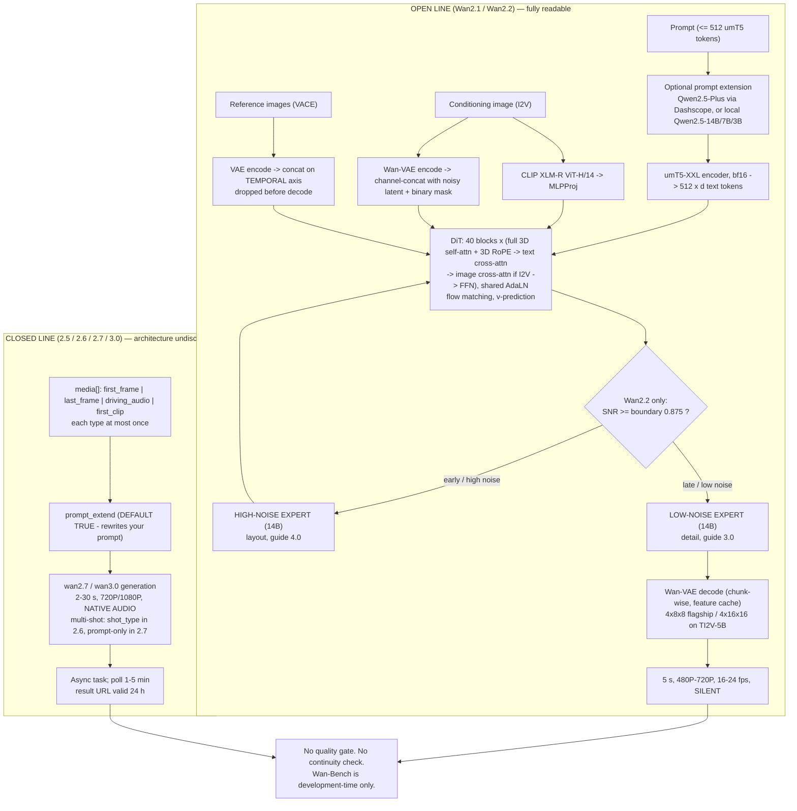

# Wan (Alibaba / Tongyi Lab) — Architecture Brief

**Analysis date: 2026-09-13.** Wan is Alibaba's video-generation line, developed by **Tongyi Lab** and shipped through three distinct channels: **open weights** (GitHub `Wan-Video/*`, Hugging Face `Wan-AI/*`, ModelScope), the **Alibaba Cloud Model Studio** API (`wan2.x-t2v` / `-i2v` model IDs), and the consumer site `wan.video`. The line as of this date is **Wan2.1** (2025-02) → **Wan2.2** (2025-07-28) → **Wan2.5-preview** (2025-09) → **Wan2.6** (2025-12-16) → **Wan2.7** (2026) → **Wan3.0** (2026-08-13, current flagship). Every non-trivial architectural claim is labeled **VERIFIED** (the Wan technical report on arXiv, the official GitHub repos and their *source code*, Hugging Face model cards, Alibaba Cloud's own API reference and press room), **STRONG INFERENCE** (implied by observable code/API surface or published technique), or **HYPOTHESIS** (plausible, unconfirmed) — see `.claude/agents/video-platform-intelligence.md`'s research principle.

**Why this brief goes deeper than the previous five.** Kling, Runway, Veo, Hailuo and Higgsfield could only be reverse-engineered from marketing pages, API docs and — at best — a model card. **Wan2.1 and Wan2.2 are Apache-2.0 open weights with published inference code**, so for the first time in this research programme the architecture is not inferred at all: it is *read off config files and `model.py`*. Sections 1–13 below are sourced from the technical report, the repos' source, and the model cards, and are labeled VERIFIED at a granularity (head-dimension splits, RoPE partitioning, patch kernel shapes, loss coefficients) that no closed platform in this set has permitted.

**The countervailing finding, and the most important single fact in this brief: Wan's open-weight line and Wan's *product* line have diverged, and the divergence is now two and a half years wide.** The newest **base video generator** with published weights is **Wan2.2 (2025-07-28)**. Everything after it — 2.5-preview, 2.6, 2.7, 3.0 — is **API-only**. This was verified by enumeration, not assumed: the complete `Wan-AI` Hugging Face catalogue is **27 models**, the newest created **2026-08-06**, and none is named 2.5, 2.6, 2.7 or 3.0; the `Wan-Video` GitHub organization contains **six** repositories (`Wan2.1`, `Wan2.2`, `Wan-Animate-2`, `Wan-Dancer`, `Wan-skills`, a `diffusers` fork) with no 2.5+ repo; and Alibaba Cloud's own Wan3.0 announcement says it is available on Model Studio, with no weights release mentioned. **[VERIFIED by direct enumeration of `huggingface.co/api/models?author=Wan-AI` and `github.com/orgs/Wan-Video/repositories`, 2026-09-13]**

**Evidence-trap warning, and it is the worst one encountered in this programme so far.** A dense layer of SEO domains (`wan27.org`, `wan2-7.io`, `localaimaster.com`, `oakgen.ai`, `kingy.ai`, `videoai.me`, `wan2.video`, `cliprise.app`) publishes confident, mutually contradictory claims that Wan 2.7 and/or Wan 3.0 shipped Apache-2.0 1.3B and 14B checkpoints — with specific dates (March 2026, April 6 2026, April 22 2026) and specific download instructions. One of these same domains simultaneously publishes "Wan 2.7 Has a Thinking Mode — and Closed Weights." **None of it survives contact with the primary registries.** Compounding the trap, a GitHub repository at `AlibabaCloud-Official/Wan3.0` is **licensed Apache-2.0 and contains only a marketing README** (11 stars, 2 commits, no weights, no inference code, no HF/ModelScope links) — an Apache-2.0 *documentation* repo that makes a closed model look open to anyone checking the licence badge. **Do not source Wan version/licensing facts from anything but `github.com/Wan-Video`, `huggingface.co/Wan-AI`, or `alibabacloud.com`.**

---

## Executive Summary

1. **Wan is the only platform in this research set whose foundation architecture is fully readable, and the numbers are exact.** Wan2.1-14B: **40 layers, dim 5120, 40 heads, FFN 13824, patch (1,2,2), `window_size (-1,-1)` (full 3D attention), qk-norm on, eps 1e-6**; Wan2.1-1.3B: **30 layers, dim 1536, 12 heads**. Text encoder **umT5-XXL (5.3B), 512-token cap, bf16**. VAE **4×8×8 spatial-temporal compression, 16 latent channels, 127M params, causal**. **[VERIFIED — `wan/configs/*.py`, `wan/modules/model.py`, README tables, arXiv 2503.20314]**
2. **Wan2.2 introduced the first Mixture-of-Experts *video diffusion* model, and the routing dimension is the denoising timestep, not the token.** Two ~14B experts — a **high-noise expert** for early layout and a **low-noise expert** for late detail — 27B total, **14B active per step**, switched at an SNR threshold `t_moe` corresponding to **half of SNR_min** and implemented as the config value **`boundary: 0.875`**. Guidance is applied **per expert** (`sample_guide_scale: (3.0, 4.0)`). This is architecturally cheap MoE: no router network, no load balancing, just a scheduled model swap partway through sampling. **[VERIFIED — `wan/configs/wan_t2v_A14B.py`, HF model card, README]**
3. **The MoE choice has a direct operational consequence Narrata should note even as an API consumer: Wan2.2-A14B is two full 14B checkpoints on disk and in the workflow.** ComfyUI's official Wan2.2 workflow uses **two `Load Diffusion Model` nodes and two samplers**, one per expert. Self-hosting Wan2.2-A14B means holding or swapping ~28B parameters, which is why the published single-GPU peak is **~80 GB**. **[VERIFIED — docs.comfy.org + repo efficiency table]**
4. **Wan is flow matching, not DDPM.** Velocity prediction with linear interpolation `x_t = t·x₁ + (1−t)·x₀`, **logit-normal timestep sampling**, MSE on the velocity target, `num_train_timesteps: 1000`. Inference uses a **shift** parameter that differs sharply by model (`sample_shift` **12.0** for Wan2.2-A14B at **40 steps**; **5.0** for TI2V-5B at **50 steps**). **[VERIFIED — arXiv 2503.20314 + config files]**
5. **Positional encoding is genuine 3D RoPE with an explicitly unequal split.** `rope_apply` splits the head dimension three ways — `[c − 2·(c//3), c//3, c//3]` — one partition per (frame, height, width) axis, with the remainder going to the temporal partition. Self-attention is **full spatio-temporal** (no windowing, no sparsity: `window_size (-1,-1)`); text enters by **cross-attention**, not by concatenation into the video stream. **[VERIFIED — `wan/modules/model.py`]**
6. **Image conditioning is a two-path design, and this is the most transferable architectural fact in the brief.** Wan2.1-I2V does **both**: (a) the conditioning frame(s) are VAE-encoded and **channel-concatenated** with the noisy latent alongside a binary mask, and (b) **CLIP** image features (`clip_xlm_roberta_vit_h_14`, i.e. open-CLIP XLM-Roberta-large ViT-H/14) are projected through an `MLPProj` and consumed by a **separate image cross-attention path** (`WanI2VCrossAttention` maintains its own `k_img`/`v_img`, computes image and text attention independently, and **sums** them). Geometry travels through the latent channels; *semantics/identity* travel through cross-attention. **[VERIFIED — source code]**
7. **AdaLN is deliberately parameter-cheap, and the report says why.** A "fully shared AdaLN design to effectively reduce parameter count": one shared MLP maps the timestep embedding to six modulation vectors, and each block carries only a small learned offset `nn.Parameter(1, 6, dim)`. Compare MiniMax H3, which spends **~13B of 33B parameters** on modality-specific AdaLN branches. Two frontier labs made opposite bets on the same component. **[VERIFIED — arXiv 2503.20314 + `model.py`]**
8. **Wan-VAE is the most thoroughly disclosed video autoencoder in this research set.** 127M params, 4×8×8, 16 channels, **GroupNorm replaced by RMSNorm to preserve temporal causality**, MagViT-v2-style **"1+T"** layout (first frame spatially compressed only), and a **frame-level feature cache** enabling chunk-wise encode/decode of arbitrary-length 1080p video. Losses: **L1 (weight 3) + KL (3e-6) + LPIPS (3)**, plus GAN loss in a final stage. **[VERIFIED — arXiv 2503.20314]**
9. **Wan2.2 shipped a second, much more aggressive VAE — and paid for it in model quality tier, not in the VAE.** Wan2.2-VAE compresses **4×16×16 = 64×**, reaching **4×32×32** after patchify. It is used **only** by the small **TI2V-5B** model (dim 3072, 30 layers, 24 heads, `frame_num 121` = 5 s @ 24 fps), which is what makes 720p generation fit a consumer GPU. **The flagship A14B models kept the old 4×8×8 `Wan2.1_VAE.pth`.** High-compression latents are a *small-model enabler* here, not a flagship upgrade. **[VERIFIED — `wan_ti2v_5B.py` vs `wan_t2v_A14B.py`]**
10. **The reference/conditioning system is a separately published architecture — VACE — and it is the closest external analogue to what Narrata's Story Bible needs.** VACE unifies reference-to-video, video-to-video and masked editing behind a **Video Condition Unit** `V = [T; F; M]` (text, context frames, binary masks). **Reference images are VAE-encoded and concatenated along the *temporal* dimension, then dropped at decode** — the reference literally occupies frame slots the model attends over. Training is **Context Adapter Tuning**: the DiT is frozen and only a Context Embedder plus **8 copied Context Blocks at layers [0, 5, 10 … 35]** are trained, which converges faster than full fine-tuning. **[VERIFIED — arXiv 2503.07598]**
11. **Character consistency in the open line is not one mechanism but a family of task-specific models, all released openly**: VACE (reference face/object → video), **Wan2.2-S2V-14B** (speech-driven), **Wan2.2-Animate-14B** (animation *and* replacement modes in one jointly-trained model, via spatially-aligned skeletons + implicit facial features), **Wan-Animate-2** (removes intermediate motion extractors entirely, consumes the driving video directly, adds text-driven viewpoint control decoupled from the driving camera; a `-Lite` variant claims real-time streaming), **Wan-Dancer-14B**. **There is no persistent character *record* anywhere** — no library, no `@mention`, no lock. Same absence found at MiniMax; Kling and Higgsfield are the outliers that have one. **[VERIFIED — HF catalogue + arXiv 2509.14055 / 2608.06009]**
12. **Multi-shot became a first-class API parameter in Wan2.6 — and was then deliberately removed in Wan2.7.** `wan2.6-i2v` exposes **`shot_type: "single" | "multi"`** with the documented precedence rule **"Parameter priority: shot_type > prompt."** Wan2.7's reference states it uses **prompt-based shot control with no `shot_type` parameter**. **This is a rare, dated, first-party observation of a frontier vendor collapsing a structured control back into the prompt** — the exact pattern the Runway brief identified, now with a second independent confirmation and a visible before/after. **[VERIFIED — Alibaba Cloud Model Studio API references]**
13. **Wan2.7 ships the precise conditioning primitive that `video-architect.md` names as Narrata's sharpest continuity gap.** Its `media[]` array accepts four types — **`first_frame`, `last_frame`, `driving_audio`, `first_clip`** — where **`first_clip` is video continuation**: supply an existing clip and the model generates forward from it ("if `duration=15` and the input video is 3 s long, the model generates a 12-s continuation"). Valid combinations are enumerated (first_frame ± audio; first_frame + last_frame ± audio; first_clip ± last_frame) and **each `type` may appear at most once**. Bridge mode (first+last) and true continuation both exist in one API. **[VERIFIED — `image-to-video-general-api-reference`]**
14. **Wan is reachable through Narrata's existing provider today, and the price ladder contains an inversion.** OpenRouter lists **`alibaba/wan-3.0` from $0.0425/s**, **`wan-3.0-prime` $0.068/s**, **`wan-2.7` $0.10/s**, **`wan-2.6` from $0.04/s**. Alibaba's own published Wan3.0 rates are **$0.05/s (480P) / $0.10/s (720P) / $0.20/s (1080P)**. **The newest flagship is cheaper per second than the previous generation** (wan-2.7 at $0.10 vs wan-3.0 from $0.0425), so "newer = pricier" is not a safe routing heuristic for this vendor. **[VERIFIED as the providers' listed prices; the inversion is our arithmetic]**
15. **The quantization and distillation ecosystem around Wan is the most mature of any video model in existence, and it is entirely community-run.** De-facto standard GGUF publisher is **QuantStack** (`Wan2.2-T2V-A14B-GGUF` alone at **708k downloads**), with `unsloth` and `bullerwins` as alternates; ComfyUI ships official **fp8_scaled** files; **lightx2v's `Wan2.2-Lightning`** distills to **4 steps with no CFG** as a **rank-64 LoRA** claiming ~20× speedup. A peer-reviewed-style arXiv paper (2606.00658) specifically addresses quantizing the **dual-expert** structure with **separate calibration per expert** and protection of early layers. **[VERIFIED as published artifacts; quality-parity claims are the publishers' own]**
16. **Wan is the only platform in this set that published its own evaluation benchmark *with human-preference weighting*.** Wan-Bench: **14 metrics across 3 dimensions** (Dynamic Quality — including **ID consistency**; Image Quality; Instruction Following — including camera control), weighted by **5,000+ pairwise human comparisons**. Like every other platform examined, it is a **development-time** benchmark: **no runtime quality or continuity gate exists anywhere in the pipeline.** Now **six for six**. **[VERIFIED — arXiv 2503.20314]**

---

## Publicly Known Architecture — Product Layer

```
                     ┌─────────────────────────────────────────────────────┐
                     │                      USERS                           │
                     │  self-hosters & ComfyUI/diffusers community ·        │
                     │  Model Studio API developers · wan.video consumers · │
                     │  brokers (OpenRouter, fal, Replicate, Together,      │
                     │  WaveSpeed, Novita) · Qwen App (announced)           │
                     └──────────────────────┬──────────────────────────────┘
                                            │
        ┌───────────────────────────────────┴────────────────────────────────┐
        │                                                                     │
  ══════╪══════════ OPEN WEIGHTS (Apache 2.0) ═══════╗   ╔══ API-ONLY (Model Studio) ══
        │                                             ║   ║
  ┌─────┴──────────────────────────────────────────┐  ║   ║  ┌──────────────────────────┐
  │ BASE GENERATORS — frozen at 2.2 (2025-07-28)   │  ║   ║  │ wan2.5-*-preview  (2025-09)│
  │   Wan2.1  T2V-1.3B · T2V-14B                   │  ║   ║  │   5/10s · 480-1080p · audio│
  │          I2V-14B-480P · I2V-14B-720P           │  ║   ║  ├──────────────────────────┤
  │          FLF2V-14B-720P                        │  ║   ║  │ wan2.6-*  (2025-12-16)     │
  │   Wan2.2  T2V-A14B · I2V-A14B  (MoE 27B/14B)   │  ║   ║  │   R2V (appearance+VOICE    │
  │          TI2V-5B  (high-compression VAE)       │  ║   ║  │   from a reference video)  │
  ├────────────────────────────────────────────────┤  ║   ║  │   shot_type single|multi   │
  │ TASK / CONDITIONING MODELS — still shipping    │  ║   ║  │   ≤15s · -flash tier       │
  │   Wan2.1-VACE-1.3B / -14B   (ref + edit + mask)│  ║   ║  ├──────────────────────────┤
  │   Wan2.2-S2V-14B            (speech-driven)    │  ║   ║  │ wan2.7-*  (2026)           │
  │   Wan2.2-Animate-14B        (animate/replace)  │  ║   ║  │   first_frame·last_frame·  │
  │   Wan2.2-Animate-2-14B(+Distilled) 2026-08     │  ║   ║  │   driving_audio·FIRST_CLIP │
  │   Wan-Dancer-14B            (music→dance)      │  ║   ║  │   2-15s · 720P/1080P       │
  │   Wan-skills                (agent skills)     │  ║   ║  │   shot control via prompt  │
  └────────────────────────────────────────────────┘  ║   ║  ├──────────────────────────┤
                                                      ║   ║  │ wan3.0-video (2026-08-13)  │
  ┌────────────────────────────────────────────────┐  ║   ║  │   30s single pass · ≤20    │
  │ COMMUNITY LAYER (not Alibaba)                  │  ║   ║  │   assets · docs as input · │
  │   QuantStack/unsloth/bullerwins GGUF           │  ║   ║  │   edit visuals/plot/dialog │
  │   lightx2v Wan2.2-Lightning (4-step, no CFG)   │  ║   ║  │   $0.05/$0.10/$0.20 per s  │
  │   musubi-tuner · DiffSynth-Studio · ai-toolkit │  ║   ║  └──────────────────────────┘
  │   Wan2.2-Fun (control/camera) · VACE-Fun       │  ║   ║
  └────────────────────────────────────────────────┘  ║   ║
        THE OPEN AND CLOSED LINES SHARE A NAME AND A LINEAGE — NOT A CODEBASE YOU CAN SEE
```
**[VERIFIED]** for every named model, endpoint and date. The two-column split is analytical framing; Alibaba does not publish it this way — which is precisely why the drift is easy to miss.

---

## Model Stack

| Model | Role | Publicly disclosed internals |
|---|---|---|
| **Wan2.1-T2V-14B** | 2025 flagship T2V, 480P + 720P | **dim 5120 · ffn 13824 · 40 heads · 40 layers · patch (1,2,2) · full attention (`window_size (-1,-1)`) · qk_norm · cross_attn_norm · eps 1e-6**. umT5-XXL text encoder, 512 tokens, bf16. Wan-VAE 4×8×8, 16ch. Flow matching, v-prediction, ~50 steps. **[VERIFIED — configs + arXiv]** |
| **Wan2.1-T2V-1.3B** | Consumer-GPU T2V, 480P only | **dim 1536 · 12 heads · 30 layers**. **8.19 GB VRAM**; 5 s 480P in ~4 min on an RTX 4090. The most-downloaded Wan checkpoint of all (284k on the diffusers variant). **[VERIFIED — README + HF]** |
| **Wan2.1-I2V-14B-480P / -720P** | Image-to-video | Same backbone **plus** `clip_xlm_roberta_vit_h_14` (open-CLIP XLM-R-large ViT-H/14, fp16) → `MLPProj` → **dedicated image cross-attention** (`k_img`/`v_img`), *and* channel-concatenated VAE-encoded condition + mask. Negative prompt prepends `"镜头晃动，"` (camera shake). **[VERIFIED — `wan_i2v_14B.py`, `model.py`]** |
| **Wan2.1-FLF2V-14B-720P** | **First-Last-Frame** to video | Released 2025-04-17. The open line has had bridge-mode conditioning for over a year. Mechanism not separately documented beyond the I2V pathway. **[VERIFIED as released; mechanism STRONG INFERENCE]** |
| **Wan2.2-T2V-A14B / I2V-A14B** | Current open flagship, MoE | **27B total / 14B active.** High-noise + low-noise experts, switch at `boundary 0.875` (SNR threshold = ½·SNR_min). `sample_steps 40`, `sample_shift 12.0`, `sample_guide_scale (3.0, 4.0)` per expert. Each expert: dim 5120 / ffn 13824 / 40 heads / 40 layers. Uses the **old** `Wan2.1_VAE.pth` (4×8×8). Training data **+65.6% images, +83.2% videos** vs 2.1, with curated aesthetic labels for **lighting, composition, contrast, colour tone**. **[VERIFIED — configs + model card + README]** |
| **Wan2.2-TI2V-5B** | Unified T2V+I2V for consumer GPUs, 720P@24fps | **dim 3072 · ffn 14336 · 24 heads · 30 layers**, `vae_stride (4,16,16)` = **Wan2.2-VAE, 64× compression**, 4×32×32 after patchify. `frame_num 121`, `sample_fps 24`, `sample_steps 50`, `shift 5.0`, `guide_scale 5.0`. **5 s 720P in <9 min on one consumer GPU**; ComfyUI states it "should fit well on 8 GB VRAM" with native offloading. **[VERIFIED]** |
| **Wan2.1-VACE-1.3B / -14B** | **All-in-one reference + editing** | VCU `[T; F; M]`; references VAE-encoded and concatenated on the **temporal** axis then dropped at decode; **Concept Decoupling** into reactive `F×M` and inactive `F×(1−M)` frames; **Context Adapter Tuning** — frozen DiT + Context Embedder + **8 Context Blocks at layers [0,5,10…35]**. 12 tasks / 240-sample VACE-Benchmark scored on 8 VBench metrics + human MOS. **[VERIFIED — arXiv 2503.07598]** |
| **Wan2.2-S2V-14B** | Speech → video | Audio-driven generation, integrates with CosyVoice TTS. Published efficiency: **48 s / 88 GB on 8×H100**. **[VERIFIED — README]** |
| **Wan2.2-Animate-14B** → **Wan-Animate-2-14B** | Character animation & replacement | Animate: two modes (animation / replacement) in **one jointly trained model**, driven by **spatially-aligned skeleton signals** + **implicit facial features** from the source image. Animate-2: **eliminates intermediate motion extractors**, consumes the driving video directly in a redesigned DiT, adds **text-driven viewpoint control decoupled from the driving camera**; `-Lite` claims real-time streaming via a three-stage training paradigm. Repo warns: **do not use Wan2.2-trained LoRAs with Animate-14B.** **[VERIFIED — arXiv 2509.14055 / 2608.06009 + README]** |
| **wan2.5-*-preview** (closed) | First audio-native Wan | 5 or 10 s, 480P/720P/1080P, synchronized audio. `audio_url` custom audio 3–30 s. **No weights ever released.** **[VERIFIED — Model Studio API reference]** |
| **wan2.6-\* / -flash / -us** (closed) | Reference-to-video + multi-shot | Announced **2025-12-16** as a *series*: **R2V**, T2V, I2V, image, T2I. Official claim: upload "a character reference video with both appearance **and voice**" and generate new scenes "preserving the distinctive look and sound of the original reference"; "intelligent multi-shot storytelling … with visual consistency"; ≤**15 s**. API: **`shot_type: single|multi`**, `audio` bool, `audio_url`, `prompt_extend` (default **true**), `negative_prompt` ≤500 chars, resolutions 720P/1080P. **Audio and silent videos are billed differently.** **[VERIFIED — press room + API reference]** |
| **wan2.7-t2v / -i2v** (closed) | Frame + clip conditioning | IDs are date-stamped (`wan2.7-i2v-2026-04-25`, `wan2.7-t2v-2026-06-12`). `media[]` of **`first_frame` / `last_frame` / `driving_audio` / `first_clip`**, each at most once; three enumerated valid combinations; **video continuation** billed on total output length. 2–15 s, 720P/1080P, prompt ≤5,000 chars, `seed`, `watermark`, 1–5 min typical latency, result URLs valid **24 h**. **[VERIFIED]** |
| **wan3.0-video** (closed) | Current flagship | **30 s in a single pass**, "multi-modal omni-creation" with **up to 20 assets**, accepts **documents** (pdf/ppt/doc/xls/md/key/pages/numbers; 1 file, ≤100 MB, ≤50 pages) as input, edits "visuals, plot, and dialogue" without full regeneration, smart duration recommendation + video extension. 480P/720P/1080P at **$0.05 / $0.10 / $0.20 per second**. Alibaba's own blog concedes "audio texture and on-screen text rendering accuracy are still improving." **Model Studio only.** **[VERIFIED — alibabacloud.com blog, 2026-08-13]** |

---

## Deep Technical Section — the 13 open-weight questions

Everything in this section is read from Wan's technical report, its published configs and its inference source, except where explicitly labeled otherwise. **It applies to Wan2.1/2.2 only.** No architectural disclosure of any kind exists for 2.5, 2.6, 2.7 or 3.0.

### 1. Transformer architecture (DiT backbone)

```
  WAN2.1 / WAN2.2 DiT — verified config values
  ─────────────────────────────────────────────────────────────────────────
                         layers   dim    heads   ffn_dim   VAE stride
  Wan2.1-T2V-1.3B ......   30     1536    12      —        (4, 8, 8)
  Wan2.1-*-14B .........   40     5120    40     13824     (4, 8, 8)
  Wan2.2-*-A14B ........   40     5120    40     13824     (4, 8, 8)   ×2 experts
  Wan2.2-TI2V-5B .......   30     3072    24     14336     (4,16,16)

  shared:  patch_size (1,2,2) · freq_dim 256 · eps 1e-6
           qk_norm True · cross_attn_norm True
           window_size (-1,-1)  ⇒ FULL 3D SELF-ATTENTION, no windowing
```

Structure per block, from `model.py`: **self-attention (with RoPE applied to q and k, optional `WanRMSNorm` qk-norm) → cross-attention to text → FFN**, with AdaLN-style modulation on all three. Patchification is a **3D convolution with kernel (1,2,2)** followed by flattening — i.e. **2×2 spatial patches and no additional temporal patching**, since the VAE has already done 4× temporal compression.

**There is no MoE inside a block.** Wan2.2's "MoE" operates at the *sampling-schedule* level: two complete 14B DiTs, one used while `t ≥ t_moe` and the other while `t < t_moe`. There is no router network, no top-k gating, no auxiliary load-balancing loss. Practically this is closer to a **two-stage cascade sharing a latent space** than to a Switch-Transformer-style MoE, and it is worth being precise about because the term invites the wrong mental model. **[Config values and block structure VERIFIED; the "cascade, not routed MoE" characterization is our reading — STRONG INFERENCE]**

**Attention type: full, dense, spatio-temporal.** `window_size (-1,-1)` in every shipped config. The report also notes that at ~1M-token sequence lengths "the computational cost of attention can account for up to **95% of end-to-end training time**" — which is the honest cost of that choice, and is why Wan invested in 2D context parallelism (§8) rather than in sparsity. **Contrast: MiniMax H3 trained native sparse attention in and withheld the implementation.** **[VERIFIED]**

**Position encoding: 3D RoPE.** `rope_params` builds frequency tables (max sequence position 1024 per axis); `rope_apply` splits the per-head dimension `c` as **`[c − 2·(c//3), c//3, c//3]`** and applies rotary embeddings independently over the frame, height and width grid axes, with the remainder dimension going to the **temporal** partition. RoPE is applied in self-attention only — **text cross-attention has no rotary embedding**, which is consistent with text being an unordered-with-respect-to-video condition rather than a co-located token stream. **[VERIFIED — `wan/modules/model.py`]**

### 2. Diffusion / flow architecture

**Flow matching, not DDPM.** The report states the training objective as the MSE between the model output and the velocity target `v_t`, with the forward path a **linear interpolation** `x_t = t·x₁ + (1−t)·x₀` and timesteps `t ∈ [0,1]` drawn from a **logit-normal** distribution. `num_train_timesteps: 1000` in the shared config.

The practically important knob is the **shift**, and its spread across models is large enough to matter:

```
  model                sample_steps   sample_shift   sample_guide_scale
  ───────────────────────────────────────────────────────────────────────
  Wan2.2-T2V-A14B ....      40           12.0        (3.0, 4.0)  ← per expert
  Wan2.2-TI2V-5B .....      50            5.0         5.0
  Wan2.1 (report) ....      ~50           —           —
```

A shift of **12.0** on the A14B is unusually high, and pairs with the low per-expert CFG scales (3.0/4.0) — a different operating point than the 5.0/5.0 of the 5B. **Any reproduction or cost estimate that assumes one set of sampler settings across Wan variants will be wrong.** The concrete sampler/solver implementation (UniPC vs DPM++ vs Euler) is selectable in the repo but **was not read this session** — **NOT VERIFIED**.

**CFG distillation is not in the official release.** There is no official few-step or CFG-distilled Wan checkpoint. The 4-step, CFG-free variants are **community** artifacts (§10). **[VERIFIED by absence from the model zoo]**

### 3. Text conditioning

**Encoder: umT5-XXL (~5.3B), `google/umt5-xxl` tokenizer, bf16, `text_len: 512`.** The report says umT5 was chosen after an ablation against **Qwen2.5-7B and GLM-4-9B**, on the grounds of "multilingual encoding capabilities" and "superior convergence." Text enters the DiT **exclusively through cross-attention** (`WanT2VCrossAttention`), with `cross_attn_norm: True`.

Three consequences worth carrying forward:

- **The prompt budget is 512 umT5 tokens, hard.** Longer prompts are truncated at the encoder, not gracefully degraded. Against Model Studio's 5,000-character prompt field for wan2.7, this means the **hosted line either uses a different encoder or compresses the prompt upstream** — Alibaba's `prompt_extend` (default `true`) rewrites prompts with an LLM before generation, so an over-long prompt is being *summarized by a model you did not choose*. **[512-token cap VERIFIED for the open line; the hosted-line implication is STRONG INFERENCE]**
- **An encoder-only multilingual T5 was chosen over a modern decoder LLM as recently as 2025.** MiniMax H3 went the other way (Qwen3-VL-32B layer-50 hidden states). There is no consensus in the field on this.
- **Negative prompts are a real, shipped part of the recipe**, not an afterthought: Wan ships a default Chinese negative prompt covering oversaturation, blur, artifacts and anatomy, and the I2V config *prepends* `"镜头晃动，"` (camera shake) to it. **[VERIFIED — `shared_config.py`, `wan_i2v_14B.py`]**

### 4. Image conditioning (I2V / reference)

The mechanism is **dual-path**, and both paths are visible in source:

```
  CONDITIONING IMAGE
        │
        ├─── path A: GEOMETRY ─────────────────────────────────────────
        │      VAE-encode condition frame(s) → concatenate along the
        │      CHANNEL axis with the noisy latent, together with a
        │      binary mask marking which frames are given
        │      ⇒ tells the model WHERE things are, pixel-aligned
        │
        └─── path B: SEMANTICS / IDENTITY ─────────────────────────────
               CLIP image encoder (clip_xlm_roberta_vit_h_14, fp16)
                 → MLPProj (Linear→GELU→Linear, LayerNorm)
                 → WanI2VCrossAttention: separate k_img / v_img
                    projections; image-attention and text-attention
                    computed independently and SUMMED before output
               ⇒ tells the model WHAT it is looking at
```

**[VERIFIED — `wan/modules/model.py`, `wan/configs/wan_i2v_14B.py`]**

**VACE takes a third approach for *reference* images specifically** (as opposed to first-frame conditioning): references are VAE-encoded and **concatenated along the temporal axis** — occupying extra frame slots the DiT attends over — then **removed before decoding**. This is materially different from channel-concat: a temporally-concatenated reference is visible to *every* frame through full 3D attention, without being pinned to any output frame's geometry. **That is exactly the property a character reference needs and a first-frame does not have.** **[VERIFIED — arXiv 2503.07598; the "exactly the property" reading is ours]**

### 5. Video latent representation

```
  Wan-VAE (2.1, and still the flagship VAE in 2.2)
     compression ..... 4 × 8 × 8   (T × H × W)
     latent channels .. 16
     parameters ....... 127M
     causality ........ temporal-causal; GroupNorm → RMSNorm throughout
     frame layout ..... "1 + T"  (first frame spatially compressed only,
                        MagViT-v2 style) ⇒ frame counts are 4k+1
     length ........... unbounded via frame-level feature cache across chunks

  Wan2.2-VAE (TI2V-5B only)
     compression ..... 4 × 16 × 16  = 64×
     after patchify .. 4 × 32 × 32
```

The **"1+T" layout is why Wan frame counts are always of the form 4k+1** — `frame_num 121` for a 5 s 24 fps clip is `1 + 4·30`. This is the same class of architectural tell as MiniMax's 17-frame quantization on 2K regeneration, and here it is documented rather than inferred. **[VERIFIED]**

**The 2.2 flagship kept the 2.1 VAE.** `wan_t2v_A14B.py` loads `Wan2.1_VAE.pth`; only `wan_ti2v_5B.py` loads `Wan2.2_VAE.pth` with stride `(4,16,16)`. **Alibaba shipped a 64× VAE and chose not to put its best model on it** — the strongest available signal that high-compression latents still cost quality at the frontier. **[Config facts VERIFIED; the quality inference is STRONG INFERENCE]**

### 6. VAE architecture and training

Family: a **causal 3D VAE** in the MagViT-v2 lineage, made temporal-causal by **replacing all GroupNorm layers with RMSNorm** (GroupNorm normalizes across a window that would leak future frames). Objective: **L1 reconstruction (weight 3) + KL (weight 3e-6) + LPIPS perceptual (weight 3)**, with a **GAN loss added in a final training stage**. The **feature cache** keeps frame-level activations from preceding chunks so arbitrary-length (including 1080p) video can be encoded and decoded chunk-wise without a quadratic memory blowup.

**Known artifacts/limitations: not disclosed by Alibaba.** No reconstruction-fidelity table, no failure-mode discussion, no statement of what 64× costs. The only *structural* evidence of a limitation is the flagship's refusal to adopt Wan2.2-VAE (§5). Community reports of detail loss and colour banding at high compression exist but were not treated as evidence here. **[Losses and design VERIFIED; limitations NOT DISCLOSED]**

### 7. Temporal modeling

Coherence comes from three stacked mechanisms and **no recurrent or autoregressive component**:

1. **The causal VAE** already fuses 4 frames into every latent frame, so the DiT's temporal axis is 4× shorter than the video's.
2. **Full 3D self-attention** over the entire flattened (T′,H′,W′) token sequence — every latent token attends to every other, across all frames. No temporal-only layers, no factorized spatial/temporal attention, no windowing.
3. **3D RoPE** gives the model the coordinates to use that attention structurally.

**Generation is whole-clip, single-pass.** There is no chunked or streaming generation in the base open models — which is exactly why clip length is capped by sequence length and therefore by memory, and why the industry answer everywhere is "generate short, assemble." The exceptions are all *derivative* models: `Wan-Animate-2-Lite` claims streaming for interactive character animation, and the closed `wan2.7` exposes `first_clip` continuation whose mechanism is undisclosed. **[VERIFIED for the base models; continuation mechanism NOT DISCLOSED]**

### 8. Training

| | Disclosed |
|---|---|
| **Data scale** | "billions of images and videos, amounting to **𝒪(1) trillions of tokens** in total" **[VERIFIED — arXiv]** |
| **Data sourcing** | **Not disclosed.** No provenance, licensing or acquisition statement anywhere. |
| **Curation** | Four-stage: (1) fundamental filtering on OCR density, aesthetics, NSFW, watermarks, blur and synthetic-image detection — **eliminating ~50% of data**; (2) visual-quality clustering and scoring; (3) **motion-quality classification into six tiers** from optimal to excluded; (4) dense recaptioning. **[VERIFIED]** |
| **Curriculum** | Stage 1: 256px images + **5-second 192px video at 16 fps**; Stage 2: both to 480px; Stage 3: scale to 720px. Wan2.2 adds curated **aesthetic labels** (lighting, composition, contrast, colour tone) and **+65.6% images / +83.2% videos** over 2.1. **[VERIFIED]** |
| **Post-training** | **Not disclosed.** No RLHF, no DPO, no preference-optimization stage is described for the base models. Wan-Bench's human-preference weighting is used for *evaluation*, not stated as a training signal. |
| **Compute** | **Not quantified anywhere.** No GPU-hours, no cluster size, no node count. This is the single largest gap in an otherwise unusually open report. |
| **Distillation** | None official. |

### 9. Inference

```
  DEFAULTS, from shipped configs and README
  ─────────────────────────────────────────────────────────────────────
  fps ............ 16 (Wan2.1 shared_config)   ·  24 (Wan2.2 TI2V-5B)
  duration ....... 5 s typical (frame_num 121 = 1 + 4·30 @ 24fps)
  resolution ..... 480P / 720P (1280×704 or 1280×720 typical)
  steps .......... 40 (A14B) · 50 (TI2V-5B, and ~50 in the 2.1 report)
  precision ...... bf16 (param_dtype torch.bfloat16; umT5 bf16; CLIP fp16)

  PUBLISHED LATENCY / MEMORY  (Wan2.2 repo efficiency table)
  ─────────────────────────────────────────────────────────────────────
  T2V-A14B    8×H100 ............  42 s  /  85 GB
  T2V-A14B    1×H100 ...........  180 s  /  80 GB
  TI2V-5B     1×RTX 4090 .......  540 s  /  24 GB
  S2V-14B     8×H100 ............  48 s  /  88 GB
  Wan2.1 T2V-1.3B  1×RTX 4090 ... ~240 s /  8.19 GB  (5 s 480P ≈ 4 min)
```
**[VERIFIED as the repos' published figures.]** Caveat: the resolution/length column of the Wan2.2 efficiency table was not captured in full this session, so treat the four Wan2.2 rows as *order-of-magnitude* rather than as spec-exact per-resolution numbers. The Wan2.1 1.3B figures are stated directly in prose and are solid.

**The honest headline: one 5-second clip costs roughly 3 minutes on a single H100, or 42 seconds on eight.** That is ~36× real-time on a single datacentre GPU, before any distillation. It is the number that decides the self-host question (§13, and "What Narrata Should Avoid").

**Official inference optimizations** (from the report): **FP8 GEMM → 1.13× DiT speedup**; **8-bit FlashAttention** with mixed INT8-FP8 and FP32 cross-block accumulation → **95% MFU on H20**; **diffusion caching → 1.62× end-to-end**. Parallelism: **FSDP** for parameter sharding plus a **2D context-parallel** design (**Ring Attention outer, Ulysses inner**) that cuts communication overhead "from over 10% with Ulysses to below 1%" at 256K sequence length on 16 GPUs. **[VERIFIED]**

### 10. Quantization

**Official:** ComfyUI's Wan2.2 tutorial distributes **`fp8_scaled`** diffusion-model files for the 14B T2V experts and an **`umt5_xxl_fp8_e4m3fn_scaled`** text encoder; the 5B ships fp16. The Wan report itself validates **FP8 GEMM** and **8-bit FlashAttention** as first-party techniques.

**Community, and this is where the real ecosystem is:**

| Publisher | Artifact | Scale signal |
|---|---|---|
| **QuantStack** | `Wan2.2-T2V-A14B-GGUF` | **708,317 downloads** |
| QuantStack | `Wan2.2-I2V-A14B-GGUF` | 234,106 |
| QuantStack | `Wan2.2-TI2V-5B-GGUF` / `-Animate-14B-GGUF` / `-S2V-14B-GGUF` / `-VACE-Fun-A14B-GGUF` / `Fun-*-Control(-Camera)-GGUF` | 88k / 51k / 10k / 19k / — |
| unsloth | `Wan2.2-TI2V-5B-GGUF` | 56,560 |
| bullerwins | `Wan2.2-I2V-A14B-GGUF` / `-T2V-A14B-GGUF` | 93,795 / 13,245 |
| various | `WAN2.2-14B-Rapid-AllInOne-GGUF` merges (quant + distill LoRA baked in) | 33k–46k |

**[VERIFIED — Hugging Face model index, 2026-09-13]**

**Quality/speed tradeoff: no rigorous public measurement exists.** Community guidance converges on Q8_0 ≈ near-lossless, Q5_K_M as the usual compromise, Q4_K_M usable with visible banding and facial detail loss, Q2 not recommended — but this is aggregated blog/forum consensus, **not** a measured study, and is **HYPOTHESIS** here. The one rigorous source found is **arXiv 2606.00658**, which quantizes Wan2.2-T2V-A14B specifically and reports that the **dual-expert structure requires separate calibration of the high-noise and low-noise pathways**, that **early layers must be protected** from low-bit quantization, and that calibrating on the *distilled student* (rather than the full multi-step trajectory) reduces deployment distribution mismatch — with quantized+distilled output matching or exceeding the full-precision baseline at 8 and 20 steps, 20 being the best quality/efficiency point. **[Paper claims VERIFIED as the authors' claims]**

**Cross-cutting lesson: for an MoE-by-timestep model, compression is not one decision — it is one decision per expert.**

### 11. GPU requirements

```
  INFERENCE (published / official)
  ───────────────────────────────────────────────────────────────────────
  Wan2.1-T2V-1.3B ........  8.19 GB  ← "compatible with almost all
                                       consumer-grade GPUs"
  Wan2.2-TI2V-5B .........  24 GB peak (repo) · "fits 8 GB with ComfyUI
                            native offloading" (ComfyUI docs)
  Wan2.2-*-A14B ..........  ~80 GB peak single-GPU  ⇒ H100/A100-80G class
  Wan2.2-*-A14B (8 GPU) ..  85 GB peak aggregate, 42 s
  Wan2.2-S2V-14B (8 GPU) .  88 GB peak, 48 s
  Community GGUF path ....  claimed workable down to ~6 GB VRAM at low
                            quant levels, with large speed/quality cost
                            [HYPOTHESIS — community claim, unmeasured]

  TRAINING / LoRA
  ───────────────────────────────────────────────────────────────────────
  Full training requirements: NOT DISCLOSED (no GPU-hours published)
  LoRA, community practice: rank 32 / alpha 16, LR ~2e-4, batch 1-2
                            on 16-24 GB with fp8 + block-swap
                            [community consensus — HYPOTHESIS]
```

**The 10× VRAM gap between TI2V-5B and A14B is the whole self-host story.** The model that fits a consumer GPU is the 5B on the 64× VAE — the one Alibaba itself did not put its flagship weights on. **[VERIFIED figures; the framing is ours]**

### 12. LoRA / fine-tuning

**There is no official Alibaba fine-tuning trainer for Wan.** The de-facto standard tooling is community-owned, and it is mature:

- **musubi-tuner (kohya-ss)** — purpose-built for Wan2.1/2.2 (plus HunyuanVideo, FramePack), with fp8 and block-swap VRAM savings; requires latent and text-encoder **pre-caching** before training.
- **DiffSynth-Studio** — the project the Wan team itself links to as a community project offering Wan LoRA training with low-VRAM offload, fp8 and sequence parallelism.
- **ai-toolkit** — added Wan2.2 I2V LoRA training in its UI.
- **diffusion-pipe** — Wan2.2 support reported to be in flux.

**What is trainable in practice:** character LoRAs, style LoRAs, motion/effect LoRAs, and — as lightx2v demonstrates — **step/CFG distillation delivered as a rank-64 LoRA**. The ecosystem is large enough that all-in-one merged checkpoints (quant + distill LoRA pre-baked) circulate with tens of thousands of downloads.

**Two cautions from primary sources:** the Wan2.2 repo explicitly states **"we do not recommend using LoRA models trained on Wan2.2"** with Animate-14B — i.e. LoRAs are **not portable across the task-model family** even within one version; and because A14B is **two experts**, a LoRA must be trained and applied with the high/low-noise split in mind. **[Tooling VERIFIED as published projects; hyperparameter guidance is community consensus — HYPOTHESIS; the Animate warning is VERIFIED]**

### 13. Deployment, licensing, and self-host vs API-rent

**Official inference code:** `github.com/Wan-Video/Wan2.1` and `/Wan2.2`, with `generate.py` supporting single-GPU (`--offload_model True --convert_model_dtype --t5_cpu`) and multi-GPU (`torchrun --nproc_per_node=8 … --dit_fsdp --t5_fsdp --ulysses_size 8`). **Integrations:** ComfyUI **native** (official tutorial and workflows, two-sampler MoE graph), **🤗 diffusers** (`WanPipeline` and per-model Diffusers variants published by Alibaba itself), HF Spaces, ModelScope.

**Licence: Apache 2.0**, with an explicit disclaimer of rights over generated content ("We claim no rights over the your generated contents") and an acceptable-use statement. **This is materially more permissive than any other open video model examined** — MiniMax H3 ships under a bespoke Community Licence with (unverified) territory exclusions and a revenue ceiling. **Apache 2.0 has no territory restriction, no revenue ceiling, and no application process.** **[VERIFIED — repo LICENSE statements]**

**Third-party hosting is dense**, which is itself the argument against self-hosting: OpenRouter, fal, Replicate, Together, WaveSpeed, Novita, Atlas, Runpod and others all serve Wan. **Narrata's existing OpenRouter integration already reaches `alibaba/wan-2.6`, `wan-2.7`, `wan-3.0` and `wan-3.0-prime` with no new vendor relationship.**

```
  SELF-HOST vs RENT — order-of-magnitude, at Narrata's actual scale
  ───────────────────────────────────────────────────────────────────────
  RENT (verified list prices)
    OpenRouter alibaba/wan-3.0 ......... from $0.0425 / s of output
    OpenRouter alibaba/wan-2.6 ......... from $0.04   / s
    OpenRouter alibaba/wan-2.7 ......... $0.10 / s
    Alibaba direct, wan3.0 ............. $0.05 (480P) / $0.10 (720P)
                                         / $0.20 (1080P) per second
    ⇒ a 5 s 720P clip = $0.50 direct;  a 5 s 480P clip = $0.25
    ⇒ marginal cost is ZERO when nobody is generating

  SELF-HOST (verified inputs, assumed GPU rate)
    Wan2.2-A14B needs ~80 GB ⇒ 1×H100-80G minimum
    180 s of H100 per 5 s clip (repo table)
    at an ASSUMED $2.50/GPU-hour  ⇒ ~$0.125/clip = ~$0.025 per second
      of output at 100% utilization, before storage, egress and ops
    with lightx2v 4-step distillation (~20× claimed) ⇒ ~$0.006/s
    BUT the GPU bills whether or not it is generating:
      $2.50/hr = $60/day
      breakeven vs $0.10/s (720P) ...... ~600 s ≈ 10 MINUTES of
                                          finished video generated
                                          EVERY DAY, forever
      breakeven vs $0.0425/s ........... ~1,400 s ≈ 23 minutes/day
  ───────────────────────────────────────────────────────────────────────
  [Prices and latency VERIFIED from the sources named; the $2.50/GPU-hour
   rate is an ASSUMPTION and the arithmetic is ours. Narrata runs a single
   VPS with an empty workers/ and generates nowhere near 10 minutes of
   finished video per day.]
```

---

## Generation Pipeline



**Evidence note:** every component in the OPEN subgraph is **VERIFIED** from source code, configs or the technical report. Everything in the CLOSED subgraph is verified only at the **API-surface** level — parameters, limits and billing — with **zero architectural disclosure**. As with all five prior briefs, **no runtime quality or continuity critic exists**; Wan-Bench is a development-time benchmark with human-preference weighting, not a serving-time gate. **The only automated runtime gate observable in the hosted line is `prompt_extend`, which is on by default and silently rewrites the caller's prompt** — the same trap as MiniMax's `prompt_optimizer: true`. **[VERIFIED]**

---

## Orchestration

**Wan has no router and no orchestrator — and unusually, this is true on both sides of the open/closed line.** Model selection is entirely the caller's: you pick a checkpoint (open) or a model ID (hosted). There is no equivalent of Runway's `optimize_for`, no Higgsfield Supercomputer "Orchestrator," no Hailuo Media Agent.

What Wan has instead is a **task-model zoo**, and that *is* the orchestration philosophy:

```
   ONE BACKBONE, MANY TASK CHECKPOINTS — the Wan pattern
   ───────────────────────────────────────────────────────────────
   base T2V/I2V ......... Wan2.1-T2V-14B, Wan2.2-*-A14B
   first+last frame ..... Wan2.1-FLF2V-14B-720P
   reference + editing .. Wan2.1-VACE-*      (adapter over frozen DiT)
   speech-driven ........ Wan2.2-S2V-14B
   character animate .... Wan2.2-Animate-14B -> Wan-Animate-2
   music -> dance ....... Wan-Dancer-14B
   control / camera ..... Wan2.2-Fun-* (control, control-camera, InP)
   ───────────────────────────────────────────────────────────────
   The orchestration burden is pushed entirely onto the integrator.
```

**The one genuinely orchestration-flavoured thing Alibaba published is `Wan-skills`** — "AI Agent Skills for Wan — Enable your AI Agent to easily leverage Wan's AIGC capabilities" (Apache 2.0, updated 2026-04-17). This is the **third** independent sighting of the agent-skills/MCP distribution pattern in this research programme, after Runway and Higgsfield. It is a *distribution* channel, not an internal architecture. **[VERIFIED as a repo; contents not read this session]**

**The VACE Context Adapter is the most interesting orchestration-adjacent idea in the Wan stack**, because it is an alternative to both routing and fine-tuning: rather than train a separate model per conditioning task, freeze the backbone and train **8 injected Context Blocks** that carry the task condition. It is architecturally a *pluggable capability*, and it converges faster than full fine-tuning. For a platform that must support many conditioning modes over one base model, that is a more scalable pattern than one checkpoint per task — and notably, Alibaba itself did not follow it consistently (S2V, Animate and Dancer are separate full models). **[Mechanism VERIFIED; the critique is ours]**

---

## Continuity System

Wan attacks continuity at **four layers** — and, uniquely in this research set, the layers are split across the open/closed boundary, with the strongest ones **closed**.

```
 LAYER 1 — FRAME PINNING                          [OPEN + CLOSED]
   Wan2.1-FLF2V-14B-720P ... first AND last frame (open, since 2025-04)
   wan2.7 media[] .......... first_frame · last_frame · both
   ⇒ continuity as geometric constraint at clip boundaries
   ⇒ BRIDGE MODE (generate between two fixed points) has been available
     in open weights for over a year — third sighting after KlingAvatar
     2.0's cascade and Higgsfield's "Bridge"
   [VERIFIED]

 LAYER 2 — REFERENCE CONDITIONING                 [OPEN: VACE / CLOSED: R2V]
   VACE ............ reference images VAE-encoded and concatenated on the
                     TEMPORAL axis, dropped at decode; masks separate
                     "reactive" from "inactive" pixels (Concept Decoupling)
   wan2.6-R2V ...... upload a character reference VIDEO carrying BOTH
                     appearance AND VOICE; new scenes "preserving the
                     distinctive look and sound of the original reference"
   wan3.0 .......... up to 20 assets of mixed modality, plus DOCUMENTS
   ⇒ continuity as retrieval-into-context, scoped to ONE request
   [VERIFIED]

 LAYER 3 — IDENTITY-SPECIALIST MODELS             [OPEN]
   Wan2.2-Animate-14B .... animation mode (character mimics a driving
                           performance) + replacement mode (character is
                           substituted INTO existing footage), one model
   Wan-Animate-2 ......... driving video consumed directly, no intermediate
                           motion extractor; text-driven viewpoint control
                           DECOUPLED from the driving camera
   Wan-Dancer-14B ........ music -> dance
   ⇒ continuity as a dedicated model, not a parameter
   [VERIFIED]

 LAYER 4 — MULTI-SHOT INSIDE ONE GENERATION       [CLOSED ONLY]
   wan2.6 .......... shot_type: "single" | "multi"
                     "Parameter priority: shot_type > prompt"
                     official claim: "intelligent multi-shot storytelling
                     ... with visual consistency"
   wan2.7 .......... PARAMETER REMOVED — shot control via prompt only
   wan3.0 .......... 30 s in a single pass; "narrative pacing" and
                     "one-take sequences"; multi-shot not explicitly claimed
   ⇒ continuity as an in-model property — and the CONTROL SURFACE FOR IT
     WAS DELIBERATELY REMOVED ONE VERSION AFTER IT SHIPPED
   [VERIFIED]
```

### The notable absences

**There is no persistent entity store, at any layer, open or closed.** No saved character, no named location, no prop record, no `@mention` binding, no lock, no library. Every reference is supplied per request, and hosted result URLs expire in **24 hours** (shorter than MiniMax's 7 days). **Narrata's lockable `Character`/`Location` records with `referenceImages`, and its persisted take history, are ahead of Wan's shipping product on exactly the axis Narrata cares about — for the second time in two briefs.** **[VERIFIED by absence across the API references, the press room, the repos and the HF catalogue]**

**There is no continuity validator.** Wan-Bench *measures* ID consistency as one of 14 development-time metrics, which is more than MiniMax discloses and comparable to Kling's OmniVideo-1.0 — but there is no runtime gate, no identity-drift check, no PASS/REGENERATE decision anywhere. **Six platforms, six times.** This is no longer a hypothesis about the industry; it is a settled observation.

**`shot_type`'s removal is the most instructive single data point in this brief.** A vendor shipped a structured multi-shot control, documented its precedence over the prompt, and then **deleted it one version later in favour of prompt-based control**. Runway did the same thing with camera sliders and masks (retired 2026-07-30); Higgsfield went the opposite way and expanded parametric control. Wan's move is a second vote for "collapse the control into the prompt." **Two independent frontier vendors have now retired a structured control surface in favour of prose within twelve months.** For Narrata, whose Prompt Builder work is currently *adding* structure, the reconciliation is Higgsfield's notation-layer idea: keep the structure **internal and provider-serialized**, and let the adapter decide whether it becomes a parameter or a phrase. **[All three retirements VERIFIED; the synthesis is ours]**

---

## Probable Hidden Architecture

Wan's disclosure pattern is the **inverse of both Kling's and MiniMax's**, and it changes over time rather than by subject:

```
  DISCLOSED (VERIFIED, open line 2.1/2.2)     WITHHELD (closed line 2.5-3.0)
  ──────────────────────────────────────      ──────────────────────────────────
  Full DiT configs, all sizes                 EVERYTHING architectural
  Full source code, Apache 2.0                Whether 2.5+ even share the 2.x
  3D RoPE split expression                      backbone, VAE or text encoder
  Patch kernel (1,2,2)                        How native audio is generated
  umT5-XXL choice + ablation rationale        How multi-shot works internally
  Flow-matching objective + shift values      How R2V carries VOICE identity
  VAE ratios, channels, params, losses        How first_clip continuation works
  MoE boundary 0.875, per-expert CFG          Whether 30 s is one pass or stitched
  Training curriculum + curation stages       Serving stack, GPU fleet, scheduler
  Context-parallel + FP8 + caching numbers    Any post-training / RLHF
  Wan-Bench, 14 metrics, human-weighted       Compute scale (never disclosed, even
  Apache 2.0, no territory/revenue limits       for the open models)
```

The most reasonable reading of the relationship between the two lines:

```
      Wan2.1 (open, paper)  ──► Wan2.2 (open, MoE, no paper)
                                      │
                                      ▼
                         ┌────────────────────────────────┐
                         │  Wan2.5 → 2.6 → 2.7 → 3.0      │
                         │  audio-native, 15-30 s,        │
                         │  multi-shot, 20-asset refs,    │
                         │  document ingestion, editing   │
                         │                                 │
                         │  NOT a scaled Wan2.2 — the     │
                         │  capability jump (joint audio, │
                         │  30 s single pass, document    │
                         │  understanding) implies at     │
                         │  minimum a new VAE/tokenizer   │
                         │  for audio and a multimodal    │
                         │  understanding front-end.      │
                         │  [HYPOTHESIS — nothing is      │
                         │   disclosed about any of it]   │
                         └────────────────────────────────┘
```

**A useful discipline for reading Wan going forward:** the open repos tell you what Alibaba's video architecture looked like in **mid-2025**. They are excellent evidence about *that*, and about the state of the open art today. **They are not evidence about what `wan3.0-video` is doing**, and the shared brand name makes it very easy to accidentally attribute Wan2.2's verified internals to a model that may share nothing but a lineage. Several secondary sources do exactly this. **[STRONG INFERENCE]**

---

## Infrastructure

**Per Section 11 of the agent brief: everything here is either (a) open-weight self-hosting requirements, relevant to Narrata only as build-vs-buy input, or (b) Scale-tier facts about a model-training lab that do not apply to Narrata at MVP.** Narrata runs a single VPS with an empty `workers/` and no self-hosted GPU inference. Nothing here is an infrastructure recommendation. Route to `technical-architect` for awareness.

| Signal | Evidence |
|---|---|
| **Alibaba's own serving stack for the hosted Wan line — GPU fleet, scheduler, cluster topology, storage, CDN** | **NOT VERIFIABLE.** No Tongyi Lab engineering blog covering video serving was found. The Runway-audit lesson ("check for an engineering surface distinct from research/changelog") and the Higgsfield refinement ("check the cloud vendor's customer-story pages") both fail here for a simple reason: **Alibaba Cloud *is* the cloud vendor**, so there is no third party with an incentive to publish the case study. |
| **Training-side infrastructure is unusually well documented** — FSDP + **2D context parallelism (Ring outer, Ulysses inner)**, communication overhead "from over 10% with Ulysses to below 1%" at 256K sequence / 16 GPUs; activation offloading to CPU + selective gradient checkpointing; attention up to **95% of end-to-end training time** at 1M-token sequences | **[VERIFIED — arXiv 2503.20314]** |
| **Inference optimizations**: FP8 GEMM **1.13×** on the DiT; 8-bit FlashAttention at **95% MFU on H20**; diffusion caching **1.62×** end-to-end | **[VERIFIED — same]**. Note the H20 reference — an export-compliant GPU, a quiet signal about the hardware constraints this team designs around. |
| **Compute scale: never disclosed**, for any Wan model, in any source found. No GPU-hours, no node counts, no cluster size | **NOT DISCLOSED** — the largest gap in an otherwise unusually open report |
| **Self-host reference configurations**: single-GPU `--offload_model True --convert_model_dtype --t5_cpu`; 8-GPU `torchrun --nproc_per_node=8 --dit_fsdp --t5_fsdp --ulysses_size 8` | **[VERIFIED — repo README]** |
| **Hosted API operational surface**: async task + poll, **1–5 minutes typical**, `task_id` valid **24 h**, result URL valid **24 h then auto-deleted**, `seed` supported but "doesn't guarantee identical results", `watermark` optional, audio vs silent billed differently | **[VERIFIED — Model Studio API references]**. The 24-hour URL expiry is an integration requirement: **download immediately or lose the asset.** |
| Wan's ecosystem breadth as an operational fact — OpenRouter, fal, Replicate, Together, WaveSpeed, Novita, Atlas, Runpod all serve Wan | **[VERIFIED by provider listings]**. Relevant as a *supply-resilience* property: Wan is the least single-vendor-dependent model family in this research set. |

---

## UX Architecture

Wan's product surface is the thinnest of any platform in this set, because **Wan is primarily a model, and its UX is mostly other people's software**: ComfyUI graphs, diffusers scripts, and third-party broker UIs. `wan.video` exists as a consumer site but is a JS-rendered SPA that returned no readable product detail this session.

Four patterns are nonetheless worth recording:

- **The two-sampler workflow as an exposed architecture.** ComfyUI's official Wan2.2 graph shows the user *two* model loaders and *two* samplers, because the MoE boundary is a user-visible step. It is a rare case of a UI honestly exposing an internal architectural seam — and it is also a maintenance burden, because every downstream tool (quantizers, LoRA trainers, schedulers) must now understand "which expert."
- **`prompt_extend` defaults to `true` on the hosted line.** As with MiniMax's `prompt_optimizer`, **any carefully engineered prompt is silently rewritten by an LLM unless the caller disables it.** For Narrata — whose `SHOT_PLANNING` and `MOTION_PROMPT_DRAFTING` stages exist precisely to produce a considered prompt — this flag is a correctness issue, not a tuning knob.
- **Documents as a creative input (wan3.0).** Accepting a PDF/PPT/DOC as generation context (≤100 MB, ≤50 pages) is a genuinely novel input modality not seen at any other platform in this set. It is a *business-document-to-video* play more than a storytelling one, but it is a real product idea.
- **`Wan-skills` as an agent-facing surface.** Third sighting of the MCP/agent-skills distribution pattern.

**Notably absent:** any asset library, saved-character panel, project container, version history or take comparison — at either the model level or the API level. **[STRONG INFERENCE — absence of evidence across all primary surfaces read]**

---

## What Narrata Should Adopt (evidence-based, not exhaustive)

- **Add Wan to the `AiModelOption` registry as an OpenRouter-served option, and evaluate `wan-2.7` specifically for cross-shot continuity.** This is the highest-leverage, lowest-cost item in the brief. `video-architect.md` names the sharpest real gap as *"take shot N's last frame and hand it to shot N+1's generation call as a reference image,"* conditional on **"if/when a provider in use supports image-conditioned generation this way."** `wan2.7-i2v` supports exactly that and more: `first_frame` (shot N's last frame → shot N+1), `first_frame + last_frame` (bridge between two fixed points), and **`first_clip`** (hand it the *entire previous clip* and it continues forward). It is reachable **through the OpenRouter integration Narrata already has** — no new vendor, no new credentials. **[Capability VERIFIED — Alibaba Cloud `image-to-video-general-api-reference`; provider availability VERIFIED — OpenRouter. Route to `video-architect` and `ai-architect`.]**
- **Extend the provider capability matrix with Wan's combination rules, which are a third distinct shape of the same constraint class.** MiniMax: first/last-frame ⊥ reference conditioning. Kling: `camera_control` ⊥ `image_tail`. Wan2.7: **an enumerated set of valid `media[]` combinations**, plus the rule that **each `type` may appear at most once**. Three providers, three different constraint topologies. This settles the design question: the adapter layer needs a **declarative capability matrix with exclusion and arity rules**, not a parameter map. **[VERIFIED for all three providers. Route to `video-architect`.]**
- **Explicitly set `prompt_extend: false` on any Wan call, and audit every other provider for the same flag.** Wan's hosted line defaults it to `true`; MiniMax's v1 defaults `prompt_optimizer` to `true`. Two of six platforms silently rewrite the caller's prompt by default. Narrata spends real LLM budget in `SHOT_PLANNING`/`MOTION_PROMPT_DRAFTING` producing a considered prompt, and is currently at risk of having it paraphrased away. **Worth a one-line audit item per provider adapter.** **[VERIFIED. Route to `video-architect`.]**
- **Model reference-conditioning as *temporal* context, not as a first frame — and let that shape how Narrata uses `Character.referenceImages`.** VACE's verified mechanism (reference images VAE-encoded, concatenated on the **temporal** axis, dropped at decode) is architecturally why a reference behaves differently from a start frame: it informs every output frame without constraining any one of them geometrically. The practical consequence for prompt/reference assembly is that **a character reference image and a shot's opening frame are different kinds of object and should never be conflated in the same slot**, even though many APIs accept them in the same array. **[Mechanism VERIFIED — arXiv 2503.07598; the assembly rule is ours. Route to `ai-architect`.]**
- **Treat "which model *and* which resolution tier" as a joint routing decision with a verified non-monotonic price ladder.** Wan's own catalogue prices `wan-2.7` at **$0.10/s** while the *newer* `wan-3.0` starts at **$0.0425/s**, and Alibaba's direct ladder is **$0.05 / $0.10 / $0.20** per second across 480P / 720P / 1080P — a clean **4× spread inside one model**. This corroborates the deferred-resolution recommendation from the Hailuo brief with a second vendor's numbers, and adds the warning that **version recency is not a valid cost proxy**. **[VERIFIED as listed prices. Route to `video-architect` for routing, `monetization-strategist` for unit economics.]**
- **Keep camera/shot intent structured internally and let the adapter serialize it — now with direct evidence that provider control surfaces are unstable.** Wan2.6 shipped `shot_type: single|multi` with documented precedence over the prompt; Wan2.7 removed it. Runway retired its camera sliders and mask tools in the same period. Any Narrata design that stores shot/camera intent *in the shape a specific provider currently accepts* will break on the next provider version. Storing it as a fixed internal enum and rendering it per-provider (bracketed tokens for MiniMax, prose for Runway, `shot_type` or prose for Wan) is now supported by three independent instances of provider churn. **[All three changes VERIFIED. Route to `ai-architect`.]**
- **Borrow Wan-Bench's dimension structure for Narrata's missing video validation stage.** Wan-Bench is the most usable published template found so far: **14 metrics in 3 groups** — Dynamic Quality (large-motion generation, human artifacts, physical plausibility/smoothness, pixel-level stability, **ID consistency**), Image Quality (overall, scene, stylization), Instruction Following (single/multiple objects and spatial positions, camera control, action following) — with weights derived from **5,000+ human pairwise comparisons**. Narrata does not need to reproduce the benchmark; it needs a **result shape** for a video analogue of `IMAGE_VALIDATION`, and this is a credible, evidence-backed one to start from. **[VERIFIED — arXiv 2503.20314. Route to `video-architect`.]**
- **Note the 4k+1 frame-count constraint as a general property of causal-VAE video models.** Wan's "1+T" VAE layout makes valid frame counts `4k+1` (hence `frame_num: 121` for 5 s at 24 fps); MiniMax's 2K regeneration requires 17-frame increments for the same underlying reason. Narrata's ffmpeg assembly and duration-splitting logic will meet this class of constraint at more than one provider, and it is cheaper to model it as "providers quantize duration" than to discover it per integration. **[VERIFIED at two providers. Route to `video-architect`.]**

## What Narrata Should Avoid / Not Chase Yet

- **Do not self-host Wan.** This is the clearest Section-12 verdict in the programme so far, and it is arithmetic rather than opinion: the open flagship (Wan2.2-A14B) needs **~80 GB VRAM** and **~180 s of one H100 per 5-second clip**, and a dedicated H100 at an assumed $2.50/hr must be fed **~10 minutes of finished video per day** merely to match renting at $0.10/s (~23 minutes/day to match $0.0425/s). Narrata runs a single VPS with an empty `workers/`. **And the models that would actually fit cheaper hardware (TI2V-5B on the 64× VAE, or GGUF-quantized A14B) are the ones Alibaba itself did not put its flagship weights behind.** The open weights matter here as *evidence and as a price floor*, not as an integration target. **[Premises VERIFIED; the recommendation and arithmetic are ours.]**
- **Do not train character LoRAs.** Even setting aside that it requires the GPU fleet Narrata does not have, the primary sources warn that **LoRAs do not port across the Wan task-model family** (the repo explicitly advises against using Wan2.2-trained LoRAs with Animate-14B) and that the A14B's **two-expert structure** complicates both training and application. Per-character fine-tuning stays a **watch item**, exactly as recorded in the Higgsfield brief: re-open only if a provider exposes hosted per-character training behind an API. **[VERIFIED warnings; recommendation is ours.]**
- **Do not assume Wan2.2's verified internals describe `wan2.7` or `wan3.0`.** They share a brand and a lineage, nothing publicly verifiable beyond that. The hosted line added joint audio, 30-second single-pass generation, 20-asset multimodal references and document ingestion with **zero architectural disclosure**. Attributing the open line's 4×8×8 VAE, umT5 encoder or MoE boundary to the hosted models would be a fabrication, and several secondary sources make exactly that error. **[VERIFIED distinction.]**
- **Do not source Wan facts from the SEO layer, and do not trust an Apache-2.0 badge on a GitHub repo as evidence that weights are open.** `wan27.org`, `wan2-7.io`, `localaimaster.com`, `oakgen.ai`, `kingy.ai`, `videoai.me` and `cliprise.app` collectively assert — with confident dates and download instructions — that Wan 2.7 and/or Wan 3.0 shipped Apache-2.0 checkpoints. The complete `Wan-AI` HF catalogue (27 models, newest 2026-08-06) and the six-repo `Wan-Video` GitHub org say otherwise, as does Alibaba's own Wan3.0 blog. `AlibabaCloud-Official/Wan3.0` is an **Apache-2.0-licensed README with no weights and no code**. **This is the most aggressive evidence-laundering environment encountered in this programme.** **[VERIFIED by enumeration.]**
- **Do not build around wan2.6's `shot_type` or any equivalent structured multi-shot parameter.** It shipped in December 2025 and was gone by the next version. Multi-shot-in-one-generation is real at the product level but its control surface is visibly unstable; Narrata's per-shot-pair generation + assembly architecture does not depend on it and should not start to. **[VERIFIED.]**
- **Do not read "MoE" as a cost saving.** Wan2.2's MoE keeps *compute per step* flat while roughly **doubling parameters on disk and in memory**. For an API consumer it changes nothing; for anyone reasoning about self-hosting or quantization it is a 2× storage/VRAM story, not an efficiency story. **[VERIFIED from the architecture.]**

---

## What Could Not Be Verified

- **Anything architectural about Wan2.5, 2.6, 2.7 or 3.0.** No technical report, no model card, no architecture statement. Whether they share the 2.x backbone, VAE or text encoder is **completely unknown**. This is the single largest gap in the brief and it grows with every release.
- **Whether Wan2.2 has its own technical report.** None was found; arXiv **2503.20314** (v1 2025-03-26, v2 2025-04-19) predates Wan2.2 and describes the Wan2.1 architecture. The MoE design is documented **only** in the README and HF model card. So Wan2.2's most novel contribution has **no paper**.
- **Training compute for any Wan model.** Never quantified, even in the open report.
- **Training data provenance.** Scale is stated ("𝒪(1) trillions of tokens"); sourcing, licensing and acquisition are not addressed anywhere.
- **Whether any post-training/preference stage exists.** No RLHF or DPO is described for the base models. Wan-Bench's human weighting is presented as evaluation, not training signal.
- **The concrete sampler/solver** used at inference (UniPC vs DPM++ vs Euler) — selectable in the repo, **not read this session**.
- **Wan2.1-1.3B's `ffn_dim`**, and the exact resolution/length axis of the Wan2.2 efficiency table. The dim/heads/layers figures are solid; these two specific numbers were not captured cleanly and should not be quoted.
- **Wan-VAE's measured reconstruction quality and failure modes**, and what the 64× Wan2.2-VAE actually costs in fidelity. Only structural evidence (the flagship's non-adoption) is available.
- **Quantization quality degradation, measured.** Community Q-level guidance is consensus, not measurement. arXiv 2606.00658 is the only rigorous source and it covers one model under one compression recipe.
- **lightx2v's "~20× speedup with quality on par" and "up to ~42× with FP8" claims** — publisher claims, not independently measured here.
- **How `first_clip` continuation works** in wan2.7, whether wan3.0's 30 seconds is one forward pass or an internally stitched sequence, and how wan2.6-R2V carries **voice** identity from a reference video. All three are product claims with no mechanism.
- **`wan.video`'s consumer product surface** — a JS-rendered SPA that returned no readable content; consumer pricing, asset management and any library/character features there are unexamined.
- **Chinese-language primary sources** (Tongyi Lab WeChat/Zhihu posts, the Chinese Model Studio docs and pricing, ModelScope model pages). As in the Kling and Hailuo briefs, this is the most likely home of additional disclosure and is the top open research lead.
- **Whether the OpenRouter `from $0.0425/s` floor for `wan-3.0` is a 480P tier, a promotional rate, or something else.** It is *below* Alibaba's own published 480P rate of $0.05/s, which is unexplained. Verify before any unit-economics model depends on it.
- **`Wan-skills` repo contents** — identified but not read.

---

## Sources

**Primary (Alibaba / Tongyi Lab official):**
- [arXiv 2503.20314 — *Wan: Open and Advanced Large-Scale Video Generative Models*](https://arxiv.org/abs/2503.20314) (v1 2025-03-26, v2 2025-04-19) — *the single most important source: flow-matching objective, umT5 ablation, Wan-VAE design and losses, data curation stages, training curriculum, context parallelism, FP8/8-bit-FlashAttention/caching numbers, Wan-Bench*
- [GitHub — Wan-Video/Wan2.1](https://github.com/Wan-Video/Wan2.1) — *model zoo, dim/heads/layers table, 8.19 GB figure, prompt extension, Apache 2.0*
- [GitHub — Wan-Video/Wan2.2](https://github.com/Wan-Video/Wan2.2) — *MoE description, SNR boundary, Wan2.2-VAE ratios, efficiency table, data deltas, Animate/S2V, the "do not use Wan2.2 LoRAs with Animate" warning*
- [`wan/modules/model.py` (Wan2.1)](https://raw.githubusercontent.com/Wan-Video/Wan2.1/main/wan/modules/model.py) — ***the RoPE split expression, the three attention classes, the dual-path I2V injection, the AdaLN modulation parameters***
- [`wan/configs/wan_i2v_14B.py`](https://raw.githubusercontent.com/Wan-Video/Wan2.1/main/wan/configs/wan_i2v_14B.py) — *CLIP encoder identity, 14B backbone config, VAE stride, the camera-shake negative prompt*
- [`wan/configs/shared_config.py`](https://raw.githubusercontent.com/Wan-Video/Wan2.1/main/wan/configs/shared_config.py) — *umT5 settings, `text_len 512`, `num_train_timesteps 1000`, bf16, 16 fps*
- [`wan/configs/wan_t2v_A14B.py`](https://raw.githubusercontent.com/Wan-Video/Wan2.2/main/wan/configs/wan_t2v_A14B.py) — *A14B config, `boundary 0.875`, `sample_shift 12.0`, `sample_steps 40`, per-expert guide scales, **and the fact that A14B loads `Wan2.1_VAE.pth`***
- [`wan/configs/wan_ti2v_5B.py`](https://raw.githubusercontent.com/Wan-Video/Wan2.2/main/wan/configs/wan_ti2v_5B.py) — *5B config, `vae_stride (4,16,16)`, `frame_num 121`, `sample_fps 24`*
- [Hugging Face — Wan-AI/Wan2.2-T2V-A14B model card](https://huggingface.co/Wan-AI/Wan2.2-T2V-A14B) — *MoE/`t_moe` SNR explanation, validation-loss claim, Apache 2.0*
- [Hugging Face — `api/models?author=Wan-AI`](https://huggingface.co/api/models?author=Wan-AI&sort=createdAt&direction=-1&limit=50) — ***the complete 27-model catalogue enumeration; the basis for the "open line froze at 2.2" finding***
- [GitHub — Wan-Video organization repositories](https://github.com/orgs/Wan-Video/repositories) — *six repos; corroborates the same finding*
- [arXiv 2503.07598 — *VACE: All-in-One Video Creation and Editing*](https://arxiv.org/abs/2503.07598) — *VCU, Concept Decoupling, Context Blocks at layers [0,5,10…35], VACE-Benchmark*
- [arXiv 2509.14055 — *Wan-Animate*](https://arxiv.org/abs/2509.14055) and [arXiv 2608.06009 — *Wan-Animate-2*](https://arxiv.org/abs/2608.06009) — *animation/replacement modes, skeleton + implicit facial features; then extractor-free direct video conditioning, decoupled viewpoint control, `-Lite` streaming*
- [Alibaba Cloud Model Studio — Text-to-video API reference](https://www.alibabacloud.com/help/en/model-studio/text-to-video-api-reference) — *wan2.1 → wan2.7 model IDs, durations, resolutions, audio*
- [Alibaba Cloud Model Studio — Image-to-video API reference](https://www.alibabacloud.com/help/en/model-studio/image-to-video-api-reference) — ***`shot_type: single|multi`, "Parameter priority: shot_type > prompt", `prompt_extend` default true, per-model duration/resolution matrix, audio billing difference***
- [Alibaba Cloud Model Studio — Wan 2.7 image-to-video API reference](https://www.alibabacloud.com/help/en/model-studio/image-to-video-general-api-reference) — ***`media[]` types, the enumerated valid combinations, `first_clip` continuation semantics and billing, 24-hour URL expiry***
- [Alibaba Cloud press room — *Alibaba Unveils Wan2.6 Series*](https://www.alibabacloud.com/en/press-room/alibaba-unveils-wan2-6-series-enabling-everyone) (2025-12-16) — *R2V appearance+voice, multi-shot storytelling, ≤15 s*
- [Alibaba Cloud blog — *Wan3.0: 30-Second AI Video Generation from Any Input*](https://www.alibabacloud.com/blog/wan3-0-30-second-ai-video-generation-from-any-input_603452) (2026-08-13) — *30 s single pass, 20 assets, document input, per-second pricing, Model Studio exclusivity, the candid audio/text-rendering caveat*
- [Alibaba Cloud Model Studio — models overview](https://www.alibabacloud.com/help/en/model-studio/models) — *`wan3.0-video`, `wan2.7-image-pro` listings*

**Vendor-primary for the ecosystem (each primary for its own stack, not for Alibaba's):**
- [ComfyUI docs — Wan2.2 native workflow](https://docs.comfy.org/tutorials/video/wan/wan2_2) — *fp8_scaled files, the two-loader/two-sampler MoE graph, the 8 GB claim for the 5B*
- [Hugging Face model index — Wan2.2 GGUF quantizations](https://huggingface.co/api/models?search=Wan2.2%20gguf&limit=25) — *QuantStack/unsloth/bullerwins download counts*
- [lightx2v/Wan2.2-Lightning](https://huggingface.co/lightx2v/Wan2.2-Lightning) and [ModelTC/Wan2.2-Lightning](https://github.com/ModelTC/Wan2.2-Lightning) — *4-step, CFG-free, rank-64 LoRA distillation claims*
- [kohya-ss/musubi-tuner](https://github.com/kohya-ss/musubi-tuner) · [DiffSynth-Studio](https://github.com/modelscope/DiffSynth-Studio) — *the de-facto Wan LoRA training stack*
- [OpenRouter — Alibaba models](https://openrouter.ai/alibaba) — ***`wan-3.0` from $0.0425/s, `wan-3.0-prime` $0.068/s, `wan-2.7` $0.10/s, `wan-2.6` from $0.04/s — the availability finding that makes Wan actionable for Narrata today***

**Third-party research (peer-style, not an Alibaba disclosure):**
- [arXiv 2606.00658 — *Collaborative Few-Step Distillation and Low-Bit Quantization for Wan2.2 Dual-Expert Video Diffusion Models*](https://arxiv.org/abs/2606.00658) — *per-expert calibration, early-layer protection, calibrate-on-student, 8/20-step results*

**Secondary — consulted, explicitly NOT used for any VERIFIED claim, and several are the *origin* of the false "Wan 2.7 / Wan 3.0 are Apache open weights" claims corrected above:**
- wan27.org, wan2-7.io, localaimaster.com, oakgen.ai, kingy.ai, videoai.me, wan2.video, cliprise.app, glbgpt.com, mindstudio.ai, wavespeed.ai, tellers.ai, apimart.ai, atlascloud.ai, evolink.ai, kie.ai, novita.ai, runpod.io, spheron.network, tryinfer.com, teamday.ai, nodetool.ai, modellix.ai, vast.ai, deeplearning.ai (The Batch), winbuzzer.com, rits.shanghai.nyu.edu, help.scenario.com, `github.com/AlibabaCloud-Official/Wan3.0` *(Apache-2.0-licensed README with no weights — flagged as an evidence trap)*

---

## Relevant to Narrata — closing

- **Wan is the first platform in this programme that produces a *directly actionable integration recommendation* rather than a pattern to borrow.** `video-architect.md` states that cross-shot continuity — shot N's last frame conditioning shot N+1 — is "a genuine gap, not a nice-to-have," gated on *"if/when a provider in use supports image-conditioned generation this way."* **`alibaba/wan-2.7` on OpenRouter supports it three ways** (`first_frame`, `first_frame + last_frame` bridge, `first_clip` continuation), through the provider Narrata already integrates. The gate condition named in Narrata's own architecture doc is now met. Route to `video-architect` as the top item, with `ai-architect` on the registry entry.
- **The open weights settle the build-vs-buy question in the *opposite* direction from what "open" intuitively suggests, and with numbers rather than vibes.** ~80 GB VRAM and ~180 s of H100 per 5-second clip means a dedicated GPU must absorb **10–23 minutes of finished video per day** just to break even against renting the *hosted successor* of the same model family. Narrata is a single VPS with an empty `workers/`. **Apache 2.0 is strategically valuable to Narrata as a price floor and as an escape hatch, not as an integration path** — and it is a genuinely better escape hatch than MiniMax's, because Apache 2.0 carries no territory exclusion, no revenue ceiling and no application process. Route the licensing contrast to `monetization-strategist` and `market-intelligence`; route the "no action" conclusion to `technical-architect`.
- **Six platforms, six times, no runtime quality or continuity critic — and Wan closes the argument by giving us the best template for building one.** Wan-Bench is a development-time benchmark, like Kling's OmniVideo-1.0; but unlike anything else found, it publishes **14 named metrics in 3 groups with weights derived from 5,000+ human pairwise comparisons**, including **ID consistency** and **camera-control adherence** as first-class dimensions. Narrata's missing video/voice/music analogue to `IMAGE_VALIDATION` remains the clearest differentiation surface in the programme, and this brief supplies a concrete, evidence-backed **result shape** to build it against. Route to `video-architect`.
- **Two independent frontier vendors have now retired a structured control surface in favour of the prompt inside twelve months.** Runway killed camera sliders and masks (2026-07-30); Alibaba shipped `shot_type: single|multi` in Wan2.6 with documented precedence over the prompt and **deleted it in Wan2.7**. Higgsfield went the other way. The synthesis Narrata should act on is Higgsfield's: **keep intent structured internally, serialize per provider**, because the provider's accepted shape is demonstrably the least stable part of the stack. Route to `ai-architect`.
- **A third distinct conditioning-constraint topology confirms that the adapter needs a declarative capability matrix.** MiniMax exclusivity (mode A ⊥ mode B), Kling exclusivity (parameter ⊥ parameter), Wan **enumerated valid combinations plus per-type arity limits**. Three shapes, three providers — a parameter map cannot express any of them. Route to `video-architect`.
- **The most transferable *mechanism* in the brief is VACE's temporal-axis reference injection.** Reference images that occupy frame slots and are dropped at decode behave fundamentally differently from a pinned first frame: they inform every frame without constraining any. That is the correct mental model for what Narrata's `Character.referenceImages` are *for*, and it argues that reference images and shot start-frames should never share a slot in the prompt/reference assembly — even when a provider's API would accept them in the same array. Route to `ai-architect`.
- **Finally, a methodological finding worth carrying into every future brief.** Wan has, simultaneously, the **best primary evidence** of any platform studied (source code) and the **worst secondary evidence** (an SEO layer publishing confident false licensing claims, complete with an Apache-2.0-badged marketing repo on GitHub). Openness attracts hype the same way closedness does — it just laundres it through different surfaces. **The registries are the ground truth: enumerate `huggingface.co/api/models?author=…` and the GitHub org's repo list before accepting any claim about what is open.**
